# Database Object Unit Test

## Database Test 

### 1. shouldOpenDatabase()
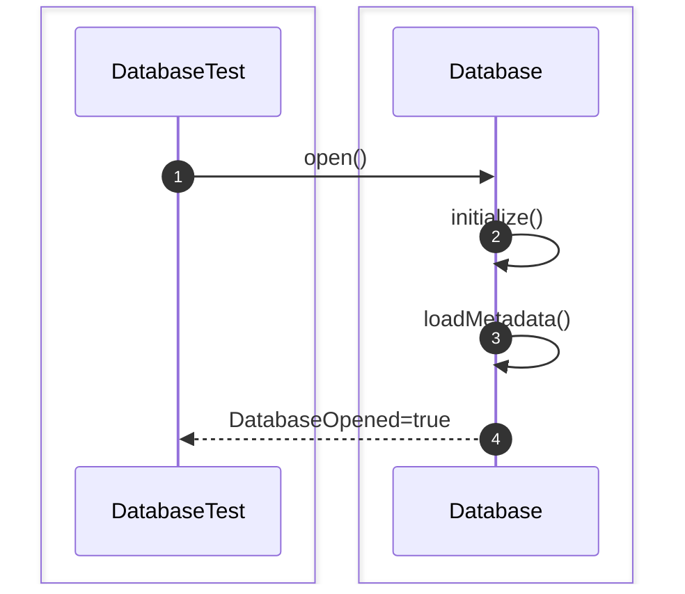
```mermaid
sequenceDiagram
    autonumber
    box #e1f5fe Test Suite
    participant Test as DatabaseTest
    end
    box #e8f5e9 Database Objects
    participant Database as Database
    end

    Test->>Database: open()

    Database->>Database: initialize()

    Database->>Database: loadMetadata()

    Database-->>Test: DatabaseOpened=true
```

### 2. shouldCloseDatabase()
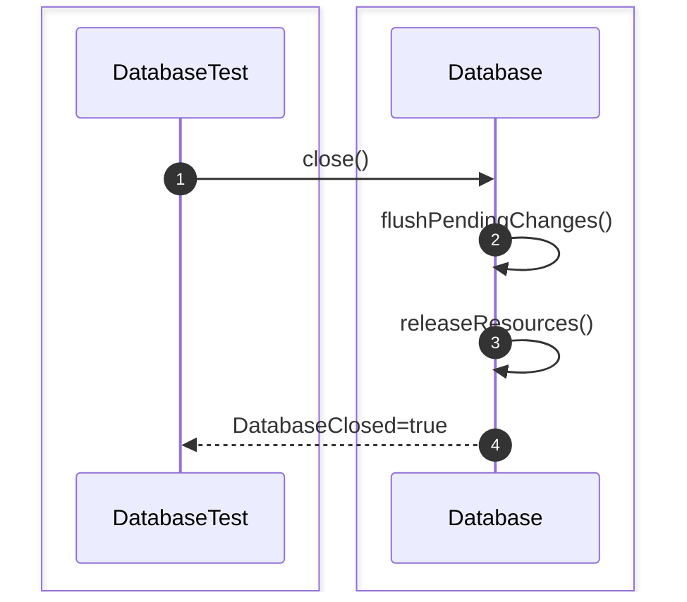
```mermaid
sequenceDiagram
    autonumber
    box #e1f5fe Test Suite
    participant Test as DatabaseTest
    end
    box #e8f5e9 Database Objects
    participant Database as Database
    end

    Test->>Database: close()

    Database->>Database: flushPendingChanges()

    Database->>Database: releaseResources()

    Database-->>Test: DatabaseClosed=true
```
## Schema 

### 3. sequenceDiagram
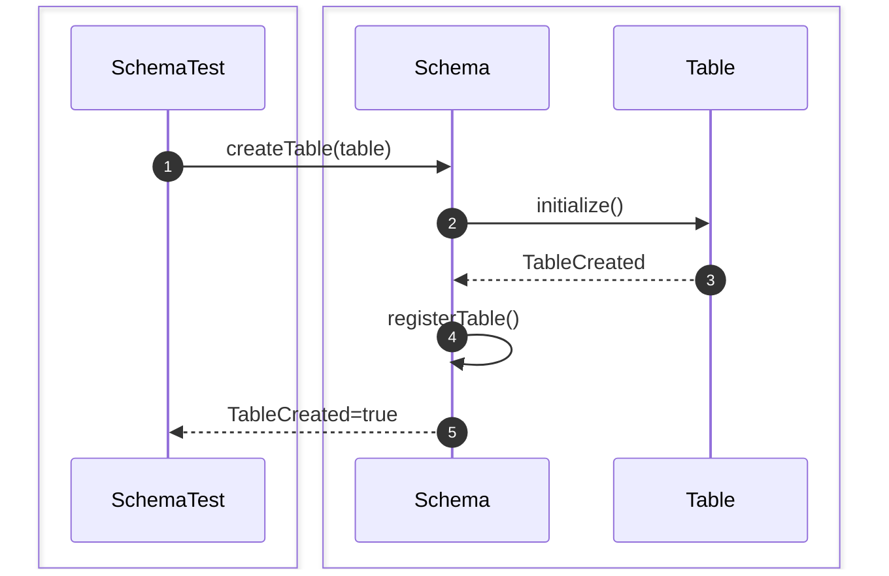
```mermaid
sequenceDiagram
    autonumber
    box #e1f5fe Test Suite
    participant Test as SchemaTest
    end
    box #e8f5e9 Database Objects
    participant Schema as Schema
    participant Table as Table
    end

    Test->>Schema: createTable(table)

    Schema->>Table: initialize()

    Table-->>Schema: TableCreated

    Schema->>Schema: registerTable()

    Schema-->>Test: TableCreated=true
```

### 4. shouldDropTable()
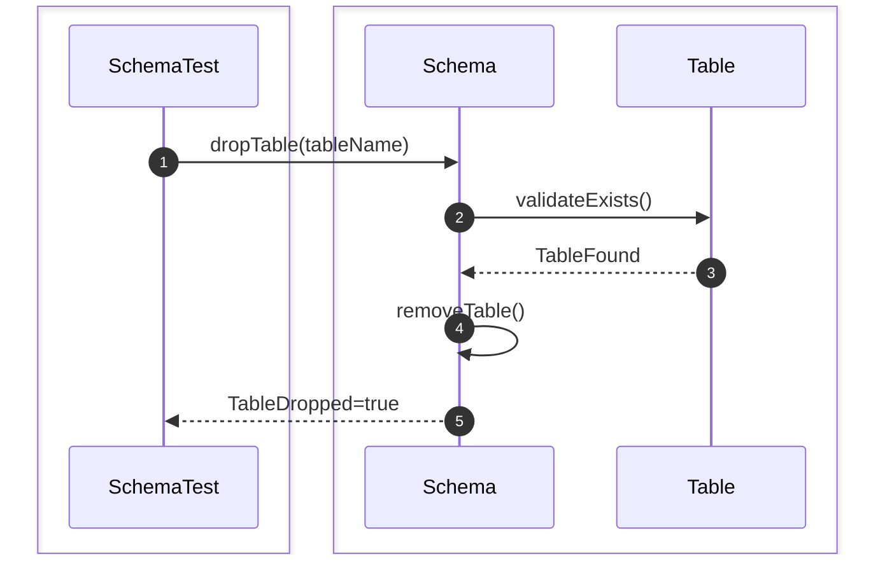
```mermaid
sequenceDiagram
    autonumber
    box #e1f5fe Test Suite
    participant Test as SchemaTest
    end
    box #e8f5e9 Database Objects
    participant Schema as Schema
    participant Table as Table
    end

    Test->>Schema: dropTable(tableName)

    Schema->>Table: validateExists()

    Table-->>Schema: TableFound

    Schema->>Schema: removeTable()

    Schema-->>Test: TableDropped=true
```

### 5. shouldCreateView()
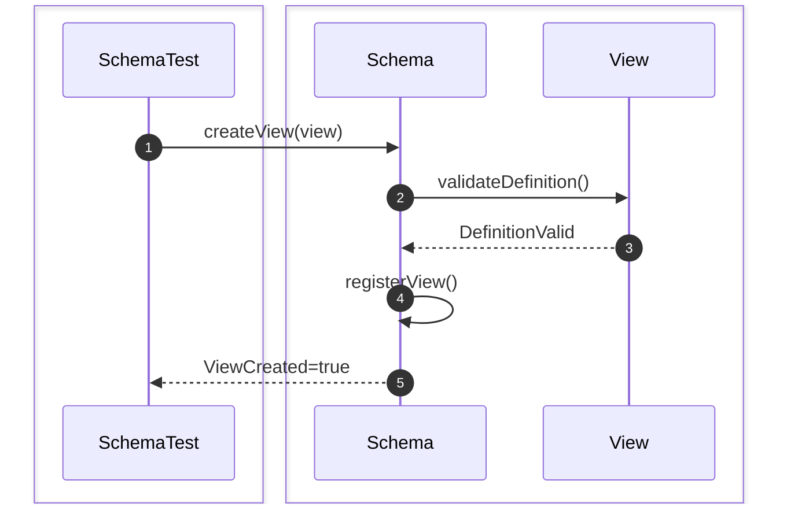
```mermaid
sequenceDiagram
    autonumber
    box #e1f5fe Test Suite
    participant Test as SchemaTest
    end
    box #e8f5e9 Database Objects
    participant Schema as Schema
    participant View as View
    end

    Test->>Schema: createView(view)

    Schema->>View: validateDefinition()

    View-->>Schema: DefinitionValid

    Schema->>Schema: registerView()

    Schema-->>Test: ViewCreated=true
```

### 6. shouldCreateStoredProcedure()
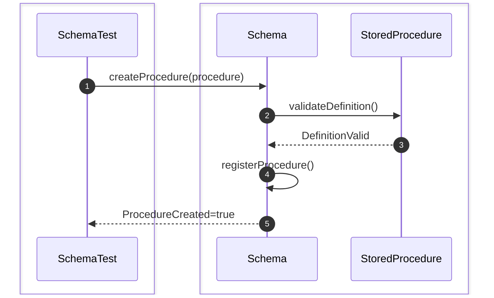
```mermaid
sequenceDiagram
    autonumber
    box #e1f5fe Test Suite
    participant Test as SchemaTest
    end
    box #e8f5e9 Database Objects
    participant Schema as Schema
    participant Procedure as StoredProcedure
    end

    Test->>Schema: createProcedure(procedure)

    Schema->>Procedure: validateDefinition()

    Procedure-->>Schema: DefinitionValid

    Schema->>Schema: registerProcedure()

    Schema-->>Test: ProcedureCreated=true
```
## Table

### 7. shouldInsertRow()
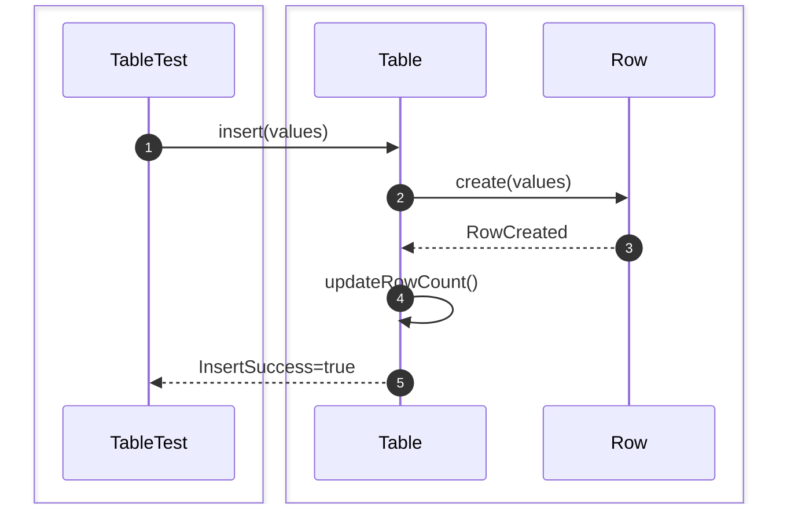
```mermaid
sequenceDiagram
    autonumber
    box #e1f5fe Test Suite
    participant Test as TableTest
    end
    box #e8f5e9 Database Objects
    participant Table as Table
    participant Row as Row
    end

    Test->>Table: insert(values)

    Table->>Row: create(values)

    Row-->>Table: RowCreated

    Table->>Table: updateRowCount()

    Table-->>Test: InsertSuccess=true
```

### 8. shouldUpdateRow()
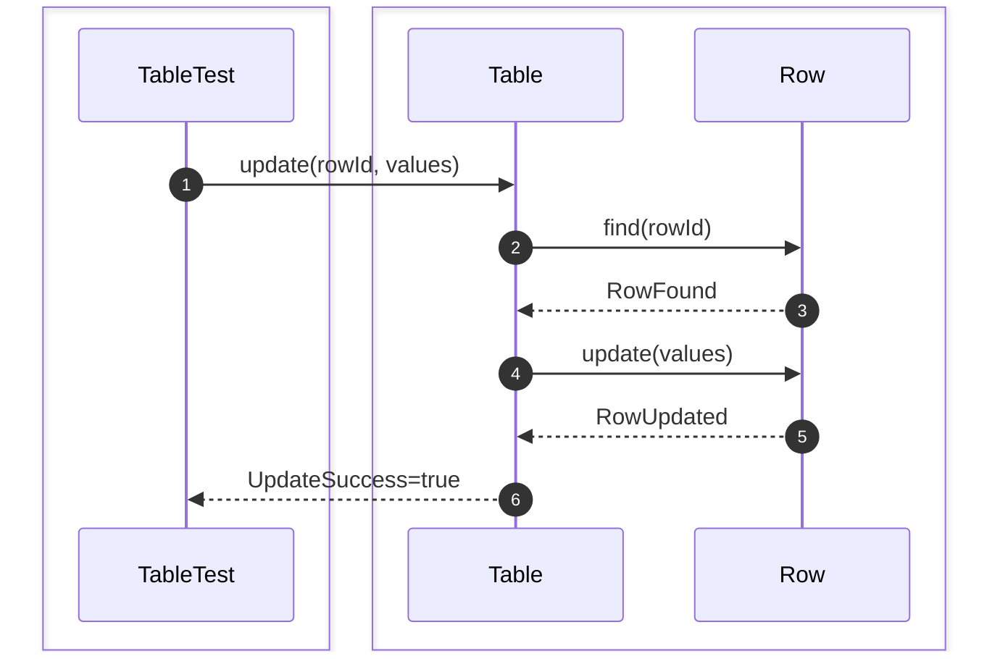
```mermaid
sequenceDiagram
    autonumber
    box #e1f5fe Test Suite
    participant Test as TableTest
    end
    box #e8f5e9 Database Objects
    participant Table as Table
    participant Row as Row
    end

    Test->>Table: update(rowId, values)

    Table->>Row: find(rowId)

    Row-->>Table: RowFound

    Table->>Row: update(values)

    Row-->>Table: RowUpdated

    Table-->>Test: UpdateSuccess=true
```

### 9. shouldDeleteRow()
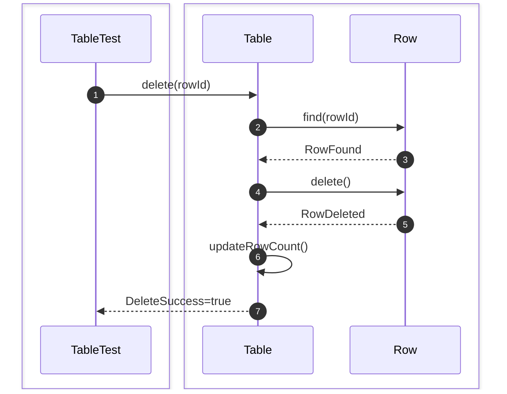
```mermaid
sequenceDiagram
    autonumber
    box #e1f5fe Test Suite
    participant Test as TableTest
    end
    box #e8f5e9 Database Objects
    participant Table as Table
    participant Row as Row
    end

    Test->>Table: delete(rowId)

    Table->>Row: find(rowId)

    Row-->>Table: RowFound

    Table->>Row: delete()

    Row-->>Table: RowDeleted

    Table->>Table: updateRowCount()

    Table-->>Test: DeleteSuccess=true
```

### 10. shouldTruncateTable()
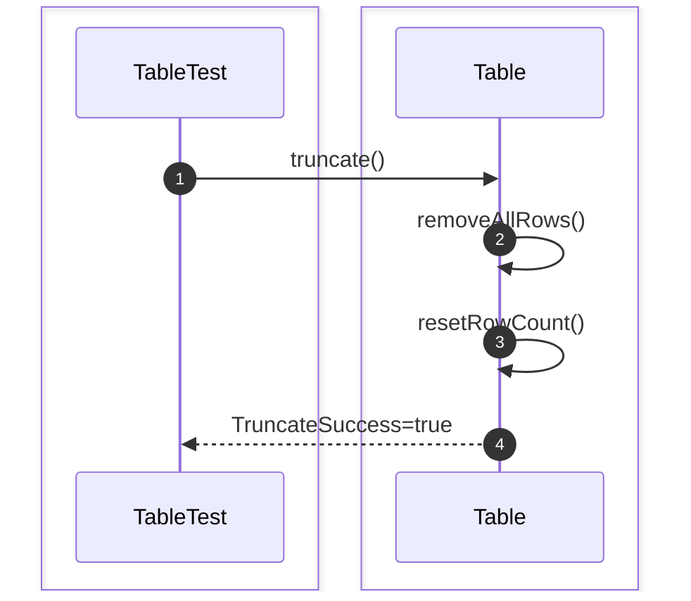
```mermaid
sequenceDiagram
    autonumber
    box #e1f5fe Test Suite
    participant Test as TableTest
    end
    box #e8f5e9 Database Objects
    participant Table as Table
    end

    Test->>Table: truncate()

    Table->>Table: removeAllRows()

    Table->>Table: resetRowCount()

    Table-->>Test: TruncateSuccess=true
```

### 11. shouldAnalyzeTable()
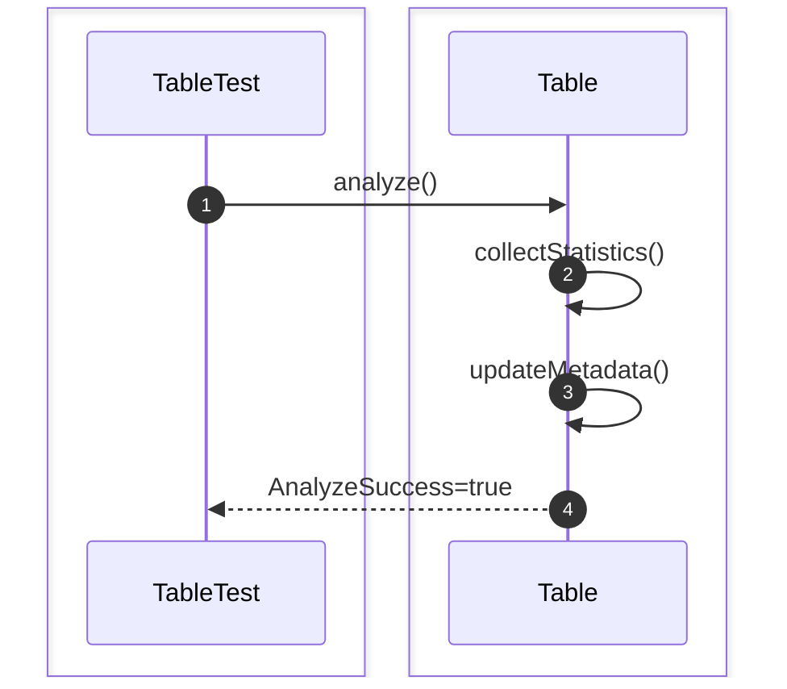
```mermaid
sequenceDiagram
    autonumber
    box #e1f5fe Test Suite
    participant Test as TableTest
    end
    box #e8f5e9 Database Objects
    participant Table as Table
    end

    Test->>Table: analyze()

    Table->>Table: collectStatistics()

    Table->>Table: updateMetadata()

    Table-->>Test: AnalyzeSuccess=true
```

## Column 

### 12. shouldValidateColumnDefinition()
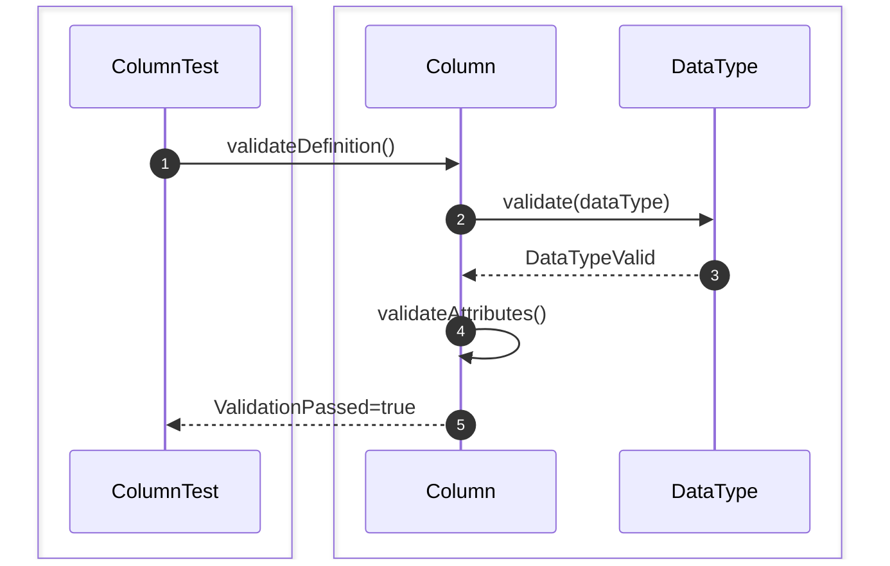
```mermaid
sequenceDiagram
    autonumber
    box #e1f5fe Test Suite
    participant Test as ColumnTest
    end
    box #e8f5e9 Database Objects
    participant Column as Column
    participant DataType as DataType
    end

    Test->>Column: validateDefinition()

    Column->>DataType: validate(dataType)

    DataType-->>Column: DataTypeValid

    Column->>Column: validateAttributes()

    Column-->>Test: ValidationPassed=true
```

### 13. shouldUpdateColumnMetadata()
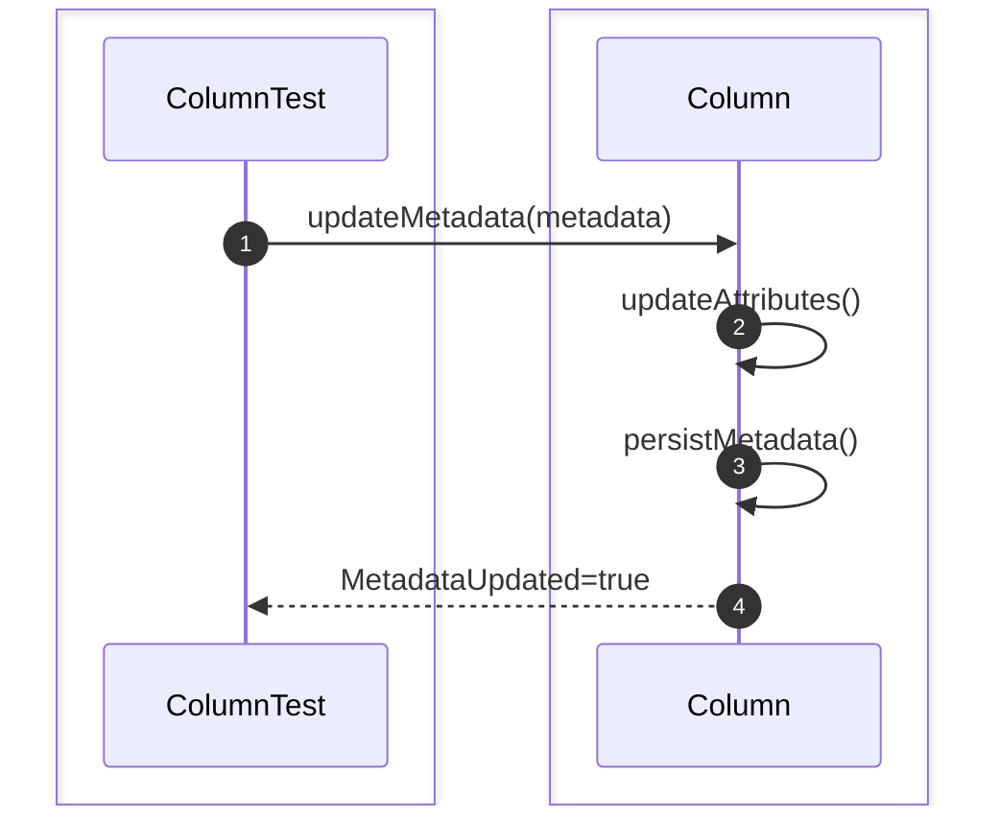
```mermaid
sequenceDiagram
    autonumber
    box #e1f5fe Test Suite
    participant Test as ColumnTest
    end
    box #e8f5e9 Database Objects
    participant Column as Column
    end

    Test->>Column: updateMetadata(metadata)

    Column->>Column: updateAttributes()

    Column->>Column: persistMetadata()

    Column-->>Test: MetadataUpdated=true
```
## Row

### 14. shouldCreateRow()
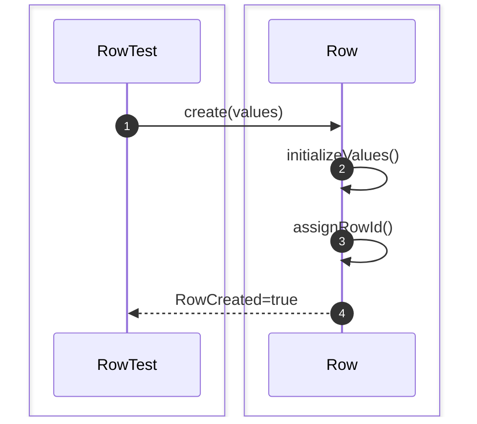
```mermaid
sequenceDiagram
    autonumber
    box #e1f5fe Test Suite
    participant Test as RowTest
    end
    box #e8f5e9 Database Objects
    participant Row as Row
    end

    Test->>Row: create(values)

    Row->>Row: initializeValues()

    Row->>Row: assignRowId()

    Row-->>Test: RowCreated=true
```

### 15. shouldUpdateRowVersion()
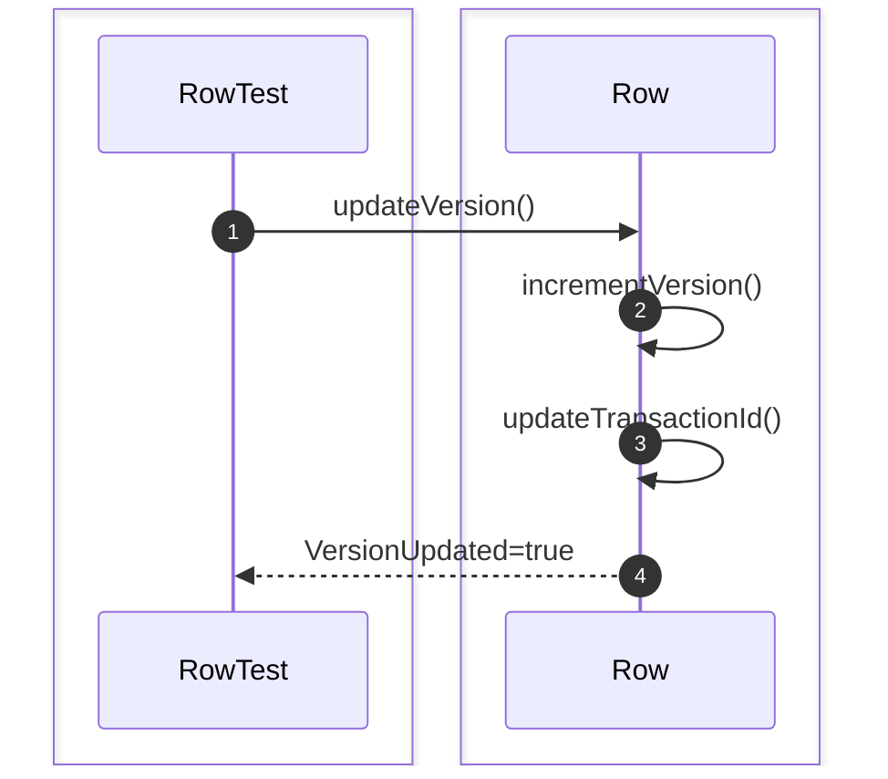
```mermaid
sequenceDiagram
    autonumber
    box #e1f5fe Test Suite
    participant Test as RowTest
    end
    box #e8f5e9 Database Objects
    participant Row as Row
    end

    Test->>Row: updateVersion()

    Row->>Row: incrementVersion()

    Row->>Row: updateTransactionId()

    Row-->>Test: VersionUpdated=true
```

### 16. shouldDeleteRow()
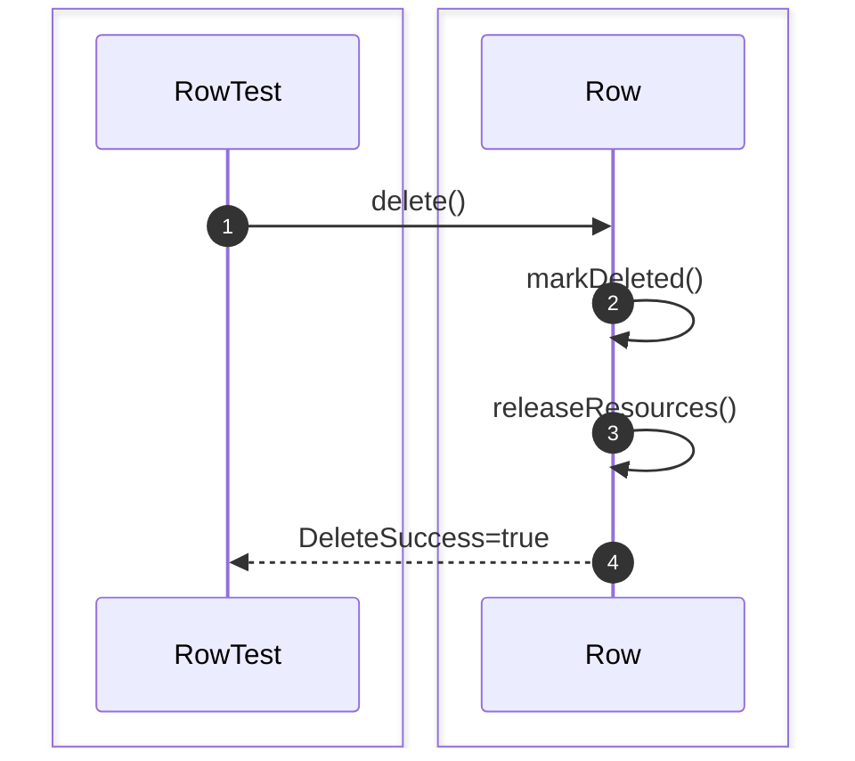
```mermaid
sequenceDiagram
    autonumber
    box #e1f5fe Test Suite
    participant Test as RowTest
    end
    box #e8f5e9 Database Objects
    participant Row as Row
    end

    Test->>Row: delete()

    Row->>Row: markDeleted()

    Row->>Row: releaseResources()

    Row-->>Test: DeleteSuccess=true
```

## Constraint

### 17. shouldValidatePrimaryKey()
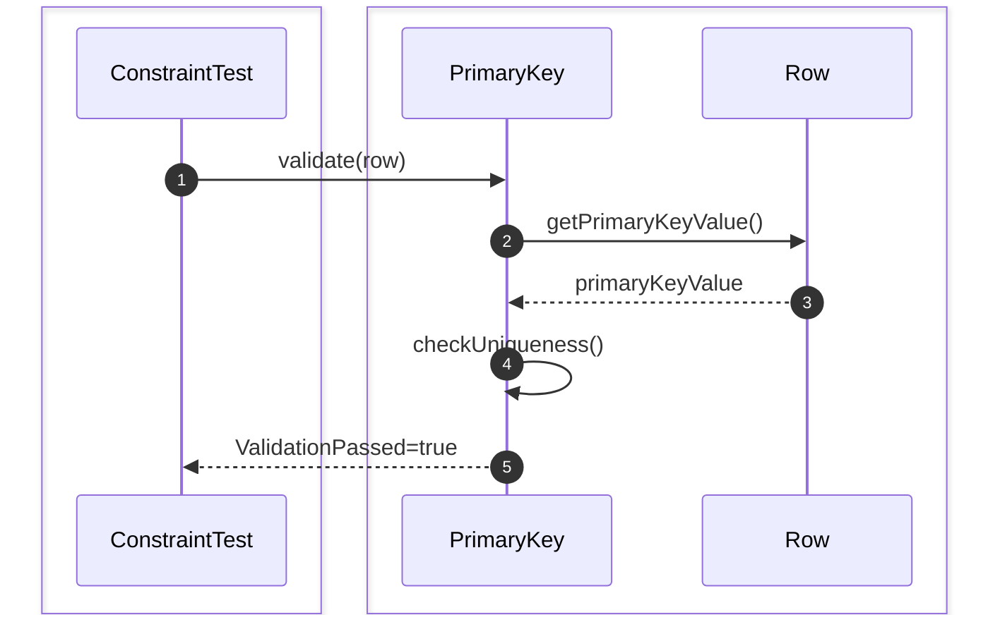
```mermaid
sequenceDiagram
    autonumber
    box #e1f5fe Test Suite
    participant Test as ConstraintTest
    end
    box #e8f5e9 Database Objects
    participant PK as PrimaryKey
    participant Row as Row
    end

    Test->>PK: validate(row)

    PK->>Row: getPrimaryKeyValue()

    Row-->>PK: primaryKeyValue

    PK->>PK: checkUniqueness()

    PK-->>Test: ValidationPassed=true
```

### 18. shouldValidateForeignKey()
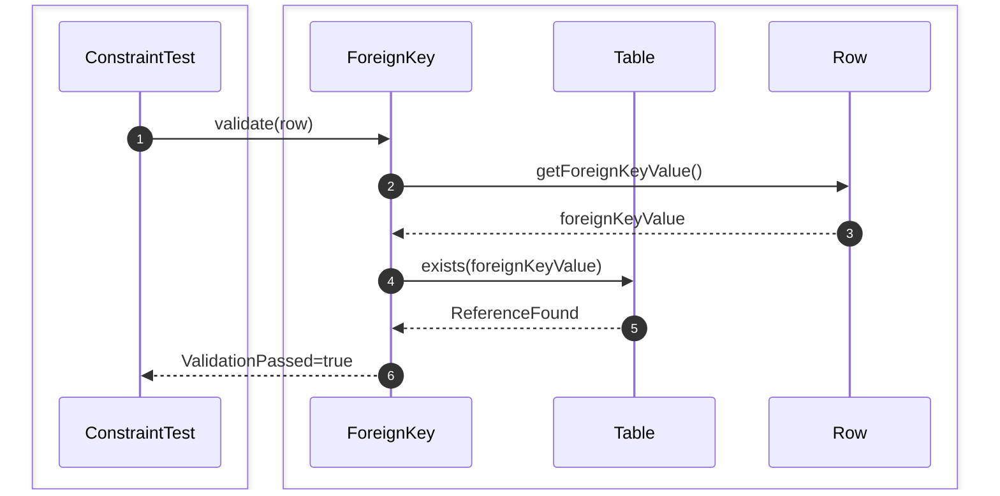
```mermaid
sequenceDiagram
    autonumber
    box #e1f5fe Test Suite
    participant Test as ConstraintTest
    end
    box #e8f5e9 Database Objects
    participant FK as ForeignKey
    participant Parent as Table
    participant Row as Row
    end

    Test->>FK: validate(row)

    FK->>Row: getForeignKeyValue()

    Row-->>FK: foreignKeyValue

    FK->>Parent: exists(foreignKeyValue)

    Parent-->>FK: ReferenceFound

    FK-->>Test: ValidationPassed=true
```

### 19. shouldValidateUniqueConstraint()
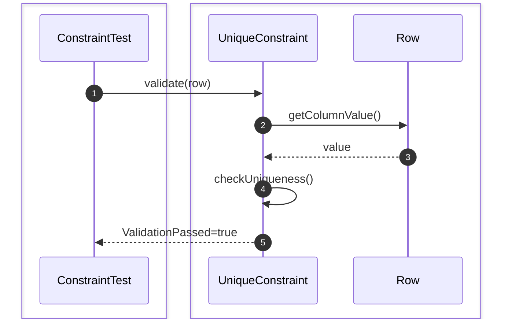
```mermaid
sequenceDiagram
    autonumber
    box #e1f5fe Test Suite
    participant Test as ConstraintTest
    end
    box #e8f5e9 Database Objects
    participant Unique as UniqueConstraint
    participant Row as Row
    end

    Test->>Unique: validate(row)

    Unique->>Row: getColumnValue()

    Row-->>Unique: value

    Unique->>Unique: checkUniqueness()

    Unique-->>Test: ValidationPassed=true
```

### 20. shouldValidateCheckConstraint()
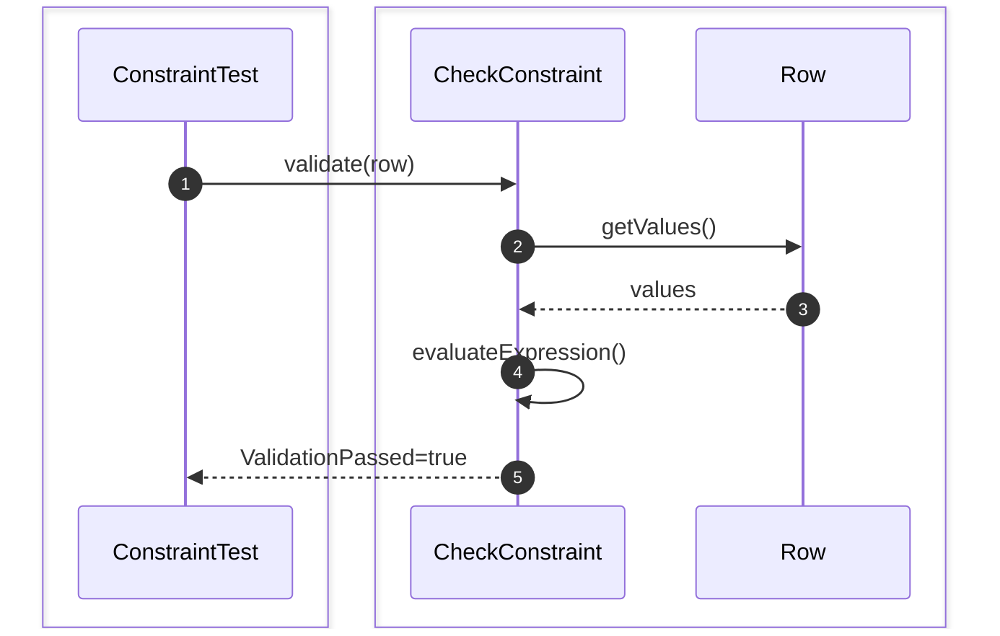
```mermaid
sequenceDiagram
    autonumber
    box #e1f5fe Test Suite
    participant Test as ConstraintTest
    end
    box #e8f5e9 Database Objects
    participant Check as CheckConstraint
    participant Row as Row
    end

    Test->>Check: validate(row)

    Check->>Row: getValues()

    Row-->>Check: values

    Check->>Check: evaluateExpression()

    Check-->>Test: ValidationPassed=true
```

## Index 

### 21. shouldInsertKey()
```mermaid
sequenceDiagram
    autonumber
    box #e1f5fe Test Suite
    participant Test as IndexTest
    end
    box #e8f5e9 Database Objects
    participant Index as Index
    end

    Test->>Index: insertKey(key, rowId)

    Index->>Index: updateIndexStructure()

    Index-->>Test: InsertSuccess=true
```

### 22. shouldSearchKey()
```mermaid
sequenceDiagram
    autonumber
    box #e1f5fe Test Suite
    participant Test as IndexTest
    end
    box #e8f5e9 Database Objects
    participant Index as Index
    end

    Test->>Index: search(key)

    Index->>Index: locateKey()

    Index-->>Test: rowId    
```

## 23. shouldDeleteKey()
```mermaid
sequenceDiagram
    autonumber
    box #e1f5fe Test Suite
    participant Test as IndexTest
    end
    box #e8f5e9 Database Objects
    participant Index as Index
    end

    Test->>Index: deleteKey(key)

    Index->>Index: removeKey()

    Index-->>Test: DeleteSuccess=true
```

## 24. shouldRebuildIndex()
```mermaid
sequenceDiagram
    autonumber
    box #e1f5fe Test Suite
    participant Test as IndexTest
    end
    box #e8f5e9 Database Objects
    participant Index as Index
    participant Table as Table
    end

    Test->>Index: rebuild()

    Index->>Table: scanRows()

    Table-->>Index: rows

    Index->>Index: rebuildStructure()

    Index-->>Test: RebuildSuccess=true
```

## Partition 

### 25. shouldPartitionTable()
```mermaid
sequenceDiagram
    autonumber
    box #e1f5fe Test Suite
    participant Test as PartitionTest
    end
    box #e8f5e9 Database Objects
    participant Partition as Partition
    participant Table as Table
    end

    Test->>Partition: partitionTable()

    Partition->>Table: reorganizeRows()

    Table-->>Partition: completed

    Partition-->>Test: PartitionCreated=true
```

### 26. shouldLocatePartition()
```mermaid
sequenceDiagram
    autonumber
    box #e1f5fe Test Suite
    participant Test as PartitionTest
    end
    box #e8f5e9 Database Objects
    participant Partition as Partition
    end

    Test->>Partition: locatePartition(key)

    Partition->>Partition: searchPartition()

    Partition-->>Test: TargetPartition
```

## View

### 27. shouldExecuteViewQuery()
```mermaid 
sequenceDiagram
    autonumber
    participant Test as ViewTest
    participant View as View
    participant Table as Table

    Test->>View: executeQuery()

    View->>Table: readRows()

    Table-->>View: resultSet

    View-->>Test: QueryResult
```

### 28. shouldRefreshViewDefinition()
```mermaid
sequenceDiagram
    autonumber
    box #e1f5fe Test Suite
    participant Test as ViewTest
    end
    box #e8f5e9 Database Objects
    participant View as View
    end

    Test->>View: refreshDefinition()

    View->>View: reloadDefinition()

    View-->>Test: RefreshSuccess=true
```

## Store Procedure

### 29. shouldExecuteProcedure()
```mermaid
sequenceDiagram
    autonumber
    box #e1f5fe Test Suite
    participant Test as StoredProcedureTest
    end
    box #e8f5e9 Database Objects
    participant Proc as StoredProcedure
    participant Table as Table
    end

    Test->>Proc: execute()

    Proc->>Table: executeSQL()

    Table-->>Proc: execution completed

    Proc-->>Test: ProcedureSuccess=true
```

### 30. shouldPassProcedureParameters()
```mermaid
sequenceDiagram
    autonumber
    box #e1f5fe Test Suite
    participant Test as StoredProcedureTest
    end
    box #e8f5e9 Database Objects
    participant Proc as StoredProcedure
    participant Table as Table
    end

    Test->>Proc: execute(parameters)

    Proc->>Table: executeSQL(parameters)

    Table-->>Proc: execution completed

    Proc-->>Test: ParameterExecutionSuccess=true
```

## Trigger 

### 31. shouldFireTrigger()
```mermaid
sequenceDiagram
    autonumber
    box #e1f5fe Test Suite
    participant Test as TriggerTest
    end
    box #e8f5e9 Database Objects
    participant Trigger as Trigger
    end

    Test->>Trigger: fire()

    Trigger->>Trigger: evaluateCondition()

    Trigger->>Trigger: executeAction()

    Trigger-->>Test: TriggerExecuted=true
```

### 32. shouldExecuteBeforeInsertTrigger()
```mermaid
sequenceDiagram
    autonumber
    box #e1f5fe Test Suite
    participant Test as TriggerTest
    end
    box #e8f5e9 Database Objects
    participant Trigger as Trigger
    participant Table as Table
    end

    Test->>Trigger: beforeInsert(row)

    Trigger->>Trigger: validateCondition()

    Trigger->>Table: allowInsert()

    Table-->>Trigger: accepted

    Trigger-->>Test: BeforeInsertExecuted=true
```

### 33. shouldExecuteAfterUpdateTrigger()
```mermaid
sequenceDiagram
    autonumber
    box #e1f5fe Test Suite
    participant Test as TriggerTest
    end
    box #e8f5e9 Database Objects
    participant Table as Table
    participant Trigger as Trigger
    end

    Test->>Table: update(row)

    Table->>Trigger: afterUpdate(row)

    Trigger->>Trigger: executeAction()

    Trigger-->>Table: completed

    Table-->>Test: AfterUpdateExecuted=true
```
## Sequence 

### 34. shouldGenerateNextValue()
```mermaid
sequenceDiagram
    autonumber
    box #e1f5fe Test Suite
    participant Test as SequenceTest
    end
    box #e8f5e9 Database Objects
    participant Seq as Sequence
    end

    Test->>Seq: nextValue()

    Seq->>Seq: increment()

    Seq-->>Test: nextValue
``` 

## 35. shouldIncrementSequence()
```mermaid
sequenceDiagram
    autonumber
    box #e1f5fe Test Suite
    participant Test as SequenceTest
    end
    box #e8f5e9 Database Objects
    participant Seq as Sequence
    end

    Test->>Seq: increment()

    Seq->>Seq: currentValue++

    Seq-->>Test: IncrementSuccess=true
```

# Database Object Integration Test 

### 1. shouldCreateDatabaseWithSchemaAndTable()
```mermaid
sequenceDiagram
    autonumber
    box #e1f5fe Test Suite
    participant Test as DatabaseObjectsIntegrationTest
    end
    box #e8f5e9 Database Objects
    participant DB as Database
    participant Schema as Schema
    participant Table as Table
    end

    Test->>DB: createDatabase()

    DB->>Schema: createSchema()

    Schema->>Table: createTable()

    Table-->>Schema: created

    Schema-->>DB: schema created

    DB-->>Test: DatabaseReady=true
```

### 2. shouldInsertRowWithConstraints()
```mermaid
sequenceDiagram
    autonumber
    box #e1f5fe Test Suite
    participant Test as DatabaseObjectsIntegrationTest
    end
    box #e8f5e9 Database Objects
    participant Table as Table
    participant Constraint as Constraint
    participant Row as Row
    end

    Test->>Table: insert(row)

    Table->>Constraint: validate(row)

    Constraint-->>Table: valid

    Table->>Row: create()

    Row-->>Table: row stored

    Table-->>Test: InsertSuccess=true
```

### 3. shouldUseIndexForQueryExecution()
```mermaid
sequenceDiagram
    autonumber
    box #e1f5fe Test Suite
    participant Test as DatabaseObjectsIntegrationTest
    end
    box #e8f5e9 Database Objects
    participant Table as Table
    participant Constraint as Constraint
    participant Row as Row
    end

    Test->>Table: insert(row)

    Table->>Constraint: validate(row)

    Constraint-->>Table: valid

    Table->>Row: create()

    Row-->>Table: row stored

    Table-->>Test: InsertSuccess=true
```
### 4. shouldExecuteTriggerDuringInsert()
```mermaid
sequenceDiagram
    autonumber
    box #e1f5fe Test Suite
    participant Test as DatabaseObjectsIntegrationTest
    end
    box #e8f5e9 Database Objects
    participant Table as Table
    participant Trigger as Trigger
    participant Row as Row
    end

    Test->>Table: insert(row)

    Table->>Trigger: beforeInsert()

    Trigger-->>Table: approved

    Table->>Row: create()

    Row-->>Table: stored

    Table->>Trigger: afterInsert()

    Trigger-->>Table: completed

    Table-->>Test: InsertCompleted=true
```
### 5. shouldExecuteStoredProcedureSuccessfully()
```mermaid
sequenceDiagram
    autonumber
    box #e1f5fe Test Suite
    participant Test as DatabaseObjectsIntegrationTest
    end
    box #e8f5e9 Database Objects
    participant Proc as StoredProcedure
    participant Table as Table
    end

    Test->>Proc: execute()

    Proc->>Table: executeSQL()

    Table-->>Proc: execution completed

    Proc-->>Test: ProcedureSuccess=true
```
### 6. shouldReadDataFromView()
```mermaid
sequenceDiagram
    autonumber
    box #e1f5fe Test Suite
    participant Test as DatabaseObjectsIntegrationTest
    end
    box #e8f5e9 Database Objects
    participant View as View
    participant Table as Table
    end

    Test->>View: executeQuery()

    View->>Table: readRows()

    Table-->>View: result set

    View-->>Test: QueryResult
```
### 7. shouldGenerateSequenceValueForInsert()
```mermaid
sequenceDiagram
    autonumber
    box #e1f5fe Test Suite
    participant Test as DatabaseObjectsIntegrationTest
    end
    box #e8f5e9 Database Objects
    participant Seq as Sequence
    participant Table as Table
    participant Row as Row
    end

    Test->>Seq: nextValue()

    Seq-->>Table: generated id

    Table->>Row: create(id)

    Row-->>Table: stored

    Table-->>Test: InsertSuccess=true
```

