# Database Server Unit Test

## DatabaseServerTest

### 1. shouldStartDatabaseServer()
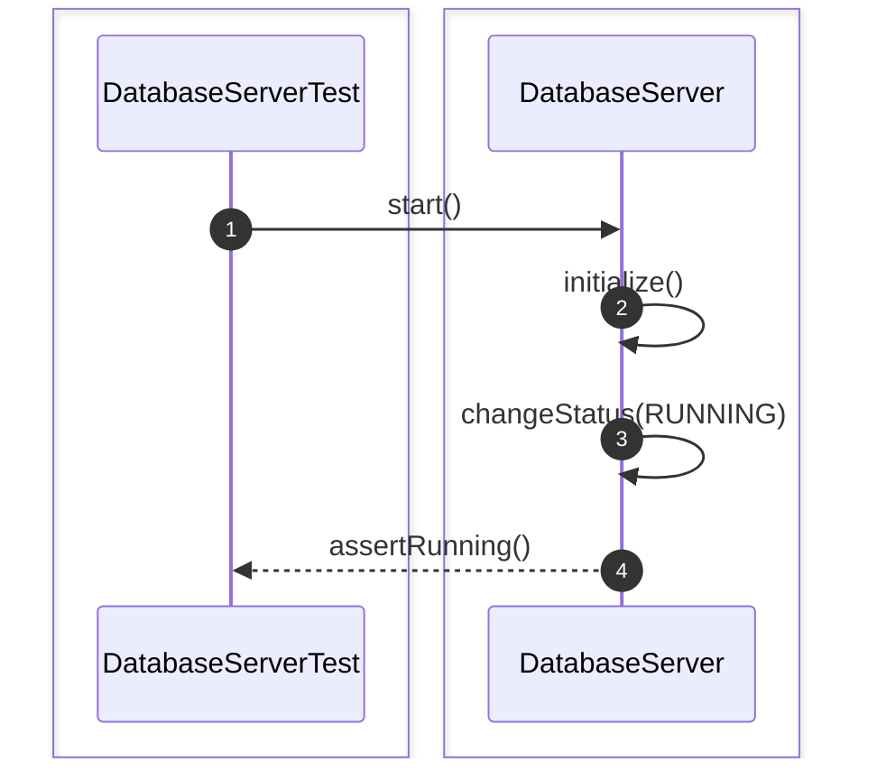
```mermaid
sequenceDiagram
    autonumber

    box #e1f5fe Test Suite
    participant Test as DatabaseServerTest
    end
    box #e3f2fd Server Managers
    participant Server as DatabaseServer
    end

    Test->>Server: start()
    Server->>Server: initialize()
    Server->>Server: changeStatus(RUNNING)
    Server-->>Test: assertRunning()
```

### 2. shouldStopDatabaseServer()
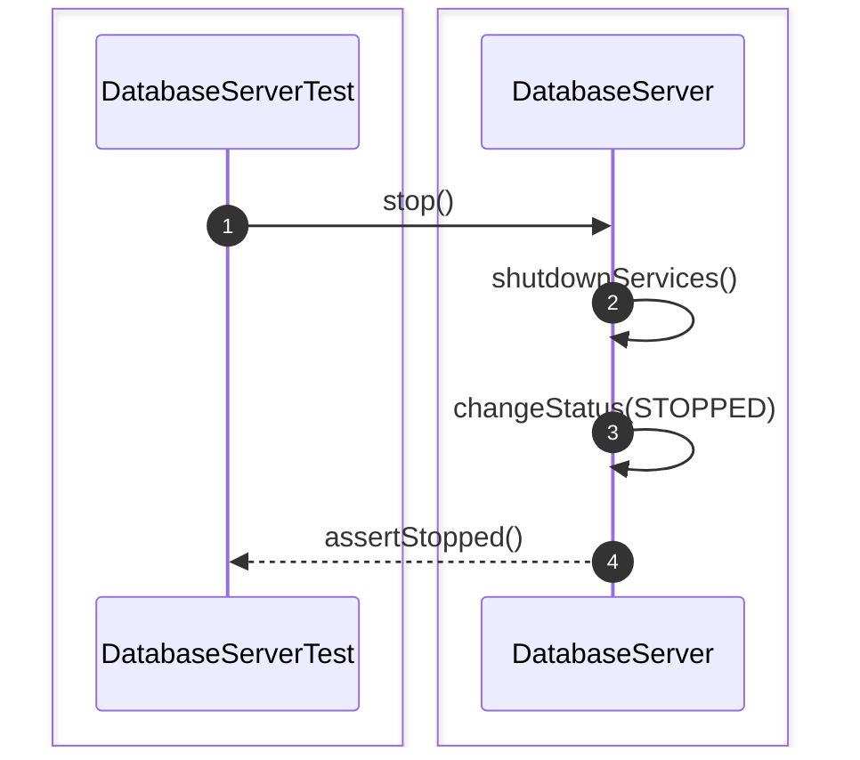
```mermaid
sequenceDiagram
    autonumber

    box #e1f5fe Test Suite
    participant Test as DatabaseServerTest
    end
    box #e3f2fd Server Managers
    participant Server as DatabaseServer
    end

    Test->>Server: stop()
    Server->>Server: shutdownServices()
    Server->>Server: changeStatus(STOPPED)
    Server-->>Test: assertStopped()
```

### 3. shouldRestartDatabaseServer()
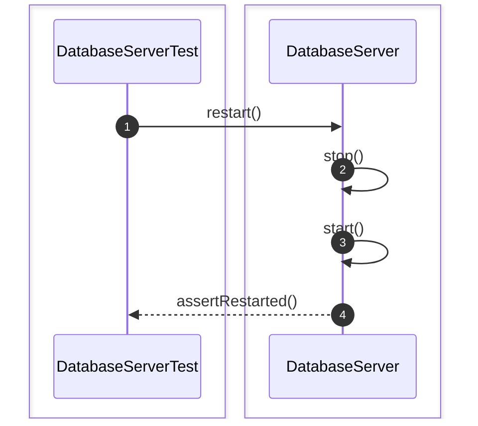
```mermaid
sequenceDiagram
    autonumber

    box #e1f5fe Test Suite
    participant Test as DatabaseServerTest
    end
    box #e3f2fd Server Managers
    participant Server as DatabaseServer
    end

    Test->>Server: restart()
    Server->>Server: stop()
    Server->>Server: start()
    Server-->>Test: assertRestarted()
```

### 4. shouldInitializeManagersOnStartup()
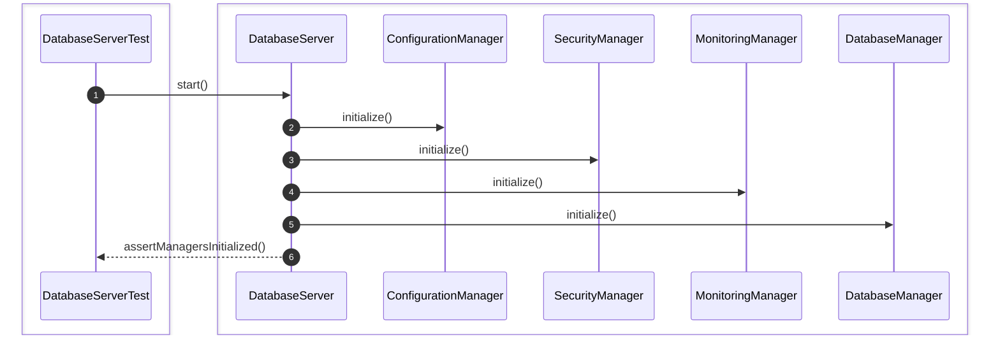
```mermaid
sequenceDiagram
    autonumber

    box #e1f5fe Test Suite
    participant Test as DatabaseServerTest
    end
    box #e3f2fd Server Managers
    participant Server as DatabaseServer
    participant Config as ConfigurationManager
    participant Security as SecurityManager
    participant Monitor as MonitoringManager
    participant DBManager as DatabaseManager
    end

    Test->>Server: start()
    Server->>Config: initialize()
    Server->>Security: initialize()
    Server->>Monitor: initialize()
    Server->>DBManager: initialize()
    Server-->>Test: assertManagersInitialized()
```

### 5. shouldShutdownManagersGracefully()
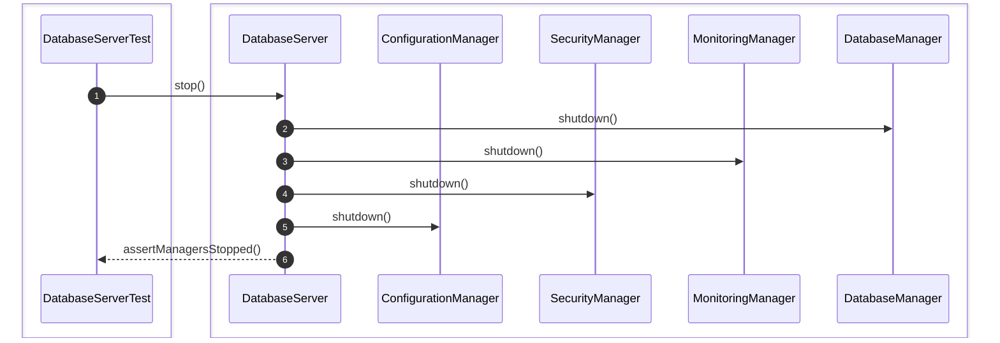
```mermaid
sequenceDiagram
    autonumber

    box #e1f5fe Test Suite
    participant Test as DatabaseServerTest
    end
    box #e3f2fd Server Managers
    participant Server as DatabaseServer
    participant Config as ConfigurationManager
    participant Security as SecurityManager
    participant Monitor as MonitoringManager
    participant DBManager as DatabaseManager
    end

    Test->>Server: stop()
    Server->>DBManager: shutdown()
    Server->>Monitor: shutdown()
    Server->>Security: shutdown()
    Server->>Config: shutdown()
    Server-->>Test: assertManagersStopped()
```

### 6. shouldAcceptClientConnection()
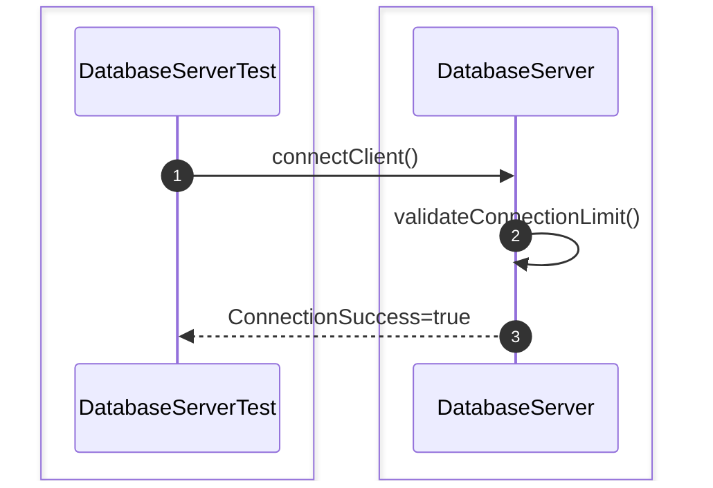
```mermaid
sequenceDiagram
    autonumber

    box #e1f5fe Test Suite
    participant Test as DatabaseServerTest
    end
    box #e3f2fd Server Managers
    participant Server as DatabaseServer
    end

    Test->>Server: connectClient()
    Server->>Server: validateConnectionLimit()
    Server-->>Test: ConnectionSuccess=true
```

### 7. shouldRejectConnectionWhenStopped()
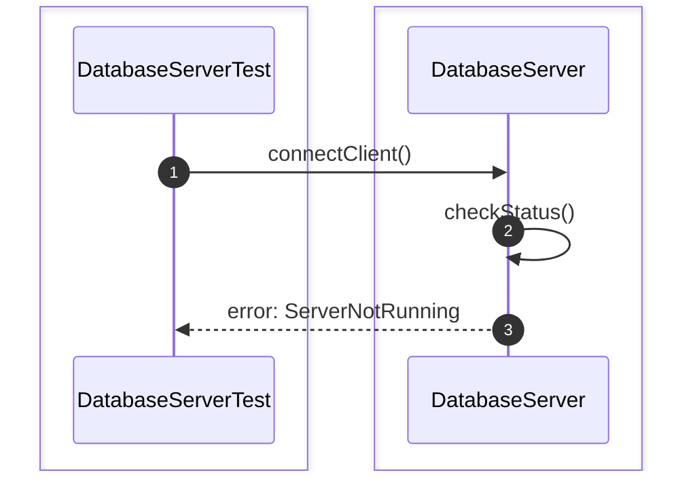
```mermaid
sequenceDiagram
    autonumber

    box #e1f5fe Test Suite
    participant Test as DatabaseServerTest
    end
    box #e3f2fd Server Managers
    participant Server as DatabaseServer
    end

    Test->>Server: connectClient()
    Server->>Server: checkStatus()
    Server-->>Test: error: ServerNotRunning
```

### 8. shouldTrackActiveConnections()
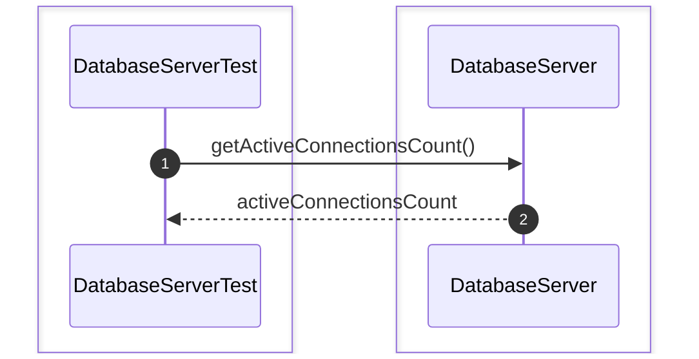
```mermaid
sequenceDiagram
    autonumber

    box #e1f5fe Test Suite
    participant Test as DatabaseServerTest
    end
    box #e3f2fd Server Managers
    participant Server as DatabaseServer
    end

    Test->>Server: getActiveConnectionsCount()
    Server-->>Test: activeConnectionsCount
```

### 9. shouldCloseIdleConnections()
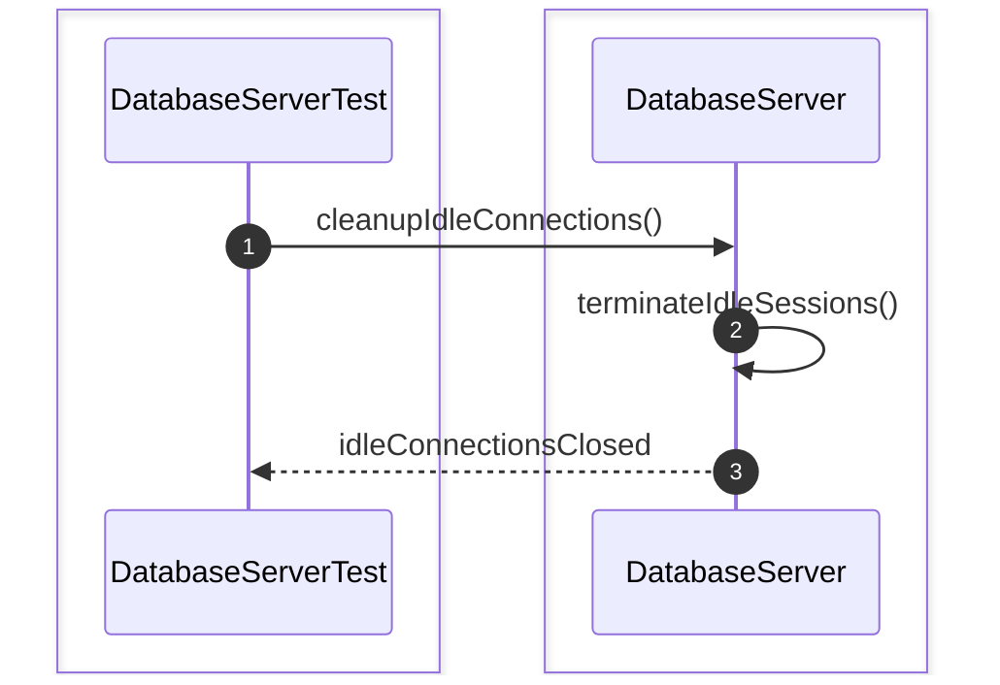
```mermaid
sequenceDiagram
    autonumber

    box #e1f5fe Test Suite
    participant Test as DatabaseServerTest
    end
    box #e3f2fd Server Managers
    participant Server as DatabaseServer
    end

    Test->>Server: cleanupIdleConnections()
    Server->>Server: terminateIdleSessions()
    Server-->>Test: idleConnectionsClosed
```

### 10. shouldRecoverAfterUnexpectedShutdown()
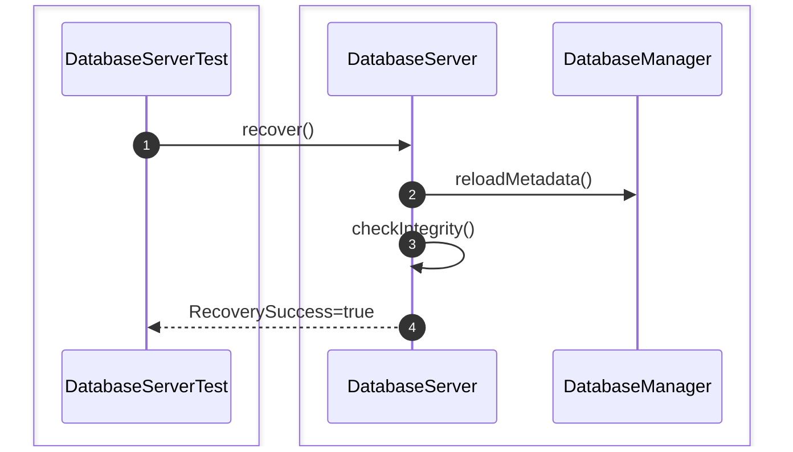
```mermaid
sequenceDiagram
    autonumber

    box #e1f5fe Test Suite
    participant Test as DatabaseServerTest
    end
    box #e3f2fd Server Managers
    participant Server as DatabaseServer
    participant DBManager as DatabaseManager
    end

    Test->>Server: recover()
    Server->>DBManager: reloadMetadata()
    Server->>Server: checkIntegrity()
    Server-->>Test: RecoverySuccess=true
```

## DatabaseManagerTest

### 1. shouldCreateDatabase()
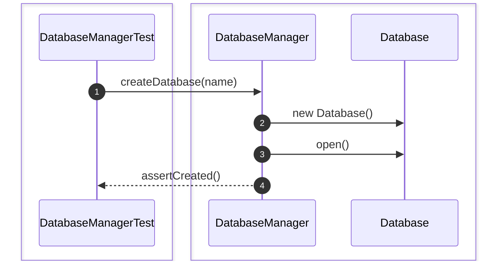
```mermaid
sequenceDiagram
    autonumber

    box #e1f5fe Test Suite
    participant Test as DatabaseManagerTest
    end
    box #e3f2fd Server Managers
    participant Manager as DatabaseManager
    participant Database as Database
    end

    Test->>Manager: createDatabase(name)
    Manager->>Database: new Database()
    Manager->>Database: open()
    Manager-->>Test: assertCreated()
```

### 2. shouldDropDatabase()
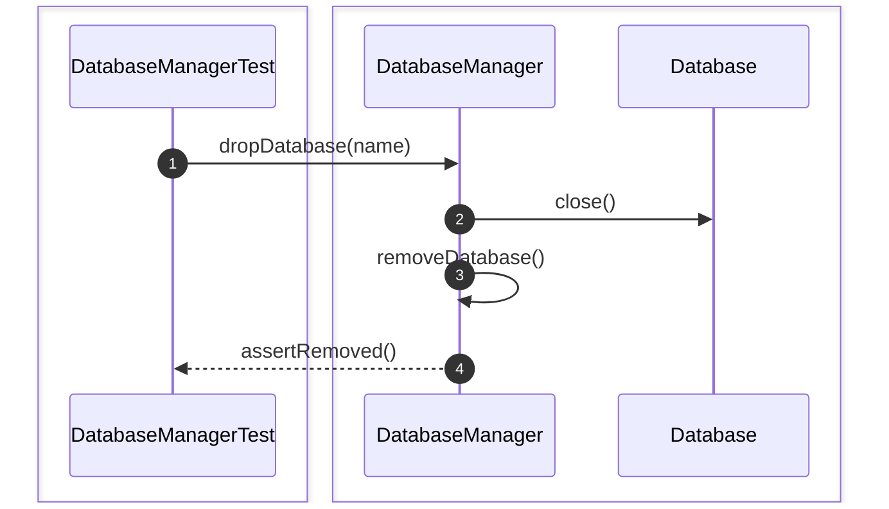
```mermaid
sequenceDiagram
    autonumber

    box #e1f5fe Test Suite
    participant Test as DatabaseManagerTest
    end
    box #e3f2fd Server Managers
    participant Manager as DatabaseManager
    participant Database as Database
    end

    Test->>Manager: dropDatabase(name)
    Manager->>Database: close()
    Manager->>Manager: removeDatabase()
    Manager-->>Test: assertRemoved()
```

### 3. shouldRenameDatabase()
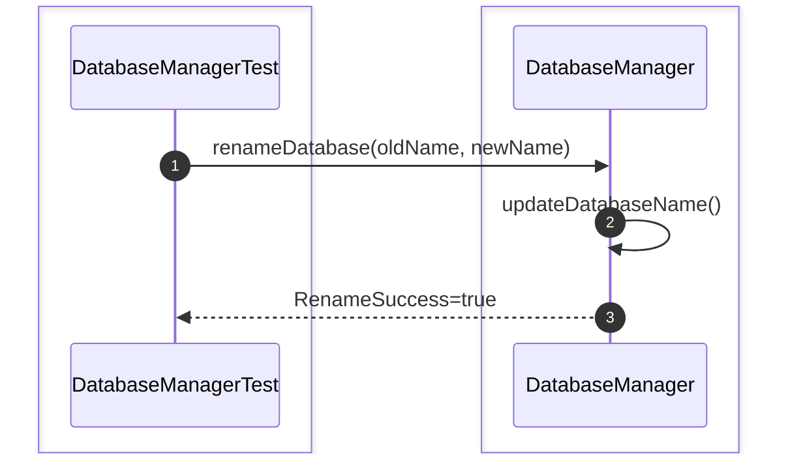
```mermaid
sequenceDiagram
    autonumber

    box #e1f5fe Test Suite
    participant Test as DatabaseManagerTest
    end
    box #e3f2fd Server Managers
    participant Manager as DatabaseManager
    end

    Test->>Manager: renameDatabase(oldName, newName)
    Manager->>Manager: updateDatabaseName()
    Manager-->>Test: RenameSuccess=true
```

### 4. shouldOpenDatabase()
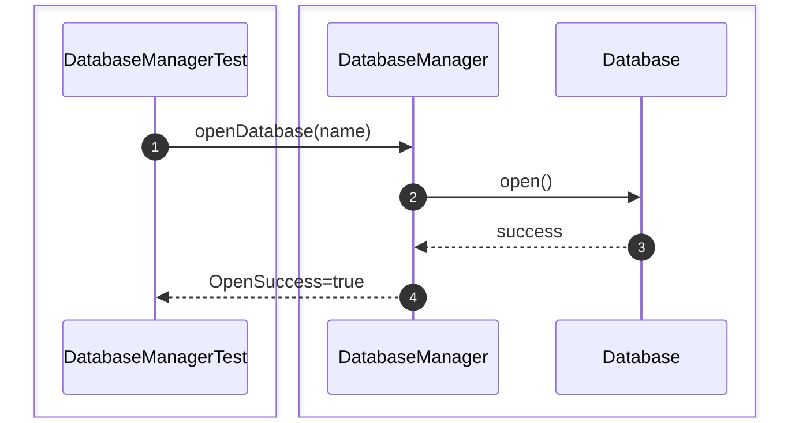
```mermaid
sequenceDiagram
    autonumber

    box #e1f5fe Test Suite
    participant Test as DatabaseManagerTest
    end
    box #e3f2fd Server Managers
    participant Manager as DatabaseManager
    participant Database as Database
    end

    Test->>Manager: openDatabase(name)
    Manager->>Database: open()
    Database-->>Manager: success
    Manager-->>Test: OpenSuccess=true
```

### 5. shouldCloseDatabase()
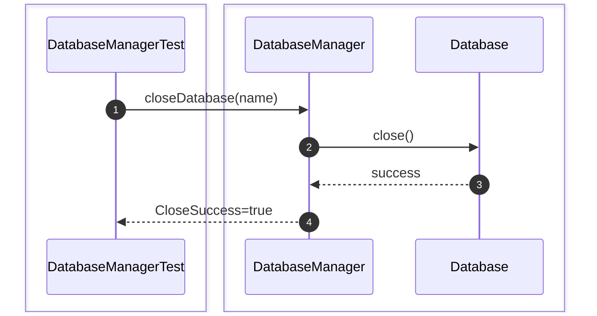
```mermaid
sequenceDiagram
    autonumber

    box #e1f5fe Test Suite
    participant Test as DatabaseManagerTest
    end
    box #e3f2fd Server Managers
    participant Manager as DatabaseManager
    participant Database as Database
    end

    Test->>Manager: closeDatabase(name)
    Manager->>Database: close()
    Database-->>Manager: success
    Manager-->>Test: CloseSuccess=true
```

### 6. shouldGetDatabaseByName()
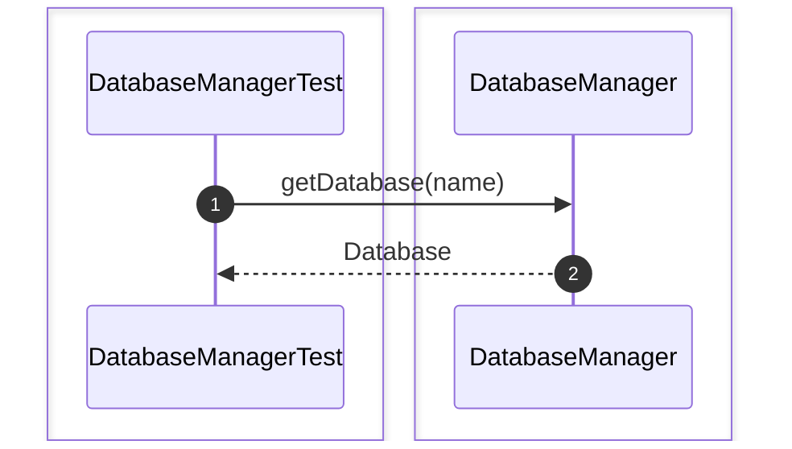
```mermaid
sequenceDiagram
    autonumber

    box #e1f5fe Test Suite
    participant Test as DatabaseManagerTest
    end
    box #e3f2fd Server Managers
    participant Manager as DatabaseManager
    end

    Test->>Manager: getDatabase(name)
    Manager-->>Test: Database
```

### 7. shouldListAllDatabases()
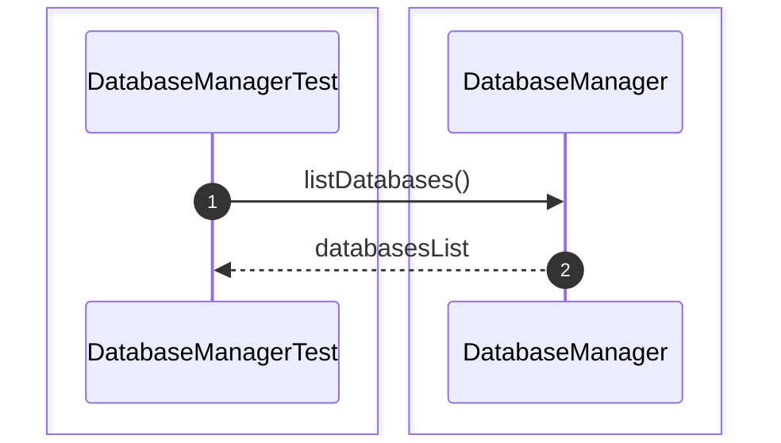
```mermaid
sequenceDiagram
    autonumber

    box #e1f5fe Test Suite
    participant Test as DatabaseManagerTest
    end
    box #e3f2fd Server Managers
    participant Manager as DatabaseManager
    end

    Test->>Manager: listDatabases()
    Manager-->>Test: databasesList
```

### 8. shouldRejectDuplicateDatabaseName()
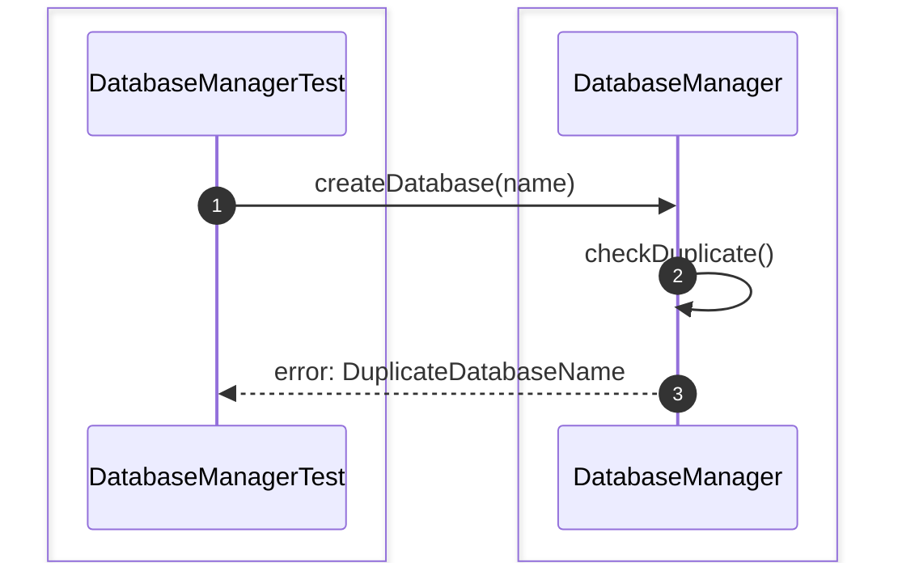
```mermaid
sequenceDiagram
    autonumber

    box #e1f5fe Test Suite
    participant Test as DatabaseManagerTest
    end
    box #e3f2fd Server Managers
    participant Manager as DatabaseManager
    end

    Test->>Manager: createDatabase(name)
    Manager->>Manager: checkDuplicate()
    Manager-->>Test: error: DuplicateDatabaseName
```

### 9. shouldRejectUnknownDatabase()
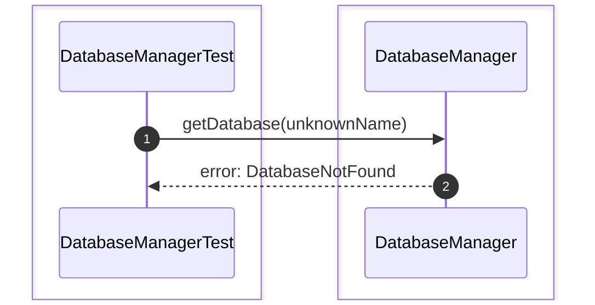
```mermaid
sequenceDiagram
    autonumber

    box #e1f5fe Test Suite
    participant Test as DatabaseManagerTest
    end
    box #e3f2fd Server Managers
    participant Manager as DatabaseManager
    end

    Test->>Manager: getDatabase(unknownName)
    Manager-->>Test: error: DatabaseNotFound
```

### 10. shouldPersistDatabaseMetadata()
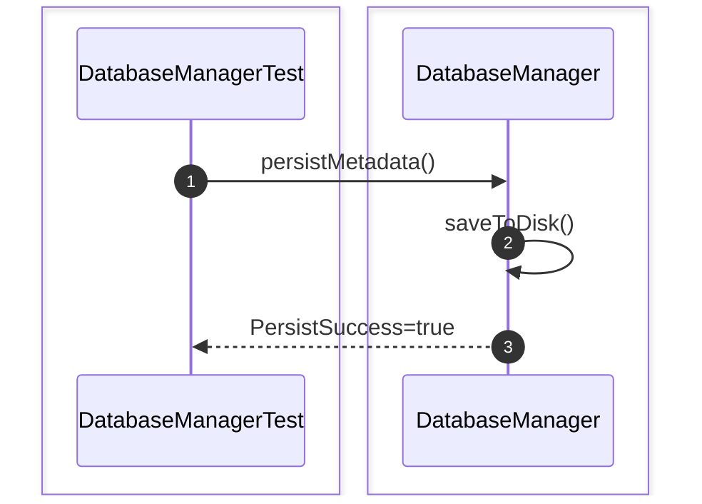
```mermaid
sequenceDiagram
    autonumber

    box #e1f5fe Test Suite
    participant Test as DatabaseManagerTest
    end
    box #e3f2fd Server Managers
    participant Manager as DatabaseManager
    end

    Test->>Manager: persistMetadata()
    Manager->>Manager: saveToDisk()
    Manager-->>Test: PersistSuccess=true
```

### 11. shouldLoadExistingDatabases()
```mermaid
sequenceDiagram
    autonumber

    box #e1f5fe Test Suite
    participant Test as DatabaseManagerTest
    end
    box #e3f2fd Server Managers
    participant Manager as DatabaseManager
    end

    Test->>Manager: loadDatabases()
    Manager->>Manager: readFromDisk()
    Manager-->>Test: LoadSuccess=true
```

### 12. shouldUpdateDatabaseStatus()
```mermaid
sequenceDiagram
    autonumber

    box #e1f5fe Test Suite
    participant Test as DatabaseManagerTest
    end
    box #e3f2fd Server Managers
    participant Manager as DatabaseManager
    end

    Test->>Manager: updateDatabaseStatus(name, status)
    Manager-->>Test: StatusUpdated=true
```

## ConfigurationManagerTest

### 1. shouldLoadConfiguration()
```mermaid
sequenceDiagram
    autonumber

    box #e1f5fe Test Suite
    participant Test as ConfigurationManagerTest
    end
    box #e3f2fd Server Managers
    participant Config as ConfigurationManager
    end

    Test->>Config: load()
    Config->>Config: readFromFile()
    Config-->>Test: ConfigLoaded=true
```

### 2. shouldReloadConfiguration()
```mermaid
sequenceDiagram
    autonumber

    box #e1f5fe Test Suite
    participant Test as ConfigurationManagerTest
    end
    box #e3f2fd Server Managers
    participant Config as ConfigurationManager
    end

    Test->>Config: reload()
    Config->>Config: clearCache()
    Config->>Config: load()
    Config-->>Test: ReloadSuccess=true
```

### 3. shouldUpdateConfiguration()
```mermaid
sequenceDiagram
    autonumber

    box #e1f5fe Test Suite
    participant Test as ConfigurationManagerTest
    end
    box #e3f2fd Server Managers
    participant Config as ConfigurationManager
    end

    Test->>Config: updateProperty(key, val)
    Config-->>Test: UpdateSuccess=true
```

### 4. shouldPersistConfiguration()
```mermaid
sequenceDiagram
    autonumber

    box #e1f5fe Test Suite
    participant Test as ConfigurationManagerTest
    end
    box #e3f2fd Server Managers
    participant Config as ConfigurationManager
    end

    Test->>Config: persist()
    Config->>Config: writeToFile()
    Config-->>Test: PersistSuccess=true
```

### 5. shouldRestoreDefaultConfiguration()
```mermaid
sequenceDiagram
    autonumber

    box #e1f5fe Test Suite
    participant Test as ConfigurationManagerTest
    end
    box #e3f2fd Server Managers
    participant Config as ConfigurationManager
    end

    Test->>Config: restoreDefaults()
    Config-->>Test: RestoreSuccess=true
```

### 6. shouldValidateConfiguration()
```mermaid
sequenceDiagram
    autonumber

    box #e1f5fe Test Suite
    participant Test as ConfigurationManagerTest
    end
    box #e3f2fd Server Managers
    participant Config as ConfigurationManager
    end

    Test->>Config: validate()
    Config-->>Test: ValidationSuccess=true
```

### 7. shouldRejectInvalidConfiguration()
```mermaid
sequenceDiagram
    autonumber

    box #e1f5fe Test Suite
    participant Test as ConfigurationManagerTest
    end
    box #e3f2fd Server Managers
    participant Config as ConfigurationManager
    end

    Test->>Config: validate()
    Config-->>Test: error: InvalidConfiguration
```

### 8. shouldReadConfigurationProperty()
```mermaid
sequenceDiagram
    autonumber

    box #e1f5fe Test Suite
    participant Test as ConfigurationManagerTest
    end
    box #e3f2fd Server Managers
    participant Config as ConfigurationManager
    end

    Test->>Config: getProperty(key)
    Config-->>Test: value
```

### 9. shouldUpdateConfigurationProperty()
```mermaid
sequenceDiagram
    autonumber

    box #e1f5fe Test Suite
    participant Test as ConfigurationManagerTest
    end
    box #e3f2fd Server Managers
    participant Config as ConfigurationManager
    end

    Test->>Config: setProperty(key, val)
    Config-->>Test: success
```

### 10. shouldSaveConfigurationToDisk()
```mermaid
sequenceDiagram
    autonumber

    box #e1f5fe Test Suite
    participant Test as ConfigurationManagerTest
    end
    box #e3f2fd Server Managers
    participant Config as ConfigurationManager
    end

    Test->>Config: save()
    Config->>Config: write()
    Config-->>Test: SaveSuccess=true
```

## SecurityManagerTest

### 1. shouldInitializeSecurityManager()
```mermaid
sequenceDiagram
    autonumber

    box #e1f5fe Test Suite
    participant Test as SecurityManagerTest
    end
    box #e3f2fd Server Managers
    participant Security as SecurityManager
    end

    Test->>Security: initialize()
    Security-->>Test: InitSuccess=true
```

### 2. shouldLoadSecurityConfiguration()
```mermaid
sequenceDiagram
    autonumber

    box #e1f5fe Test Suite
    participant Test as SecurityManagerTest
    end
    box #e3f2fd Server Managers
    participant Security as SecurityManager
    end

    Test->>Security: loadConfig()
    Security-->>Test: ConfigLoaded=true
```

### 3. shouldEnableAuthentication()
```mermaid
sequenceDiagram
    autonumber

    box #e1f5fe Test Suite
    participant Test as SecurityManagerTest
    end
    box #e3f2fd Server Managers
    participant Security as SecurityManager
    end

    Test->>Security: enableAuth()
    Security-->>Test: AuthEnabled=true
```

### 4. shouldDisableAuthentication()
```mermaid
sequenceDiagram
    autonumber

    box #e1f5fe Test Suite
    participant Test as SecurityManagerTest
    end
    box #e3f2fd Server Managers
    participant Security as SecurityManager
    end

    Test->>Security: disableAuth()
    Security-->>Test: AuthDisabled=true
```

### 5. shouldEnableAuthorization()
```mermaid
sequenceDiagram
    autonumber

    box #e1f5fe Test Suite
    participant Test as SecurityManagerTest
    end
    box #e3f2fd Server Managers
    participant Security as SecurityManager
    end

    Test->>Security: enableAuthz()
    Security-->>Test: AuthzEnabled=true
```

### 6. shouldDisableAuthorization()
```mermaid
sequenceDiagram
    autonumber

    box #e1f5fe Test Suite
    participant Test as SecurityManagerTest
    end
    box #e3f2fd Server Managers
    participant Security as SecurityManager
    end

    Test->>Security: disableAuthz()
    Security-->>Test: AuthzDisabled=true
```

## MonitoringManagerTest

### 1. shouldCollectServerMetrics()
```mermaid
sequenceDiagram
    autonumber

    box #e1f5fe Test Suite
    participant Test as MonitoringManagerTest
    end
    box #e3f2fd Server Managers
    participant Monitor as MonitoringManager
    end

    Test->>Monitor: collectMetrics()
    Monitor-->>Test: metricsRecord
```

### 2. shouldCollectMemoryUsage()
```mermaid
sequenceDiagram
    autonumber

    box #e1f5fe Test Suite
    participant Test as MonitoringManagerTest
    end
    box #e3f2fd Server Managers
    participant Monitor as MonitoringManager
    end

    Test->>Monitor: getMemoryUsage()
    Monitor-->>Test: memoryBytes
```

### 3. shouldCollectCPUUsage()
```mermaid
sequenceDiagram
    autonumber

    box #e1f5fe Test Suite
    participant Test as MonitoringManagerTest
    end
    box #e3f2fd Server Managers
    participant Monitor as MonitoringManager
    end

    Test->>Monitor: getCPUUsage()
    Monitor-->>Test: cpuPercent
```

### 4. shouldCollectDiskUsage()
```mermaid
sequenceDiagram
    autonumber

    box #e1f5fe Test Suite
    participant Test as MonitoringManagerTest
    end
    box #e3f2fd Server Managers
    participant Monitor as MonitoringManager
    end

    Test->>Monitor: getDiskUsage()
    Monitor-->>Test: diskBytes
```

### 5. shouldCollectConnectionStatistics()
```mermaid
sequenceDiagram
    autonumber

    box #e1f5fe Test Suite
    participant Test as MonitoringManagerTest
    end
    box #e3f2fd Server Managers
    participant Monitor as MonitoringManager
    end

    Test->>Monitor: getConnectionStats()
    Monitor-->>Test: stats
```

### 6. shouldReportServerStatus()
```mermaid
sequenceDiagram
    autonumber

    box #e1f5fe Test Suite
    participant Test as MonitoringManagerTest
    end
    box #e3f2fd Server Managers
    participant Monitor as MonitoringManager
    end

    Test->>Monitor: getStatusReport()
    Monitor-->>Test: reportString
```

### 7. shouldReportDatabaseStatistics()
```mermaid
sequenceDiagram
    autonumber

    box #e1f5fe Test Suite
    participant Test as MonitoringManagerTest
    end
    box #e3f2fd Server Managers
    participant Monitor as MonitoringManager
    end

    Test->>Monitor: getDbStats()
    Monitor-->>Test: dbStats
```

### 8. shouldResetStatistics()
```mermaid
sequenceDiagram
    autonumber

    box #e1f5fe Test Suite
    participant Test as MonitoringManagerTest
    end
    box #e3f2fd Server Managers
    participant Monitor as MonitoringManager
    end

    Test->>Monitor: resetStats()
    Monitor-->>Test: ResetSuccess=true
```

# Database Server Integration Test

### 1. shouldStartEntireDatabaseServer()
```mermaid
sequenceDiagram
    autonumber

    box #e1f5fe Test Suite
    participant Test as DatabaseServerIntegrationTest
    end
    box #e3f2fd Server Managers
    participant Server as DatabaseServer
    participant Config as ConfigurationManager
    participant Security as SecurityManager
    participant Monitor as MonitoringManager
    participant DBManager as DatabaseManager
    end

    Test->>Server: start()
    Server->>Config: load()
    Server->>Security: initialize()
    Server->>Monitor: start()
    Server->>DBManager: initialize()
    Server-->>Test: ServerRunning=true
```

### 2. shouldInitializeAllManagers()
```mermaid
sequenceDiagram
    autonumber

    box #e1f5fe Test Suite
    participant Test as DatabaseServerIntegrationTest
    end
    box #e3f2fd Server Managers
    participant Server as DatabaseServer
    participant Config as ConfigurationManager
    participant Security as SecurityManager
    participant Monitor as MonitoringManager
    participant DBManager as DatabaseManager
    end

    Test->>Server: start()
    Server->>Config: initialize()
    Server->>Security: initialize()
    Server->>Monitor: initialize()
    Server->>DBManager: initialize()
    Server-->>Test: AllManagersActive=true
```

### 3. shouldCreateDatabaseThroughServer()
```mermaid
sequenceDiagram
    autonumber

    box #e1f5fe Test Suite
    participant Test as DatabaseServerIntegrationTest
    end
    box #e3f2fd Server Managers
    participant Server as DatabaseServer
    participant DBManager as DatabaseManager
    participant Database as Database
    end

    Test->>Server: createDatabase(name)
    Server->>DBManager: createDatabase(name)
    DBManager->>Database: new Database()
    DBManager-->>Server: dbCreated
    Server-->>Test: DatabaseCreated=true
```

### 4. shouldOpenExistingDatabase()
```mermaid
sequenceDiagram
    autonumber

    box #e1f5fe Test Suite
    participant Test as DatabaseServerIntegrationTest
    end
    box #e3f2fd Server Managers
    participant Server as DatabaseServer
    participant DBManager as DatabaseManager
    end

    Test->>Server: openDatabase(name)
    Server->>DBManager: openDatabase(name)
    DBManager-->>Server: dbOpened
    Server-->>Test: DatabaseOpened=true
```

### 5. shouldShutdownServerGracefully()
```mermaid
sequenceDiagram
    autonumber

    box #e1f5fe Test Suite
    participant Test as DatabaseServerIntegrationTest
    end
    box #e3f2fd Server Managers
    participant Server as DatabaseServer
    participant DBManager as DatabaseManager
    participant Monitor as MonitoringManager
    participant Security as SecurityManager
    participant Config as ConfigurationManager
    end

    Test->>Server: stop()
    Server->>DBManager: closeAllDatabases()
    Server->>Monitor: stop()
    Server->>Security: shutdown()
    Server->>Config: persist()
    Server-->>Test: ShutdownComplete=true
```

### 6. shouldRestartServerWithoutDataLoss()
```mermaid
sequenceDiagram
    autonumber

    box #e1f5fe Test Suite
    participant Test as DatabaseServerIntegrationTest
    end
    box #e3f2fd Server Managers
    participant Server as DatabaseServer
    participant DBManager as DatabaseManager
    end

    Test->>Server: restart()
    Server->>Server: stop()
    Server->>Server: start()
    Server->>DBManager: reloadMetadata()
    DBManager-->>Server: restored
    Server-->>Test: RestartSuccess=true
```

