# Database Server Unit Test

## 1. shouldStartDatabaseServer()
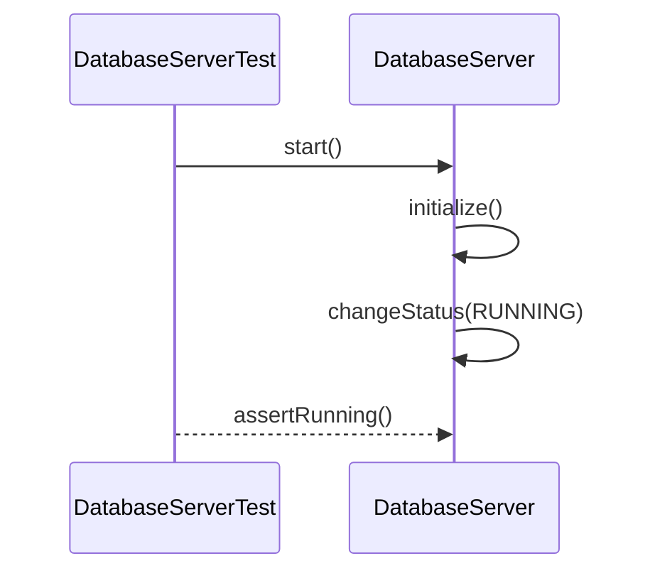
```mermaid
sequenceDiagram
    participant Test as DatabaseServerTest
    participant Server as DatabaseServer

    Test->>Server: start()
    Server->>Server: initialize()
    Server->>Server: changeStatus(RUNNING)
    Test-->>Server: assertRunning()
```

## 2. shouldStopDatabaseServer()
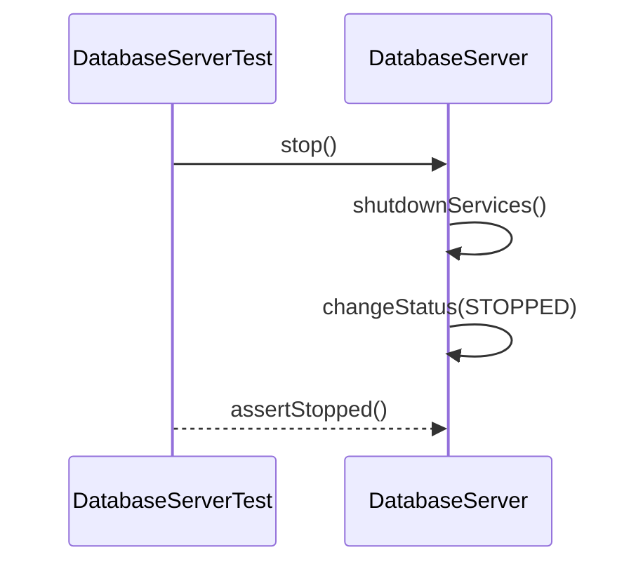
```mermaid
sequenceDiagram
    participant Test as DatabaseServerTest
    participant Server as DatabaseServer

    Test->>Server: stop()
    Server->>Server: shutdownServices()
    Server->>Server: changeStatus(STOPPED)
    Test-->>Server: assertStopped()
```

## 3. shouldRestartDatabaseServer()
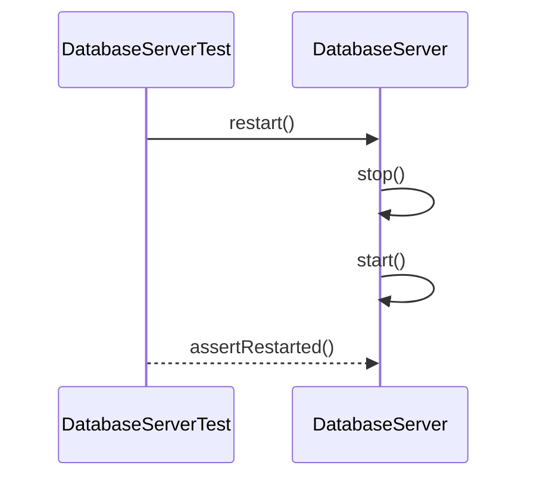
```mermaid
sequenceDiagram
    participant Test as DatabaseServerTest
    participant Server as DatabaseServer

    Test->>Server: restart()
    Server->>Server: stop()
    Server->>Server: start()
    Test-->>Server: assertRestarted()
```

## 4. shouldInitializeManagersOnStartup()
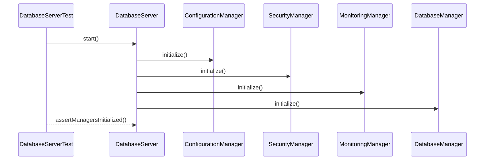
```mermaid
sequenceDiagram
    participant Test as DatabaseServerTest
    participant Server as DatabaseServer
    participant Config as ConfigurationManager
    participant Security as SecurityManager
    participant Monitor as MonitoringManager
    participant DBManager as DatabaseManager

    Test->>Server: start()

    Server->>Config: initialize()
    Server->>Security: initialize()
    Server->>Monitor: initialize()
    Server->>DBManager: initialize()

    Test-->>Server: assertManagersInitialized()
```

## 5. shouldCreateDatabase()
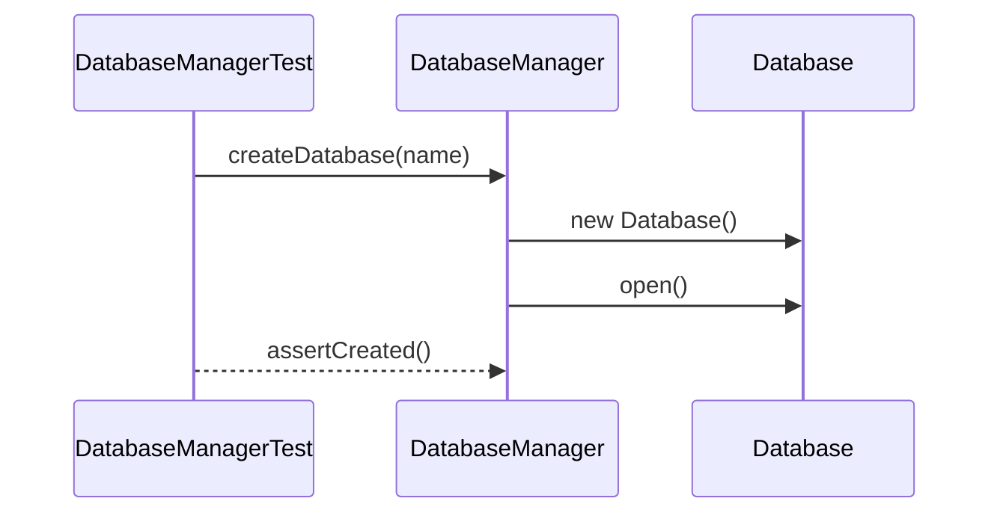
```mermaid
sequenceDiagram
    participant Test as DatabaseManagerTest
    participant Manager as DatabaseManager
    participant Database

    Test->>Manager: createDatabase(name)
    Manager->>Database: new Database()
    Manager->>Database: open()

    Test-->>Manager: assertCreated()
```

## 6. shouldDropDatabase()
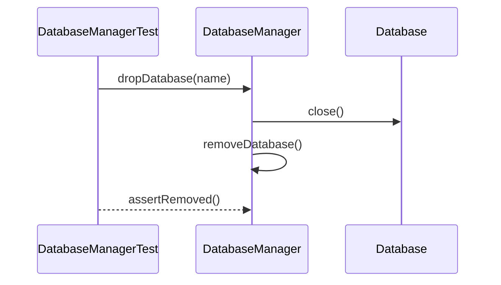
```mermaid 
sequenceDiagram
    participant Test as DatabaseManagerTest
    participant Manager as DatabaseManager
    participant Database

    Test->>Manager: dropDatabase(name)
    Manager->>Database: close()
    Manager->>Manager: removeDatabase()

    Test-->>Manager: assertRemoved()
```

## 7. shouldGetDatabaseByName()
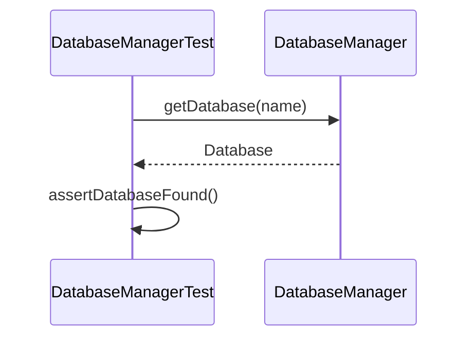
```mermaid
sequenceDiagram
    participant Test as DatabaseManagerTest
    participant Manager as DatabaseManager

    Test->>Manager: getDatabase(name)
    Manager-->>Test: Database
    Test->>Test: assertDatabaseFound()
```

## 8. shouldListAllDatabases()
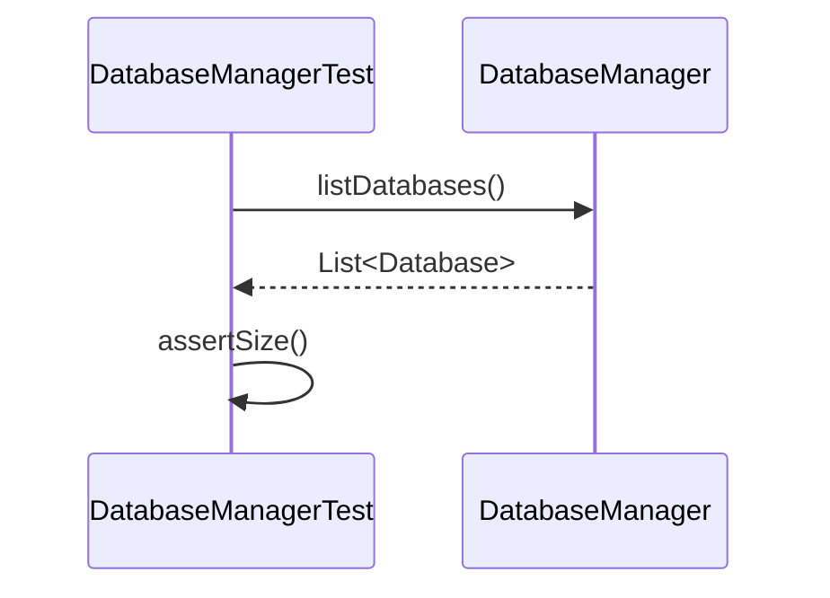
```mermaid
sequenceDiagram
    participant Test as DatabaseManagerTest
    participant Manager as DatabaseManager

    Test->>Manager: listDatabases()
    Manager-->>Test: List<Database>

    Test->>Test: assertSize()
```

## 9. shouldRejectDuplicateDatabaseName()
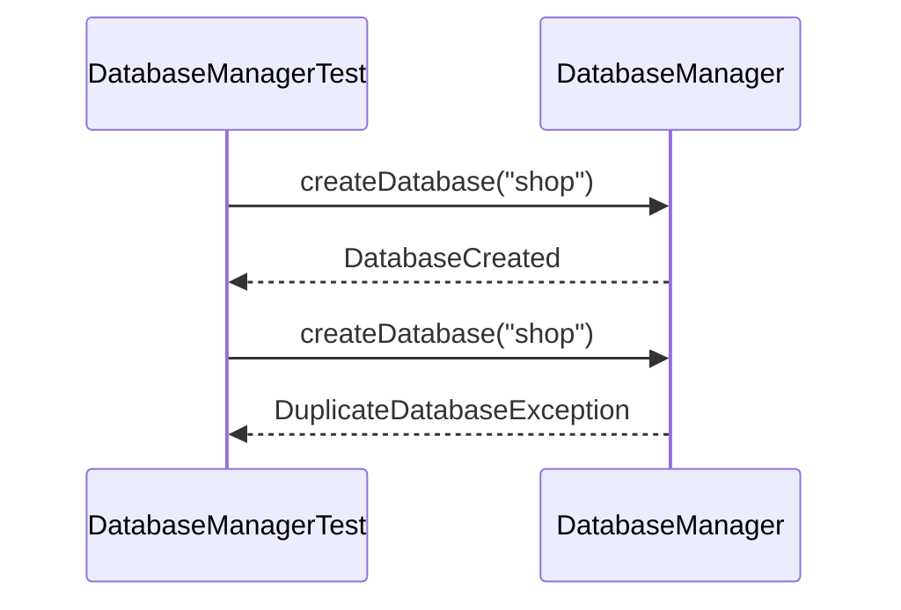
```mermaid
sequenceDiagram
    participant Test as DatabaseManagerTest
    participant Manager as DatabaseManager

    Test->>Manager: createDatabase("shop")
    Manager-->>Test: DatabaseCreated

    Test->>Manager: createDatabase("shop")

    Manager-->>Test: DuplicateDatabaseException
```

## 10. shouldLoadConfiguration()
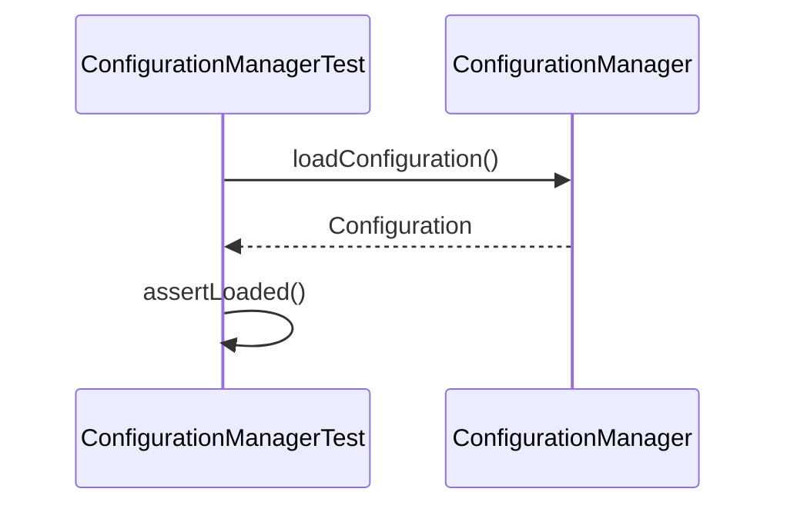
```mermaid
sequenceDiagram
    participant Test as ConfigurationManagerTest
    participant Config as ConfigurationManager

    Test->>Config: loadConfiguration()
    Config-->>Test: Configuration

    Test->>Test: assertLoaded()
```

## 11. shouldUpdateConfiguration()
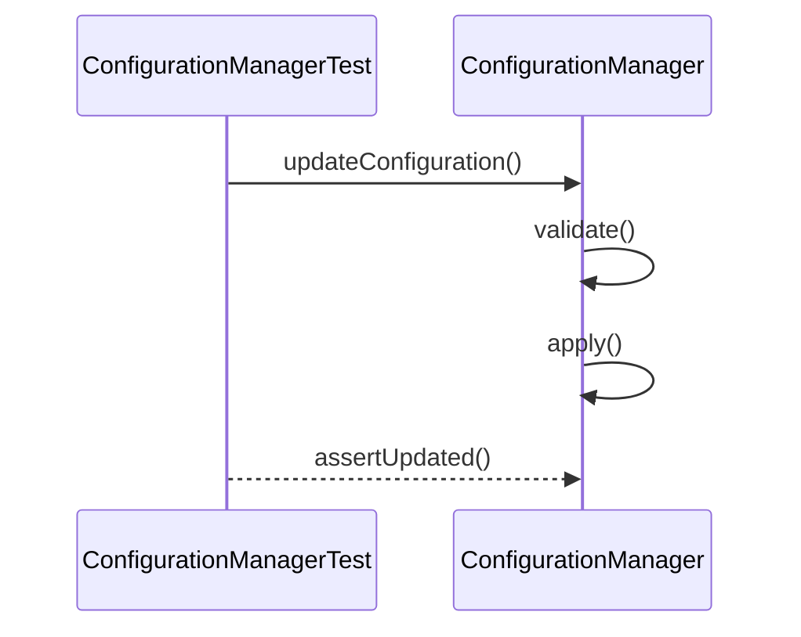
```mermaid
sequenceDiagram
    participant Test as ConfigurationManagerTest
    participant Config as ConfigurationManager

    Test->>Config: updateConfiguration()
    Config->>Config: validate()
    Config->>Config: apply()

    Test-->>Config: assertUpdated()
```

## 12. shouldPersistConfiguration()
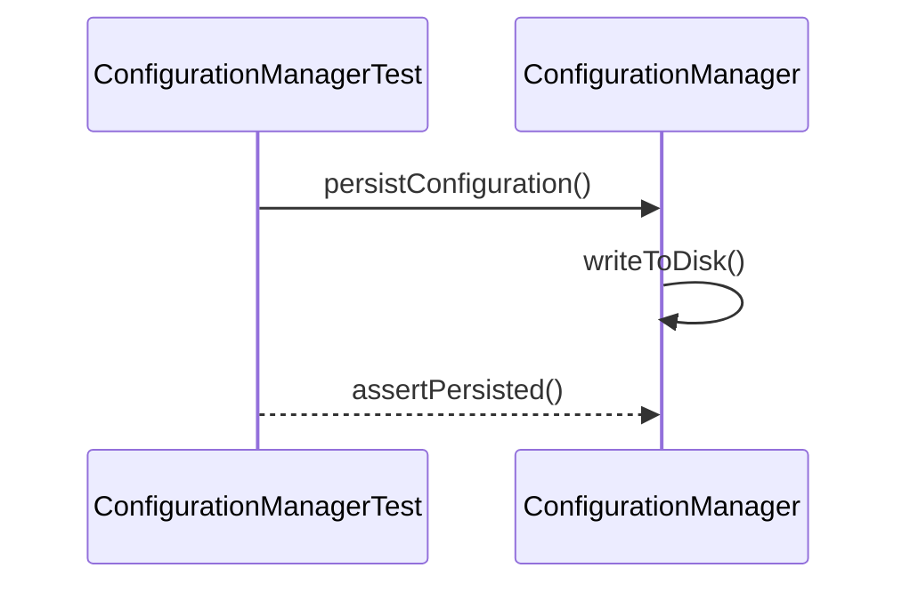
```mermaid
sequenceDiagram
    participant Test as ConfigurationManagerTest
    participant Config as ConfigurationManager

    Test->>Config: persistConfiguration()
    Config->>Config: writeToDisk()

    Test-->>Config: assertPersisted()
```

## 13. shouldCollectServerMetrics()
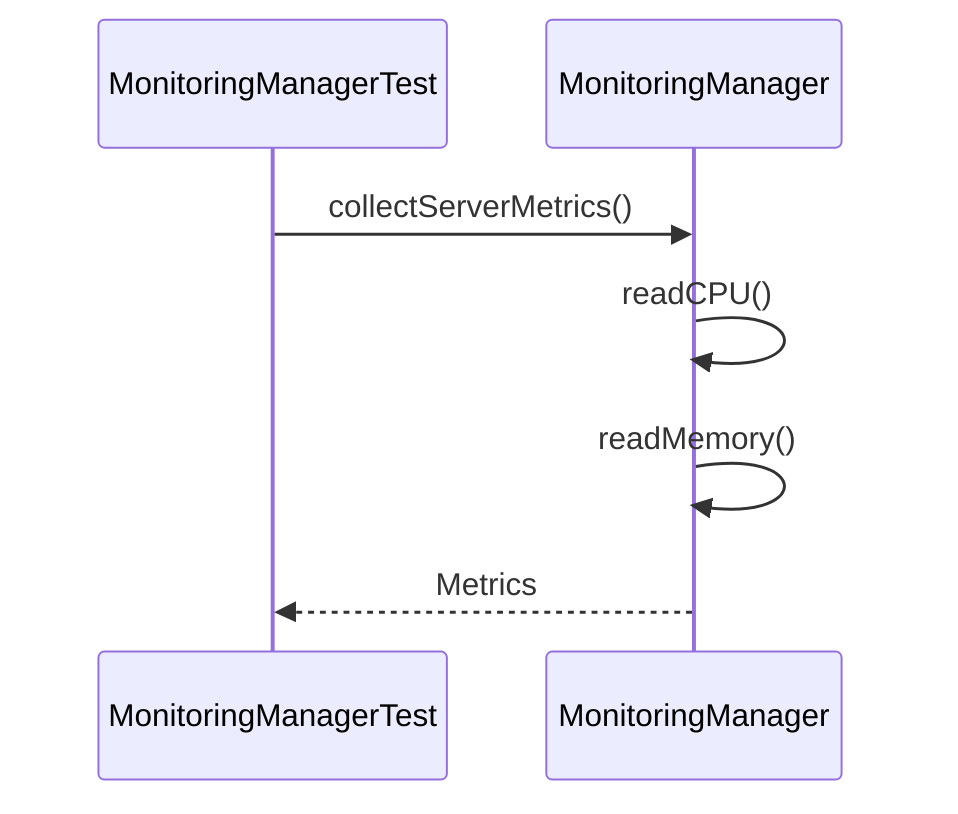
```mermaid
sequenceDiagram
    participant Test as MonitoringManagerTest
    participant Monitor as MonitoringManager

    Test->>Monitor: collectServerMetrics()
    Monitor->>Monitor: readCPU()
    Monitor->>Monitor: readMemory()

    Monitor-->>Test: Metrics
```

## 14. shouldReportServerStatus()
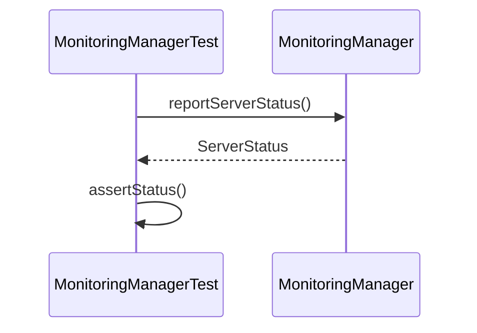
```mermaid
sequenceDiagram
    participant Test as MonitoringManagerTest
    participant Monitor as MonitoringManager

    Test->>Monitor: reportServerStatus()
    Monitor-->>Test: ServerStatus

    Test->>Test: assertStatus()
```

# Database Server Integration Test

## 1. shouldStartEntireDatabaseServer()
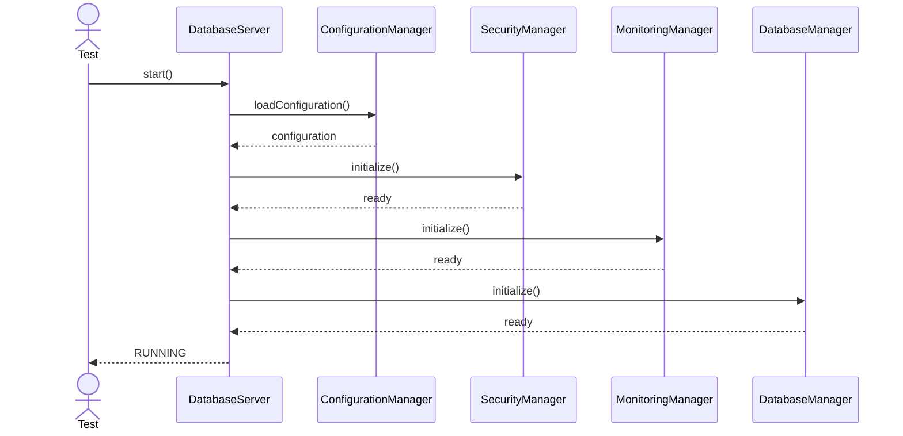
```mermaid
sequenceDiagram
    actor Test
    participant Server as DatabaseServer
    participant Config as ConfigurationManager
    participant Security as SecurityManager
    participant Monitor as MonitoringManager
    participant DBManager as DatabaseManager

    Test->>Server: start()

    Server->>Config: loadConfiguration()
    Config-->>Server: configuration

    Server->>Security: initialize()
    Security-->>Server: ready

    Server->>Monitor: initialize()
    Monitor-->>Server: ready

    Server->>DBManager: initialize()
    DBManager-->>Server: ready

    Server-->>Test: RUNNING
```

## 2. shouldCreateDatabaseThroughServer()
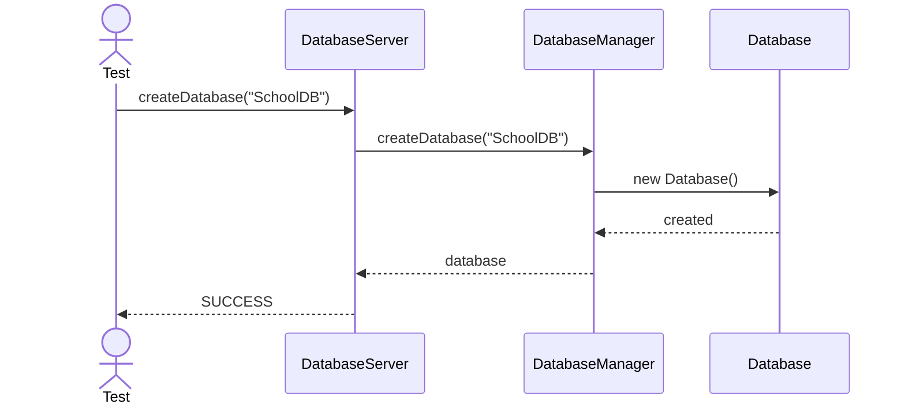
```mermaid
sequenceDiagram
    actor Test
    participant Server as DatabaseServer
    participant DBManager as DatabaseManager
    participant Database

    Test->>Server: createDatabase("SchoolDB")

    Server->>DBManager: createDatabase("SchoolDB")

    DBManager->>Database: new Database()
    Database-->>DBManager: created

    DBManager-->>Server: database

    Server-->>Test: SUCCESS
```

## 3. shouldShutdownServerGracefully()
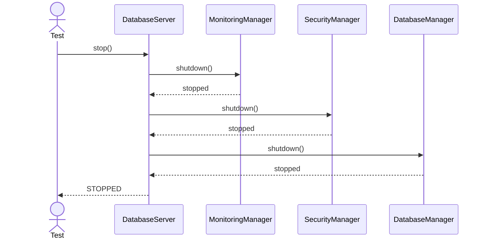
```mermaid
sequenceDiagram
    actor Test
    participant Server as DatabaseServer
    participant Monitor as MonitoringManager
    participant Security as SecurityManager
    participant DBManager as DatabaseManager

    Test->>Server: stop()

    Server->>Monitor: shutdown()
    Monitor-->>Server: stopped

    Server->>Security: shutdown()
    Security-->>Server: stopped

    Server->>DBManager: shutdown()
    DBManager-->>Server: stopped

    Server-->>Test: STOPPED
```