# Query Processing Unit Test

## SQLParserTest

### 1. shouldParseValidSQL()
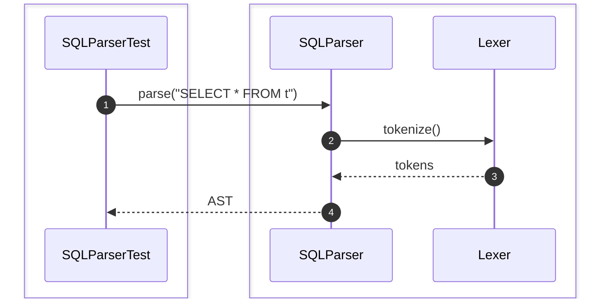

### 2. shouldParseSelectStatement()
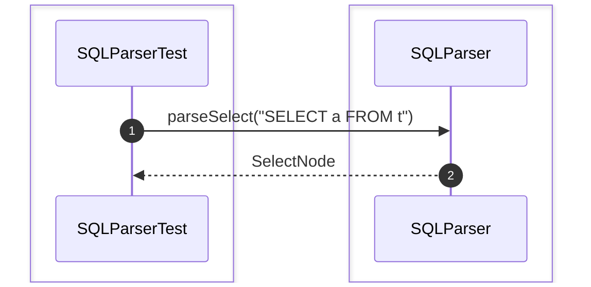

### 3. shouldParseInsertStatement()
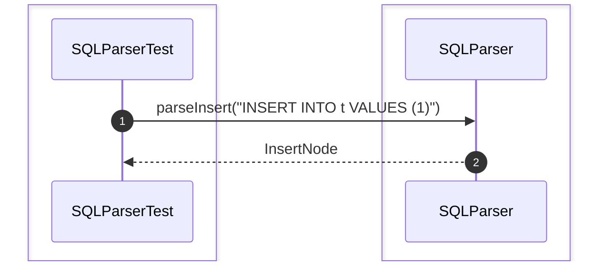

### 4. shouldParseUpdateStatement()


### 5. shouldParseDeleteStatement()
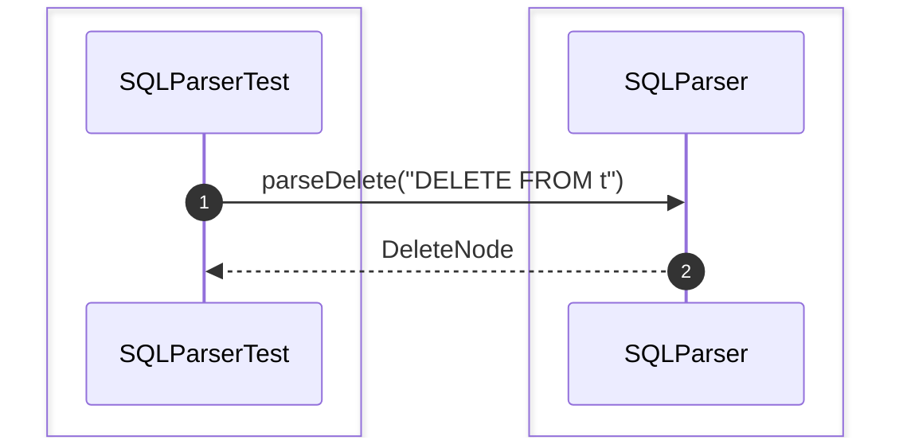

### 6. shouldParseCreateTableStatement()
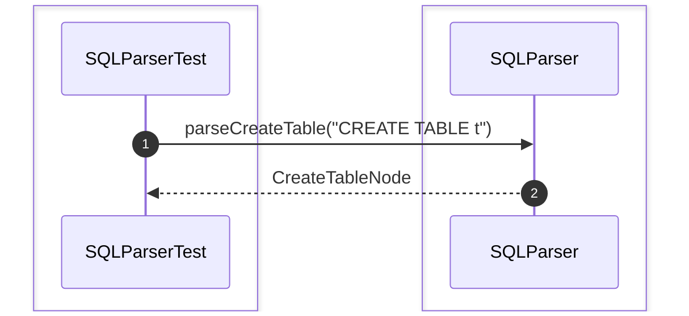

### 7. shouldParseDropTableStatement()
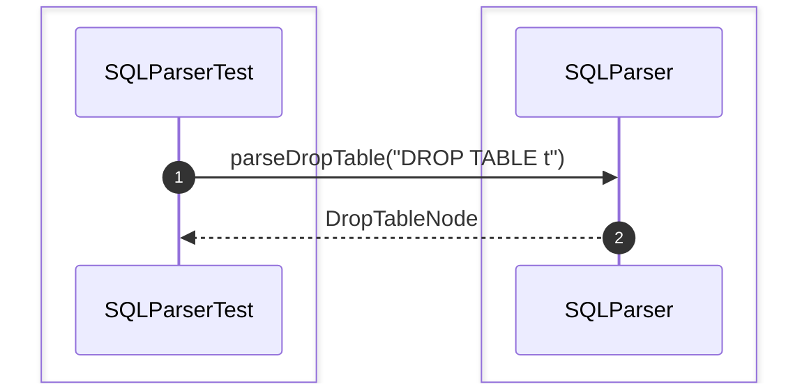

### 8. shouldTokenizeSQL()
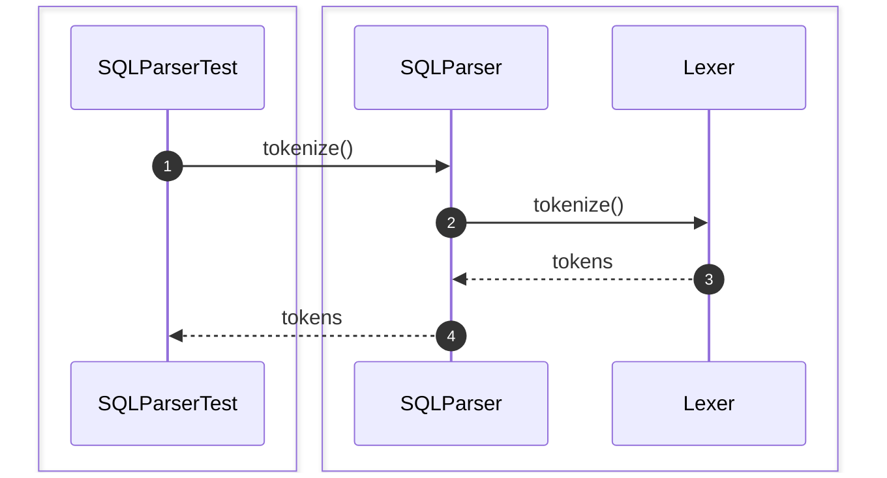

### 9. shouldValidateSQLSyntax()
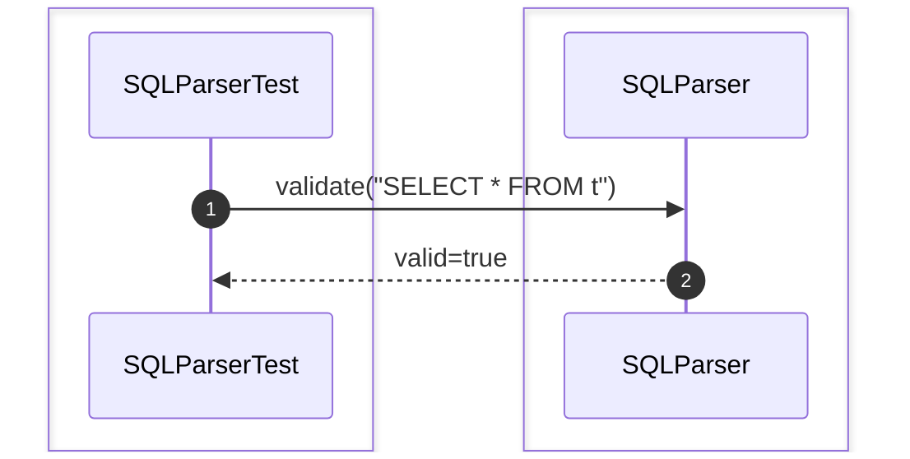

### 10. shouldRejectInvalidSQLSyntax()
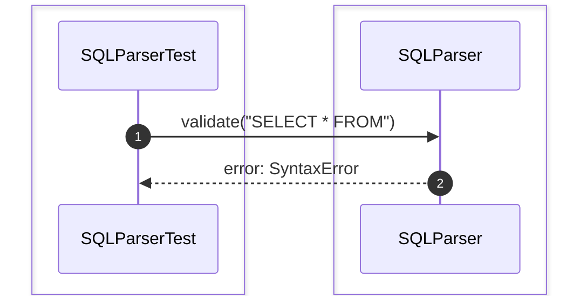

### 11. shouldRejectUnsupportedSQL()
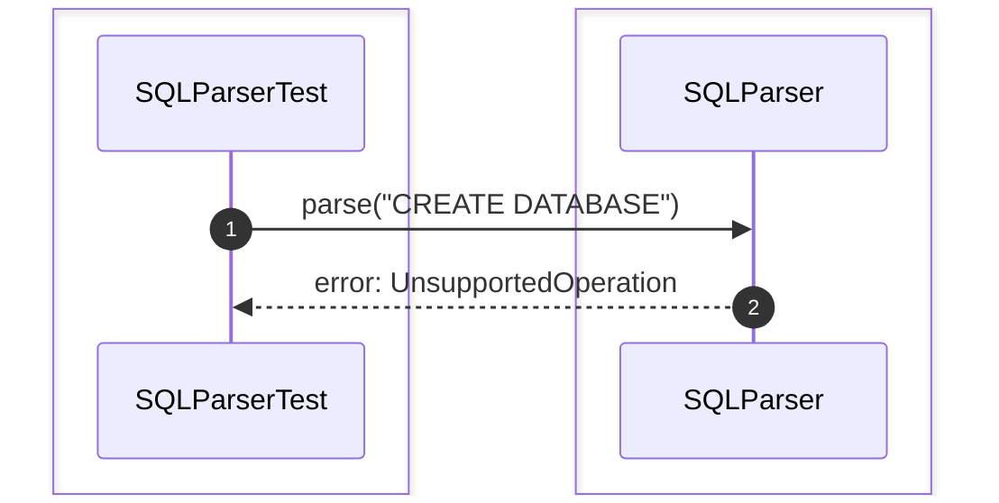

### 12. shouldHandleNestedQuery()
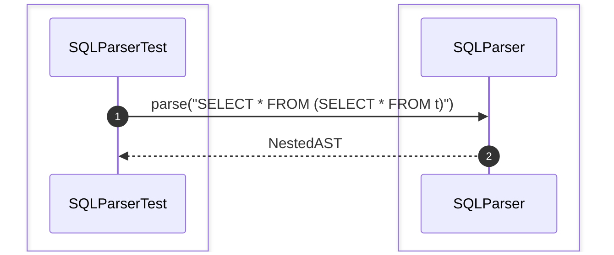

### 13. shouldHandleAlias()
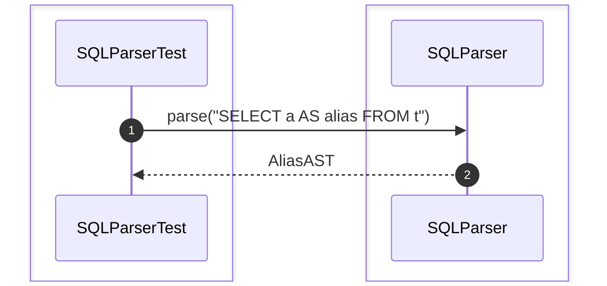

### 14. shouldHandleJoinClause()
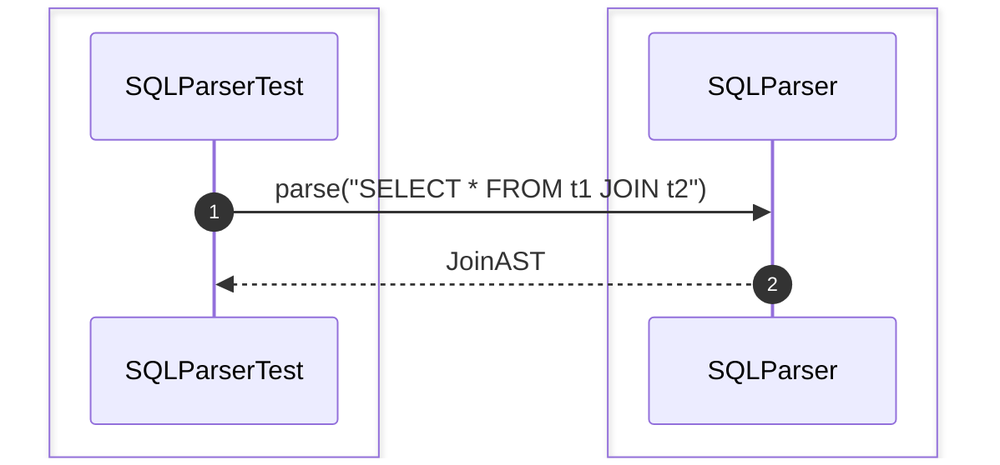

### 15. shouldHandleGroupByClause()


### 16. shouldHandleOrderByClause()
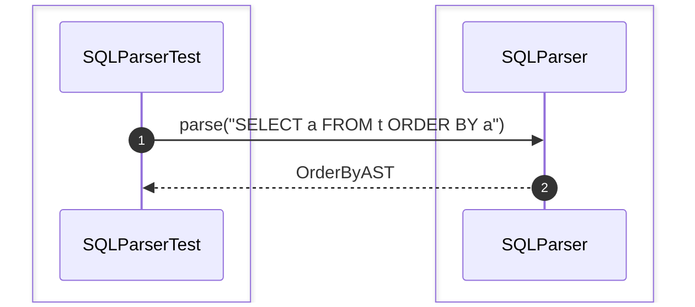

### 17. shouldHandleLimitClause()
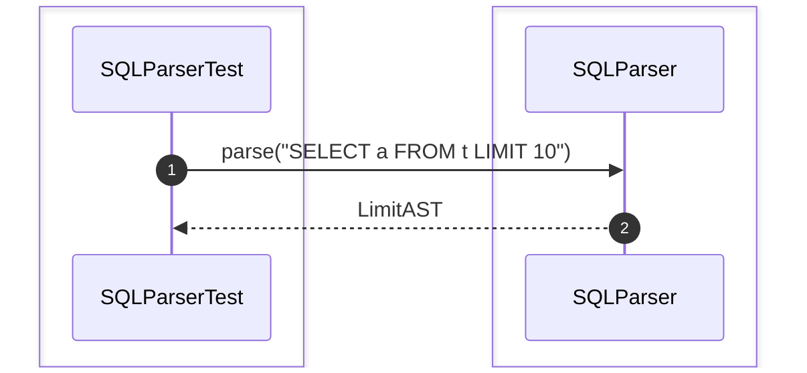

## LexerTest

### 1. shouldTokenizeSQLStatement()
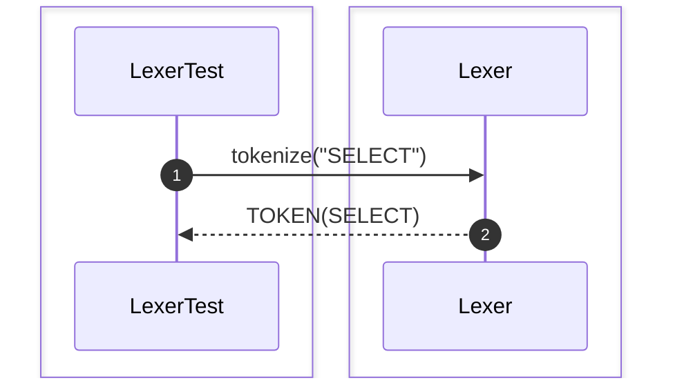

### 2. shouldIgnoreWhitespace()
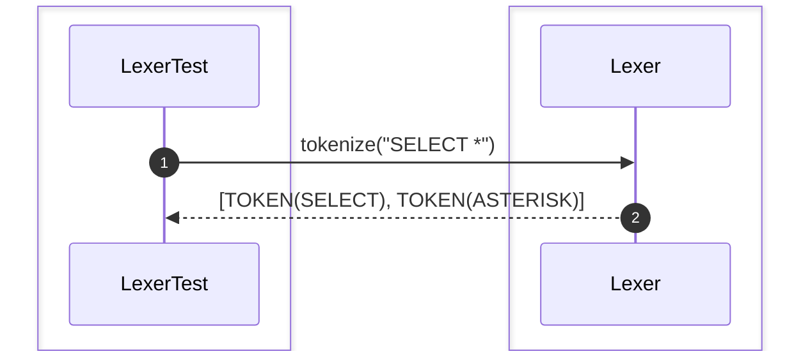

### 3. shouldIgnoreComments()
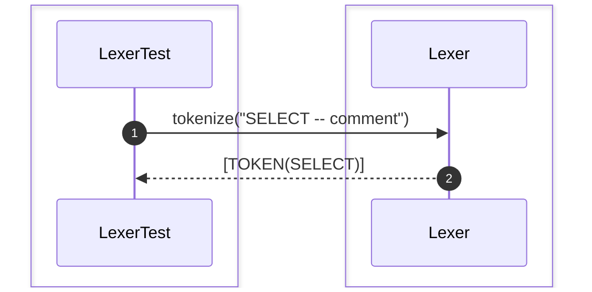

### 4. shouldRecognizeKeywords()
```mermaid
sequenceDiagram
    autonumber

    box #e1f5fe Test Suite
    participant Test as LexerTest
    end
    box #fff3e0 Query Components
    participant Lexer as Lexer
    end

    Test->>Lexer: tokenize("SELECT INSERT UPDATE")
    Lexer-->>Test: Keywords list
```

### 5. shouldRecognizeIdentifiers()
```mermaid
sequenceDiagram
    autonumber

    box #e1f5fe Test Suite
    participant Test as LexerTest
    end
    box #fff3e0 Query Components
    participant Lexer as Lexer
    end

    Test->>Lexer: tokenize("student_name")
    Lexer-->>Test: TOKEN(IDENTIFIER)
```

### 6. shouldRecognizeOperators()
```mermaid
sequenceDiagram
    autonumber

    box #e1f5fe Test Suite
    participant Test as LexerTest
    end
    box #fff3e0 Query Components
    participant Lexer as Lexer
    end

    Test->>Lexer: tokenize("+=*")
    Lexer-->>Test: Operators list
```

### 7. shouldRecognizeNumbers()
```mermaid
sequenceDiagram
    autonumber

    box #e1f5fe Test Suite
    participant Test as LexerTest
    end
    box #fff3e0 Query Components
    participant Lexer as Lexer
    end

    Test->>Lexer: tokenize("123.45")
    Lexer-->>Test: TOKEN(NUMBER)
```

### 8. shouldRecognizeStringLiteral()
```mermaid
sequenceDiagram
    autonumber

    box #e1f5fe Test Suite
    participant Test as LexerTest
    end
    box #fff3e0 Query Components
    participant Lexer as Lexer
    end

    Test->>Lexer: tokenize("'john'")
    Lexer-->>Test: TOKEN(STRING)
```

### 9. shouldRecognizeBooleanLiteral()
```mermaid
sequenceDiagram
    autonumber

    box #e1f5fe Test Suite
    participant Test as LexerTest
    end
    box #fff3e0 Query Components
    participant Lexer as Lexer
    end

    Test->>Lexer: tokenize("TRUE")
    Lexer-->>Test: TOKEN(BOOLEAN)
```

### 10. shouldRecognizeDelimiter()
```mermaid
sequenceDiagram
    autonumber

    box #e1f5fe Test Suite
    participant Test as LexerTest
    end
    box #fff3e0 Query Components
    participant Lexer as Lexer
    end

    Test->>Lexer: tokenize(";,")
    Lexer-->>Test: Delimiters list
```

## ASTTest

### 1. shouldBuildASTFromSQL()
```mermaid
sequenceDiagram
    autonumber

    box #e1f5fe Test Suite
    participant Test as ASTTest
    end
    box #fff3e0 Query Components
    participant AST as AST
    end

    Test->>AST: build(tokens)
    AST-->>Test: ASTRoot
```

### 2. shouldStoreASTRootNode()
```mermaid
sequenceDiagram
    autonumber

    box #e1f5fe Test Suite
    participant Test as ASTTest
    end
    box #fff3e0 Query Components
    participant AST as AST
    end

    Test->>AST: setRoot(node)
    AST-->>Test: root stored
```

### 3. shouldBuildSelectNode()
```mermaid
sequenceDiagram
    autonumber

    box #e1f5fe Test Suite
    participant Test as ASTTest
    end
    box #fff3e0 Query Components
    participant AST as AST
    end

    Test->>AST: createSelectNode()
    AST-->>Test: SelectNode
```

### 4. shouldBuildInsertNode()
```mermaid
sequenceDiagram
    autonumber

    box #e1f5fe Test Suite
    participant Test as ASTTest
    end
    box #fff3e0 Query Components
    participant AST as AST
    end

    Test->>AST: createInsertNode()
    AST-->>Test: InsertNode
```

### 5. shouldBuildUpdateNode()
```mermaid
sequenceDiagram
    autonumber

    box #e1f5fe Test Suite
    participant Test as ASTTest
    end
    box #fff3e0 Query Components
    participant AST as AST
    end

    Test->>AST: createUpdateNode()
    AST-->>Test: UpdateNode
```

### 6. shouldBuildDeleteNode()
```mermaid
sequenceDiagram
    autonumber

    box #e1f5fe Test Suite
    participant Test as ASTTest
    end
    box #fff3e0 Query Components
    participant AST as AST
    end

    Test->>AST: createDeleteNode()
    AST-->>Test: DeleteNode
```

### 7. shouldBuildJoinNode()
```mermaid
sequenceDiagram
    autonumber

    box #e1f5fe Test Suite
    participant Test as ASTTest
    end
    box #fff3e0 Query Components
    participant AST as AST
    end

    Test->>AST: createJoinNode()
    AST-->>Test: JoinNode
```

### 8. shouldBuildWhereNode()
```mermaid
sequenceDiagram
    autonumber

    box #e1f5fe Test Suite
    participant Test as ASTTest
    end
    box #fff3e0 Query Components
    participant AST as AST
    end

    Test->>AST: createWhereNode()
    AST-->>Test: WhereNode
```

### 9. shouldBuildGroupByNode()
```mermaid
sequenceDiagram
    autonumber

    box #e1f5fe Test Suite
    participant Test as ASTTest
    end
    box #fff3e0 Query Components
    participant AST as AST
    end

    Test->>AST: createGroupByNode()
    AST-->>Test: GroupByNode
```

### 10. shouldBuildOrderByNode()
```mermaid
sequenceDiagram
    autonumber

    box #e1f5fe Test Suite
    participant Test as ASTTest
    end
    box #fff3e0 Query Components
    participant AST as AST
    end

    Test->>AST: createOrderByNode()
    AST-->>Test: OrderByNode
```

## LogicalPlanTest

### 1. shouldCreateLogicalPlan()
```mermaid
sequenceDiagram
    autonumber

    box #e1f5fe Test Suite
    participant Test as LogicalPlanTest
    end
    box #fff3e0 Query Components
    participant Plan as LogicalPlan
    end

    Test->>Plan: new LogicalPlan()
    Plan-->>Test: LogicalPlan
```

### 2. shouldAddLogicalOperators()
```mermaid
sequenceDiagram
    autonumber

    box #e1f5fe Test Suite
    participant Test as LogicalPlanTest
    end
    box #fff3e0 Query Components
    participant Plan as LogicalPlan
    end

    Test->>Plan: addOperator(op)
    Plan-->>Test: operator added
```

### 3. shouldCreateScanOperator()
```mermaid
sequenceDiagram
    autonumber

    box #e1f5fe Test Suite
    participant Test as LogicalPlanTest
    end
    box #fff3e0 Query Components
    participant Plan as LogicalPlan
    end

    Test->>Plan: createScan("t")
    Plan-->>Test: ScanOperator
```

### 4. shouldCreateFilterOperator()
```mermaid
sequenceDiagram
    autonumber

    box #e1f5fe Test Suite
    participant Test as LogicalPlanTest
    end
    box #fff3e0 Query Components
    participant Plan as LogicalPlan
    end

    Test->>Plan: createFilter("a > 1")
    Plan-->>Test: FilterOperator
```

### 5. shouldCreateProjectionOperator()
```mermaid
sequenceDiagram
    autonumber

    box #e1f5fe Test Suite
    participant Test as LogicalPlanTest
    end
    box #fff3e0 Query Components
    participant Plan as LogicalPlan
    end

    Test->>Plan: createProjection("a")
    Plan-->>Test: ProjectionOperator
```

### 6. shouldCreateJoinOperator()
```mermaid
sequenceDiagram
    autonumber

    box #e1f5fe Test Suite
    participant Test as LogicalPlanTest
    end
    box #fff3e0 Query Components
    participant Plan as LogicalPlan
    end

    Test->>Plan: createJoin()
    Plan-->>Test: JoinOperator
```

### 7. shouldCreateAggregationOperator()
```mermaid
sequenceDiagram
    autonumber

    box #e1f5fe Test Suite
    participant Test as LogicalPlanTest
    end
    box #fff3e0 Query Components
    participant Plan as LogicalPlan
    end

    Test->>Plan: createAggregation()
    Plan-->>Test: AggregationOperator
```

### 8. shouldCreateSortOperator()
```mermaid
sequenceDiagram
    autonumber

    box #e1f5fe Test Suite
    participant Test as LogicalPlanTest
    end
    box #fff3e0 Query Components
    participant Plan as LogicalPlan
    end

    Test->>Plan: createSort()
    Plan-->>Test: SortOperator
```

### 9. shouldCreateLimitOperator()
```mermaid
sequenceDiagram
    autonumber

    box #e1f5fe Test Suite
    participant Test as LogicalPlanTest
    end
    box #fff3e0 Query Components
    participant Plan as LogicalPlan
    end

    Test->>Plan: createLimit()
    Plan-->>Test: LimitOperator
```

### 10. shouldLinkLogicalOperators()
```mermaid
sequenceDiagram
    autonumber

    box #e1f5fe Test Suite
    participant Test as LogicalPlanTest
    end
    box #fff3e0 Query Components
    participant Plan as LogicalPlan
    end

    Test->>Plan: link(op1, op2)
    Plan-->>Test: linked
```

## QueryOptimizerTest

### 1. shouldOptimizeLogicalPlan()
```mermaid
sequenceDiagram
    autonumber

    box #e1f5fe Test Suite
    participant Test as QueryOptimizerTest
    end
    box #fff3e0 Query Components
    participant Optimizer as QueryOptimizer
    end

    Test->>Optimizer: optimize(plan)
    Optimizer-->>Test: optimizedPlan
```

### 2. shouldEstimateQueryCost()
```mermaid
sequenceDiagram
    autonumber

    box #e1f5fe Test Suite
    participant Test as QueryOptimizerTest
    end
    box #fff3e0 Query Components
    participant Optimizer as QueryOptimizer
    end

    Test->>Optimizer: estimateCost(plan)
    Optimizer-->>Test: cost
```

### 3. shouldChooseJoinOrder()
```mermaid
sequenceDiagram
    autonumber

    box #e1f5fe Test Suite
    participant Test as QueryOptimizerTest
    end
    box #fff3e0 Query Components
    participant Optimizer as QueryOptimizer
    end

    Test->>Optimizer: chooseJoinOrder(tables)
    Optimizer-->>Test: joinOrder
```

### 4. shouldGeneratePhysicalPlan()
```mermaid
sequenceDiagram
    autonumber

    box #e1f5fe Test Suite
    participant Test as QueryOptimizerTest
    end
    box #fff3e0 Query Components
    participant Optimizer as QueryOptimizer
    end

    Test->>Optimizer: generatePhysical(plan)
    Optimizer-->>Test: physicalPlan
```

### 5. shouldPushDownPredicate()
```mermaid
sequenceDiagram
    autonumber

    box #e1f5fe Test Suite
    participant Test as QueryOptimizerTest
    end
    box #fff3e0 Query Components
    participant Optimizer as QueryOptimizer
    end

    Test->>Optimizer: pushDownPredicate()
    Optimizer-->>Test: pushed
```

### 6. shouldEliminateUnusedProjection()
```mermaid
sequenceDiagram
    autonumber

    box #e1f5fe Test Suite
    participant Test as QueryOptimizerTest
    end
    box #fff3e0 Query Components
    participant Optimizer as QueryOptimizer
    end

    Test->>Optimizer: eliminateProjections()
    Optimizer-->>Test: eliminated
```

### 7. shouldSimplifyExpression()
```mermaid
sequenceDiagram
    autonumber

    box #e1f5fe Test Suite
    participant Test as QueryOptimizerTest
    end
    box #fff3e0 Query Components
    participant Optimizer as QueryOptimizer
    end

    Test->>Optimizer: simplifyExpression()
    Optimizer-->>Test: simplified
```

### 8. shouldChooseIndexScan()
```mermaid
sequenceDiagram
    autonumber

    box #e1f5fe Test Suite
    participant Test as QueryOptimizerTest
    end
    box #fff3e0 Query Components
    participant Optimizer as QueryOptimizer
    end

    Test->>Optimizer: chooseIndexScan()
    Optimizer-->>Test: IndexScanChosen
```

### 9. shouldChooseTableScan()
```mermaid
sequenceDiagram
    autonumber

    box #e1f5fe Test Suite
    participant Test as QueryOptimizerTest
    end
    box #fff3e0 Query Components
    participant Optimizer as QueryOptimizer
    end

    Test->>Optimizer: chooseTableScan()
    Optimizer-->>Test: TableScanChosen
```

### 10. shouldOptimizeJoinStrategy()
```mermaid
sequenceDiagram
    autonumber

    box #e1f5fe Test Suite
    participant Test as QueryOptimizerTest
    end
    box #fff3e0 Query Components
    participant Optimizer as QueryOptimizer
    end

    Test->>Optimizer: chooseJoinStrategy()
    Optimizer-->>Test: HashJoinChosen
```

### 11. shouldOptimizeAggregation()
```mermaid
sequenceDiagram
    autonumber

    box #e1f5fe Test Suite
    participant Test as QueryOptimizerTest
    end
    box #fff3e0 Query Components
    participant Optimizer as QueryOptimizer
    end

    Test->>Optimizer: optimizeAggregation()
    Optimizer-->>Test: optimized
```

### 12. shouldReuseStatistics()
```mermaid
sequenceDiagram
    autonumber

    box #e1f5fe Test Suite
    participant Test as QueryOptimizerTest
    end
    box #fff3e0 Query Components
    participant Optimizer as QueryOptimizer
    end

    Test->>Optimizer: reuseStats()
    Optimizer-->>Test: reused
```

## PhysicalPlanTest

### 1. shouldCreatePhysicalPlan()
```mermaid
sequenceDiagram
    autonumber

    box #e1f5fe Test Suite
    participant Test as PhysicalPlanTest
    end
    box #fff3e0 Query Components
    participant Plan as PhysicalPlan
    end

    Test->>Plan: new PhysicalPlan()
    Plan-->>Test: PhysicalPlan
```

### 2. shouldStoreExecutionOperators()
```mermaid
sequenceDiagram
    autonumber

    box #e1f5fe Test Suite
    participant Test as PhysicalPlanTest
    end
    box #fff3e0 Query Components
    participant Plan as PhysicalPlan
    end

    Test->>Plan: addOperator(op)
    Plan-->>Test: operator stored
```

### 3. shouldCreateSequentialScan()
```mermaid
sequenceDiagram
    autonumber

    box #e1f5fe Test Suite
    participant Test as PhysicalPlanTest
    end
    box #fff3e0 Query Components
    participant Plan as PhysicalPlan
    end

    Test->>Plan: createSeqScan()
    Plan-->>Test: SeqScanOperator
```

### 4. shouldCreateIndexScan()
```mermaid
sequenceDiagram
    autonumber

    box #e1f5fe Test Suite
    participant Test as PhysicalPlanTest
    end
    box #fff3e0 Query Components
    participant Plan as PhysicalPlan
    end

    Test->>Plan: createIndexScan()
    Plan-->>Test: IndexScanOperator
```

### 5. shouldCreateNestedLoopJoin()
```mermaid
sequenceDiagram
    autonumber

    box #e1f5fe Test Suite
    participant Test as PhysicalPlanTest
    end
    box #fff3e0 Query Components
    participant Plan as PhysicalPlan
    end

    Test->>Plan: createNLJoin()
    Plan-->>Test: NLJoinOperator
```

### 6. shouldCreateHashJoin()
```mermaid
sequenceDiagram
    autonumber

    box #e1f5fe Test Suite
    participant Test as PhysicalPlanTest
    end
    box #fff3e0 Query Components
    participant Plan as PhysicalPlan
    end

    Test->>Plan: createHashJoin()
    Plan-->>Test: HashJoinOperator
```

### 7. shouldCreateMergeJoin()
```mermaid
sequenceDiagram
    autonumber

    box #e1f5fe Test Suite
    participant Test as PhysicalPlanTest
    end
    box #fff3e0 Query Components
    participant Plan as PhysicalPlan
    end

    Test->>Plan: createMergeJoin()
    Plan-->>Test: MergeJoinOperator
```

### 8. shouldCreateSortOperator()
```mermaid
sequenceDiagram
    autonumber

    box #e1f5fe Test Suite
    participant Test as PhysicalPlanTest
    end
    box #fff3e0 Query Components
    participant Plan as PhysicalPlan
    end

    Test->>Plan: createSort()
    Plan-->>Test: SortOperator
```

### 9. shouldCreateAggregateOperator()
```mermaid
sequenceDiagram
    autonumber

    box #e1f5fe Test Suite
    participant Test as PhysicalPlanTest
    end
    box #fff3e0 Query Components
    participant Plan as PhysicalPlan
    end

    Test->>Plan: createAggregate()
    Plan-->>Test: AggregateOperator
```

### 10. shouldLinkExecutionTree()
```mermaid
sequenceDiagram
    autonumber

    box #e1f5fe Test Suite
    participant Test as PhysicalPlanTest
    end
    box #fff3e0 Query Components
    participant Plan as PhysicalPlan
    end

    Test->>Plan: link(op1, op2)
    Plan-->>Test: executionTree
```

## QueryExecutorTest

### 1. shouldExecutePhysicalPlan()
```mermaid
sequenceDiagram
    autonumber

    box #e1f5fe Test Suite
    participant Test as QueryExecutorTest
    end
    box #fff3e0 Query Components
    participant Executor as QueryExecutor
    end

    Test->>Executor: execute(plan)
    Executor-->>Test: resultSet
```

### 2. shouldExecuteSequentialScan()
```mermaid
sequenceDiagram
    autonumber

    box #e1f5fe Test Suite
    participant Test as QueryExecutorTest
    end
    box #fff3e0 Query Components
    participant Executor as QueryExecutor
    end

    Test->>Executor: executeSeqScan()
    Executor-->>Test: rows
```

### 3. shouldExecuteIndexScan()
```mermaid
sequenceDiagram
    autonumber

    box #e1f5fe Test Suite
    participant Test as QueryExecutorTest
    end
    box #fff3e0 Query Components
    participant Executor as QueryExecutor
    end

    Test->>Executor: executeIndexScan()
    Executor-->>Test: rows
```

### 4. shouldExecuteJoin()
```mermaid
sequenceDiagram
    autonumber

    box #e1f5fe Test Suite
    participant Test as QueryExecutorTest
    end
    box #fff3e0 Query Components
    participant Executor as QueryExecutor
    end

    Test->>Executor: executeJoin()
    Executor-->>Test: joinedRows
```

### 5. shouldExecuteAggregation()
```mermaid
sequenceDiagram
    autonumber

    box #e1f5fe Test Suite
    participant Test as QueryExecutorTest
    end
    box #fff3e0 Query Components
    participant Executor as QueryExecutor
    end

    Test->>Executor: executeAggregation()
    Executor-->>Test: aggregatedRows
```

### 6. shouldExecuteSort()
```mermaid
sequenceDiagram
    autonumber

    box #e1f5fe Test Suite
    participant Test as QueryExecutorTest
    end
    box #fff3e0 Query Components
    participant Executor as QueryExecutor
    end

    Test->>Executor: executeSort()
    Executor-->>Test: sortedRows
```

### 7. shouldExecuteProjection()
```mermaid
sequenceDiagram
    autonumber

    box #e1f5fe Test Suite
    participant Test as QueryExecutorTest
    end
    box #fff3e0 Query Components
    participant Executor as QueryExecutor
    end

    Test->>Executor: executeProjection()
    Executor-->>Test: projectedRows
```

### 8. shouldExecuteFilter()
```mermaid
sequenceDiagram
    autonumber

    box #e1f5fe Test Suite
    participant Test as QueryExecutorTest
    end
    box #fff3e0 Query Components
    participant Executor as QueryExecutor
    end

    Test->>Executor: executeFilter()
    Executor-->>Test: filteredRows
```

### 9. shouldFetchResultRows()
```mermaid
sequenceDiagram
    autonumber

    box #e1f5fe Test Suite
    participant Test as QueryExecutorTest
    end
    box #fff3e0 Query Components
    participant Executor as QueryExecutor
    end

    Test->>Executor: fetchNext()
    Executor-->>Test: row
```

### 10. shouldReturnEmptyResult()
```mermaid
sequenceDiagram
    autonumber

    box #e1f5fe Test Suite
    participant Test as QueryExecutorTest
    end
    box #fff3e0 Query Components
    participant Executor as QueryExecutor
    end

    Test->>Executor: fetchNext()
    Executor-->>Test: empty
```

### 11. shouldCancelRunningQuery()
```mermaid
sequenceDiagram
    autonumber

    box #e1f5fe Test Suite
    participant Test as QueryExecutorTest
    end
    box #fff3e0 Query Components
    participant Executor as QueryExecutor
    end

    Test->>Executor: cancel()
    Executor-->>Test: QueryCancelled=true
```

### 12. shouldReleaseExecutionResources()
```mermaid
sequenceDiagram
    autonumber

    box #e1f5fe Test Suite
    participant Test as QueryExecutorTest
    end
    box #fff3e0 Query Components
    participant Executor as QueryExecutor
    end

    Test->>Executor: release()
    Executor-->>Test: released=true
```

## StatisticsManagerTest

### 1. shouldCollectTableStatistics()
```mermaid
sequenceDiagram
    autonumber

    box #e1f5fe Test Suite
    participant Test as StatisticsManagerTest
    end
    box #fff3e0 Query Components
    participant Stats as StatisticsManager
    end

    Test->>Stats: collectTableStats("t")
    Stats-->>Test: stats
```

### 2. shouldCollectColumnStatistics()
```mermaid
sequenceDiagram
    autonumber

    box #e1f5fe Test Suite
    participant Test as StatisticsManagerTest
    end
    box #fff3e0 Query Components
    participant Stats as StatisticsManager
    end

    Test->>Stats: collectColumnStats("t", "c")
    Stats-->>Test: stats
```

### 3. shouldUpdateStatistics()
```mermaid
sequenceDiagram
    autonumber

    box #e1f5fe Test Suite
    participant Test as StatisticsManagerTest
    end
    box #fff3e0 Query Components
    participant Stats as StatisticsManager
    end

    Test->>Stats: updateStats("t")
    Stats-->>Test: UpdateSuccess=true
```

### 4. shouldDeleteStatistics()
```mermaid
sequenceDiagram
    autonumber

    box #e1f5fe Test Suite
    participant Test as StatisticsManagerTest
    end
    box #fff3e0 Query Components
    participant Stats as StatisticsManager
    end

    Test->>Stats: deleteStats("t")
    Stats-->>Test: DeleteSuccess=true
```

### 5. shouldEstimateRowCount()
```mermaid
sequenceDiagram
    autonumber

    box #e1f5fe Test Suite
    participant Test as StatisticsManagerTest
    end
    box #fff3e0 Query Components
    participant Stats as StatisticsManager
    end

    Test->>Stats: estimateRows("t")
    Stats-->>Test: rowCount
```

### 6. shouldEstimateSelectivity()
```mermaid
sequenceDiagram
    autonumber

    box #e1f5fe Test Suite
    participant Test as StatisticsManagerTest
    end
    box #fff3e0 Query Components
    participant Stats as StatisticsManager
    end

    Test->>Stats: estimateSelectivity("t", "c > 1")
    Stats-->>Test: selectivity
```

### 7. shouldEstimateDistinctValues()
```mermaid
sequenceDiagram
    autonumber

    box #e1f5fe Test Suite
    participant Test as StatisticsManagerTest
    end
    box #fff3e0 Query Components
    participant Stats as StatisticsManager
    end

    Test->>Stats: estimateDistinct("t", "c")
    Stats-->>Test: distinctCount
```

### 8. shouldEstimateJoinCost()
```mermaid
sequenceDiagram
    autonumber

    box #e1f5fe Test Suite
    participant Test as StatisticsManagerTest
    end
    box #fff3e0 Query Components
    participant Stats as StatisticsManager
    end

    Test->>Stats: estimateJoinCost()
    Stats-->>Test: cost
```

### 9. shouldProvideStatisticsForOptimizer()
```mermaid
sequenceDiagram
    autonumber

    box #e1f5fe Test Suite
    participant Test as StatisticsManagerTest
    end
    box #fff3e0 Query Components
    participant Stats as StatisticsManager
    end

    Test->>Stats: getStatsForOptimizer()
    Stats-->>Test: statsMap
```

### 10. shouldPersistStatistics()
```mermaid
sequenceDiagram
    autonumber

    box #e1f5fe Test Suite
    participant Test as StatisticsManagerTest
    end
    box #fff3e0 Query Components
    participant Stats as StatisticsManager
    end

    Test->>Stats: persist()
    Stats-->>Test: PersistSuccess=true
```

# Query Processing Integration Test

### 1. shouldParseOptimizeAndExecuteQuery()
```mermaid
sequenceDiagram
    autonumber

    box #e1f5fe Test Suite
    participant Test as QueryProcessingIntegrationTest
    end
    box #fff3e0 Query Components
    participant Parser as SQLParser
    participant Optimizer as QueryOptimizer
    participant Executor as QueryExecutor
    end

    Test->>Parser: parse()
    Parser-->>Optimizer: AST
    Optimizer-->>Executor: PhysicalPlan
    Executor-->>Test: resultSet
```

### 2. shouldGenerateLogicalAndPhysicalPlan()
```mermaid
sequenceDiagram
    autonumber

    box #e1f5fe Test Suite
    participant Test as QueryProcessingIntegrationTest
    end
    box #fff3e0 Query Components
    participant Parser as SQLParser
    participant Optimizer as QueryOptimizer
    end

    Test->>Parser: parse()
    Parser-->>Optimizer: AST
    Optimizer-->>Test: physicalPlan
```

### 3. shouldExecuteOptimizedQueryPlan()
```mermaid
sequenceDiagram
    autonumber

    box #e1f5fe Test Suite
    participant Test as QueryProcessingIntegrationTest
    end
    box #fff3e0 Query Components
    participant Executor as QueryExecutor
    end

    Test->>Executor: execute(optimizedPlan)
    Executor-->>Test: resultSet
```

### 4. shouldCollectStatisticsDuringExecution()
```mermaid
sequenceDiagram
    autonumber

    box #e1f5fe Test Suite
    participant Test as QueryProcessingIntegrationTest
    end
    box #fff3e0 Query Components
    participant Executor as QueryExecutor
    participant Stats as StatisticsManager
    end

    Test->>Executor: execute()
    Executor->>Stats: recordMetrics()
    Stats-->>Test: updated stats
```

### 5. shouldRejectInvalidSQLQuery()
```mermaid
sequenceDiagram
    autonumber

    box #e1f5fe Test Suite
    participant Test as QueryProcessingIntegrationTest
    end
    box #fff3e0 Query Components
    participant Parser as SQLParser
    end

    Test->>Parser: parse("invalid SQL")
    Parser-->>Test: error: SyntaxError
```

### 6. shouldOptimizeJoinQuery()
```mermaid
sequenceDiagram
    autonumber

    box #e1f5fe Test Suite
    participant Test as QueryProcessingIntegrationTest
    end
    box #fff3e0 Query Components
    participant Optimizer as QueryOptimizer
    end

    Test->>Optimizer: optimizeJoin()
    Optimizer-->>Test: JoinPlanChosen
```

### 7. shouldExecuteIndexBasedQuery()
```mermaid
sequenceDiagram
    autonumber

    box #e1f5fe Test Suite
    participant Test as QueryProcessingIntegrationTest
    end
    box #fff3e0 Query Components
    participant Executor as QueryExecutor
    end

    Test->>Executor: executeIndexQuery()
    Executor-->>Test: indexResult
```

### 8. shouldExecuteAggregateQuery()
```mermaid
sequenceDiagram
    autonumber

    box #e1f5fe Test Suite
    participant Test as QueryProcessingIntegrationTest
    end
    box #fff3e0 Query Components
    participant Executor as QueryExecutor
    end

    Test->>Executor: executeAggregateQuery()
    Executor-->>Test: aggregateResult
```

### 9. shouldExecuteNestedQuery()
```mermaid
sequenceDiagram
    autonumber

    box #e1f5fe Test Suite
    participant Test as QueryProcessingIntegrationTest
    end
    box #fff3e0 Query Components
    participant Executor as QueryExecutor
    end

    Test->>Executor: executeNestedQuery()
    Executor-->>Test: nestedResult
```

### 10. shouldExecuteMultiTableJoin()
```mermaid
sequenceDiagram
    autonumber

    box #e1f5fe Test Suite
    participant Test as QueryProcessingIntegrationTest
    end
    box #fff3e0 Query Components
    participant Executor as QueryExecutor
    end

    Test->>Executor: executeMultiJoin()
    Executor-->>Test: multiJoinResult
```

### 11. shouldExecuteDDLStatement()
```mermaid
sequenceDiagram
    autonumber

    box #e1f5fe Test Suite
    participant Test as QueryProcessingIntegrationTest
    end
    box #fff3e0 Query Components
    participant Executor as QueryExecutor
    end

    Test->>Executor: executeDDL()
    Executor-->>Test: DDLCompleted=true
```

### 12. shouldExecuteDMLStatement()
```mermaid
sequenceDiagram
    autonumber

    box #e1f5fe Test Suite
    participant Test as QueryProcessingIntegrationTest
    end
    box #fff3e0 Query Components
    participant Executor as QueryExecutor
    end

    Test->>Executor: executeDML()
    Executor-->>Test: DMLRowsAffected
```

