# Query Processing Unit Test 

## SQL Parser

### 1. shouldParseValidSQL()
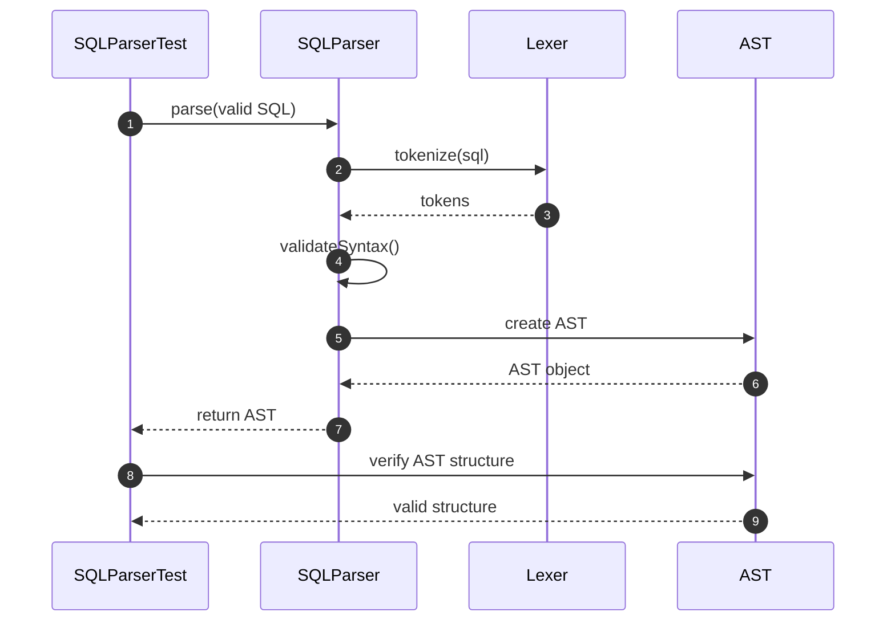
```mermaid
sequenceDiagram
    autonumber

    participant Test as SQLParserTest
    participant Parser as SQLParser
    participant Lexer as Lexer
    participant AST as AST

    Test->>Parser: parse(valid SQL)

    Parser->>Lexer: tokenize(sql)

    Lexer-->>Parser: tokens

    Parser->>Parser: validateSyntax()

    Parser->>AST: create AST

    AST-->>Parser: AST object

    Parser-->>Test: return AST

    Test->>AST: verify AST structure

    AST-->>Test: valid structure
```

### 2. shouldTokenizeSQL()
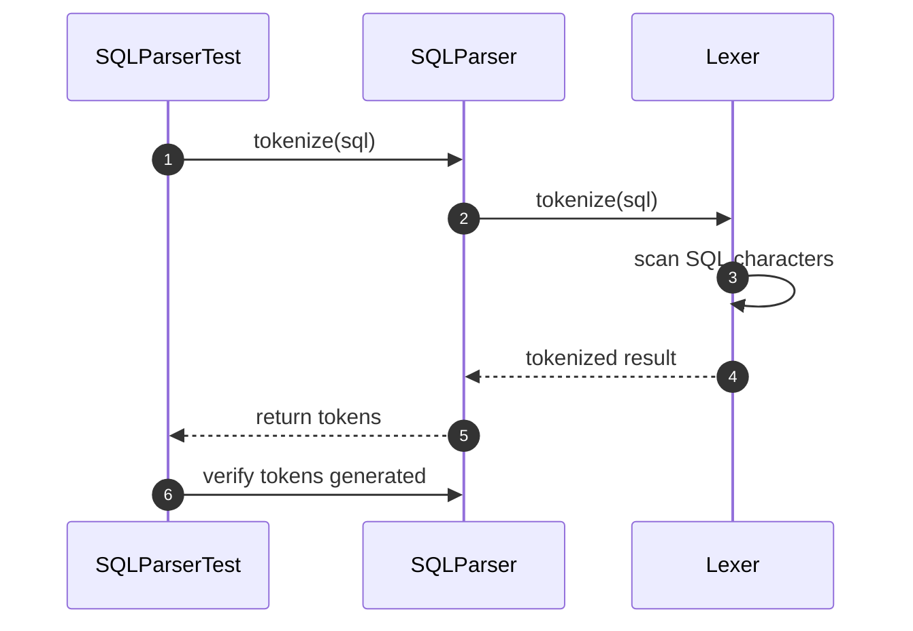
```mermaid
sequenceDiagram
    autonumber

    participant Test as SQLParserTest
    participant Parser as SQLParser
    participant Lexer as Lexer

    Test->>Parser: tokenize(sql)

    Parser->>Lexer: tokenize(sql)

    Lexer->>Lexer: scan SQL characters

    Lexer-->>Parser: tokenized result

    Parser-->>Test: return tokens

    Test->>Parser: verify tokens generated
```

### 3. shouldValidateSQLSyntax()
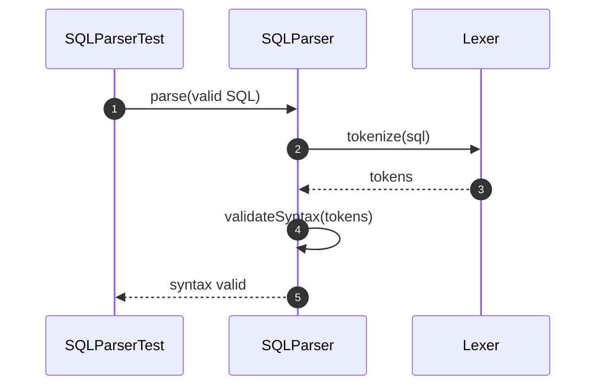
```mermaid
sequenceDiagram
    autonumber

    participant Test as SQLParserTest
    participant Parser as SQLParser
    participant Lexer as Lexer

    Test->>Parser: parse(valid SQL)

    Parser->>Lexer: tokenize(sql)

    Lexer-->>Parser: tokens

    Parser->>Parser: validateSyntax(tokens)

    Parser-->>Test: syntax valid
```

### 4. shouldRejectInvalidSQLSyntax()

```mermaid
sequenceDiagram
    autonumber

    participant Test as SQLParserTest
    participant Parser as SQLParser
    participant Lexer as Lexer

    Test->>Parser: parse(invalid SQL)

    Parser->>Lexer: tokenize(sql)

    Lexer-->>Parser: tokens

    Parser->>Parser: validateSyntax(tokens)

    Parser-->>Test: syntax error
```

## Lexer

### 5. shouldTokenizeSQLStatement()
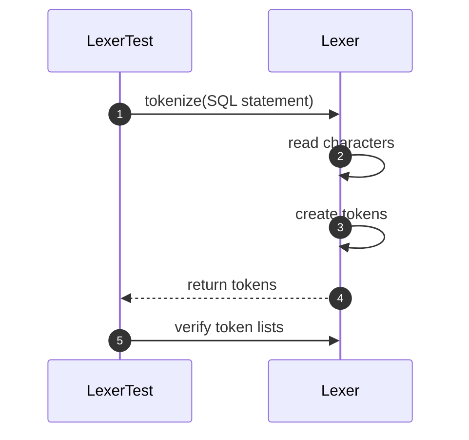
```mermaid
sequenceDiagram
    autonumber

    participant Test as LexerTest
    participant Lexer as Lexer

    Test->>Lexer: tokenize(SQL statement)

    Lexer->>Lexer: read characters

    Lexer->>Lexer: create tokens

    Lexer-->>Test: return tokens

    Test->>Lexer: verify token lists
```

### 6. shouldIgnoreWhitespace()
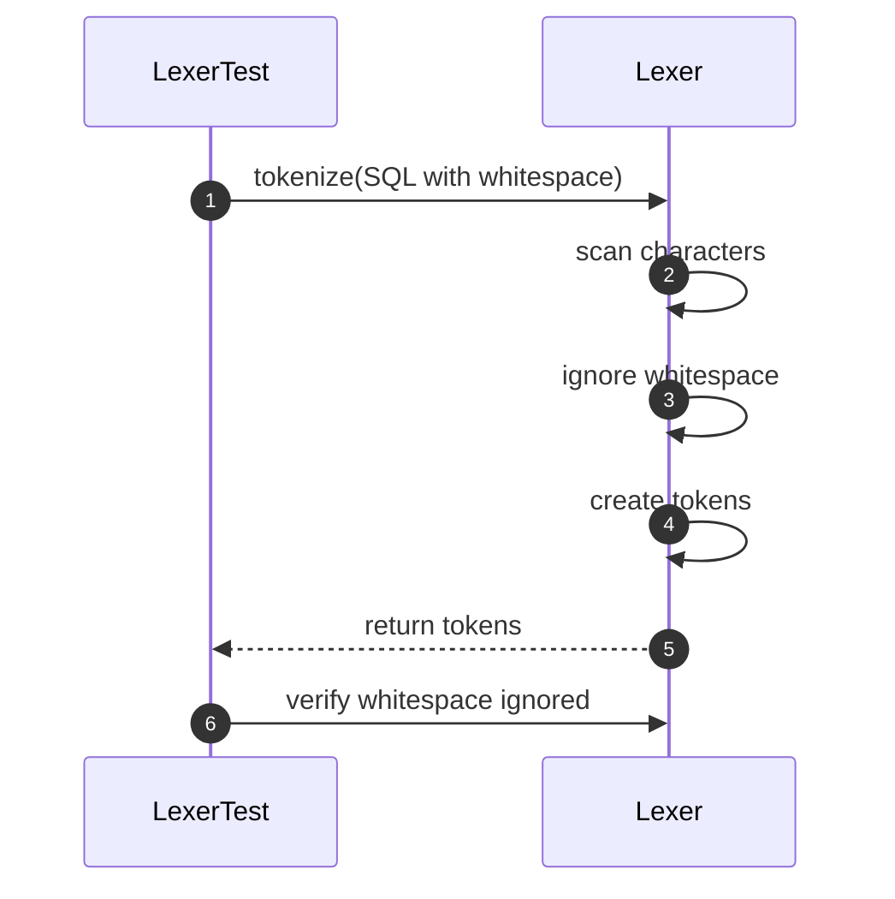
```mermaid
sequenceDiagram
    autonumber

    participant Test as LexerTest
    participant Lexer as Lexer

    Test->>Lexer: tokenize(SQL with whitespace)

    Lexer->>Lexer: scan characters

    Lexer->>Lexer: ignore whitespace

    Lexer->>Lexer: create tokens

    Lexer-->>Test: return tokens

    Test->>Lexer: verify whitespace ignored
```

### 7. shouldRecognizeKeywords()
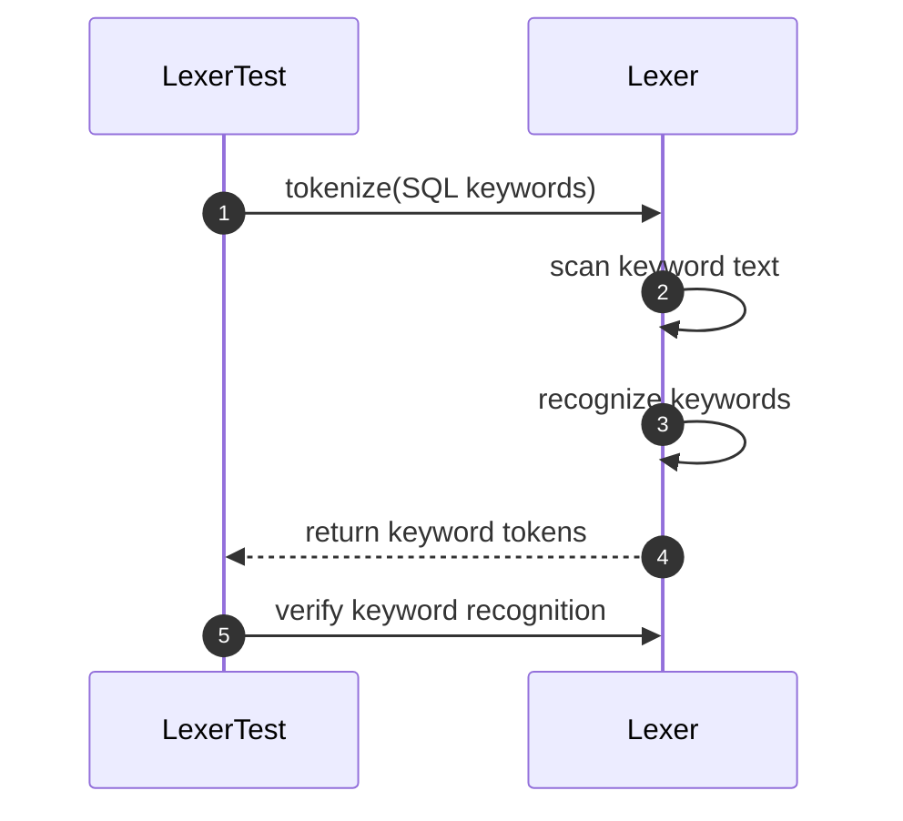
```mermaid
sequenceDiagram
    autonumber

    participant Test as LexerTest
    participant Lexer as Lexer

    Test->>Lexer: tokenize(SQL keywords)

    Lexer->>Lexer: scan keyword text

    Lexer->>Lexer: recognize keywords

    Lexer-->>Test: return keyword tokens

    Test->>Lexer: verify keyword recognition
```

## AST 

### 8. shouldBuildASTFromSQL()
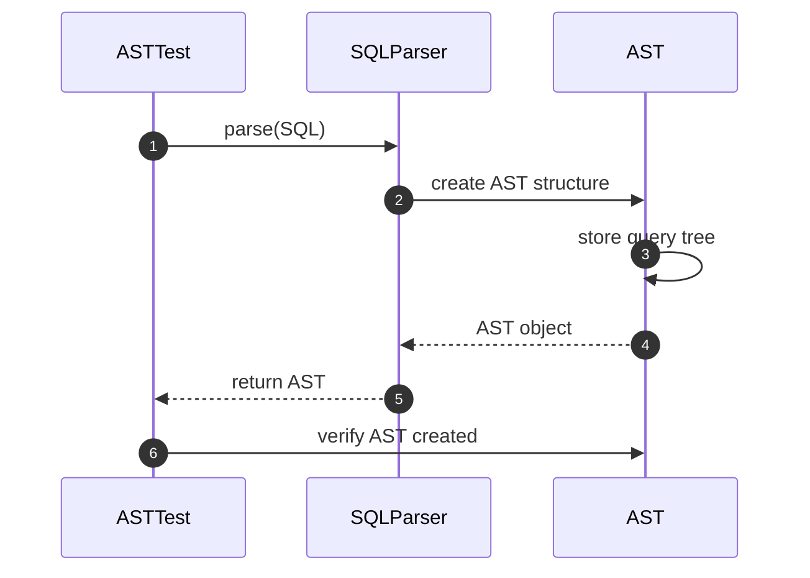
```mermaid
sequenceDiagram
    autonumber

    participant Test as ASTTest
    participant Parser as SQLParser
    participant AST as AST

    Test->>Parser: parse(SQL)

    Parser->>AST: create AST structure

    AST->>AST: store query tree

    AST-->>Parser: AST object

    Parser-->>Test: return AST

    Test->>AST: verify AST created
```

### 9. shouldStoreASTRootNode()
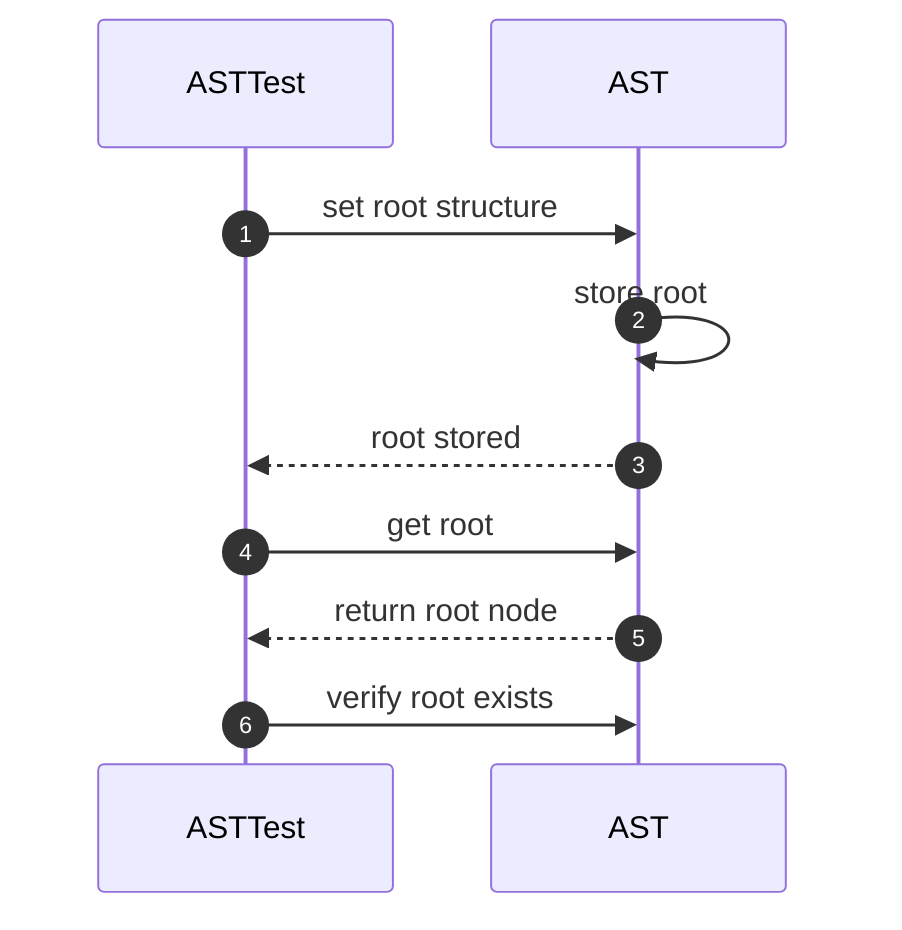
```mermaid
sequenceDiagram
    autonumber

    participant Test as ASTTest
    participant AST as AST

    Test->>AST: set root structure

    AST->>AST: store root

    AST-->>Test: root stored

    Test->>AST: get root

    AST-->>Test: return root node

    Test->>AST: verify root exists
```

## Logical Plan

### 10. shouldCreateLogicalPlan()
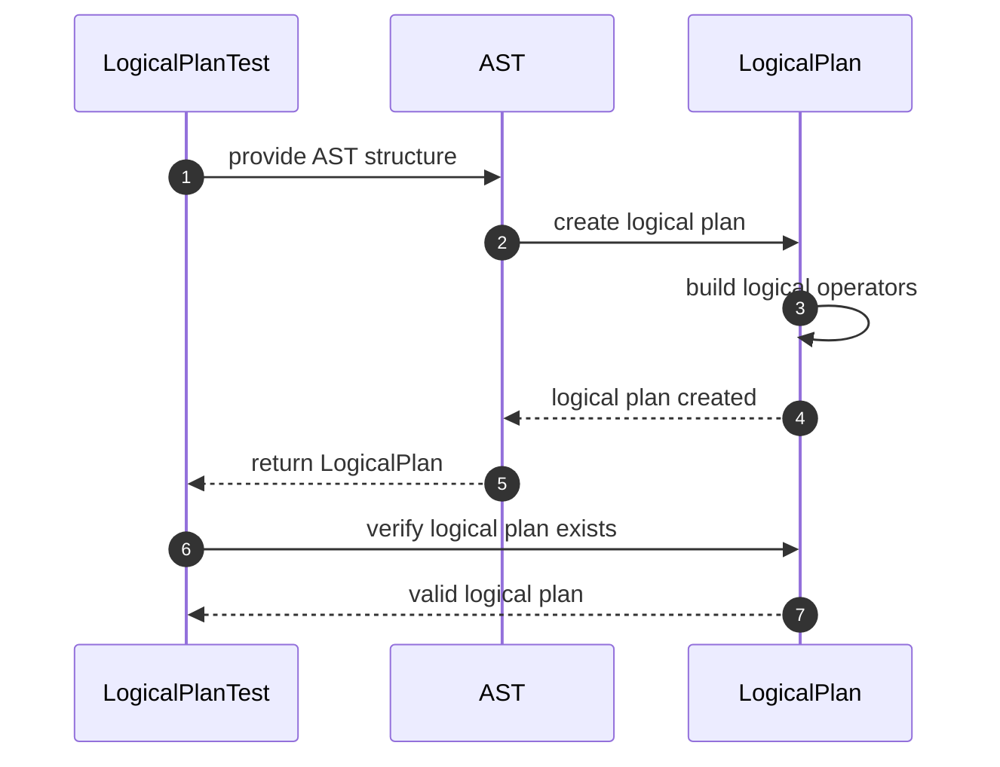
```mermaid
sequenceDiagram
    autonumber

    participant Test as LogicalPlanTest
    participant AST as AST
    participant Plan as LogicalPlan

    Test->>AST: provide AST structure

    AST->>Plan: create logical plan

    Plan->>Plan: build logical operators

    Plan-->>AST: logical plan created

    AST-->>Test: return LogicalPlan

    Test->>Plan: verify logical plan exists

    Plan-->>Test: valid logical plan
```

### 11. shouldAddLogicalOperators()
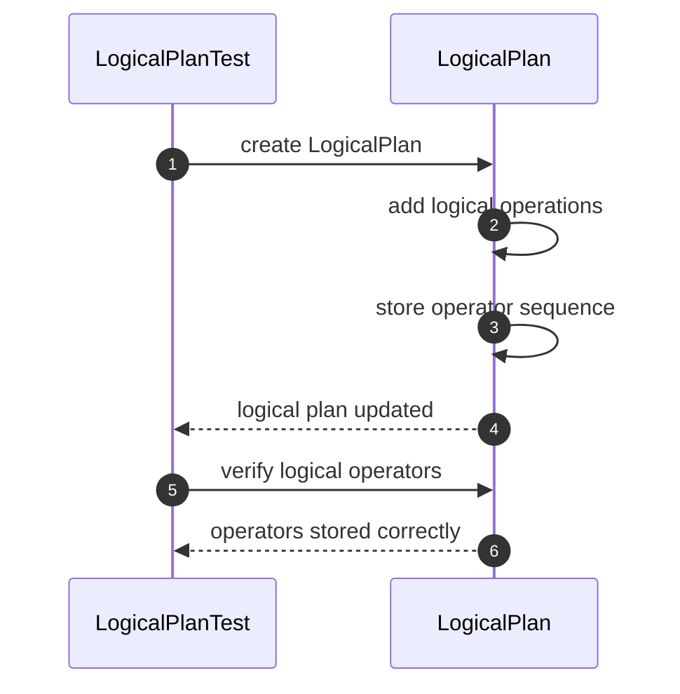
```mermaid
sequenceDiagram
    autonumber

    participant Test as LogicalPlanTest
    participant Plan as LogicalPlan

    Test->>Plan: create LogicalPlan

    Plan->>Plan: add logical operations

    Plan->>Plan: store operator sequence

    Plan-->>Test: logical plan updated

    Test->>Plan: verify logical operators

    Plan-->>Test: operators stored correctly
```

## Query Optimizer

### 12. shouldOptimizeLogicalPlan()
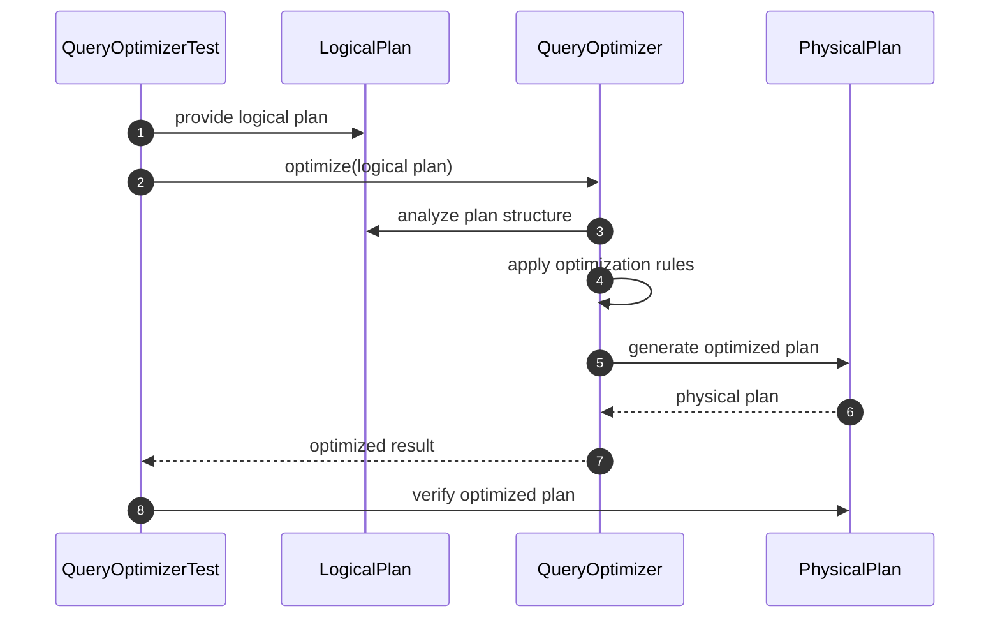
```mermaid
sequenceDiagram
    autonumber

    participant Test as QueryOptimizerTest
    participant Plan as LogicalPlan
    participant Optimizer as QueryOptimizer
    participant Physical as PhysicalPlan

    Test->>Plan: provide logical plan

    Test->>Optimizer: optimize(logical plan)

    Optimizer->>Plan: analyze plan structure

    Optimizer->>Optimizer: apply optimization rules

    Optimizer->>Physical: generate optimized plan

    Physical-->>Optimizer: physical plan

    Optimizer-->>Test: optimized result

    Test->>Physical: verify optimized plan
```

### 13. shouldEstimateQueryCost()
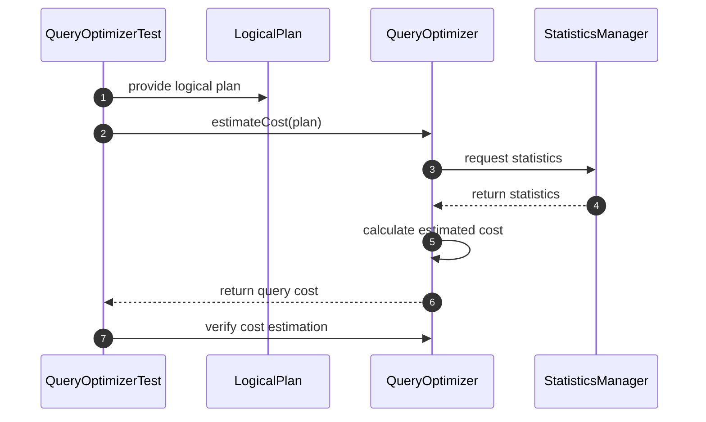
```mermaid
sequenceDiagram
    autonumber

    participant Test as QueryOptimizerTest
    participant Plan as LogicalPlan
    participant Optimizer as QueryOptimizer
    participant Stats as StatisticsManager

    Test->>Plan: provide logical plan

    Test->>Optimizer: estimateCost(plan)

    Optimizer->>Stats: request statistics

    Stats-->>Optimizer: return statistics

    Optimizer->>Optimizer: calculate estimated cost

    Optimizer-->>Test: return query cost

    Test->>Optimizer: verify cost estimation
```

### 14. shouldChooseJoinOrder()
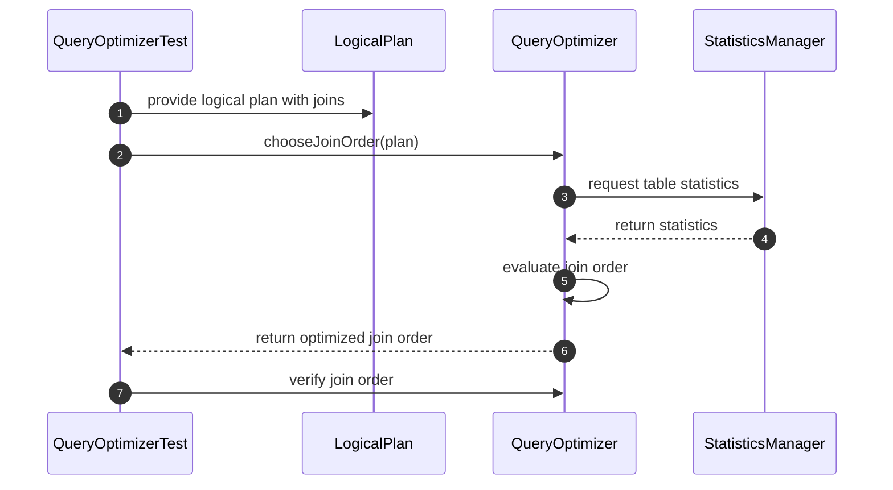
```mermaid
sequenceDiagram
    autonumber

    participant Test as QueryOptimizerTest
    participant Plan as LogicalPlan
    participant Optimizer as QueryOptimizer
    participant Stats as StatisticsManager

    Test->>Plan: provide logical plan with joins

    Test->>Optimizer: chooseJoinOrder(plan)

    Optimizer->>Stats: request table statistics

    Stats-->>Optimizer: return statistics

    Optimizer->>Optimizer: evaluate join order

    Optimizer-->>Test: return optimized join order

    Test->>Optimizer: verify join order
```

### 15. shouldGeneratePhysicalPlan()
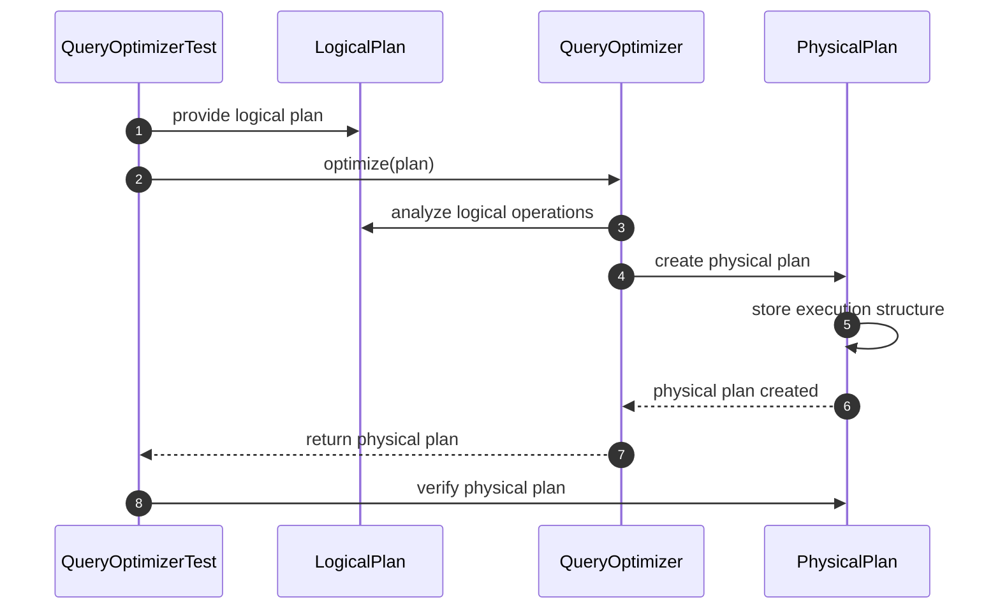
```mermaid
sequenceDiagram
    autonumber

    participant Test as QueryOptimizerTest
    participant Plan as LogicalPlan
    participant Optimizer as QueryOptimizer
    participant Physical as PhysicalPlan

    Test->>Plan: provide logical plan

    Test->>Optimizer: optimize(plan)

    Optimizer->>Plan: analyze logical operations

    Optimizer->>Physical: create physical plan

    Physical->>Physical: store execution structure

    Physical-->>Optimizer: physical plan created

    Optimizer-->>Test: return physical plan

    Test->>Physical: verify physical plan
```

## Physical Plan 

### 16. shouldCreatePhysicalPlan()
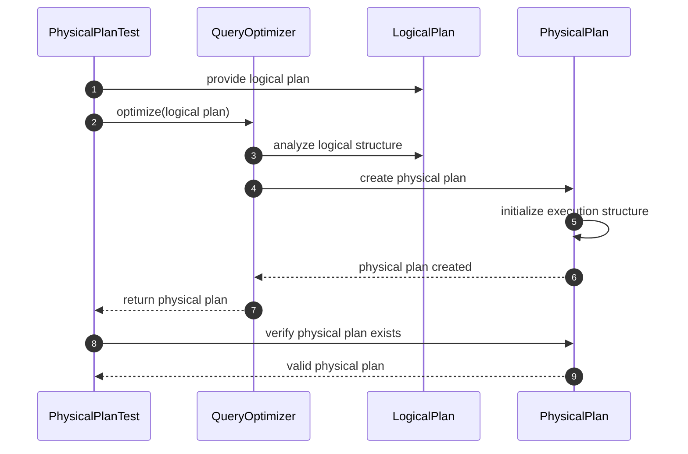
```mermaid
sequenceDiagram
    autonumber

    participant Test as PhysicalPlanTest
    participant Optimizer as QueryOptimizer
    participant Logical as LogicalPlan
    participant Physical as PhysicalPlan

    Test->>Logical: provide logical plan

    Test->>Optimizer: optimize(logical plan)

    Optimizer->>Logical: analyze logical structure

    Optimizer->>Physical: create physical plan

    Physical->>Physical: initialize execution structure

    Physical-->>Optimizer: physical plan created

    Optimizer-->>Test: return physical plan

    Test->>Physical: verify physical plan exists

    Physical-->>Test: valid physical plan
```

### 17. shouldStoreExecutionOperators()
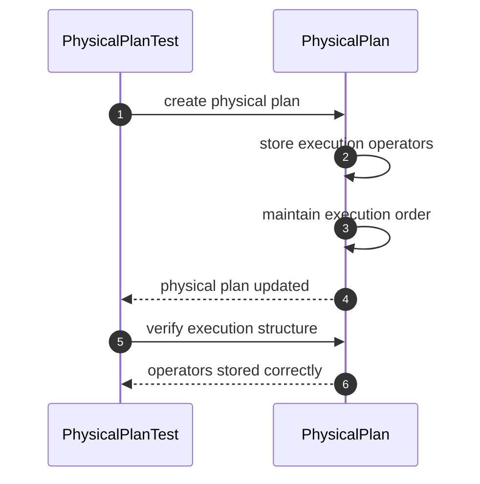
```mermaid
sequenceDiagram
    autonumber

    participant Test as PhysicalPlanTest
    participant Physical as PhysicalPlan

    Test->>Physical: create physical plan

    Physical->>Physical: store execution operators

    Physical->>Physical: maintain execution order

    Physical-->>Test: physical plan updated

    Test->>Physical: verify execution structure

    Physical-->>Test: operators stored correctly
```
## Query Executor

### 18. shouldExecutePhysicalPlan()
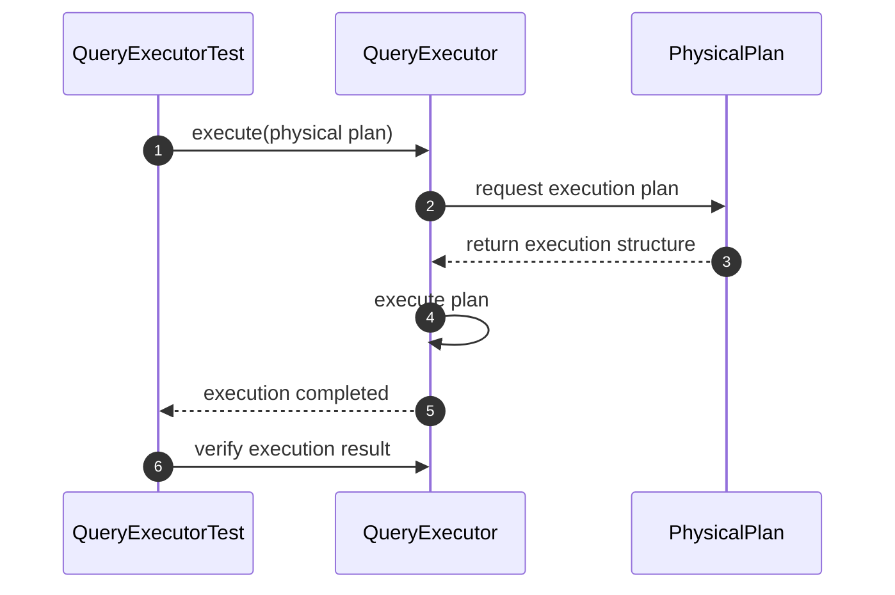
```mermaid
sequenceDiagram
    autonumber

    participant Test as QueryExecutorTest
    participant Executor as QueryExecutor
    participant Physical as PhysicalPlan

    Test->>Executor: execute(physical plan)

    Executor->>Physical: request execution plan

    Physical-->>Executor: return execution structure

    Executor->>Executor: execute plan

    Executor-->>Test: execution completed

    Test->>Executor: verify execution result
```

### 19. shouldFetchResultRows()
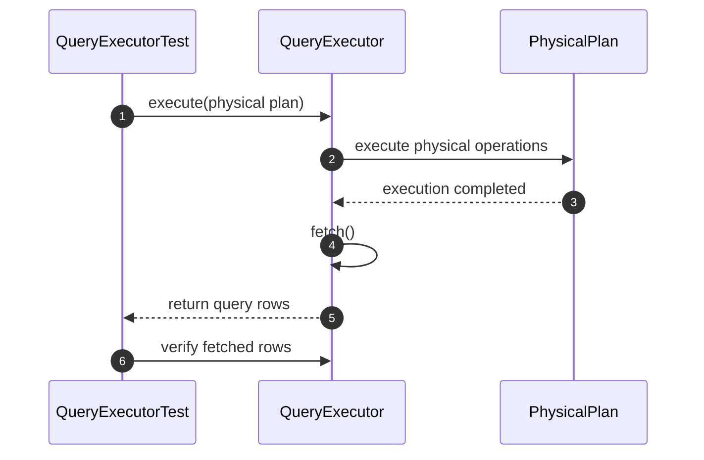
```mermaid
sequenceDiagram
    autonumber

    participant Test as QueryExecutorTest
    participant Executor as QueryExecutor
    participant Physical as PhysicalPlan

    Test->>Executor: execute(physical plan)

    Executor->>Physical: execute physical operations

    Physical-->>Executor: execution completed

    Executor->>Executor: fetch()

    Executor-->>Test: return query rows

    Test->>Executor: verify fetched rows
```

### 20. shouldCancelRunningQuery()
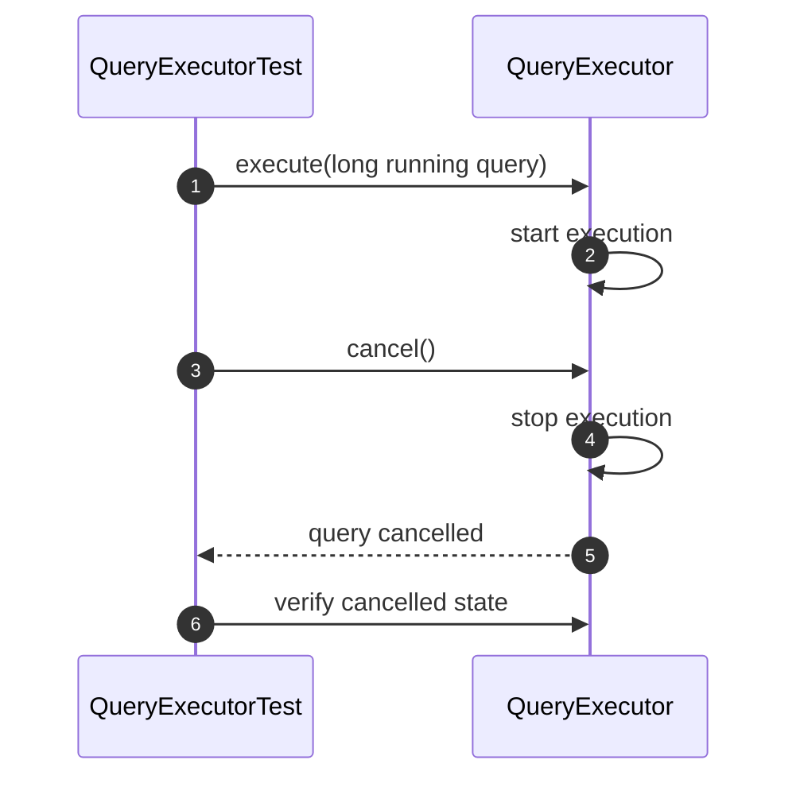
```mermaid
sequenceDiagram
    autonumber

    participant Test as QueryExecutorTest
    participant Executor as QueryExecutor

    Test->>Executor: execute(long running query)

    Executor->>Executor: start execution

    Test->>Executor: cancel()

    Executor->>Executor: stop execution

    Executor-->>Test: query cancelled

    Test->>Executor: verify cancelled state
```

## StatisticsManager

### 21. shouldCollectTableStatistics()
```mermaid
sequenceDiagram
    autonumber

    participant Test as StatisticsManagerTest
    participant Stats as StatisticsManager
    participant Table as Table

    Test->>Stats: collect(table)

    Stats->>Table: request table information

    Table-->>Stats: return table metadata

    Stats->>Stats: calculate statistics

    Stats-->>Test: statistics collected

    Test->>Stats: verify statistics
```

### 22. shouldUpdateStatistics()
```mermaid
sequenceDiagram
    autonumber

    participant Test as StatisticsManagerTest
    participant Stats as StatisticsManager
    participant Table as Table

    Test->>Stats: updateStatistics(table)

    Stats->>Table: get current table information

    Table-->>Stats: return current state

    Stats->>Stats: recalculate statistics

    Stats-->>Test: statistics updated

    Test->>Stats: verify updated statistics
```

### 23. shouldProvideStatisticsForOptimizer()
```mermaid
sequenceDiagram
    autonumber

    participant Test as StatisticsManagerTest
    participant Stats as StatisticsManager
    participant Optimizer as QueryOptimizer

    Test->>Stats: collect statistics

    Stats->>Stats: store statistics

    Test->>Optimizer: optimize(logical plan)

    Optimizer->>Stats: request statistics

    Stats-->>Optimizer: return statistics

    Optimizer->>Optimizer: use statistics for optimization

    Optimizer-->>Test: optimized result
```
# Query Processing Integration Test 

### 24. shouldParseOptimizeAndExecuteQuery()
```mermaid
sequenceDiagram
    autonumber

    participant Test as QueryProcessingIntegrationTest
    participant Parser as SQLParser
    participant AST as AST
    participant Logical as LogicalPlan
    participant Optimizer as QueryOptimizer
    participant Physical as PhysicalPlan
    participant Executor as QueryExecutor

    Test->>Parser: parse(SQL)

    Parser->>AST: create AST

    AST-->>Parser: AST created

    Parser-->>Test: return AST

    Test->>Logical: create logical plan

    Logical-->>Test: logical plan created

    Test->>Optimizer: optimize(logical plan)

    Optimizer->>Physical: generate physical plan

    Physical-->>Optimizer: physical plan

    Optimizer-->>Test: optimized plan

    Test->>Executor: execute(physical plan)

    Executor-->>Test: query executed
```

### 25. shouldGenerateLogicalAndPhysicalPlan()
```mermaid
sequenceDiagram
    autonumber

    participant Test as QueryProcessingIntegrationTest
    participant Parser as SQLParser
    participant AST as AST
    participant Logical as LogicalPlan
    participant Optimizer as QueryOptimizer
    participant Physical as PhysicalPlan

    Test->>Parser: parse(SQL)

    Parser->>AST: create AST

    AST-->>Parser: AST

    Test->>Logical: build logical plan

    Logical-->>Test: logical plan

    Test->>Optimizer: optimize(logical plan)

    Optimizer->>Physical: create physical plan

    Physical-->>Optimizer: physical plan

    Optimizer-->>Test: return physical plan

    Test->>Physical: verify physical plan
```

### 26. shouldExecuteOptimizedQueryPlan()
```mermaid
sequenceDiagram
    autonumber

    participant Test as QueryProcessingIntegrationTest
    participant Optimizer as QueryOptimizer
    participant Physical as PhysicalPlan
    participant Executor as QueryExecutor

    Test->>Optimizer: optimize(logical plan)

    Optimizer->>Physical: generate optimized plan

    Physical-->>Optimizer: optimized physical plan

    Optimizer-->>Test: physical plan

    Test->>Executor: execute(physical plan)

    Executor->>Physical: read execution structure

    Physical-->>Executor: execution information

    Executor-->>Test: execution completed
```

### 27. shouldCollectStatisticsDuringExecution()
```mermaid
sequenceDiagram
    autonumber

    participant Test as QueryProcessingIntegrationTest
    participant Table as Table
    participant Stats as StatisticsManager
    participant Optimizer as QueryOptimizer
    participant Executor as QueryExecutor

    Test->>Stats: collect(table statistics)

    Stats->>Table: read table information

    Table-->>Stats: return metadata

    Stats-->>Optimizer: provide statistics

    Optimizer->>Optimizer: optimize query plan

    Optimizer-->>Executor: optimized physical plan

    Executor-->>Test: execute query
```

## 28. shouldRejectInvalidSQLQuery()
```mermaid
sequenceDiagram
    autonumber

    participant Test as QueryProcessingIntegrationTest
    participant Parser as SQLParser
    participant Lexer as Lexer

    Test->>Parser: parse(invalid SQL)

    Parser->>Lexer: tokenize(sql)

    Lexer-->>Parser: tokens

    Parser->>Parser: validateSyntax()

    Parser-->>Test: reject invalid SQL

    Test->>Parser: verify error handling
```
