# Recovery Unit Test

## WALManagerTest

### 1. shouldAppendLog()
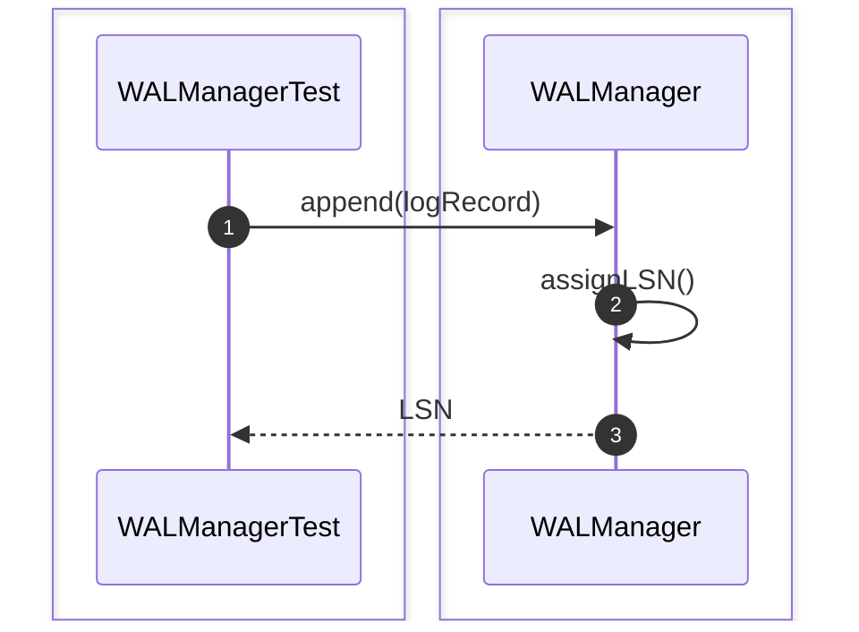
```mermaid
sequenceDiagram
    autonumber

    box #e1f5fe Test Suite
    participant Test as WALManagerTest
    end
    box #ffebee Recovery Components
    participant WAL as WALManager
    end

    Test->>WAL: append(logRecord)
    WAL->>WAL: assignLSN()
    WAL-->>Test: LSN
```

### 2. shouldFlushLog()
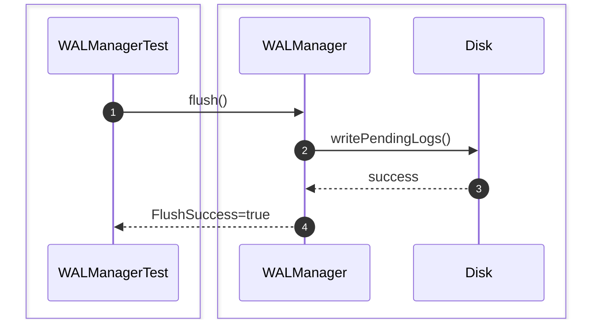
```mermaid
sequenceDiagram
    autonumber

    box #e1f5fe Test Suite
    participant Test as WALManagerTest
    end
    box #ffebee Recovery Components
    participant WAL as WALManager
    participant Disk as Disk
    end

    Test->>WAL: flush()
    WAL->>Disk: writePendingLogs()
    Disk-->>WAL: success
    WAL-->>Test: FlushSuccess=true
```

### 3. shouldReplayLog()
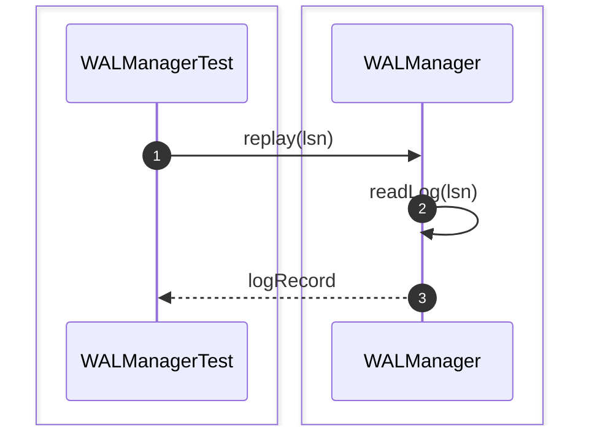
```mermaid
sequenceDiagram
    autonumber

    box #e1f5fe Test Suite
    participant Test as WALManagerTest
    end
    box #ffebee Recovery Components
    participant WAL as WALManager
    end

    Test->>WAL: replay(lsn)
    WAL->>WAL: readLog(lsn)
    WAL-->>Test: logRecord
```

### 4. shouldOrderLSN()
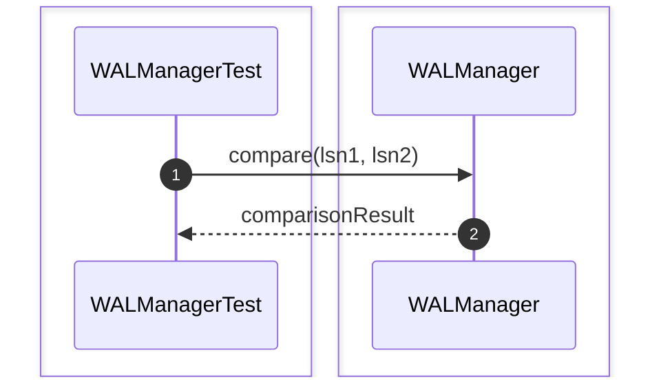
```mermaid
sequenceDiagram
    autonumber

    box #e1f5fe Test Suite
    participant Test as WALManagerTest
    end
    box #ffebee Recovery Components
    participant WAL as WALManager
    end

    Test->>WAL: compare(lsn1, lsn2)
    WAL-->>Test: comparisonResult
```

### 5. shouldAssignIncreasingLSN()
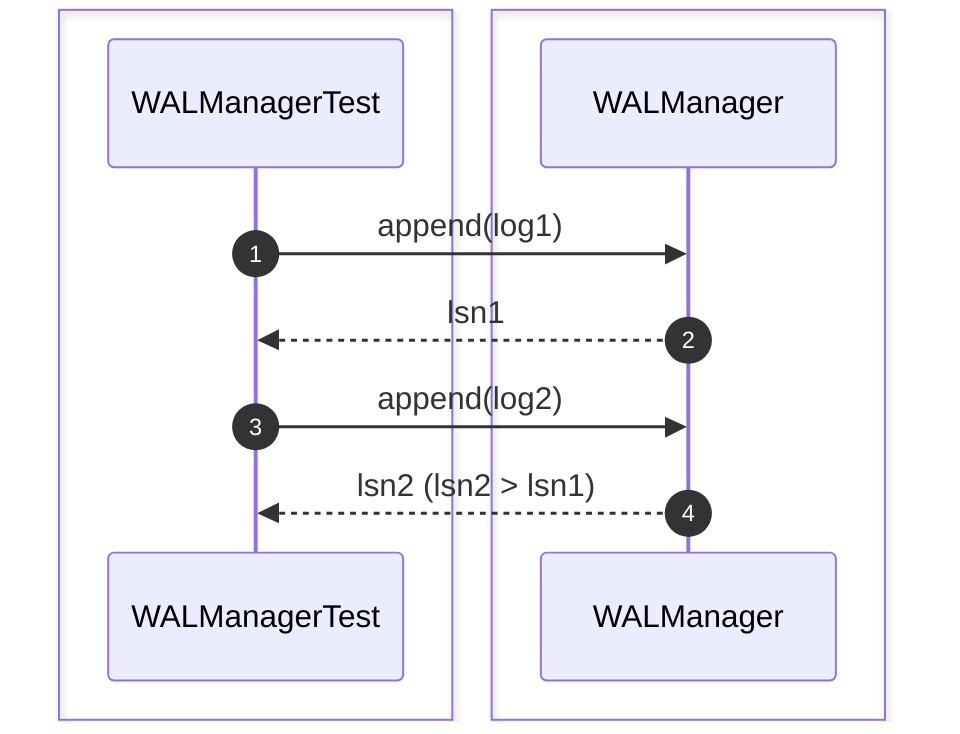
```mermaid
sequenceDiagram
    autonumber

    box #e1f5fe Test Suite
    participant Test as WALManagerTest
    end
    box #ffebee Recovery Components
    participant WAL as WALManager
    end

    Test->>WAL: append(log1)
    WAL-->>Test: lsn1
    Test->>WAL: append(log2)
    WAL-->>Test: lsn2 (lsn2 > lsn1)
```

### 6. shouldWriteCommitRecord()

```mermaid
sequenceDiagram
    autonumber

    box #e1f5fe Test Suite
    participant Test as WALManagerTest
    end
    box #ffebee Recovery Components
    participant WAL as WALManager
    end

    Test->>WAL: writeCommit(txId)
    WAL->>WAL: append(COMMIT)
    WAL-->>Test: lsn
```

### 7. shouldWriteAbortRecord()
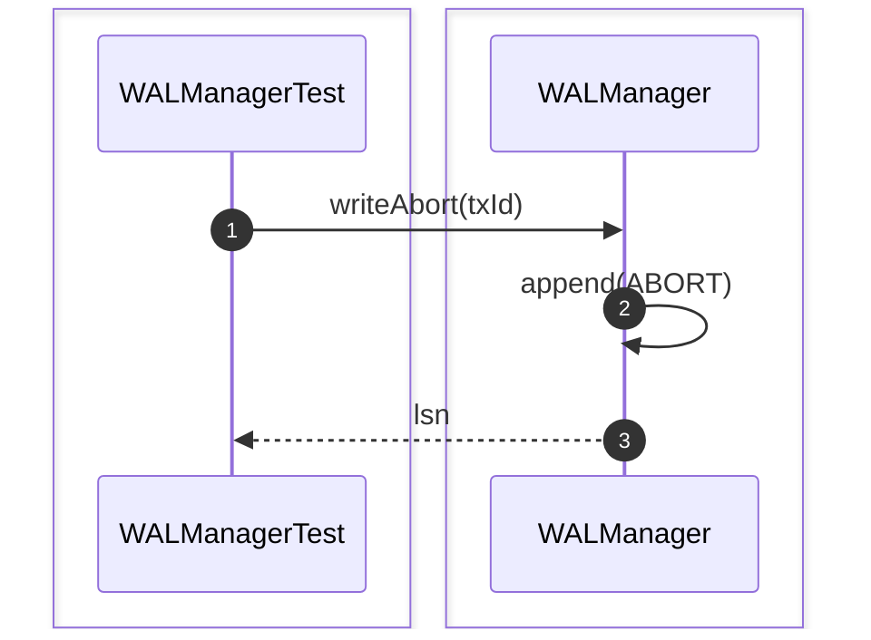
```mermaid
sequenceDiagram
    autonumber

    box #e1f5fe Test Suite
    participant Test as WALManagerTest
    end
    box #ffebee Recovery Components
    participant WAL as WALManager
    end

    Test->>WAL: writeAbort(txId)
    WAL->>WAL: append(ABORT)
    WAL-->>Test: lsn
```

### 8. shouldRecoverLogFile()
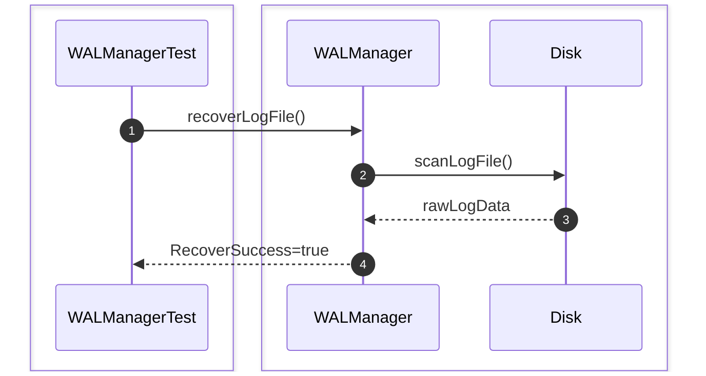
```mermaid
sequenceDiagram
    autonumber

    box #e1f5fe Test Suite
    participant Test as WALManagerTest
    end
    box #ffebee Recovery Components
    participant WAL as WALManager
    participant Disk as Disk
    end

    Test->>WAL: recoverLogFile()
    WAL->>Disk: scanLogFile()
    Disk-->>WAL: rawLogData
    WAL-->>Test: RecoverSuccess=true
```

### 9. shouldPersistLogRecord()
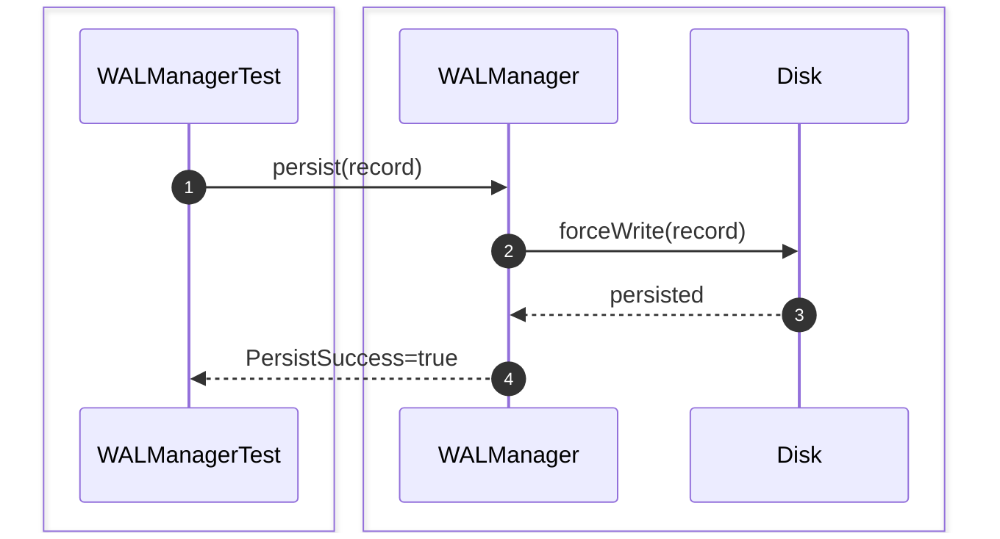
```mermaid
sequenceDiagram
    autonumber

    box #e1f5fe Test Suite
    participant Test as WALManagerTest
    end
    box #ffebee Recovery Components
    participant WAL as WALManager
    participant Disk as Disk
    end

    Test->>WAL: persist(record)
    WAL->>Disk: forceWrite(record)
    Disk-->>WAL: persisted
    WAL-->>Test: PersistSuccess=true
```

### 10. shouldVerifyWriteAheadLoggingRule()
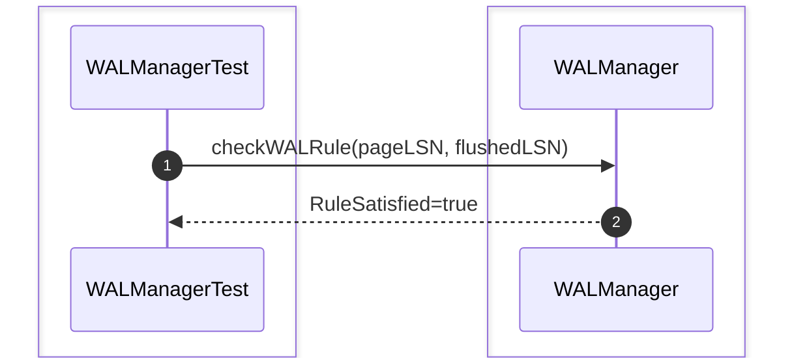
```mermaid
sequenceDiagram
    autonumber

    box #e1f5fe Test Suite
    participant Test as WALManagerTest
    end
    box #ffebee Recovery Components
    participant WAL as WALManager
    end

    Test->>WAL: checkWALRule(pageLSN, flushedLSN)
    WAL-->>Test: RuleSatisfied=true
```

## RecoveryManagerTest

### 1. shouldRecover()
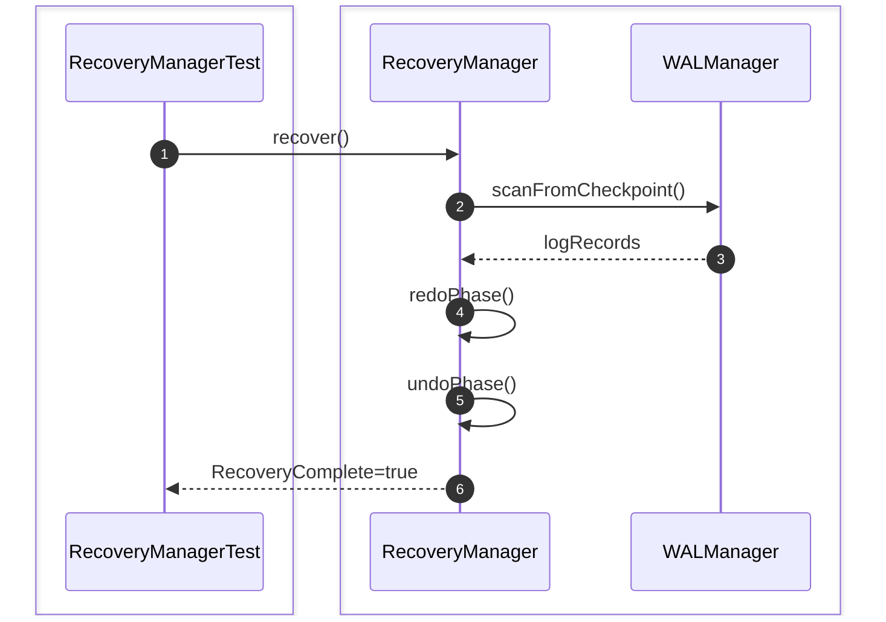
```mermaid
sequenceDiagram
    autonumber

    box #e1f5fe Test Suite
    participant Test as RecoveryManagerTest
    end
    box #ffebee Recovery Components
    participant Recovery as RecoveryManager
    participant WAL as WALManager
    end

    Test->>Recovery: recover()
    Recovery->>WAL: scanFromCheckpoint()
    WAL-->>Recovery: logRecords
    Recovery->>Recovery: redoPhase()
    Recovery->>Recovery: undoPhase()
    Recovery-->>Test: RecoveryComplete=true
```

### 2. shouldRedo()
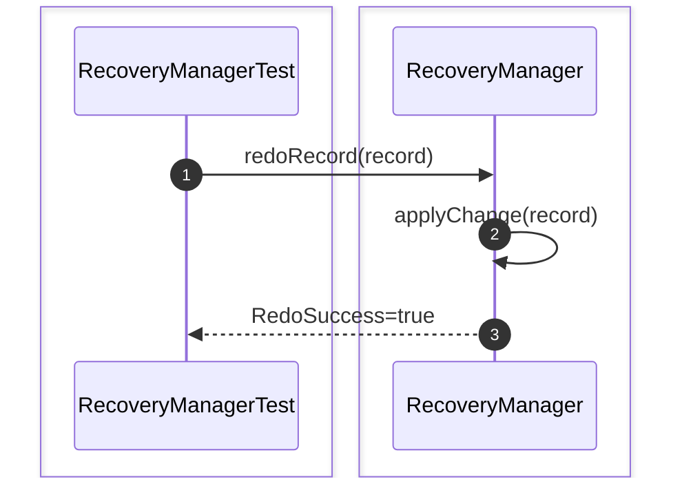
```mermaid
sequenceDiagram
    autonumber

    box #e1f5fe Test Suite
    participant Test as RecoveryManagerTest
    end
    box #ffebee Recovery Components
    participant Recovery as RecoveryManager
    end

    Test->>Recovery: redoRecord(record)
    Recovery->>Recovery: applyChange(record)
    Recovery-->>Test: RedoSuccess=true
```

### 3. shouldUndo()
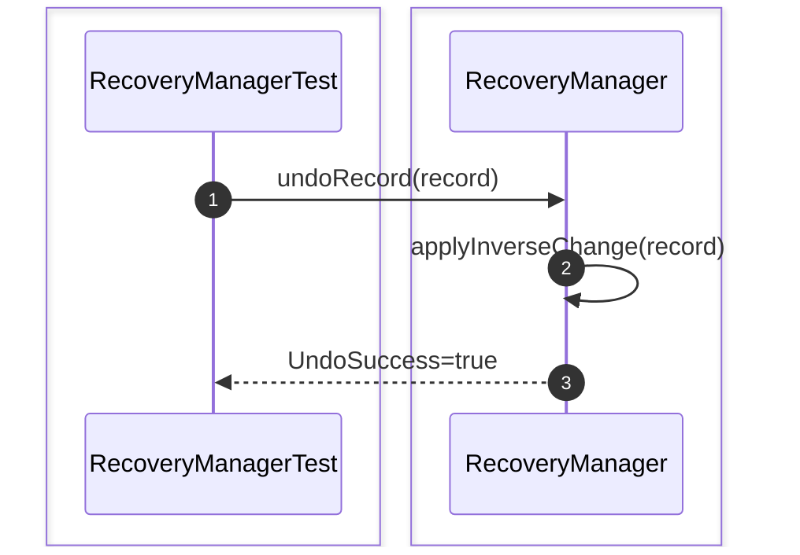
```mermaid
sequenceDiagram
    autonumber

    box #e1f5fe Test Suite
    participant Test as RecoveryManagerTest
    end
    box #ffebee Recovery Components
    participant Recovery as RecoveryManager
    end

    Test->>Recovery: undoRecord(record)
    Recovery->>Recovery: applyInverseChange(record)
    Recovery-->>Test: UndoSuccess=true
```

### 4. shouldRecoverCheckpoint()
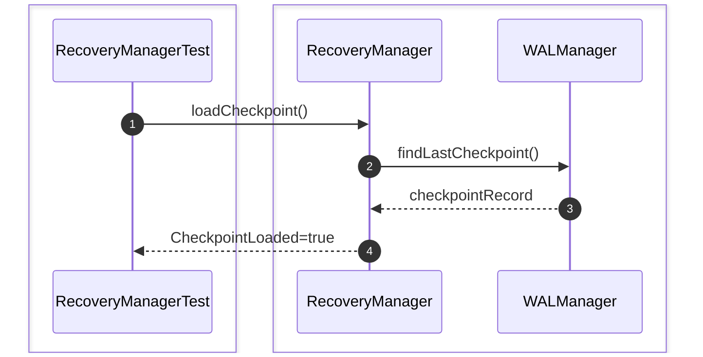
```mermaid
sequenceDiagram
    autonumber

    box #e1f5fe Test Suite
    participant Test as RecoveryManagerTest
    end
    box #ffebee Recovery Components
    participant Recovery as RecoveryManager
    participant WAL as WALManager
    end

    Test->>Recovery: loadCheckpoint()
    Recovery->>WAL: findLastCheckpoint()
    WAL-->>Recovery: checkpointRecord
    Recovery-->>Test: CheckpointLoaded=true
```

### 5. shouldScanLogRecords()
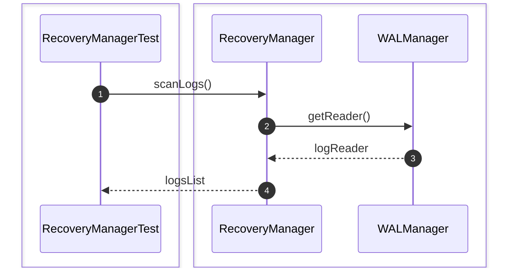
```mermaid
sequenceDiagram
    autonumber

    box #e1f5fe Test Suite
    participant Test as RecoveryManagerTest
    end
    box #ffebee Recovery Components
    participant Recovery as RecoveryManager
    participant WAL as WALManager
    end

    Test->>Recovery: scanLogs()
    Recovery->>WAL: getReader()
    WAL-->>Recovery: logReader
    Recovery-->>Test: logsList
```

### 6. shouldRedoCommittedTransactions()
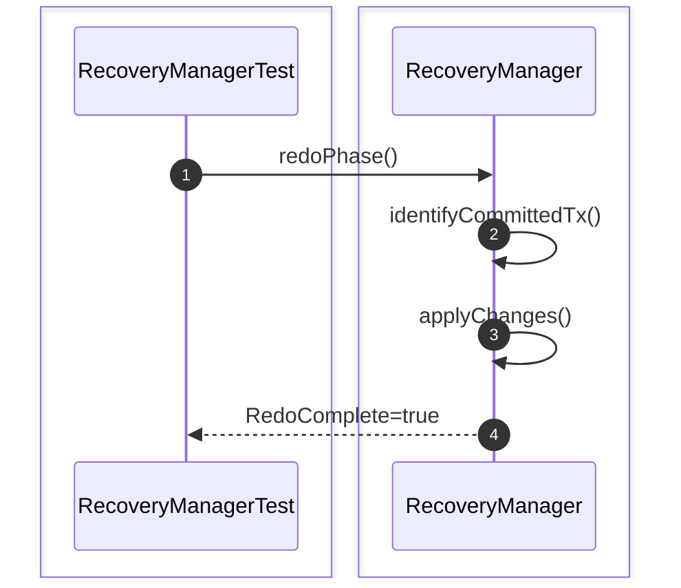
```mermaid
sequenceDiagram
    autonumber

    box #e1f5fe Test Suite
    participant Test as RecoveryManagerTest
    end
    box #ffebee Recovery Components
    participant Recovery as RecoveryManager
    end

    Test->>Recovery: redoPhase()
    Recovery->>Recovery: identifyCommittedTx()
    Recovery->>Recovery: applyChanges()
    Recovery-->>Test: RedoComplete=true
```

### 7. shouldUndoIncompleteTransactions()
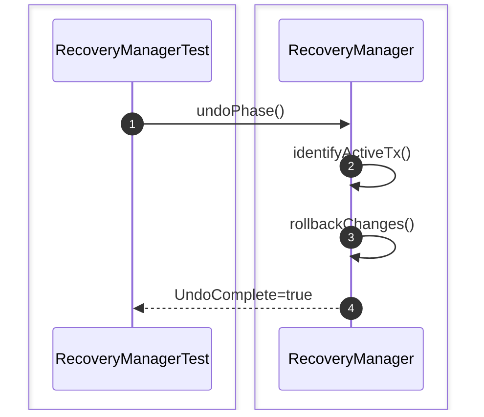
```mermaid
sequenceDiagram
    autonumber

    box #e1f5fe Test Suite
    participant Test as RecoveryManagerTest
    end
    box #ffebee Recovery Components
    participant Recovery as RecoveryManager
    end

    Test->>Recovery: undoPhase()
    Recovery->>Recovery: identifyActiveTx()
    Recovery->>Recovery: rollbackChanges()
    Recovery-->>Test: UndoComplete=true
```

### 8. shouldRestoreDatabaseState()
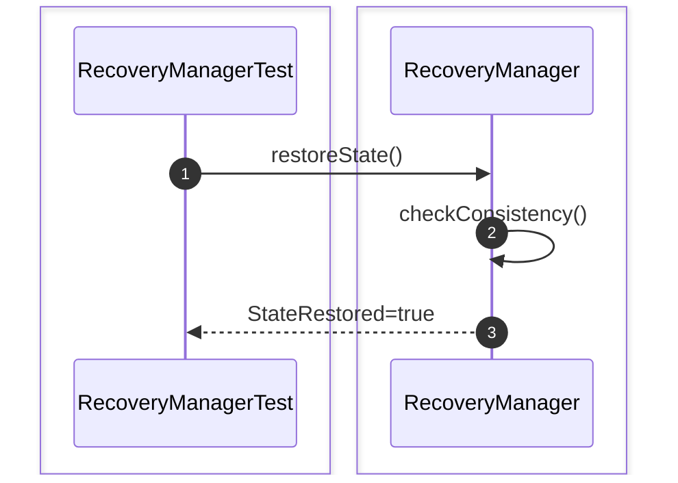
```mermaid
sequenceDiagram
    autonumber

    box #e1f5fe Test Suite
    participant Test as RecoveryManagerTest
    end
    box #ffebee Recovery Components
    participant Recovery as RecoveryManager
    end

    Test->>Recovery: restoreState()
    Recovery->>Recovery: checkConsistency()
    Recovery-->>Test: StateRestored=true
```

### 9. shouldSkipCommittedTransaction()

```mermaid
sequenceDiagram
    autonumber

    box #e1f5fe Test Suite
    participant Test as RecoveryManagerTest
    end
    box #ffebee Recovery Components
    participant Recovery as RecoveryManager
    end

    Test->>Recovery: redoRecord(record)
    Recovery->>Recovery: checkAlreadyApplied()
    Recovery-->>Test: skipped=true
```

### 10. shouldFinishRecovery()
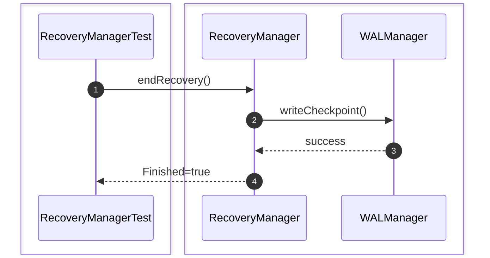
```mermaid
sequenceDiagram
    autonumber

    box #e1f5fe Test Suite
    participant Test as RecoveryManagerTest
    end
    box #ffebee Recovery Components
    participant Recovery as RecoveryManager
    participant WAL as WALManager
    end

    Test->>Recovery: endRecovery()
    Recovery->>WAL: writeCheckpoint()
    WAL-->>Recovery: success
    Recovery-->>Test: Finished=true
```

# Recovery Integration Test

### 1. shouldRecoverAfterCrash()
```mermaid
sequenceDiagram
    autonumber

    box #e1f5fe Test Suite
    participant Test as RecoveryIntegrationTest
    end
    box #ffebee Recovery Components
    participant Recovery as RecoveryManager
    participant WAL as WALManager
    end

    Test->>Recovery: recover()
    Recovery->>WAL: scanLogs()
    Recovery->>Recovery: redo()
    Recovery->>Recovery: undo()
    Recovery-->>Test: DatabaseConsistent=true
```

### 2. shouldCommitTransactionWithWAL()
```mermaid
sequenceDiagram
    autonumber

    box #e1f5fe Test Suite
    participant Test as RecoveryIntegrationTest
    end
    box #ffebee Recovery Components
    participant WAL as WALManager
    participant Disk as Disk
    end

    Test->>WAL: writeCommit(txId)
    WAL->>Disk: flush()
    Disk-->>WAL: flushed
    WAL-->>Test: CommitComplete=true
```

### 3. shouldRollbackTransactionWithMVCC()
```mermaid
sequenceDiagram
    autonumber

    box #e1f5fe Test Suite
    participant Test as RecoveryIntegrationTest
    end
    box #ffebee Recovery Components
    participant Recovery as RecoveryManager
    end

    Test->>Recovery: rollback(txId)
    Recovery->>Recovery: undo(txId)
    Recovery-->>Test: RollbackComplete=true
```

### 4. shouldAcquireAndReleaseLocks()
```mermaid
sequenceDiagram
    autonumber

    box #e1f5fe Test Suite
    participant Test as RecoveryIntegrationTest
    end
    box #ffebee Recovery Components
    participant Recovery as RecoveryManager
    end

    Test->>Recovery: recover()
    Recovery->>Recovery: releaseAllLocks()
    Recovery-->>Test: LocksReleased=true
```

### 5. shouldRecoverCommittedTransactions()
```mermaid
sequenceDiagram
    autonumber

    box #e1f5fe Test Suite
    participant Test as RecoveryIntegrationTest
    end
    box #ffebee Recovery Components
    participant Recovery as RecoveryManager
    end

    Test->>Recovery: recover()
    Recovery->>Recovery: redoCommitted()
    Recovery-->>Test: RedoCompleted=true
```

### 6. shouldRecoverRolledBackTransactions()
```mermaid
sequenceDiagram
    autonumber

    box #e1f5fe Test Suite
    participant Test as RecoveryIntegrationTest
    end
    box #ffebee Recovery Components
    participant Recovery as RecoveryManager
    end

    Test->>Recovery: recover()
    Recovery->>Recovery: undoRolledBack()
    Recovery-->>Test: UndoCompleted=true
```

### 7. shouldHandleConcurrentTransactions()
```mermaid
sequenceDiagram
    autonumber

    box #e1f5fe Test Suite
    participant Test as RecoveryIntegrationTest
    end
    box #ffebee Recovery Components
    participant Recovery as RecoveryManager
    end

    Test->>Recovery: recover()
    Recovery->>Recovery: processConcurrentLogs()
    Recovery-->>Test: RecoverySuccess=true
```

### 8. shouldResolveDeadlockAutomatically()
```mermaid
sequenceDiagram
    autonumber

    box #e1f5fe Test Suite
    participant Test as RecoveryIntegrationTest
    end
    box #ffebee Recovery Components
    participant Recovery as RecoveryManager
    end

    Test->>Recovery: recover()
    Recovery->>Recovery: detectAndAbortDeadlock()
    Recovery-->>Test: DeadlockResolved=true
```

