## Recovery Unit Test 

## WAL Manager

### 1. shouldAppendLogRecord()
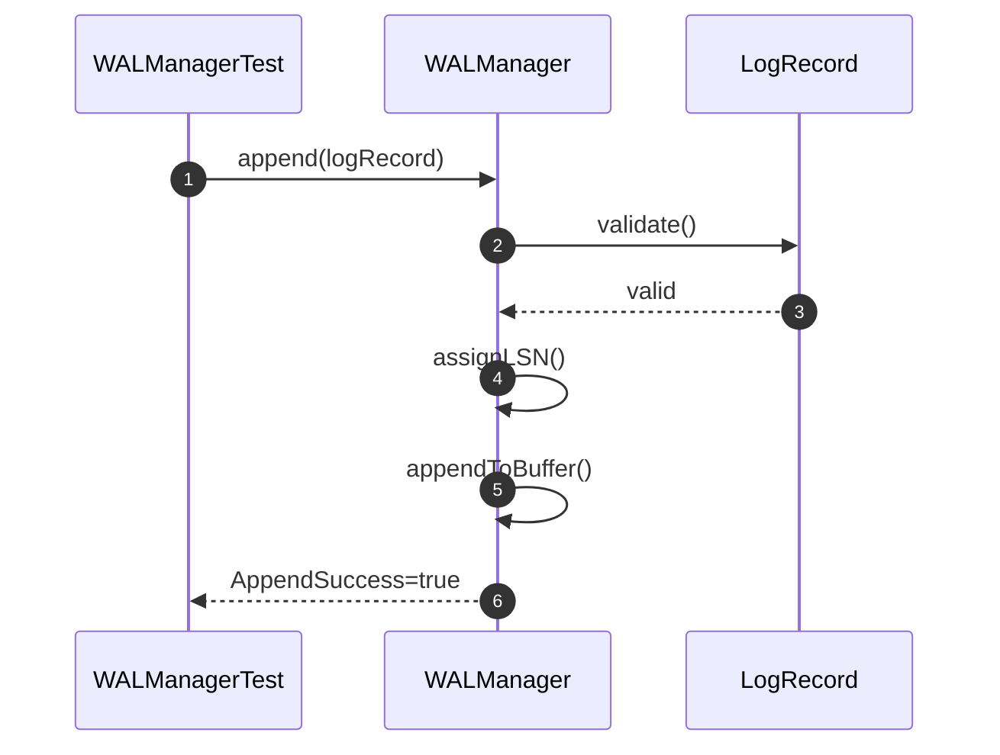

### 2. shouldFlushLogToDisk()
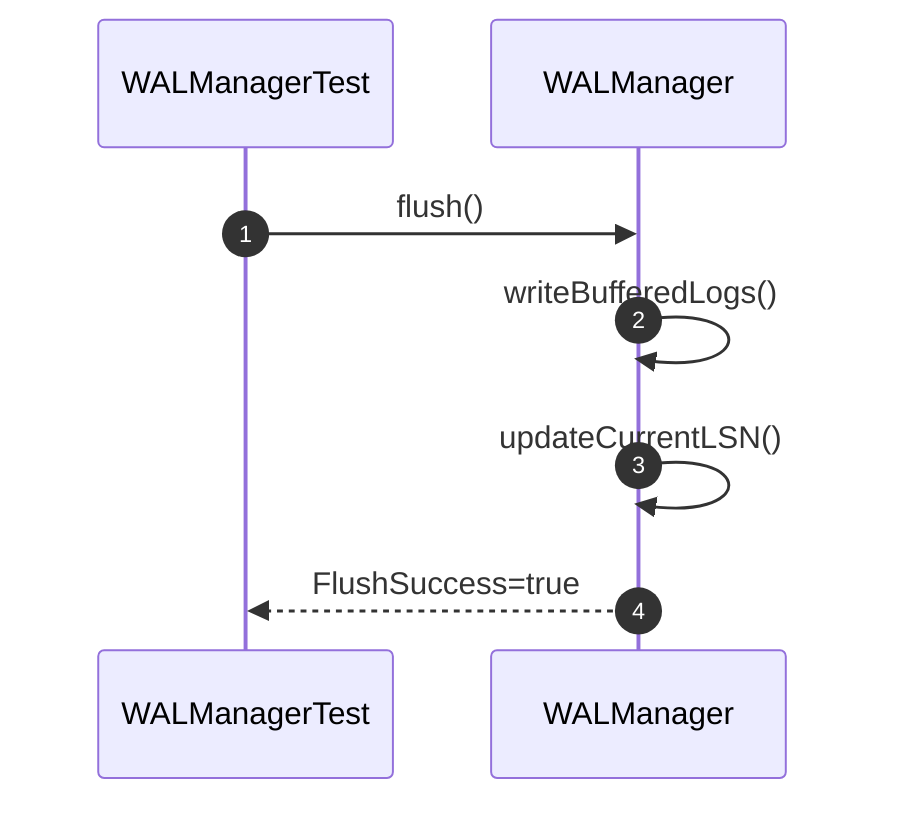

### 3. shouldReplayLogRecords()
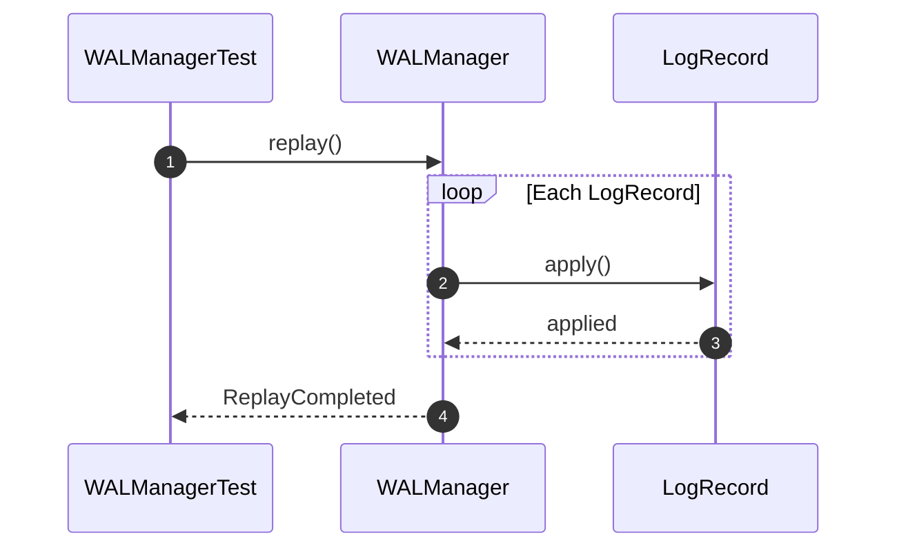

### 4. shouldMaintainIncreasingLSN()
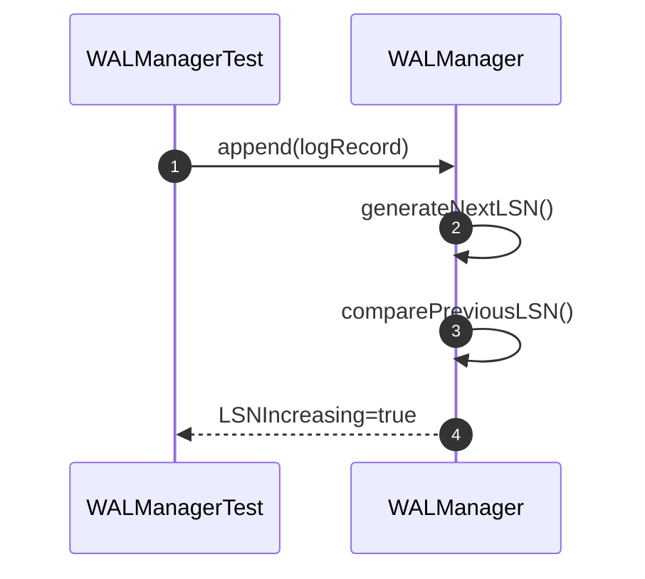
## Recovery Manager

### 5. shouldRecoverDatabase()
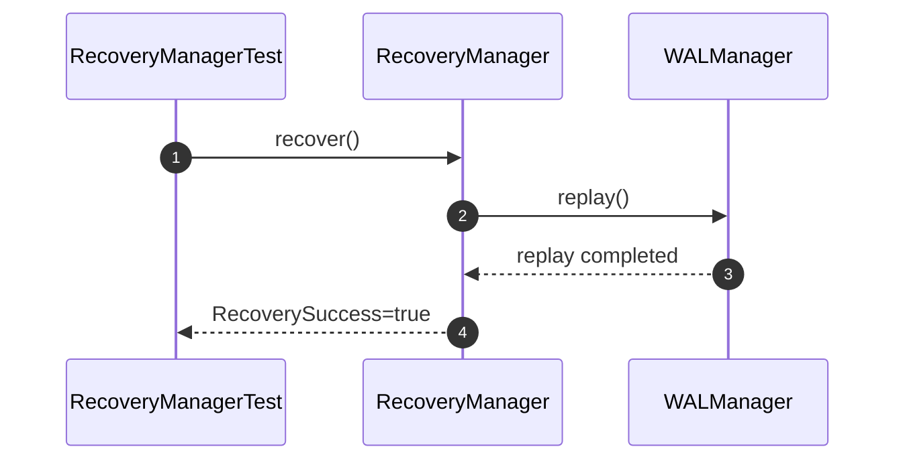

### 6. shouldRedoCommittedTransactions()
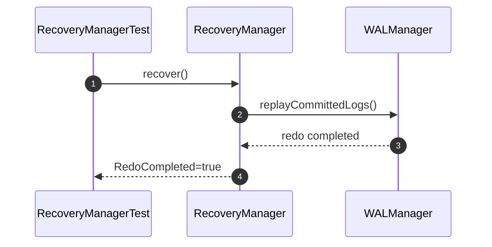

### 7. shouldUndoUncommittedTransactions()
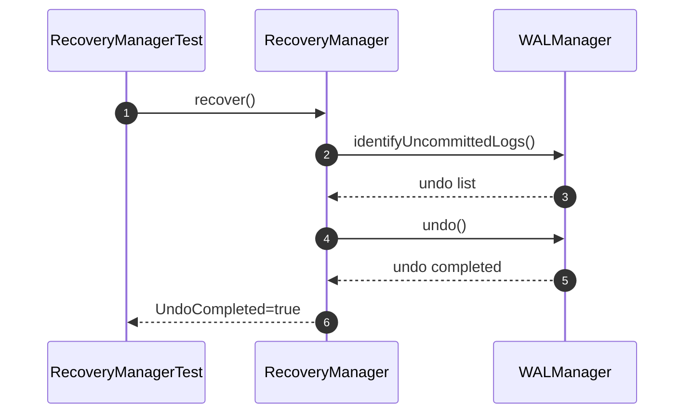

### 8. shouldRestoreConsistentState()
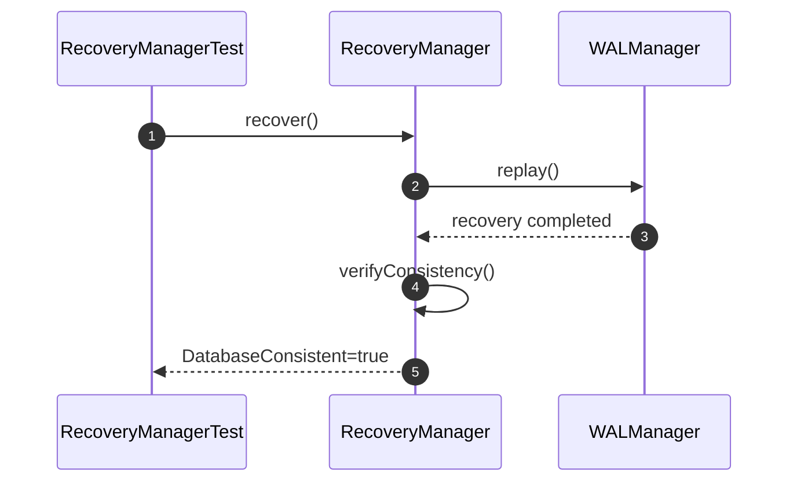

## Log Record

### 9. shouldCreateLogRecord()
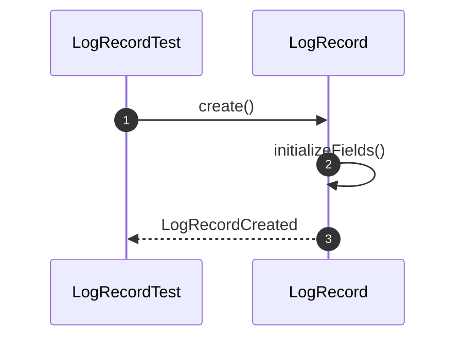

### 10. shouldStoreTransactionId()
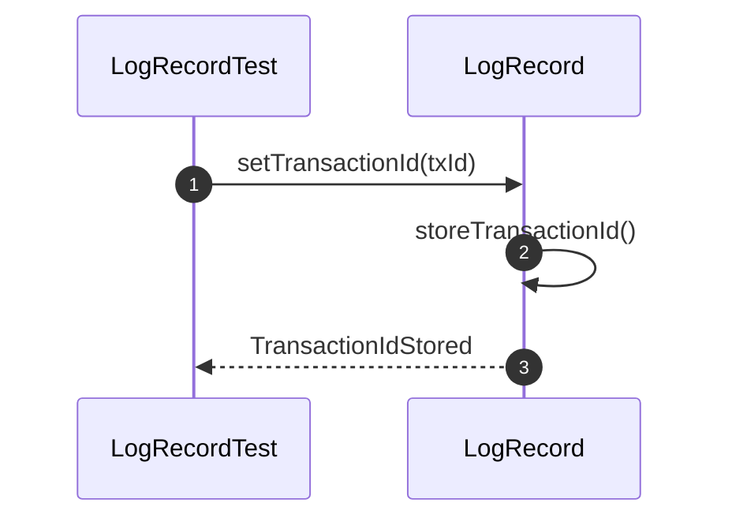

### 11. shouldStoreLogSequenceNumber()
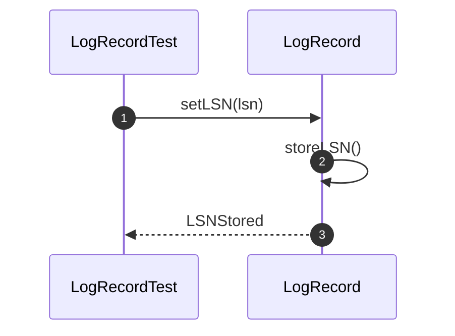

### 12. shouldStoreOperationType()
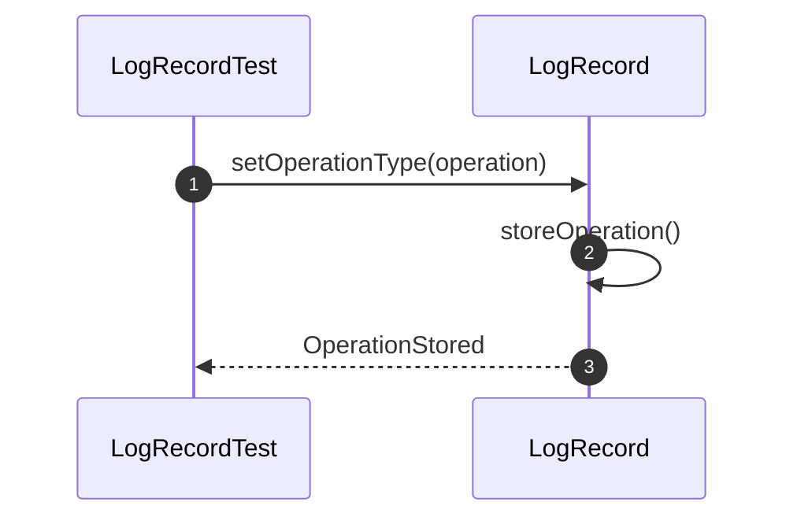

# Recovery Integration Test

### 13. shouldRecoverDatabaseFromWAL()
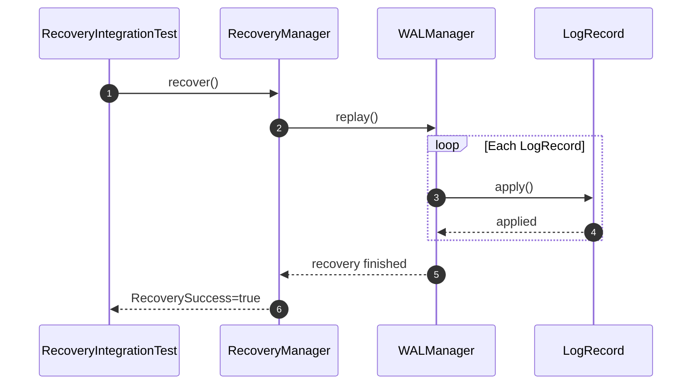

### 14. shouldReplayLogRecordsInOrder()
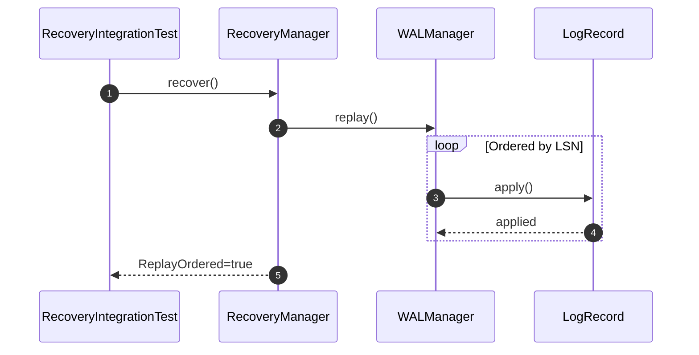

### 15. shouldRestoreConsistentDatabaseState()
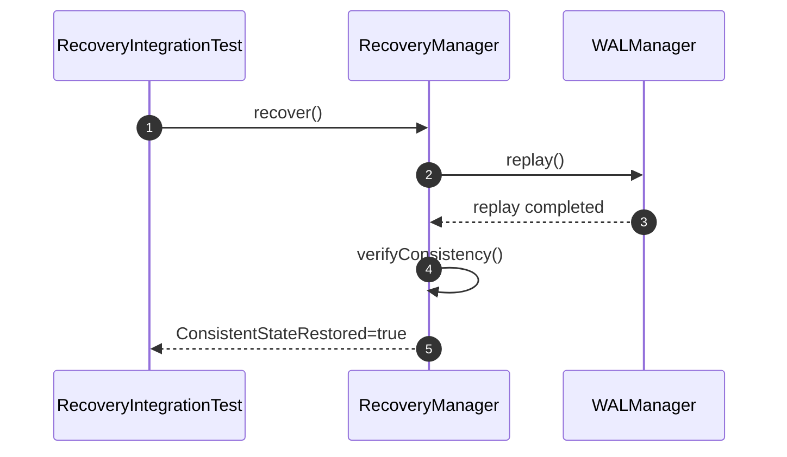

### 16. shouldRecoverAfterSimulatedCrash()
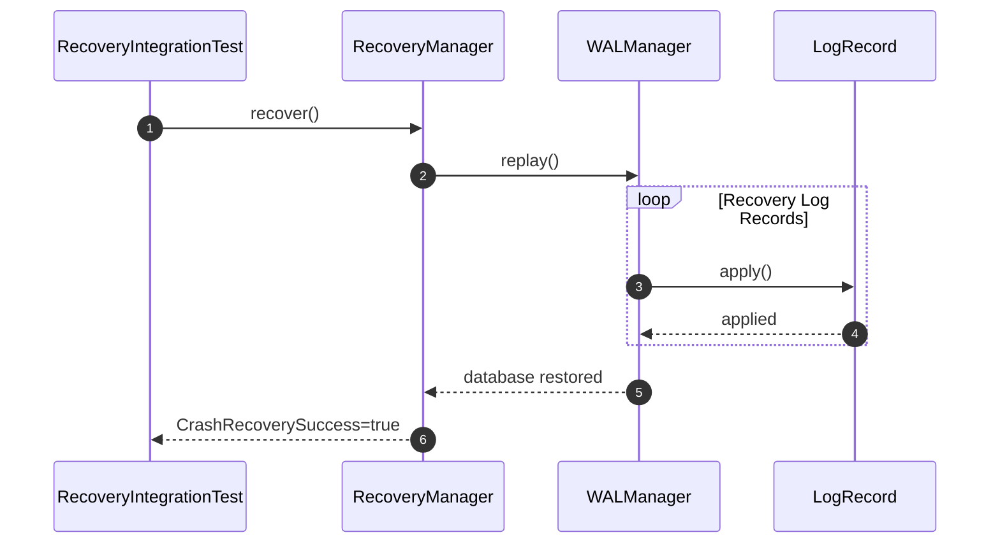
