# Replication Unit Test

## ReplicationManagerTest

### 1. shouldReplicateData()

```mermaid
sequenceDiagram
    autonumber

    box #e1f5fe Test Suite
    participant Test as ReplicationManagerTest
    end
    box #ffebee Replication Components
    participant Manager as ReplicationManager
    participant Node as ClusterNode
    end

    Test->>Manager: replicate(data)
    Manager->>Node: sendData(data)
    Node-->>Manager: ack
    Manager-->>Test: ReplicationSuccess=true
```

### 2. shouldSynchronizeReplicas()
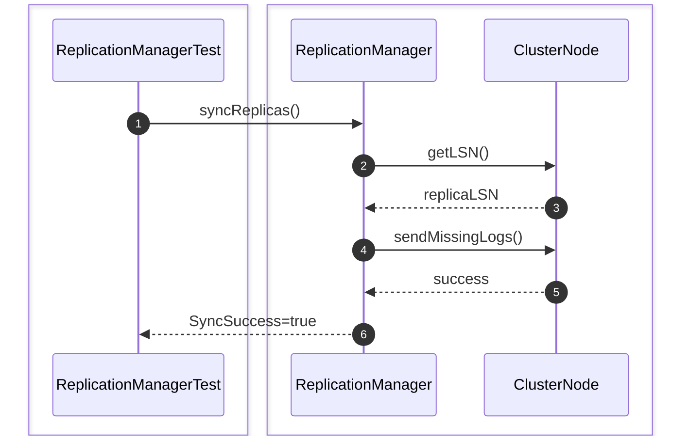
```mermaid
sequenceDiagram
    autonumber

    box #e1f5fe Test Suite
    participant Test as ReplicationManagerTest
    end
    box #ffebee Replication Components
    participant Manager as ReplicationManager
    participant Node as ClusterNode
    end

    Test->>Manager: syncReplicas()
    Manager->>Node: getLSN()
    Node-->>Manager: replicaLSN
    Manager->>Node: sendMissingLogs()
    Node-->>Manager: success
    Manager-->>Test: SyncSuccess=true
```

### 3. shouldElectLeader()
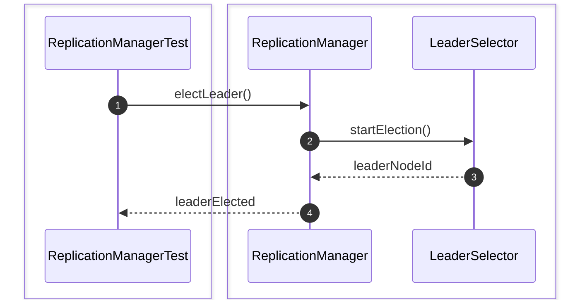
```mermaid
sequenceDiagram
    autonumber

    box #e1f5fe Test Suite
    participant Test as ReplicationManagerTest
    end
    box #ffebee Replication Components
    participant Manager as ReplicationManager
    participant Selector as LeaderSelector
    end

    Test->>Manager: electLeader()
    Manager->>Selector: startElection()
    Selector-->>Manager: leaderNodeId
    Manager-->>Test: leaderElected
```

### 4. shouldHandleReplicaFailure()
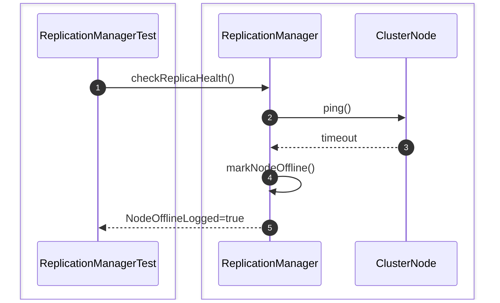
```mermaid
sequenceDiagram
    autonumber

    box #e1f5fe Test Suite
    participant Test as ReplicationManagerTest
    end
    box #ffebee Replication Components
    participant Manager as ReplicationManager
    participant Node as ClusterNode
    end

    Test->>Manager: checkReplicaHealth()
    Manager->>Node: ping()
    Node-->>Manager: timeout
    Manager->>Manager: markNodeOffline()
    Manager-->>Test: NodeOfflineLogged=true
```

### 5. shouldReplicateCommittedTransaction()
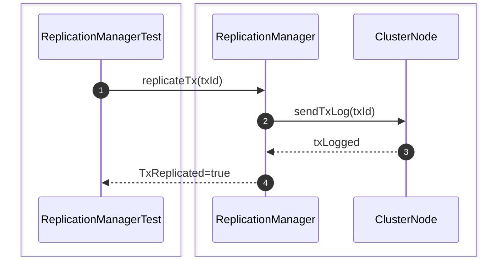
```mermaid
sequenceDiagram
    autonumber

    box #e1f5fe Test Suite
    participant Test as ReplicationManagerTest
    end
    box #ffebee Replication Components
    participant Manager as ReplicationManager
    participant Node as ClusterNode
    end

    Test->>Manager: replicateTx(txId)
    Manager->>Node: sendTxLog(txId)
    Node-->>Manager: txLogged
    Manager-->>Test: TxReplicated=true
```

### 6. shouldRetryReplication()
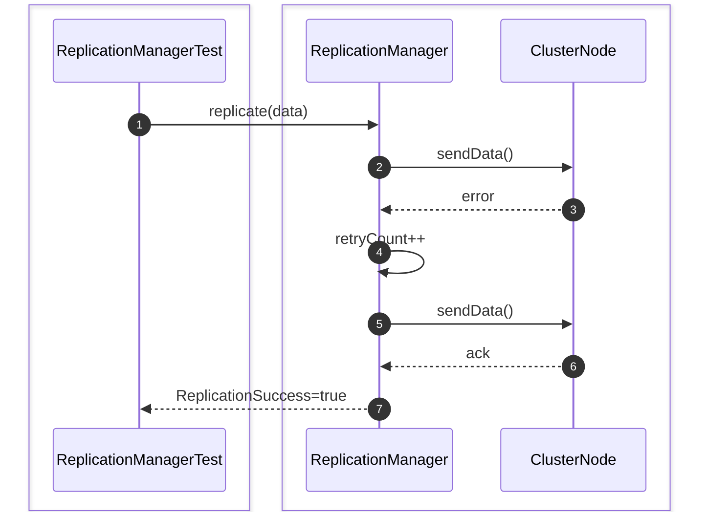
```mermaid
sequenceDiagram
    autonumber

    box #e1f5fe Test Suite
    participant Test as ReplicationManagerTest
    end
    box #ffebee Replication Components
    participant Manager as ReplicationManager
    participant Node as ClusterNode
    end

    Test->>Manager: replicate(data)
    Manager->>Node: sendData()
    Node-->>Manager: error
    Manager->>Manager: retryCount++
    Manager->>Node: sendData()
    Node-->>Manager: ack
    Manager-->>Test: ReplicationSuccess=true
```

### 7. shouldSynchronizeReplicaState()
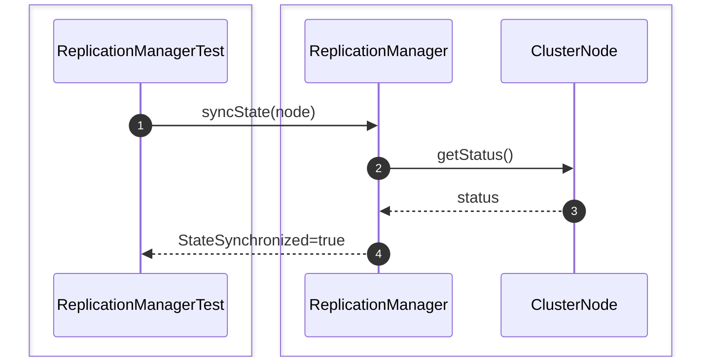
```mermaid
sequenceDiagram
    autonumber

    box #e1f5fe Test Suite
    participant Test as ReplicationManagerTest
    end
    box #ffebee Replication Components
    participant Manager as ReplicationManager
    participant Node as ClusterNode
    end

    Test->>Manager: syncState(node)
    Manager->>Node: getStatus()
    Node-->>Manager: status
    Manager-->>Test: StateSynchronized=true
```

### 8. shouldSynchronizeMissingLogs()
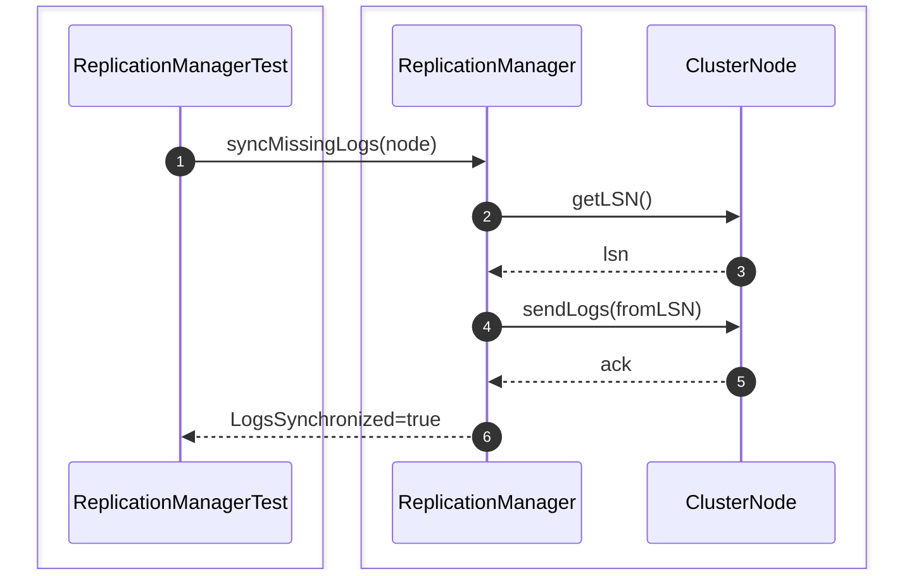
```mermaid
sequenceDiagram
    autonumber

    box #e1f5fe Test Suite
    participant Test as ReplicationManagerTest
    end
    box #ffebee Replication Components
    participant Manager as ReplicationManager
    participant Node as ClusterNode
    end

    Test->>Manager: syncMissingLogs(node)
    Manager->>Node: getLSN()
    Node-->>Manager: lsn
    Manager->>Node: sendLogs(fromLSN)
    Node-->>Manager: ack
    Manager-->>Test: LogsSynchronized=true
```

### 9. shouldRejectReplicationWhenLeaderUnavailable()
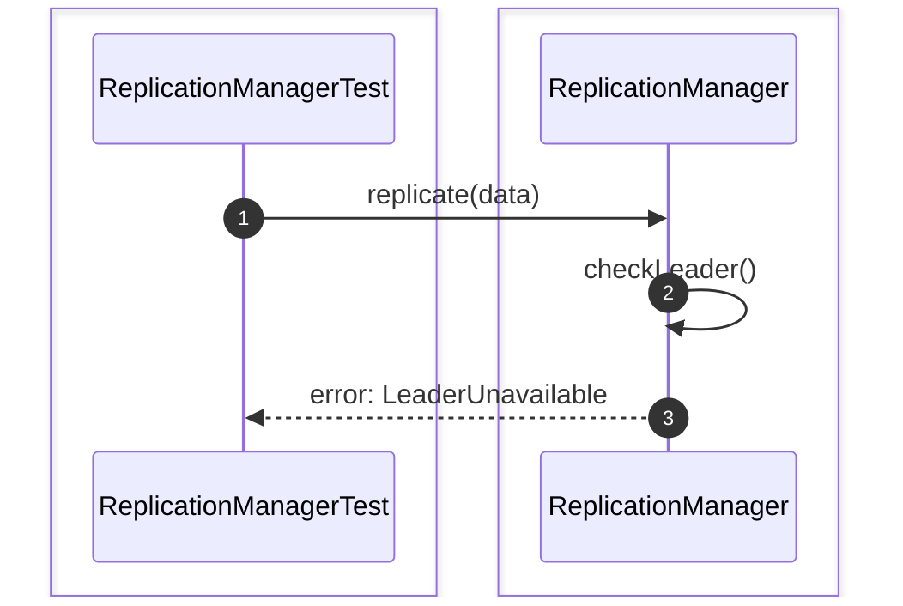
```mermaid
sequenceDiagram
    autonumber

    box #e1f5fe Test Suite
    participant Test as ReplicationManagerTest
    end
    box #ffebee Replication Components
    participant Manager as ReplicationManager
    end

    Test->>Manager: replicate(data)
    Manager->>Manager: checkLeader()
    Manager-->>Test: error: LeaderUnavailable
```

### 10. shouldUpdateClusterLeader()
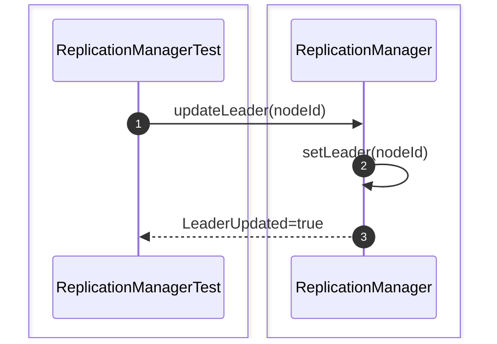
```mermaid
sequenceDiagram
    autonumber

    box #e1f5fe Test Suite
    participant Test as ReplicationManagerTest
    end
    box #ffebee Replication Components
    participant Manager as ReplicationManager
    end

    Test->>Manager: updateLeader(nodeId)
    Manager->>Manager: setLeader(nodeId)
    Manager-->>Test: LeaderUpdated=true
```

## ClusterNode

### 1. shouldCreateClusterNode()
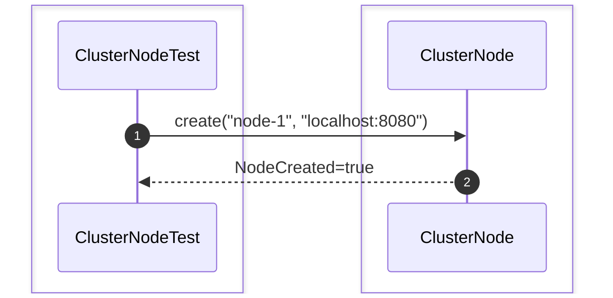
```mermaid
sequenceDiagram
    autonumber

    box #e1f5fe Test Suite
    participant Test as ClusterNodeTest
    end
    box #ffebee Replication Components
    participant Node as ClusterNode
    end

    Test->>Node: create("node-1", "localhost:8080")
    Node-->>Test: NodeCreated=true
```

### 2. shouldConnectToCluster()
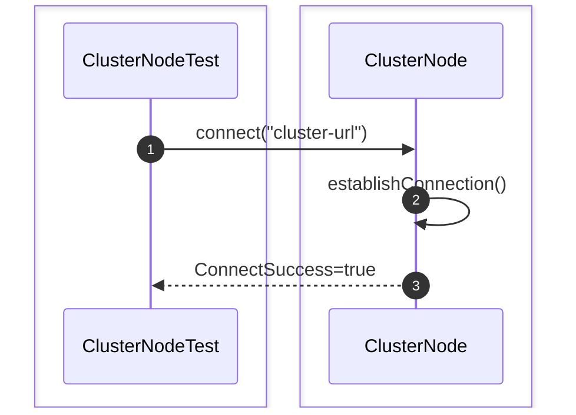
```mermaid
sequenceDiagram
    autonumber

    box #e1f5fe Test Suite
    participant Test as ClusterNodeTest
    end
    box #ffebee Replication Components
    participant Node as ClusterNode
    end

    Test->>Node: connect("cluster-url")
    Node->>Node: establishConnection()
    Node-->>Test: ConnectSuccess=true
```

### 3. shouldDisconnectFromCluster()
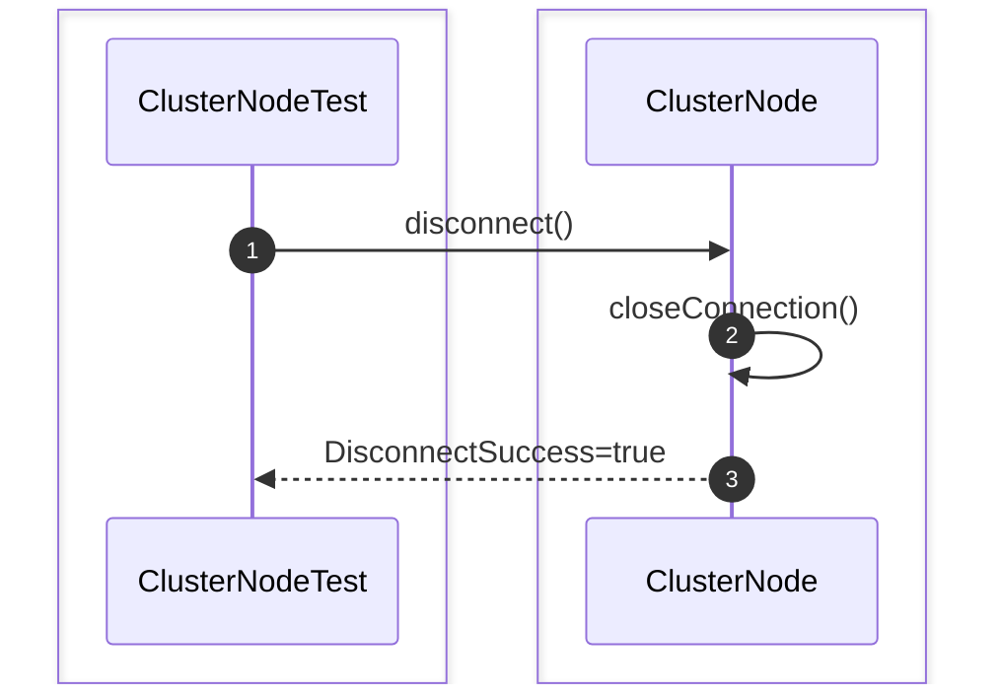
```mermaid
sequenceDiagram
    autonumber

    box #e1f5fe Test Suite
    participant Test as ClusterNodeTest
    end
    box #ffebee Replication Components
    participant Node as ClusterNode
    end

    Test->>Node: disconnect()
    Node->>Node: closeConnection()
    Node-->>Test: DisconnectSuccess=true
```

### 4. shouldUpdateNodeStatus()
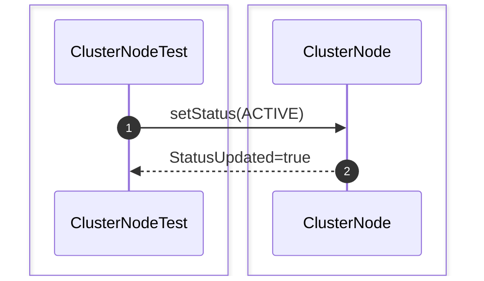
```mermaid
sequenceDiagram
    autonumber

    box #e1f5fe Test Suite
    participant Test as ClusterNodeTest
    end
    box #ffebee Replication Components
    participant Node as ClusterNode
    end

    Test->>Node: setStatus(ACTIVE)
    Node-->>Test: StatusUpdated=true
```

### 5. shouldHeartbeat()
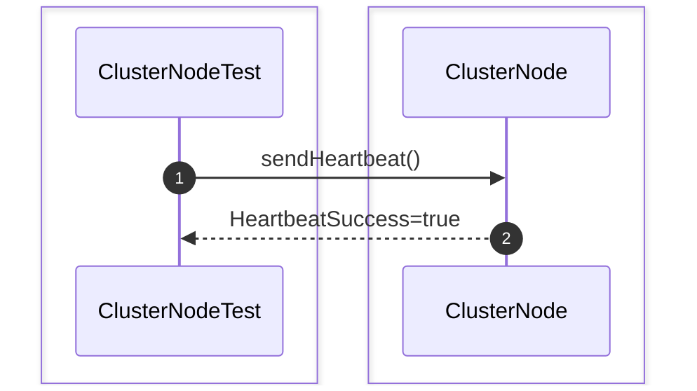
```mermaid
sequenceDiagram
    autonumber

    box #e1f5fe Test Suite
    participant Test as ClusterNodeTest
    end
    box #ffebee Replication Components
    participant Node as ClusterNode
    end

    Test->>Node: sendHeartbeat()
    Node-->>Test: HeartbeatSuccess=true
```

### 6. shouldRecoverNode()
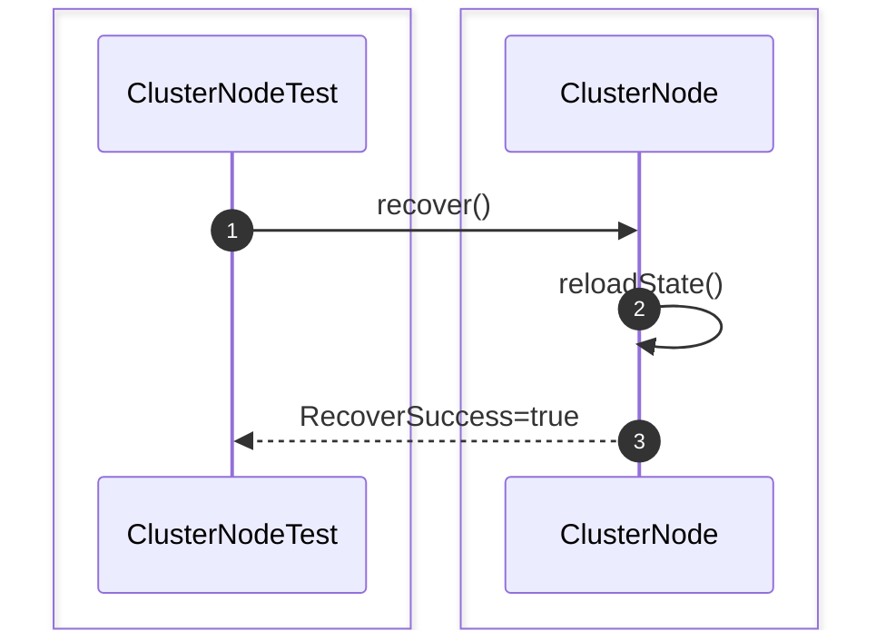
```mermaid
sequenceDiagram
    autonumber

    box #e1f5fe Test Suite
    participant Test as ClusterNodeTest
    end
    box #ffebee Replication Components
    participant Node as ClusterNode
    end

    Test->>Node: recover()
    Node->>Node: reloadState()
    Node-->>Test: RecoverSuccess=true
```

### 7. shouldDetectNodeFailure()
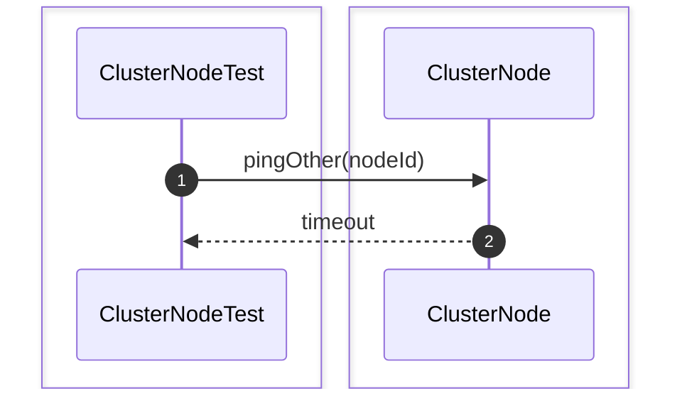
```mermaid
sequenceDiagram
    autonumber

    box #e1f5fe Test Suite
    participant Test as ClusterNodeTest
    end
    box #ffebee Replication Components
    participant Node as ClusterNode
    end

    Test->>Node: pingOther(nodeId)
    Node-->>Test: timeout
```

### 8. shouldSynchronizeNodeState()
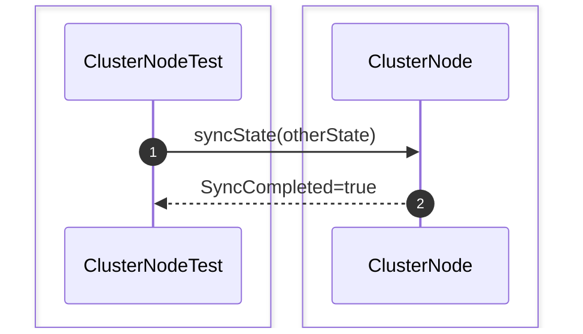
```mermaid
sequenceDiagram
    autonumber

    box #e1f5fe Test Suite
    participant Test as ClusterNodeTest
    end
    box #ffebee Replication Components
    participant Node as ClusterNode
    end

    Test->>Node: syncState(otherState)
    Node-->>Test: SyncCompleted=true
```

# Replication Integration Test

### 1. shouldReplicateDataToReplica()
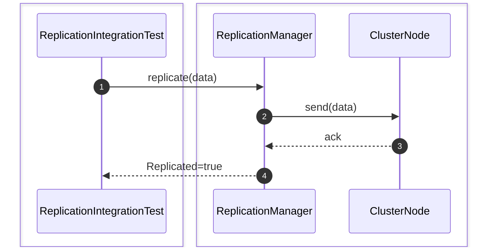
```mermaid
sequenceDiagram
    autonumber

    box #e1f5fe Test Suite
    participant Test as ReplicationIntegrationTest
    end
    box #ffebee Replication Components
    participant Manager as ReplicationManager
    participant Node as ClusterNode
    end

    Test->>Manager: replicate(data)
    Manager->>Node: send(data)
    Node-->>Manager: ack
    Manager-->>Test: Replicated=true
```

### 2. shouldSynchronizeClusterNodes()
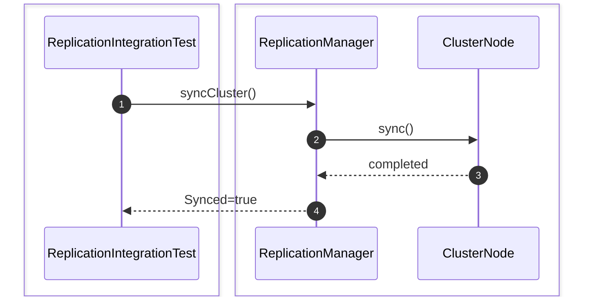
```mermaid
sequenceDiagram
    autonumber

    box #e1f5fe Test Suite
    participant Test as ReplicationIntegrationTest
    end
    box #ffebee Replication Components
    participant Manager as ReplicationManager
    participant Node as ClusterNode
    end

    Test->>Manager: syncCluster()
    Manager->>Node: sync()
    Node-->>Manager: completed
    Manager-->>Test: Synced=true
```

### 3. shouldElectLeaderSuccessfully()
```mermaid
sequenceDiagram
    autonumber

    box #e1f5fe Test Suite
    participant Test as ReplicationIntegrationTest
    end
    box #ffebee Replication Components
    participant Manager as ReplicationManager
    participant Selector as LeaderSelector
    end

    Test->>Manager: triggerElection()
    Manager->>Selector: elect()
    Selector-->>Manager: leaderNode
    Manager-->>Test: LeaderElected=true
```

### 4. shouldRecoverReplicationAfterNodeFailure()
```mermaid
sequenceDiagram
    autonumber

    box #e1f5fe Test Suite
    participant Test as ReplicationIntegrationTest
    end
    box #ffebee Replication Components
    participant Manager as ReplicationManager
    participant Node as ClusterNode
    end

    Test->>Manager: recoverNode(node)
    Manager->>Node: syncState()
    Node-->>Manager: synced
    Manager-->>Test: RecoverySuccess=true
```

### 5. shouldReplicateCommittedTransactionAcrossCluster()
```mermaid
sequenceDiagram
    autonumber

    box #e1f5fe Test Suite
    participant Test as ReplicationIntegrationTest
    end
    box #ffebee Replication Components
    participant Manager as ReplicationManager
    participant Node1 as ClusterNode
    participant Node2 as ClusterNode
    end

    Test->>Manager: replicateTx(tx)
    Manager->>Node1: send(tx)
    Manager->>Node2: send(tx)
    Node1-->>Manager: ack
    Node2-->>Manager: ack
    Manager-->>Test: ReplicatedAcrossCluster=true
```

### 6. shouldSynchronizeReplicaUsingWAL()
```mermaid
sequenceDiagram
    autonumber

    box #e1f5fe Test Suite
    participant Test as ReplicationIntegrationTest
    end
    box #ffebee Replication Components
    participant Manager as ReplicationManager
    participant Node as ClusterNode
    end

    Test->>Manager: syncWithWAL(node)
    Manager->>Node: sendWAL()
    Node-->>Manager: ack
    Manager-->>Test: Synced=true
```

### 7. shouldContinueReplicationAfterLeaderElection()
```mermaid
sequenceDiagram
    autonumber

    box #e1f5fe Test Suite
    participant Test as ReplicationIntegrationTest
    end
    box #ffebee Replication Components
    participant Manager as ReplicationManager
    end

    Test->>Manager: electLeader()
    Manager-->>Test: leaderElected
    Test->>Manager: replicate(data)
    Manager-->>Test: ReplicationSuccess=true
```

### 8. shouldRecoverReplicaAfterFailure()
```mermaid
sequenceDiagram
    autonumber

    box #e1f5fe Test Suite
    participant Test as ReplicationIntegrationTest
    end
    box #ffebee Replication Components
    participant Manager as ReplicationManager
    participant Node as ClusterNode
    end

    Test->>Manager: recoverReplica(node)
    Manager->>Node: reloadAndSync()
    Node-->>Manager: recovered
    Manager-->>Test: RecoverySuccess=true
```

