# Replication Unit Test

## Replication Manager

### 1. shouldReplicateData()
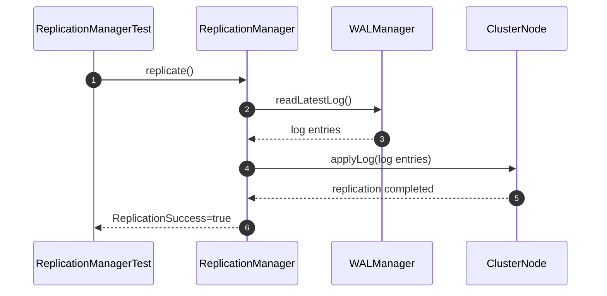

### 2. shouldSynchronizeReplicas()
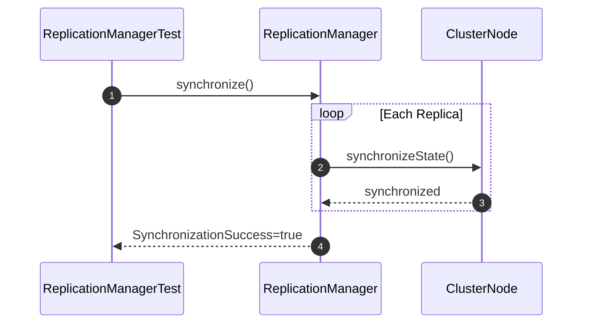

### 3. shouldElectLeader()
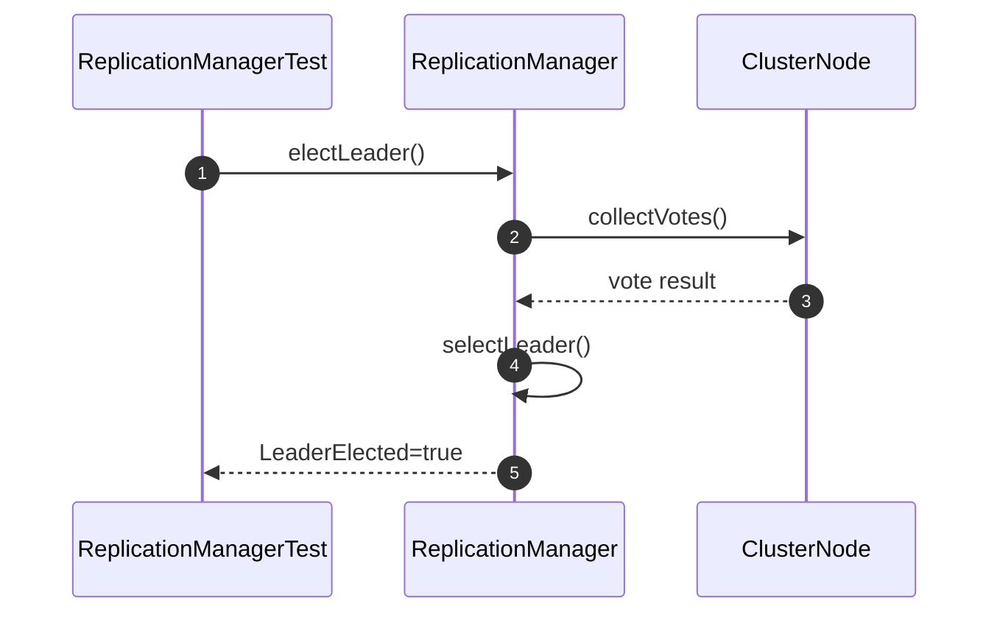

### 4. shouldHandleReplicaFailure()
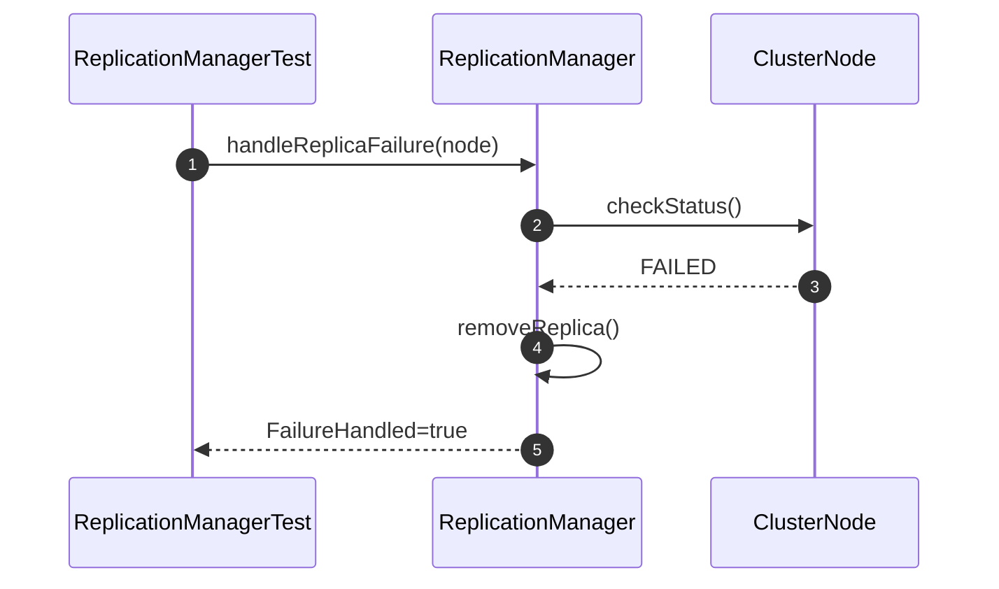

## Cluster Node

### 5. shouldCreateClusterNode()
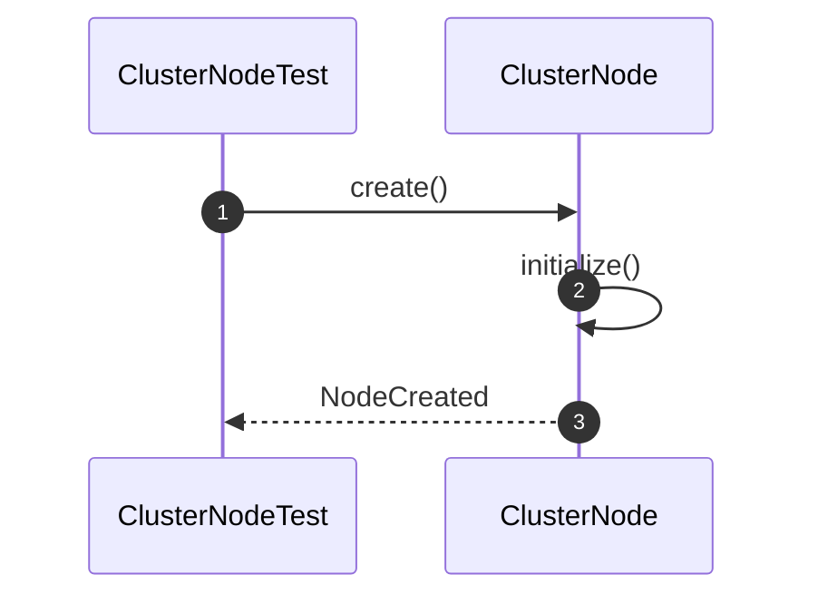

### 6. shouldUpdateNodeStatus()
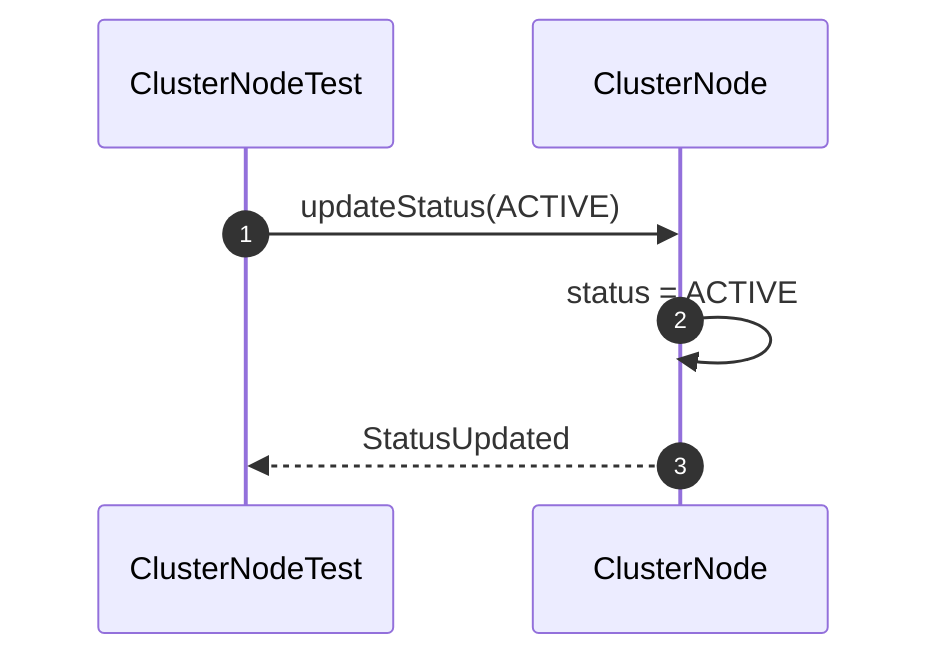

### 7. shouldConnectToCluster()
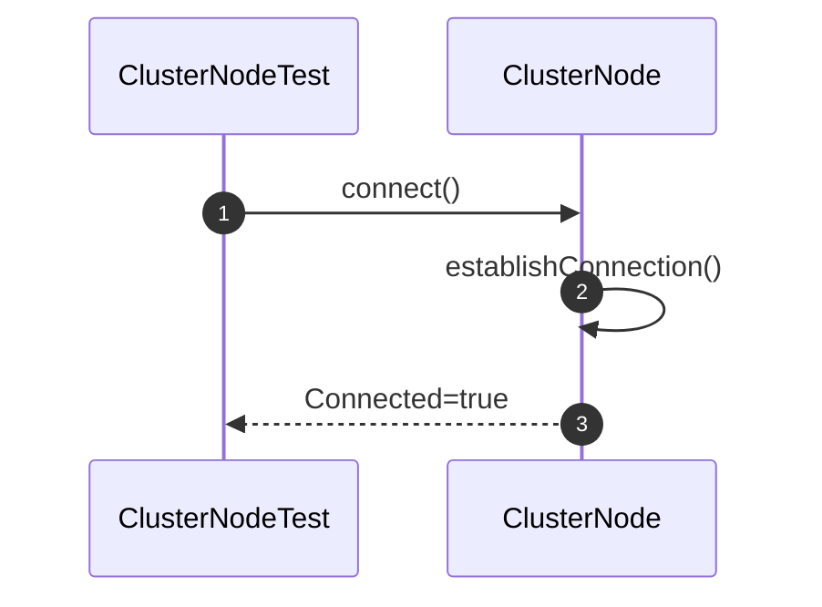

### 8. shouldDisconnectFromCluster()
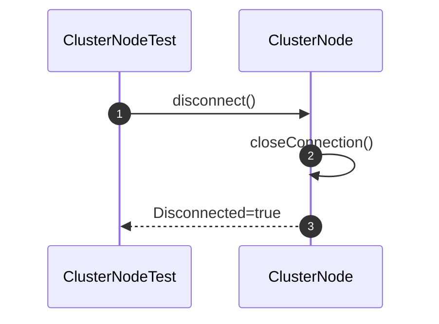

# Replication Integration Test

### 9. shouldReplicateDataToReplica()
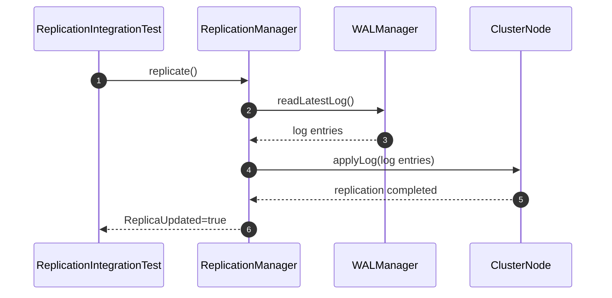

### 10. shouldSynchronizeClusterNodes()
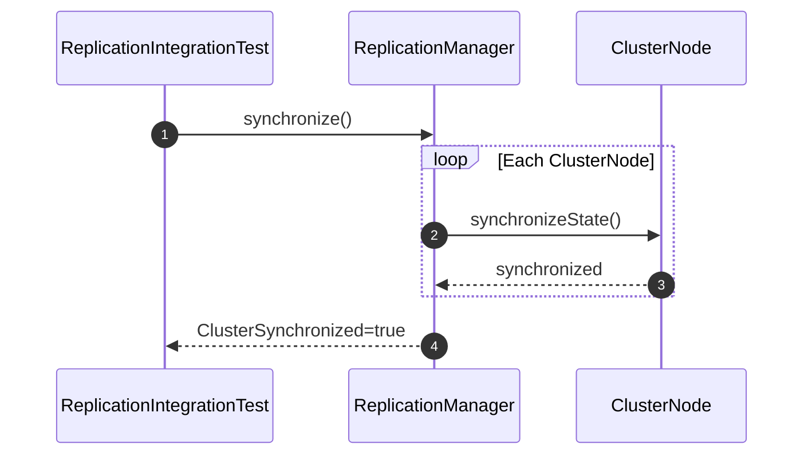

### 11. shouldElectLeaderSuccessfully()
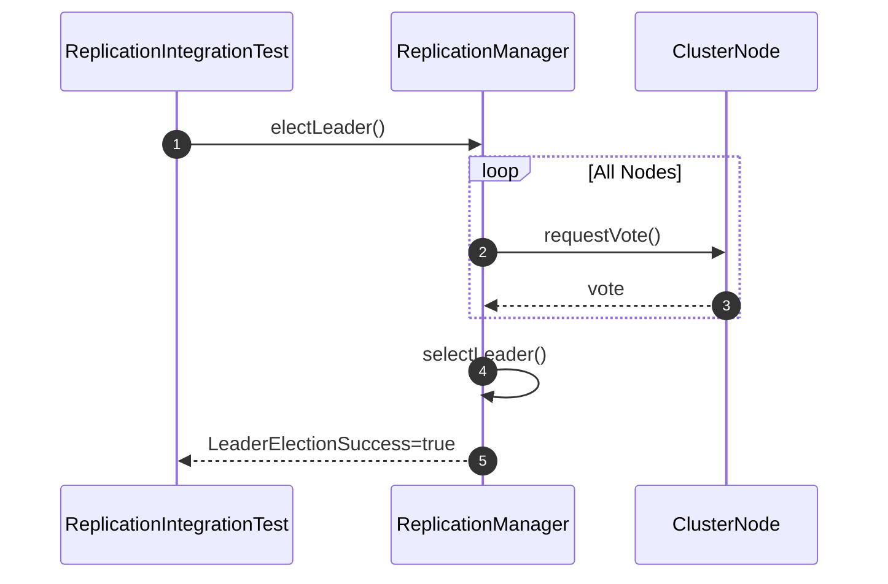

### 12. shouldRecoverReplicationAfterNodeFailure()
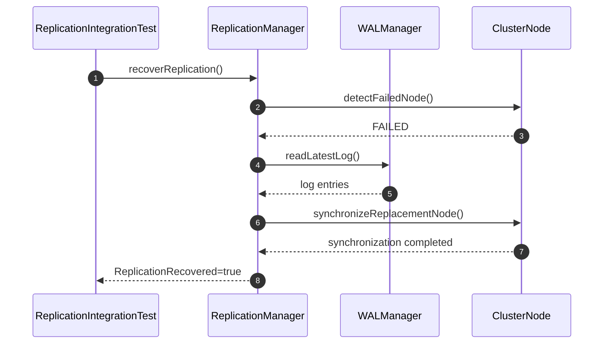