# Security Unit Test

## SecurityManager

### 1. shouldAuthenticateUser()
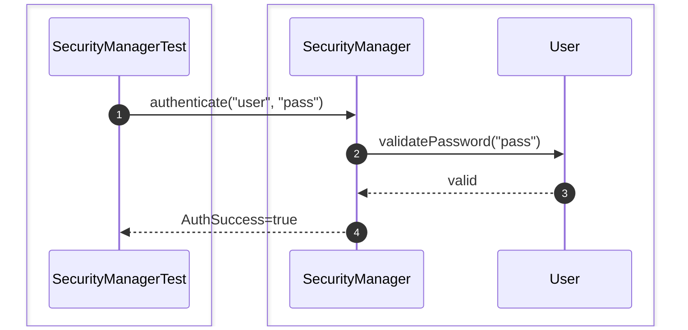

### 2. shouldAuthorizeUser()
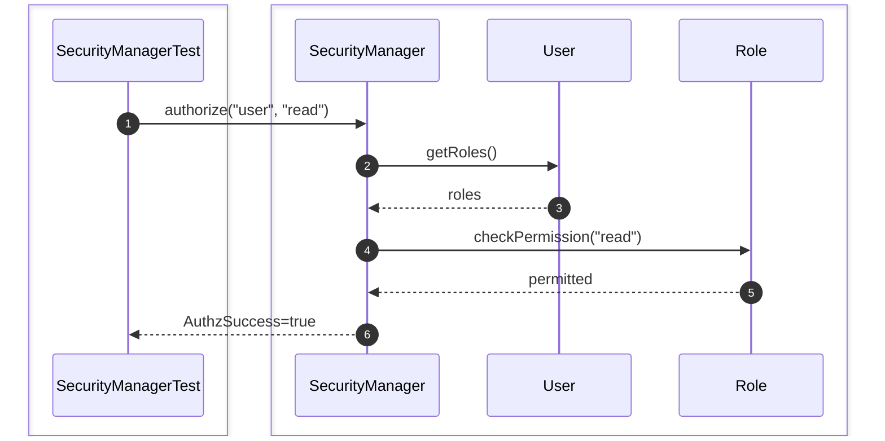

### 3. shouldGrantPermission()
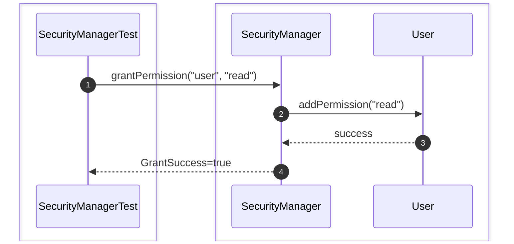

### 4. shouldRevokePermission()
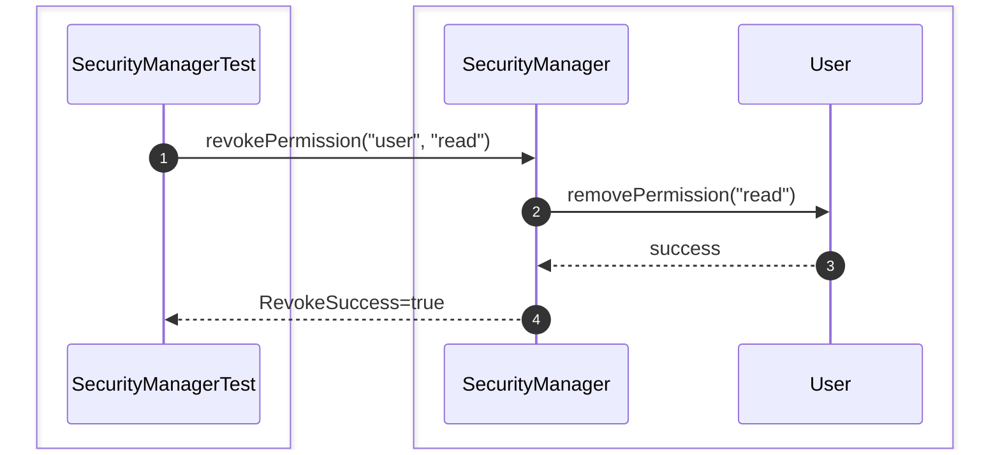

### 5. shouldRejectInvalidPassword()
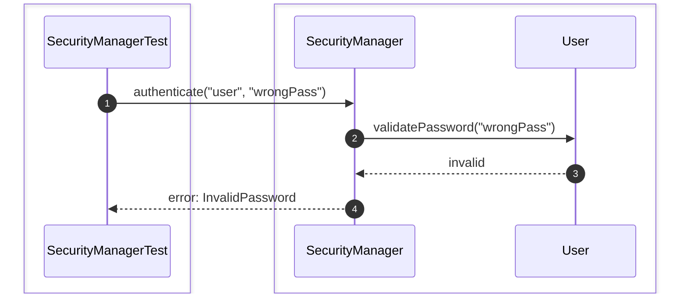

### 6. shouldRejectLockedUser()


### 7. shouldRejectDisabledUser()
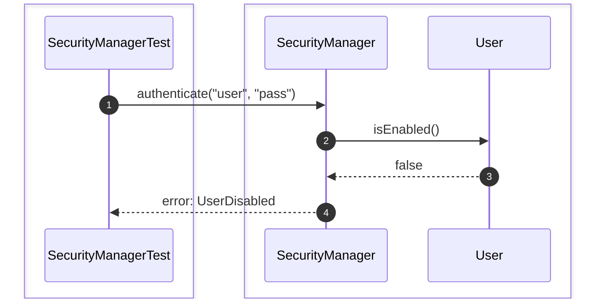

### 8. shouldCheckRolePermission()
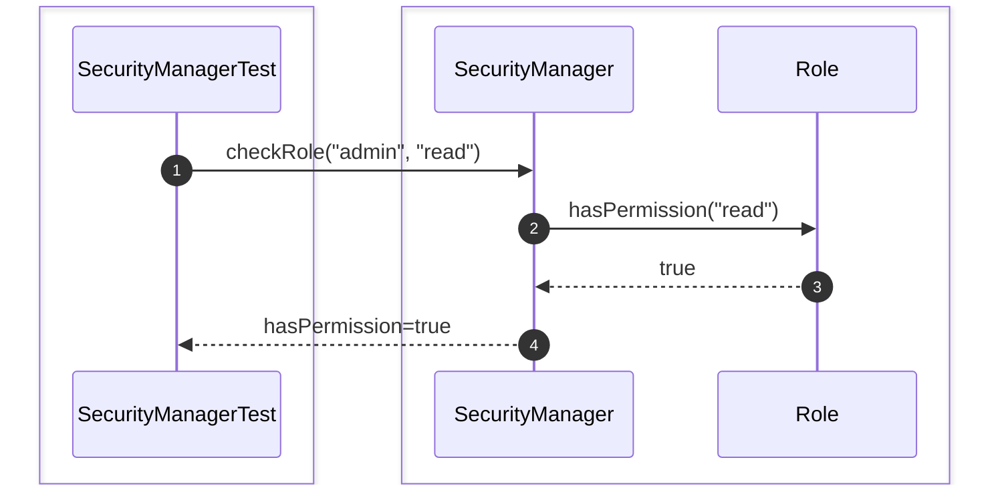

### 9. shouldGrantRolePermission()
```mermaid
sequenceDiagram
    autonumber

    box #e1f5fe Test Suite
    participant Test as SecurityManagerTest
    end
    box #e3f2fd Security Components
    participant Security as SecurityManager
    participant Role as Role
    end

    Test->>Security: grantRolePermission("admin", "write")
    Security->>Role: addPermission("write")
    Role-->>Security: success
    Security-->>Test: GrantSuccess=true
```

### 10. shouldVerifyPermissionInheritance()
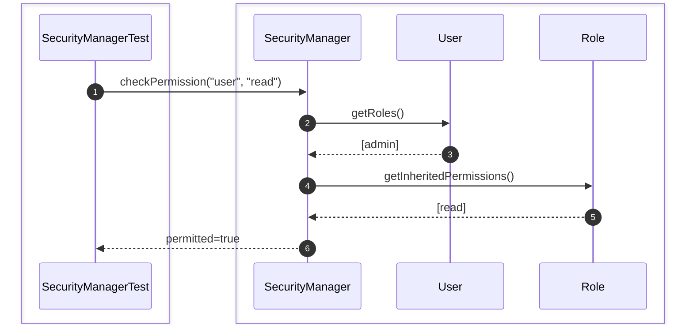

## User

### 1. shouldCreateUser()
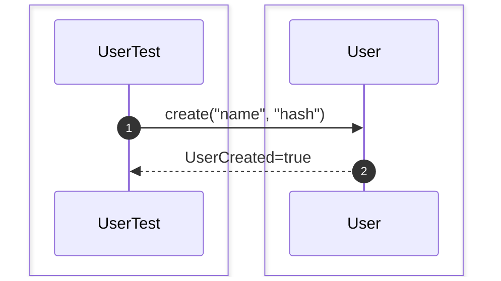

### 2. shouldUpdatePassword()
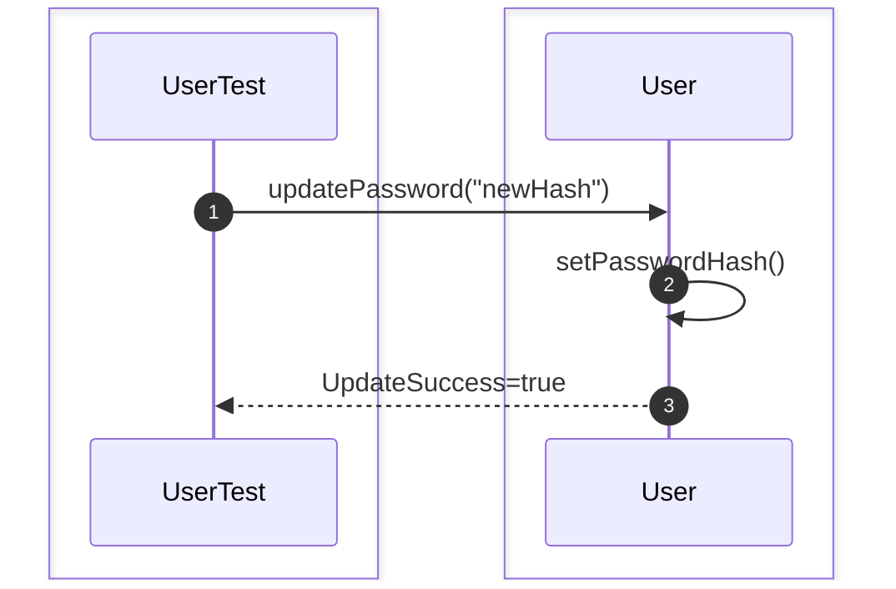

### 3. shouldLockUser()
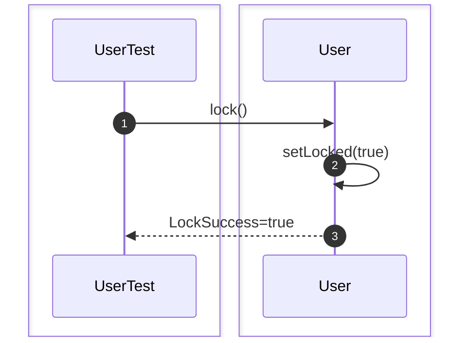

### 4. shouldUnlockUser()
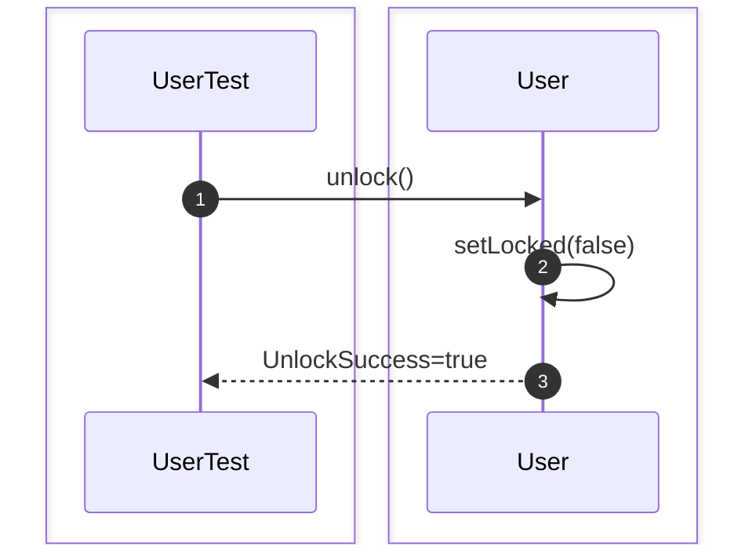

### 5. shouldEnableUser()
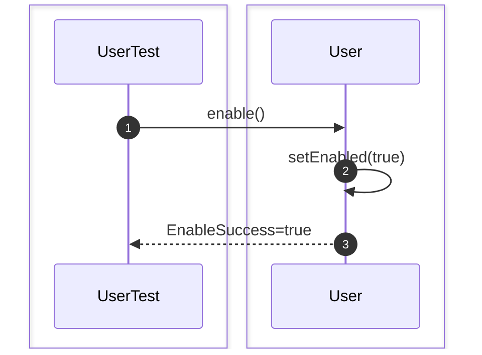

### 6. shouldDisableUser()


### 7. shouldValidatePasswordHash()
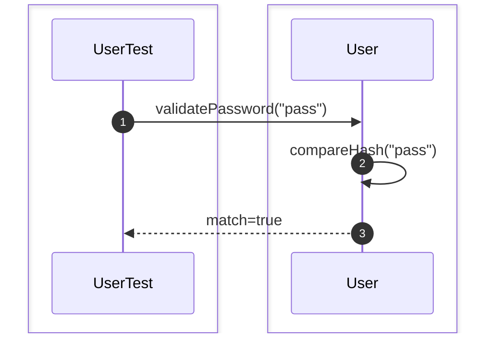

## Role

### 1. shouldCreateRole()
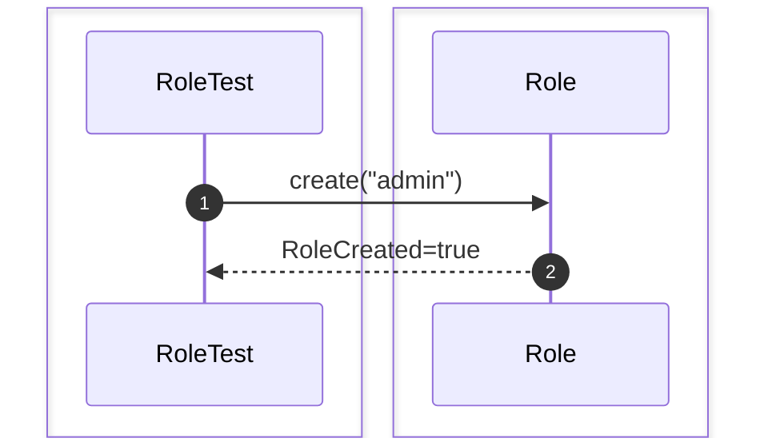

### 2. shouldAssignPermission()
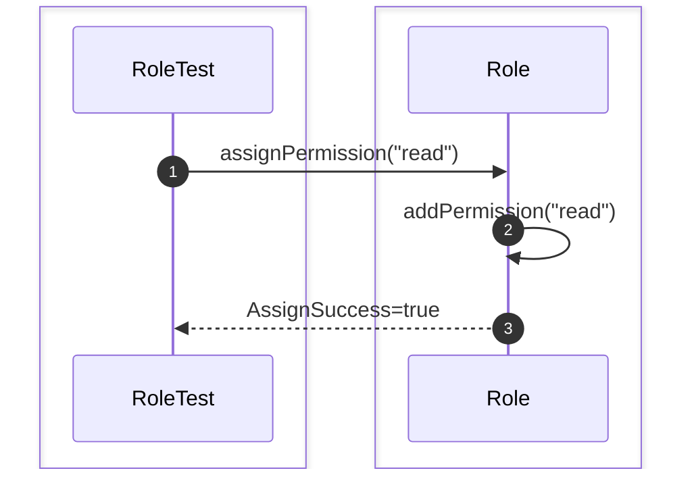

### 3. shouldRemovePermission()
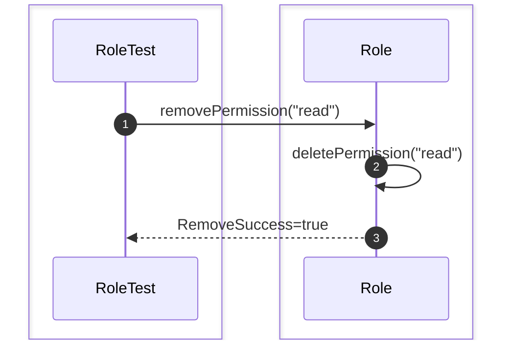

### 4. shouldDeleteRole()
```mermaid
sequenceDiagram
    autonumber

    box #e1f5fe Test Suite
    participant Test as RoleTest
    end
    box #e3f2fd Security Components
    participant Role as Role
    end

    Test->>Role: delete()
    Role-->>Test: DeleteSuccess=true
```

### 5. shouldRenameRole()
```mermaid
sequenceDiagram
    autonumber

    box #e1f5fe Test Suite
    participant Test as RoleTest
    end
    box #e3f2fd Security Components
    participant Role as Role
    end

    Test->>Role: rename("newAdmin")
    Role->>Role: setName()
    Role-->>Test: RenameSuccess=true
```

### 6. shouldListPermissions()
```mermaid
sequenceDiagram
    autonumber

    box #e1f5fe Test Suite
    participant Test as RoleTest
    end
    box #e3f2fd Security Components
    participant Role as Role
    end

    Test->>Role: getPermissions()
    Role-->>Test: list
```

## Permission

### 1. shouldCreatePermission()
```mermaid
sequenceDiagram
    autonumber

    box #e1f5fe Test Suite
    participant Test as PermissionTest
    end
    box #e3f2fd Security Components
    participant Permission as Permission
    end

    Test->>Permission: create("read", "table1")
    Permission-->>Test: PermissionCreated=true
```

### 2. shouldComparePermissions()
```mermaid
sequenceDiagram
    autonumber

    box #e1f5fe Test Suite
    participant Test as PermissionTest
    end
    box #e3f2fd Security Components
    participant Permission as Permission
    end

    Test->>Permission: compare(perm1, perm2)
    Permission-->>Test: equals=true
```

### 3. shouldValidatePermission()
```mermaid
sequenceDiagram
    autonumber

    box #e1f5fe Test Suite
    participant Test as PermissionTest
    end
    box #e3f2fd Security Components
    participant Permission as Permission
    end

    Test->>Permission: validate()
    Permission-->>Test: valid=true
```

### 4. shouldStoreAction()
```mermaid
sequenceDiagram
    autonumber

    box #e1f5fe Test Suite
    participant Test as PermissionTest
    end
    box #e3f2fd Security Components
    participant Permission as Permission
    end

    Test->>Permission: setAction("read")
    Permission-->>Test: success
```

### 5. shouldStoreResource()
```mermaid
sequenceDiagram
    autonumber

    box #e1f5fe Test Suite
    participant Test as PermissionTest
    end
    box #e3f2fd Security Components
    participant Permission as Permission
    end

    Test->>Permission: setResource("table1")
    Permission-->>Test: success
```

# Security Integration Test

### 1. shouldAuthenticateAndAuthorizeUser()
```mermaid
sequenceDiagram
    autonumber

    box #e1f5fe Test Suite
    participant Test as SecurityIntegrationTest
    end
    box #e3f2fd Security Components
    participant Security as SecurityManager
    end

    Test->>Security: login("u", "p")
    Security-->>Test: token
    Test->>Security: access("u", "resource")
    Security-->>Test: allowed=true
```

### 2. shouldAssignRoleAndGrantPermission()
```mermaid
sequenceDiagram
    autonumber

    box #e1f5fe Test Suite
    participant Test as SecurityIntegrationTest
    end
    box #e3f2fd Security Components
    participant Security as SecurityManager
    end

    Test->>Security: assignRole("u", "admin")
    Security->>Security: grantPermission("admin", "read")
    Security-->>Test: success
```

### 3. shouldRevokePermissionSuccessfully()
```mermaid
sequenceDiagram
    autonumber

    box #e1f5fe Test Suite
    participant Test as SecurityIntegrationTest
    end
    box #e3f2fd Security Components
    participant Security as SecurityManager
    end

    Test->>Security: revokePermission("admin", "read")
    Security-->>Test: success
```

### 4. shouldRejectUnauthorizedAccess()
```mermaid
sequenceDiagram
    autonumber

    box #e1f5fe Test Suite
    participant Test as SecurityIntegrationTest
    end
    box #e3f2fd Security Components
    participant Security as SecurityManager
    end

    Test->>Security: access("u", "secret")
    Security-->>Test: error: Unauthorized
```

### 5. shouldAuthenticateGrantAndAccess()
```mermaid
sequenceDiagram
    autonumber

    box #e1f5fe Test Suite
    participant Test as SecurityIntegrationTest
    end
    box #e3f2fd Security Components
    participant Security as SecurityManager
    end

    Test->>Security: login("u", "p")
    Security->>Security: grantPermission("u", "read")
    Security->>Security: access("u", "read")
    Security-->>Test: allowed=true
```

### 6. shouldGrantRoleThenAuthorize()
```mermaid
sequenceDiagram
    autonumber

    box #e1f5fe Test Suite
    participant Test as SecurityIntegrationTest
    end
    box #e3f2fd Security Components
    participant Security as SecurityManager
    end

    Test->>Security: assignRole("u", "manager")
    Security->>Security: authorize("u", "write")
    Security-->>Test: authorized=true
```

### 7. shouldRevokePermissionAndRejectAccess()
```mermaid
sequenceDiagram
    autonumber

    box #e1f5fe Test Suite
    participant Test as SecurityIntegrationTest
    end
    box #e3f2fd Security Components
    participant Security as SecurityManager
    end

    Test->>Security: revoke("u", "read")
    Security->>Security: access("u", "read")
    Security-->>Test: denied=true
```

