# Security Unit Test

## Security Manager

### 1. shouldAuthenticateUser()
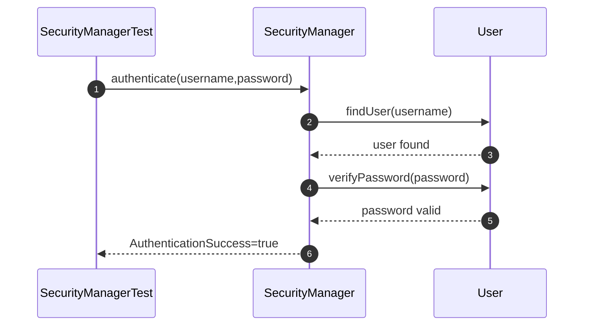

### 2. shouldAuthorizeUser()
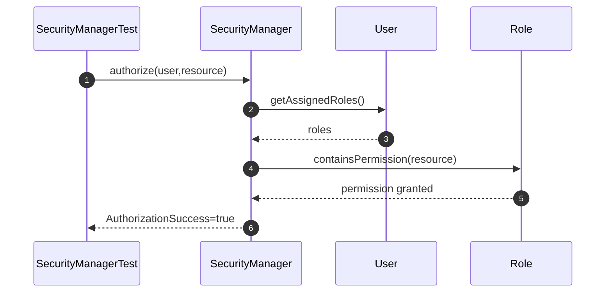

### 3. shouldGrantPermission()
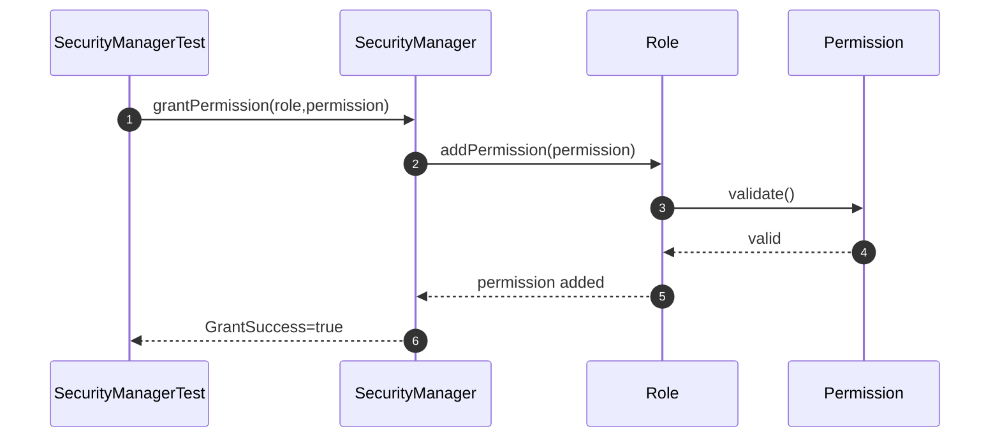
### 4. shouldRevokePermission()
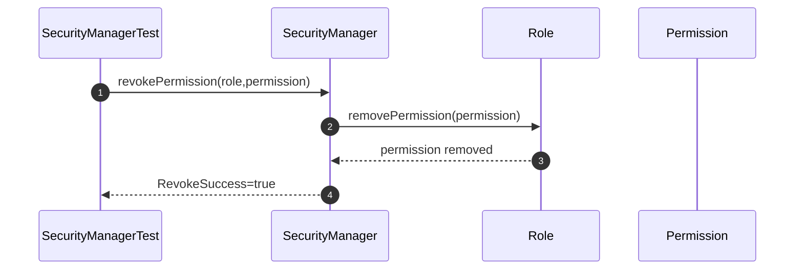

## User 

### 5. shouldCreateUser()
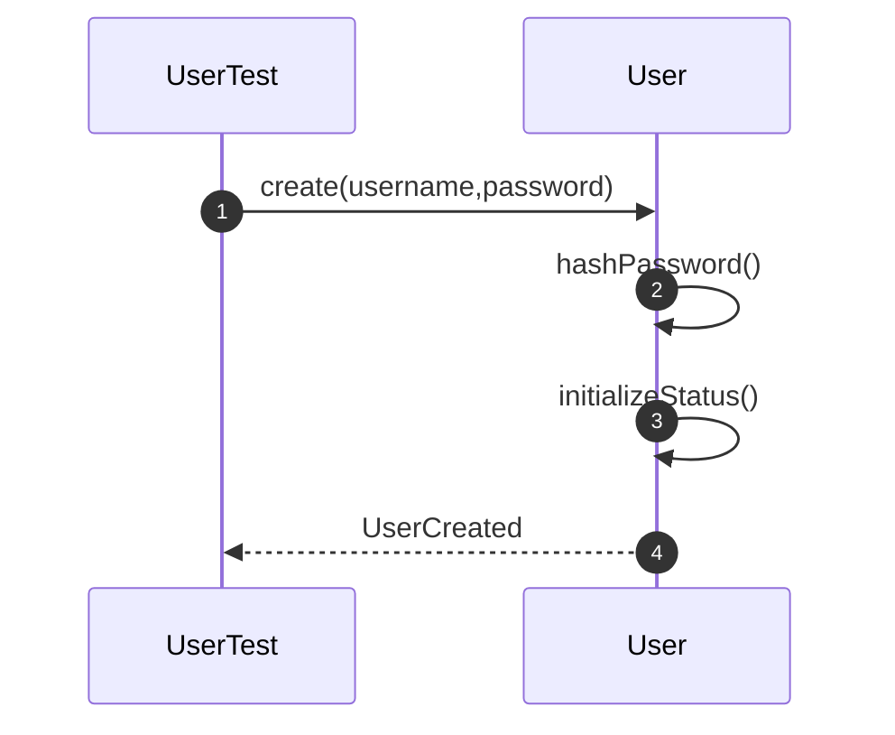

### 6. shouldUpdatePassword()
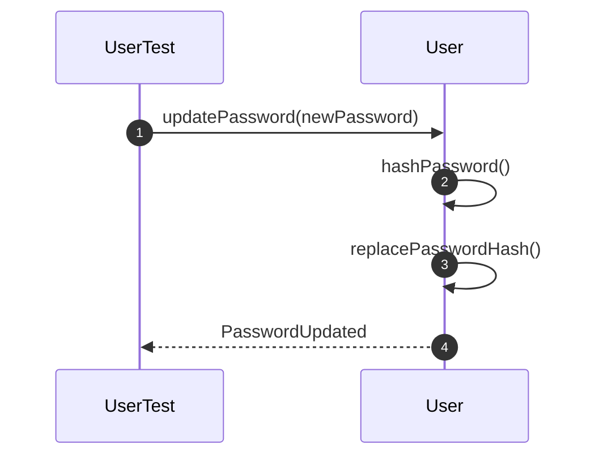

### 7. shouldLockUser()
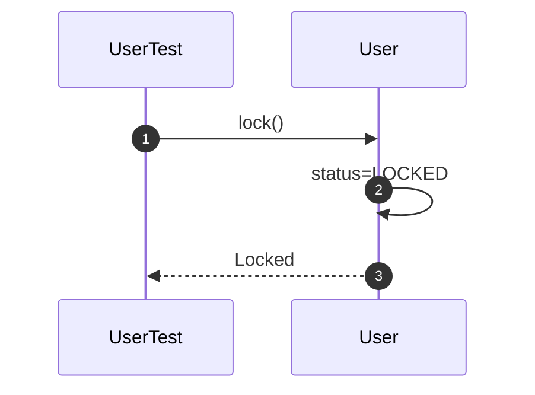

### 8. shouldUnlockUser()
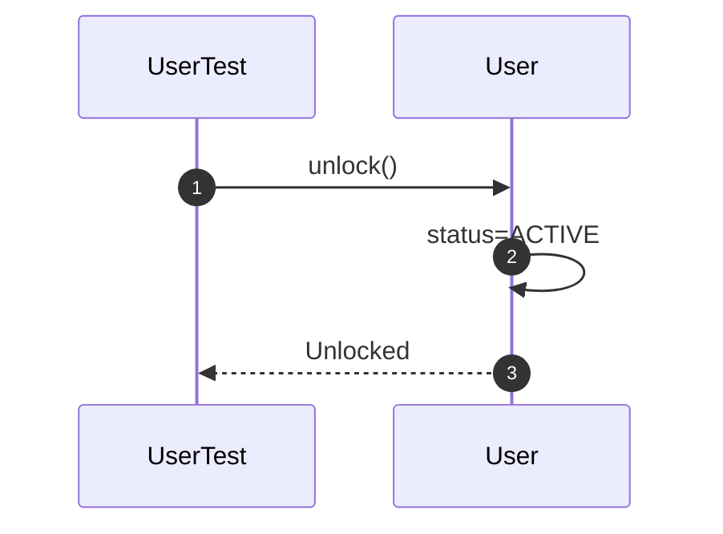

## Role

### 9. shouldCreateRole()
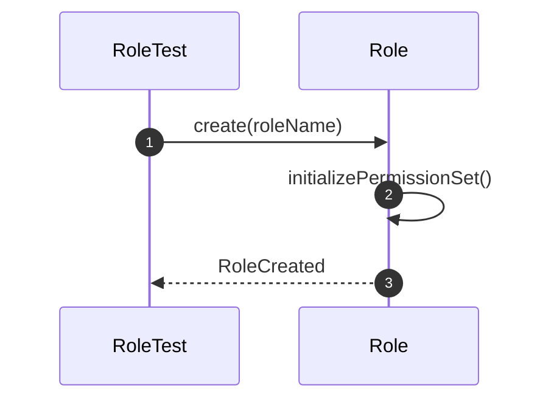

### 10. shouldAssignPermission()
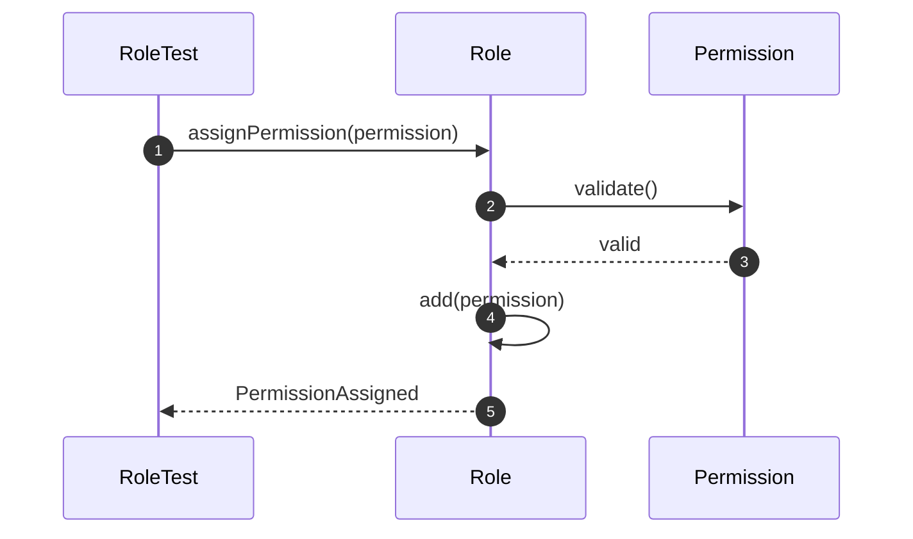

### 11. shouldRemovePermission()
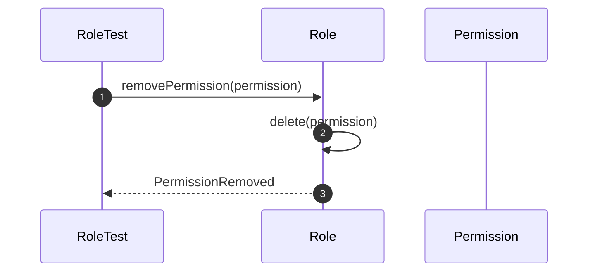

## Permission 

### 12. shouldCreatePermission()
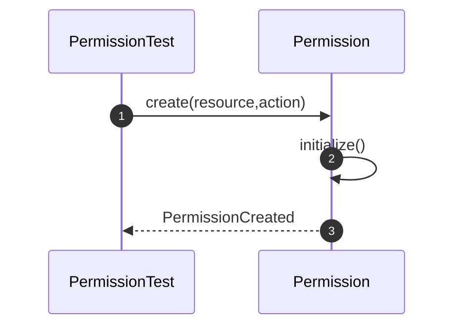

### 13. shouldComparePermissions()
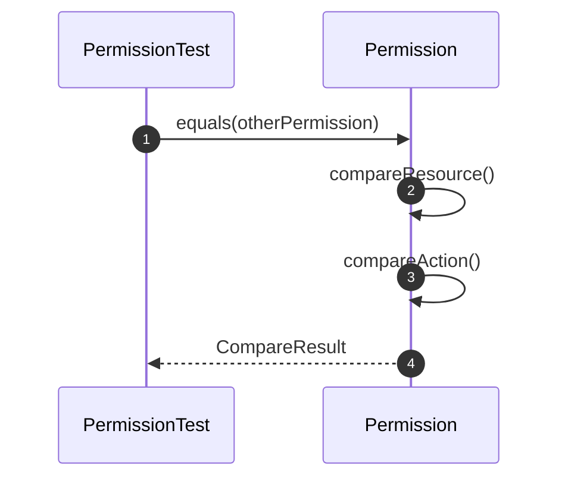

### 14. shouldValidatePermission()
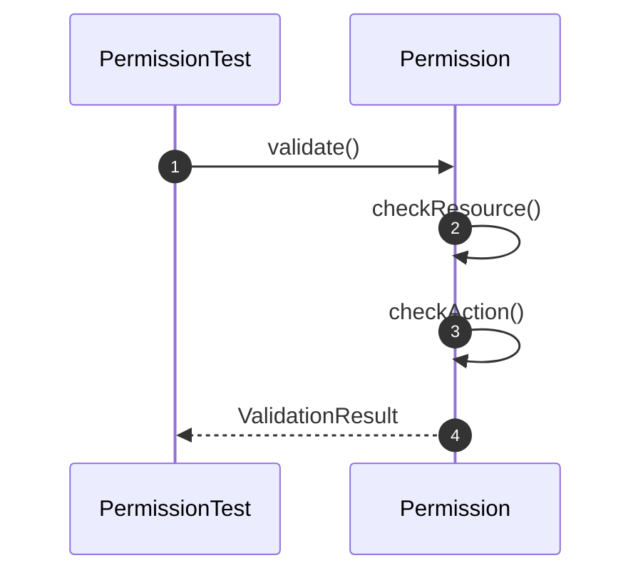
# Security Integration Test

### 15. shouldAuthenticateAndAuthorizeUser()
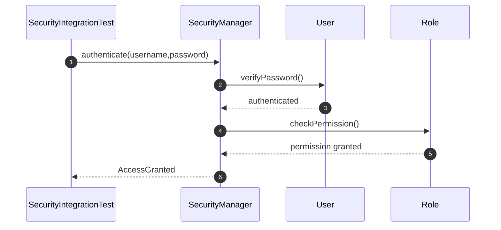

### 16. shouldAssignRoleAndGrantPermission()
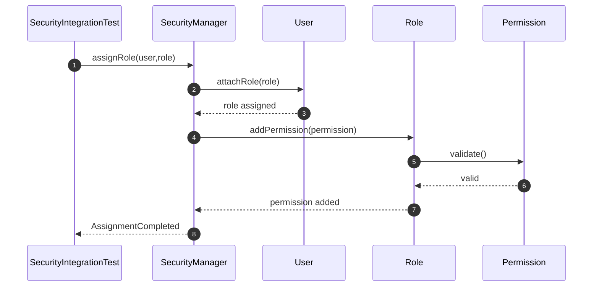

### 17. shouldRevokePermissionSuccessfully()
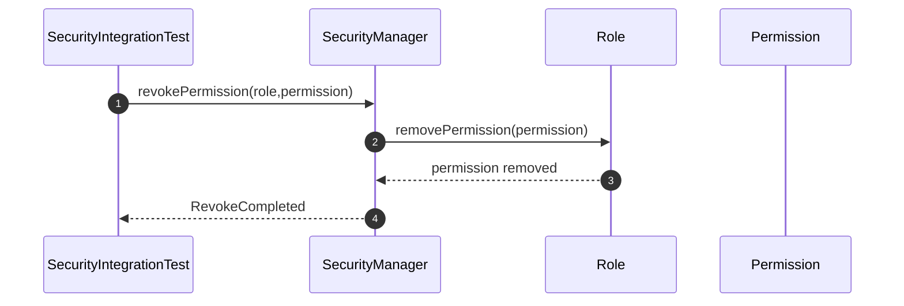

### 18. shouldRejectUnauthorizedAccess()
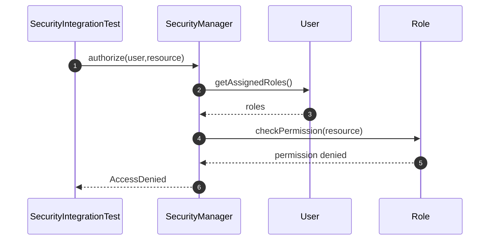