# Storage Engine Unit Test

## BufferPoolTest

### 1. shouldPinPage()
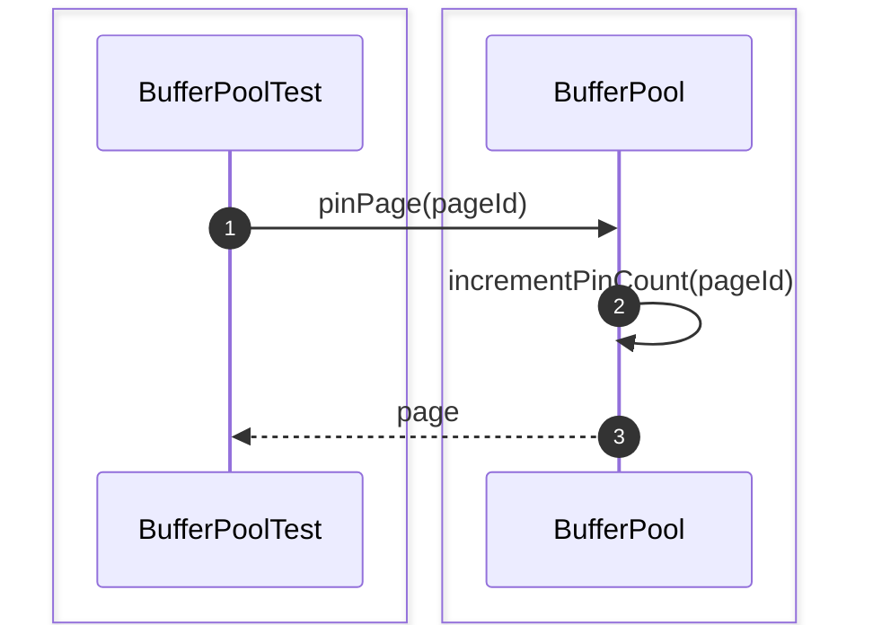
```mermaid
sequenceDiagram
    autonumber

    box #e1f5fe Test Suite
    participant Test as BufferPoolTest
    end
    box #e0f2f1 Storage Components
    participant Buffer as BufferPool
    end

    Test->>Buffer: pinPage(pageId)
    Buffer->>Buffer: incrementPinCount(pageId)
    Buffer-->>Test: page
```

### 2. shouldUnpinPage()

```mermaid
sequenceDiagram
    autonumber

    box #e1f5fe Test Suite
    participant Test as BufferPoolTest
    end
    box #e0f2f1 Storage Components
    participant Buffer as BufferPool
    end

    Test->>Buffer: unpinPage(pageId)
    Buffer->>Buffer: decrementPinCount(pageId)
    Buffer-->>Test: success
```

### 3. shouldFetchExistingPage()
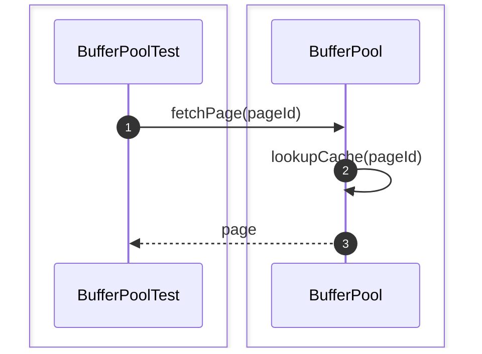
```mermaid
sequenceDiagram
    autonumber

    box #e1f5fe Test Suite
    participant Test as BufferPoolTest
    end
    box #e0f2f1 Storage Components
    participant Buffer as BufferPool
    end

    Test->>Buffer: fetchPage(pageId)
    Buffer->>Buffer: lookupCache(pageId)
    Buffer-->>Test: page
```

### 4. shouldAllocateNewPage()
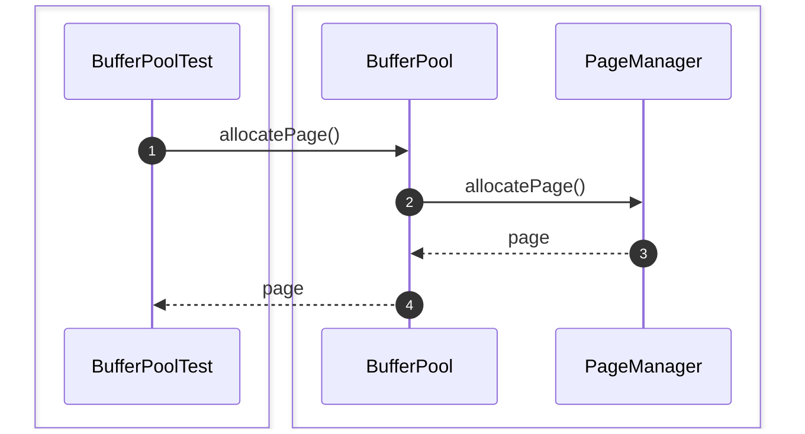
```mermaid
sequenceDiagram
    autonumber

    box #e1f5fe Test Suite
    participant Test as BufferPoolTest
    end
    box #e0f2f1 Storage Components
    participant Buffer as BufferPool
    participant PageManager as PageManager
    end

    Test->>Buffer: allocatePage()
    Buffer->>PageManager: allocatePage()
    PageManager-->>Buffer: page
    Buffer-->>Test: page
```

### 5. shouldFlushDirtyPage()
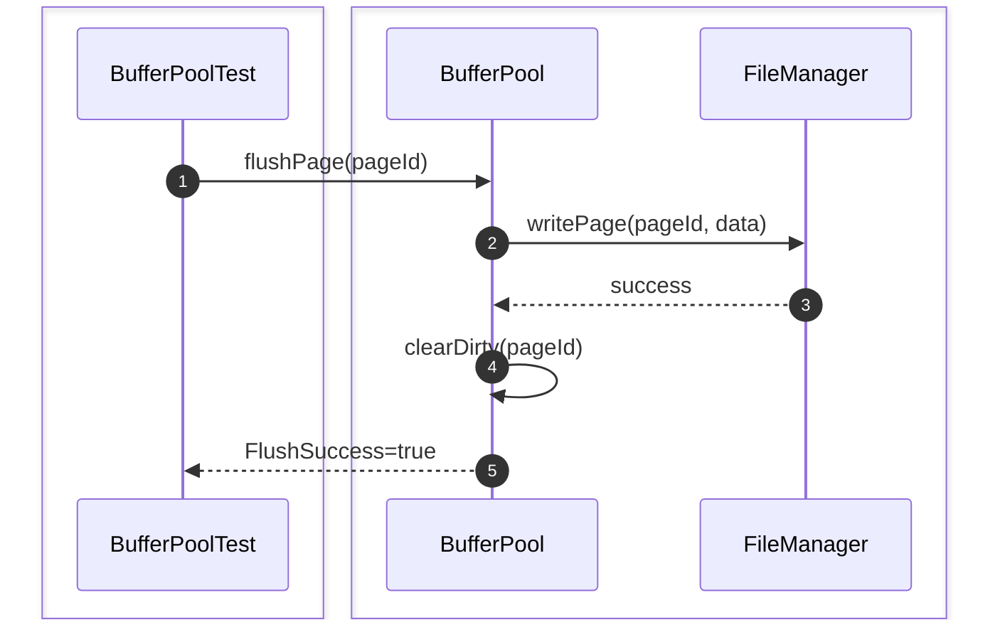
```mermaid
sequenceDiagram
    autonumber

    box #e1f5fe Test Suite
    participant Test as BufferPoolTest
    end
    box #e0f2f1 Storage Components
    participant Buffer as BufferPool
    participant FileManager as FileManager
    end

    Test->>Buffer: flushPage(pageId)
    Buffer->>FileManager: writePage(pageId, data)
    FileManager-->>Buffer: success
    Buffer->>Buffer: clearDirty(pageId)
    Buffer-->>Test: FlushSuccess=true
```

### 6. shouldEvictPage()
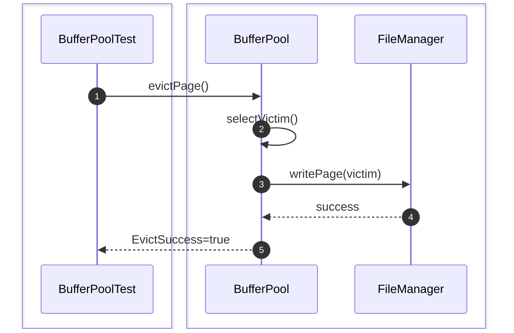
```mermaid
sequenceDiagram
    autonumber

    box #e1f5fe Test Suite
    participant Test as BufferPoolTest
    end
    box #e0f2f1 Storage Components
    participant Buffer as BufferPool
    participant FileManager as FileManager
    end

    Test->>Buffer: evictPage()
    Buffer->>Buffer: selectVictim()
    Buffer->>FileManager: writePage(victim)
    FileManager-->>Buffer: success
    Buffer-->>Test: EvictSuccess=true
```

### 7. shouldRejectEvictPinnedPage()
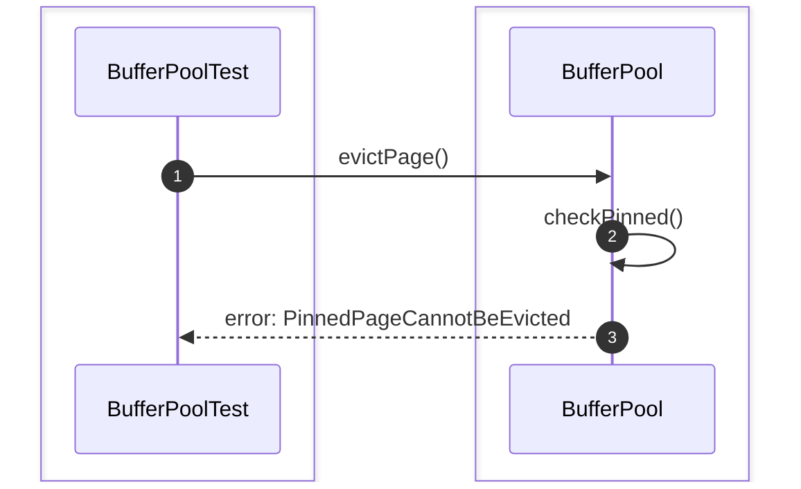
```mermaid
sequenceDiagram
    autonumber

    box #e1f5fe Test Suite
    participant Test as BufferPoolTest
    end
    box #e0f2f1 Storage Components
    participant Buffer as BufferPool
    end

    Test->>Buffer: evictPage()
    Buffer->>Buffer: checkPinned()
    Buffer-->>Test: error: PinnedPageCannotBeEvicted
```

### 8. shouldReplaceVictimPage()
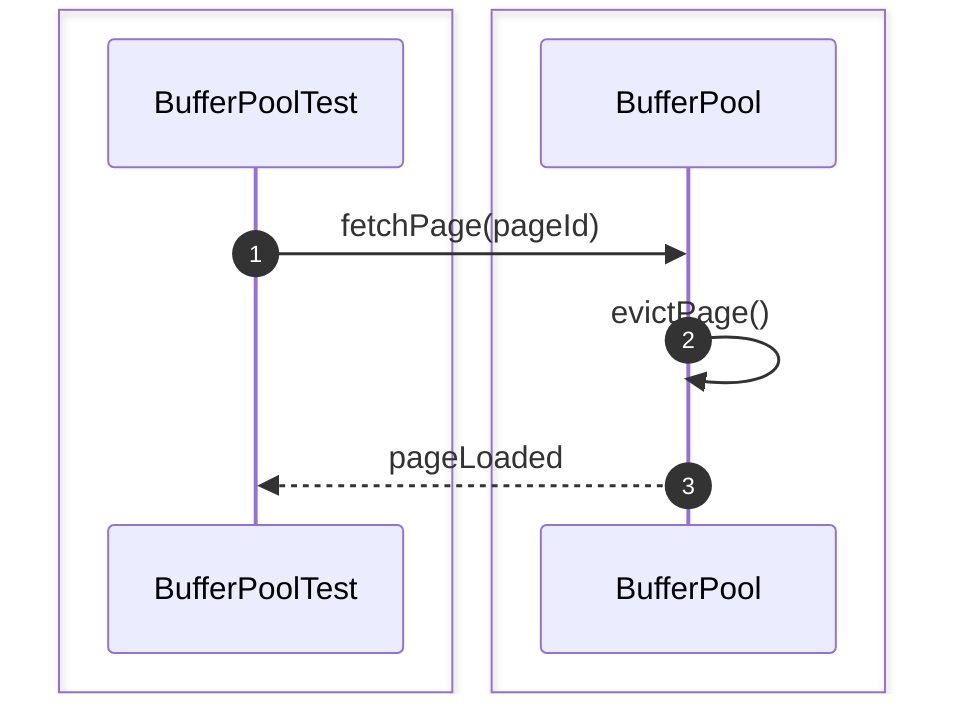
```mermaid
sequenceDiagram
    autonumber

    box #e1f5fe Test Suite
    participant Test as BufferPoolTest
    end
    box #e0f2f1 Storage Components
    participant Buffer as BufferPool
    end

    Test->>Buffer: fetchPage(pageId)
    Buffer->>Buffer: evictPage()
    Buffer-->>Test: pageLoaded
```

### 9. shouldMarkPageDirty()
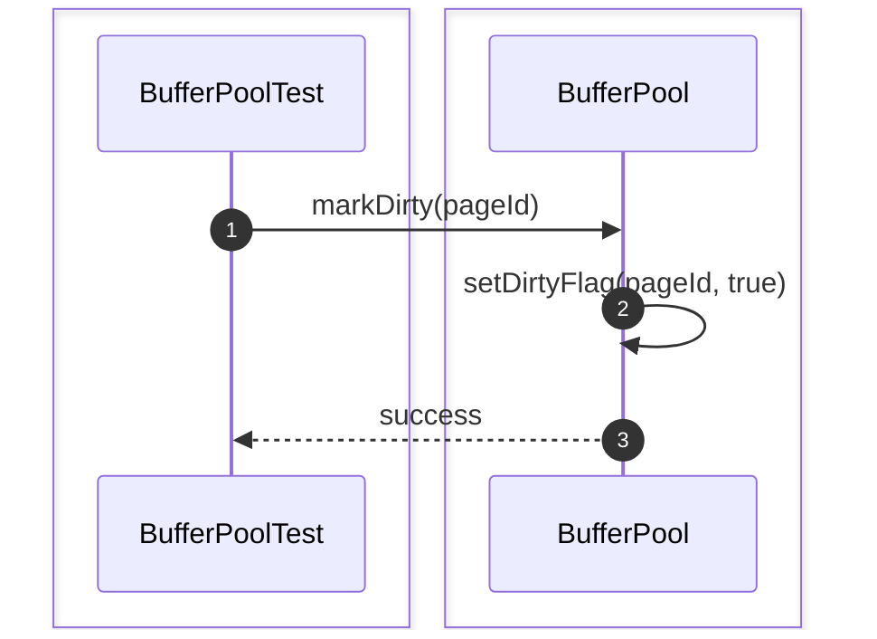
```mermaid
sequenceDiagram
    autonumber

    box #e1f5fe Test Suite
    participant Test as BufferPoolTest
    end
    box #e0f2f1 Storage Components
    participant Buffer as BufferPool
    end

    Test->>Buffer: markDirty(pageId)
    Buffer->>Buffer: setDirtyFlag(pageId, true)
    Buffer-->>Test: success
```

### 10. shouldClearDirtyFlagAfterFlush()

```mermaid
sequenceDiagram
    autonumber

    box #e1f5fe Test Suite
    participant Test as BufferPoolTest
    end
    box #e0f2f1 Storage Components
    participant Buffer as BufferPool
    end

    Test->>Buffer: flushPage(pageId)
    Buffer->>Buffer: setDirtyFlag(pageId, false)
    Buffer-->>Test: success
```

### 11. shouldTrackPinCount()
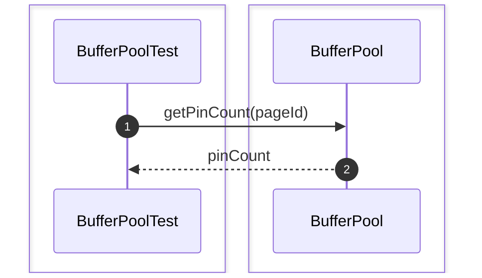
```mermaid
sequenceDiagram
    autonumber

    box #e1f5fe Test Suite
    participant Test as BufferPoolTest
    end
    box #e0f2f1 Storage Components
    participant Buffer as BufferPool
    end

    Test->>Buffer: getPinCount(pageId)
    Buffer-->>Test: pinCount
```

### 12. shouldReturnCachedPage()

```mermaid
sequenceDiagram
    autonumber

    box #e1f5fe Test Suite
    participant Test as BufferPoolTest
    end
    box #e0f2f1 Storage Components
    participant Buffer as BufferPool
    end

    Test->>Buffer: fetchPage(pageId)
    Buffer->>Buffer: checkCache(pageId)
    Buffer-->>Test: cachedPage
```

## PageManagerTest

### 1. shouldCreatePage()
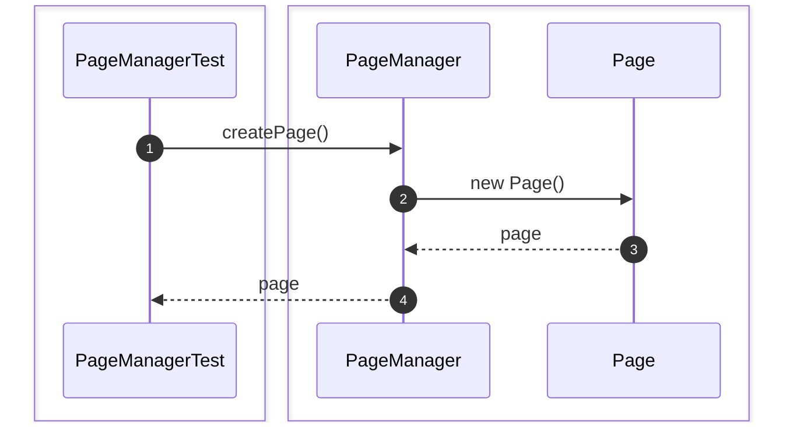
```mermaid
sequenceDiagram
    autonumber

    box #e1f5fe Test Suite
    participant Test as PageManagerTest
    end
    box #e0f2f1 Storage Components
    participant PageManager as PageManager
    participant Page as Page
    end

    Test->>PageManager: createPage()
    PageManager->>Page: new Page()
    Page-->>PageManager: page
    PageManager-->>Test: page
```

### 2. shouldReadPage()
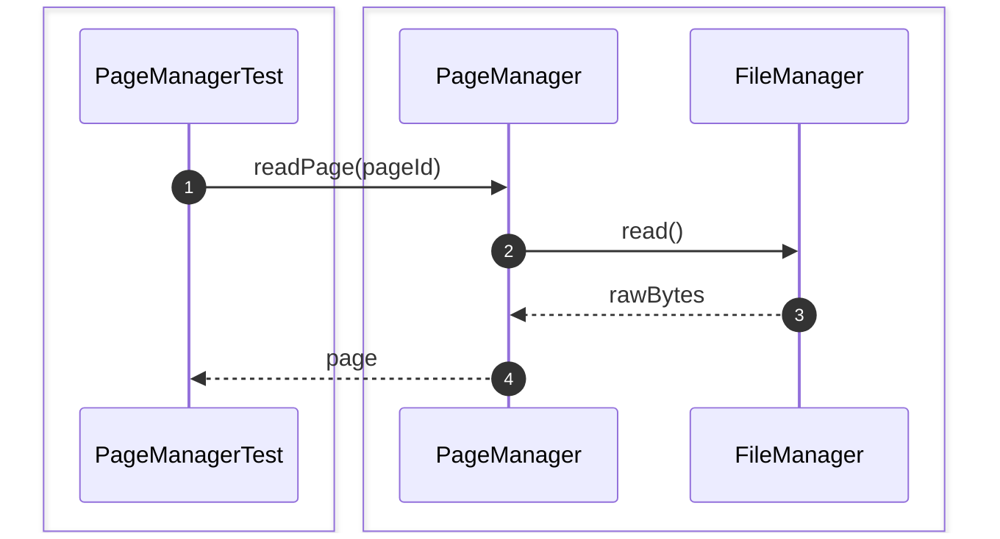
```mermaid
sequenceDiagram
    autonumber

    box #e1f5fe Test Suite
    participant Test as PageManagerTest
    end
    box #e0f2f1 Storage Components
    participant PageManager as PageManager
    participant FileManager as FileManager
    end

    Test->>PageManager: readPage(pageId)
    PageManager->>FileManager: read()
    FileManager-->>PageManager: rawBytes
    PageManager-->>Test: page
```

### 3. shouldWritePage()
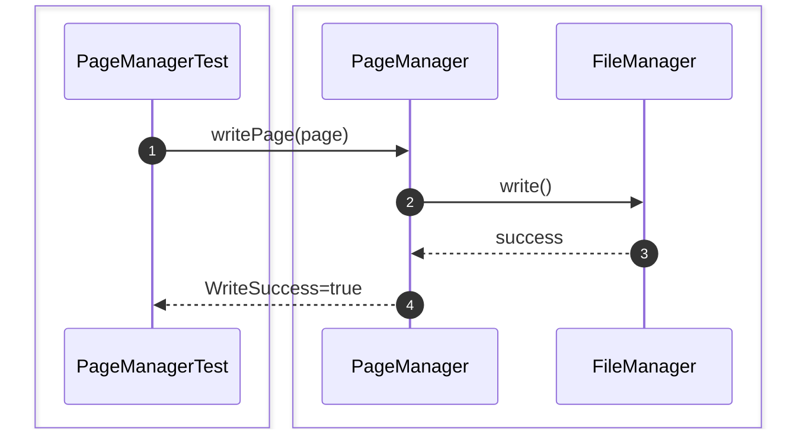
```mermaid
sequenceDiagram
    autonumber

    box #e1f5fe Test Suite
    participant Test as PageManagerTest
    end
    box #e0f2f1 Storage Components
    participant PageManager as PageManager
    participant FileManager as FileManager
    end

    Test->>PageManager: writePage(page)
    PageManager->>FileManager: write()
    FileManager-->>PageManager: success
    PageManager-->>Test: WriteSuccess=true
```

### 4. shouldAllocatePage()
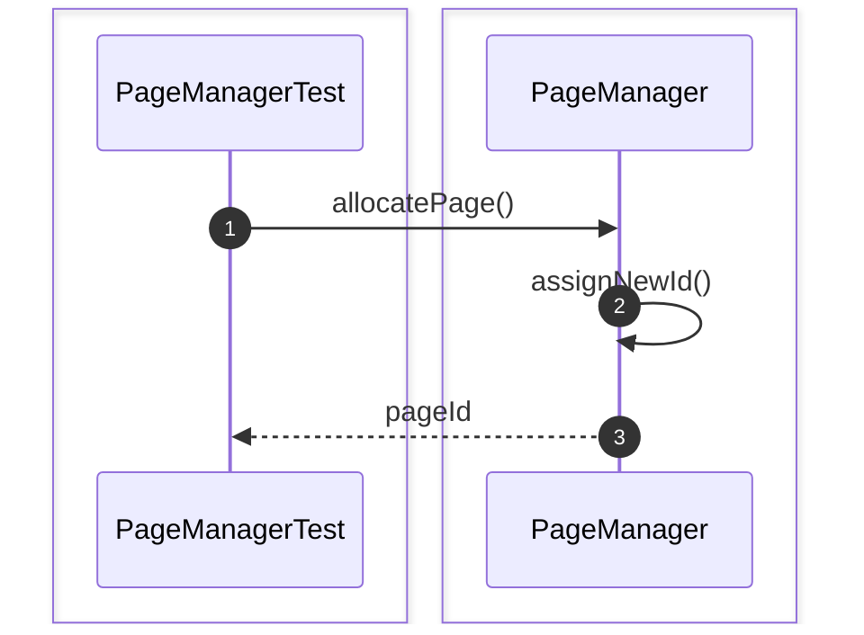
```mermaid
sequenceDiagram
    autonumber

    box #e1f5fe Test Suite
    participant Test as PageManagerTest
    end
    box #e0f2f1 Storage Components
    participant PageManager as PageManager
    end

    Test->>PageManager: allocatePage()
    PageManager->>PageManager: assignNewId()
    PageManager-->>Test: pageId
```

### 5. shouldDeallocatePage()
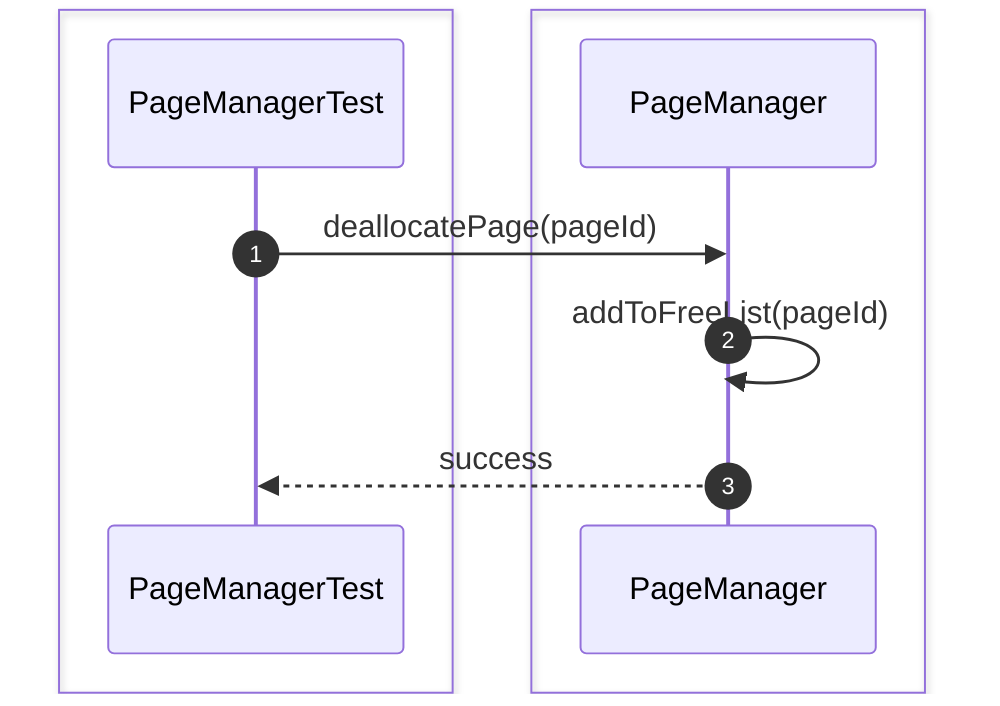
```mermaid
sequenceDiagram
    autonumber

    box #e1f5fe Test Suite
    participant Test as PageManagerTest
    end
    box #e0f2f1 Storage Components
    participant PageManager as PageManager
    end

    Test->>PageManager: deallocatePage(pageId)
    PageManager->>PageManager: addToFreeList(pageId)
    PageManager-->>Test: success
```

### 6. shouldReuseFreedPage()
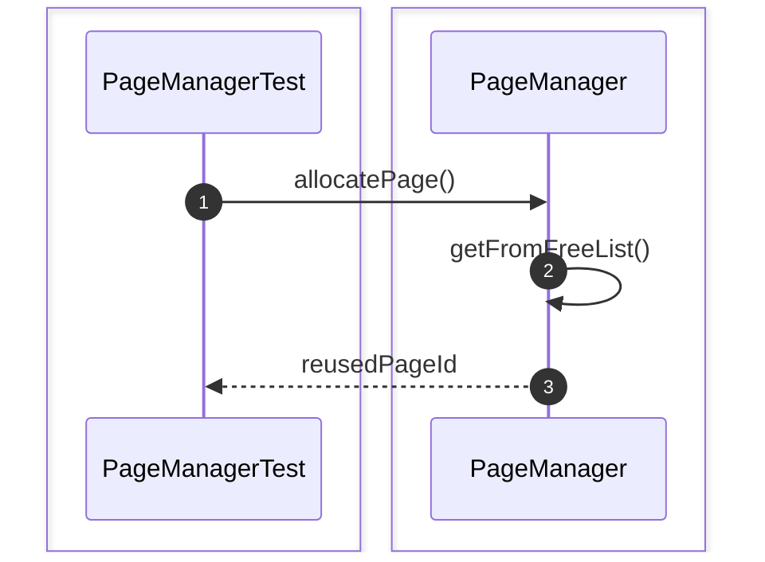
```mermaid
sequenceDiagram
    autonumber

    box #e1f5fe Test Suite
    participant Test as PageManagerTest
    end
    box #e0f2f1 Storage Components
    participant PageManager as PageManager
    end

    Test->>PageManager: allocatePage()
    PageManager->>PageManager: getFromFreeList()
    PageManager-->>Test: reusedPageId
```

### 7. shouldAssignUniquePageId()
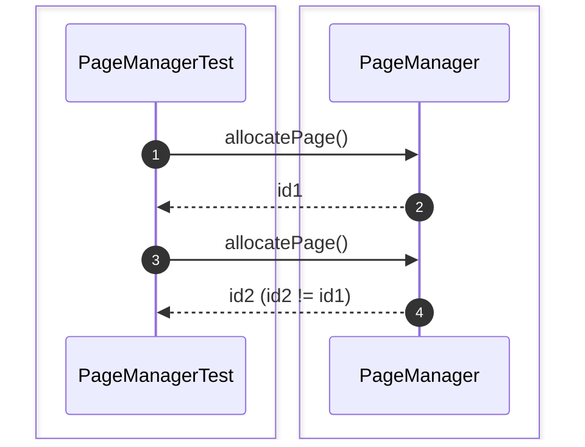
```mermaid
sequenceDiagram
    autonumber

    box #e1f5fe Test Suite
    participant Test as PageManagerTest
    end
    box #e0f2f1 Storage Components
    participant PageManager as PageManager
    end

    Test->>PageManager: allocatePage()
    PageManager-->>Test: id1
    Test->>PageManager: allocatePage()
    PageManager-->>Test: id2 (id2 != id1)
```

### 8. shouldMaintainPageMetadata()
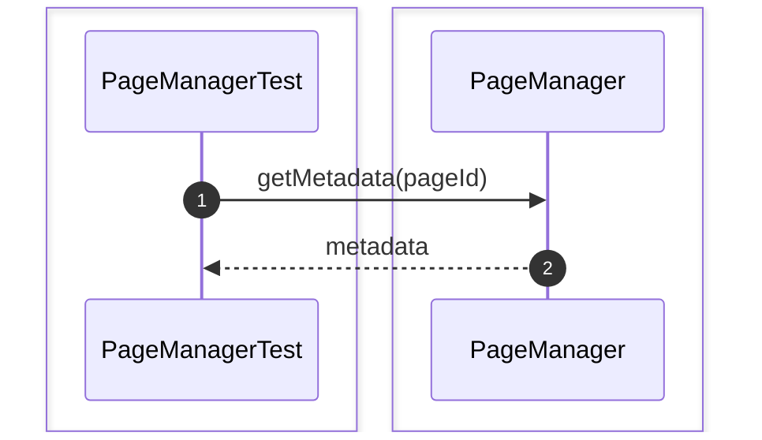
```mermaid
sequenceDiagram
    autonumber

    box #e1f5fe Test Suite
    participant Test as PageManagerTest
    end
    box #e0f2f1 Storage Components
    participant PageManager as PageManager
    end

    Test->>PageManager: getMetadata(pageId)
    PageManager-->>Test: metadata
```

### 9. shouldMarkPageDirty()
```mermaid
sequenceDiagram
    autonumber

    box #e1f5fe Test Suite
    participant Test as PageManagerTest
    end
    box #e0f2f1 Storage Components
    participant PageManager as PageManager
    end

    Test->>PageManager: markDirty(pageId)
    PageManager-->>Test: success
```

### 10. shouldClearDirtyFlag()
```mermaid
sequenceDiagram
    autonumber

    box #e1f5fe Test Suite
    participant Test as PageManagerTest
    end
    box #e0f2f1 Storage Components
    participant PageManager as PageManager
    end

    Test->>PageManager: clearDirty(pageId)
    PageManager-->>Test: success
```

### 11. shouldCreateCheckpoint()
```mermaid
sequenceDiagram
    autonumber

    box #e1f5fe Test Suite
    participant Test as PageManagerTest
    end
    box #e0f2f1 Storage Components
    participant PageManager as PageManager
    participant FileManager as FileManager
    end

    Test->>PageManager: checkpoint()
    PageManager->>FileManager: flushAll()
    FileManager-->>PageManager: success
    PageManager-->>Test: CheckpointSuccess=true
```

### 12. shouldRestoreCheckpoint()
```mermaid
sequenceDiagram
    autonumber

    box #e1f5fe Test Suite
    participant Test as PageManagerTest
    end
    box #e0f2f1 Storage Components
    participant PageManager as PageManager
    participant FileManager as FileManager
    end

    Test->>PageManager: restore(checkpointId)
    PageManager->>FileManager: read(checkpointId)
    FileManager-->>PageManager: state
    PageManager-->>Test: RestoreSuccess=true
```

## FileManagerTest

### 1. shouldCreateDataFile()
```mermaid
sequenceDiagram
    autonumber

    box #e1f5fe Test Suite
    participant Test as FileManagerTest
    end
    box #e0f2f1 Storage Components
    participant FileManager as FileManager
    participant Disk as Disk
    end

    Test->>FileManager: create("file.db")
    FileManager->>Disk: createNewFile()
    Disk-->>FileManager: success
    FileManager-->>Test: FileCreated=true
```

### 2. shouldOpenDataFile()
```mermaid
sequenceDiagram
    autonumber

    box #e1f5fe Test Suite
    participant Test as FileManagerTest
    end
    box #e0f2f1 Storage Components
    participant FileManager as FileManager
    participant Disk as Disk
    end

    Test->>FileManager: open("file.db")
    FileManager->>Disk: openFile()
    Disk-->>FileManager: fileHandle
    FileManager-->>Test: OpenSuccess=true
```

### 3. shouldCloseDataFile()
```mermaid
sequenceDiagram
    autonumber

    box #e1f5fe Test Suite
    participant Test as FileManagerTest
    end
    box #e0f2f1 Storage Components
    participant FileManager as FileManager
    participant Disk as Disk
    end

    Test->>FileManager: close()
    FileManager->>Disk: closeHandle()
    Disk-->>FileManager: success
    FileManager-->>Test: CloseSuccess=true
```

### 4. shouldReadDataFile()
```mermaid
sequenceDiagram
    autonumber

    box #e1f5fe Test Suite
    participant Test as FileManagerTest
    end
    box #e0f2f1 Storage Components
    participant FileManager as FileManager
    participant Disk as Disk
    end

    Test->>FileManager: read(offset, buffer)
    FileManager->>Disk: readBytes()
    Disk-->>FileManager: bytesRead
    FileManager-->>Test: bytesRead
```

### 5. shouldWriteDataFile()
```mermaid
sequenceDiagram
    autonumber

    box #e1f5fe Test Suite
    participant Test as FileManagerTest
    end
    box #e0f2f1 Storage Components
    participant FileManager as FileManager
    participant Disk as Disk
    end

    Test->>FileManager: write(offset, buffer)
    FileManager->>Disk: writeBytes()
    Disk-->>FileManager: success
    FileManager-->>Test: WriteSuccess=true
```

### 6. shouldDeleteDataFile()
```mermaid
sequenceDiagram
    autonumber

    box #e1f5fe Test Suite
    participant Test as FileManagerTest
    end
    box #e0f2f1 Storage Components
    participant FileManager as FileManager
    participant Disk as Disk
    end

    Test->>FileManager: delete("file.db")
    FileManager->>Disk: deleteFile()
    Disk-->>FileManager: success
    FileManager-->>Test: DeleteSuccess=true
```

### 7. shouldRenameDataFile()
```mermaid
sequenceDiagram
    autonumber

    box #e1f5fe Test Suite
    participant Test as FileManagerTest
    end
    box #e0f2f1 Storage Components
    participant FileManager as FileManager
    participant Disk as Disk
    end

    Test->>FileManager: rename("old", "new")
    FileManager->>Disk: renameFile()
    Disk-->>FileManager: success
    FileManager-->>Test: RenameSuccess=true
```

### 8. shouldExpandDataFile()
```mermaid
sequenceDiagram
    autonumber

    box #e1f5fe Test Suite
    participant Test as FileManagerTest
    end
    box #e0f2f1 Storage Components
    participant FileManager as FileManager
    participant Disk as Disk
    end

    Test->>FileManager: expand(size)
    FileManager->>Disk: setFileSize()
    Disk-->>FileManager: success
    FileManager-->>Test: ExpandSuccess=true
```

### 9. shouldShrinkDataFile()
```mermaid
sequenceDiagram
    autonumber

    box #e1f5fe Test Suite
    participant Test as FileManagerTest
    end
    box #e0f2f1 Storage Components
    participant FileManager as FileManager
    participant Disk as Disk
    end

    Test->>FileManager: shrink(size)
    FileManager->>Disk: truncateFile()
    Disk-->>FileManager: success
    FileManager-->>Test: ShrinkSuccess=true
```

### 10. shouldCheckFileExistence()
```mermaid
sequenceDiagram
    autonumber

    box #e1f5fe Test Suite
    participant Test as FileManagerTest
    end
    box #e0f2f1 Storage Components
    participant FileManager as FileManager
    end

    Test->>FileManager: exists("file.db")
    FileManager-->>Test: exists=true
```

### 11. shouldSynchronizeFileToDisk()
```mermaid
sequenceDiagram
    autonumber

    box #e1f5fe Test Suite
    participant Test as FileManagerTest
    end
    box #e0f2f1 Storage Components
    participant FileManager as FileManager
    participant Disk as Disk
    end

    Test->>FileManager: sync()
    FileManager->>Disk: fsync()
    Disk-->>FileManager: success
    FileManager-->>Test: SyncSuccess=true
```

### 12. shouldHandleMissingFile()
```mermaid
sequenceDiagram
    autonumber

    box #e1f5fe Test Suite
    participant Test as FileManagerTest
    end
    box #e0f2f1 Storage Components
    participant FileManager as FileManager
    end

    Test->>FileManager: open("missing.db")
    FileManager-->>Test: error: FileNotFound
```

## PageTest

### 1. shouldCreatePage()
```mermaid
sequenceDiagram
    autonumber

    box #e1f5fe Test Suite
    participant Test as PageTest
    end
    box #e0f2f1 Storage Components
    participant Page as Page
    end

    Test->>Page: new Page(id)
    Page-->>Test: PageCreated
```

### 2. shouldReadPageData()
```mermaid
sequenceDiagram
    autonumber

    box #e1f5fe Test Suite
    participant Test as PageTest
    end
    box #e0f2f1 Storage Components
    participant Page as Page
    end

    Test->>Page: getData()
    Page-->>Test: bytes
```

### 3. shouldWritePageData()
```mermaid
sequenceDiagram
    autonumber

    box #e1f5fe Test Suite
    participant Test as PageTest
    end
    box #e0f2f1 Storage Components
    participant Page as Page
    end

    Test->>Page: writeData(bytes)
    Page-->>Test: success
```

### 4. shouldUpdatePageHeader()
```mermaid
sequenceDiagram
    autonumber

    box #e1f5fe Test Suite
    participant Test as PageTest
    end
    box #e0f2f1 Storage Components
    participant Page as Page
    end

    Test->>Page: updateHeader(header)
    Page-->>Test: success
```

### 5. shouldMarkPageDirty()
```mermaid
sequenceDiagram
    autonumber

    box #e1f5fe Test Suite
    participant Test as PageTest
    end
    box #e0f2f1 Storage Components
    participant Page as Page
    end

    Test->>Page: setDirty(true)
    Page-->>Test: success
```

### 6. shouldClearDirtyFlag()
```mermaid
sequenceDiagram
    autonumber

    box #e1f5fe Test Suite
    participant Test as PageTest
    end
    box #e0f2f1 Storage Components
    participant Page as Page
    end

    Test->>Page: setDirty(false)
    Page-->>Test: success
```

### 7. shouldIncrementPageLSN()
```mermaid
sequenceDiagram
    autonumber

    box #e1f5fe Test Suite
    participant Test as PageTest
    end
    box #e0f2f1 Storage Components
    participant Page as Page
    end

    Test->>Page: setLSN(lsn)
    Page-->>Test: success
```

### 8. shouldResetPage()
```mermaid
sequenceDiagram
    autonumber

    box #e1f5fe Test Suite
    participant Test as PageTest
    end
    box #e0f2f1 Storage Components
    participant Page as Page
    end

    Test->>Page: reset()
    Page-->>Test: success
```

# Storage Engine Integration Test

### 1. shouldAllocateAndWritePage()
```mermaid
sequenceDiagram
    autonumber

    box #e1f5fe Test Suite
    participant Test as StorageIntegrationTest
    end
    box #e0f2f1 Storage Components
    participant PageManager as PageManager
    participant FileManager as FileManager
    end

    Test->>PageManager: allocatePage()
    PageManager-->>Test: pageId
    Test->>PageManager: writePage(pageId, data)
    PageManager->>FileManager: write()
    FileManager-->>PageManager: success
    PageManager-->>Test: WriteSuccess=true
```

### 2. shouldReadPageFromDisk()
```mermaid
sequenceDiagram
    autonumber

    box #e1f5fe Test Suite
    participant Test as StorageIntegrationTest
    end
    box #e0f2f1 Storage Components
    participant PageManager as PageManager
    participant FileManager as FileManager
    end

    Test->>PageManager: readPage(pageId)
    PageManager->>FileManager: read()
    FileManager-->>PageManager: pageData
    PageManager-->>Test: page
```

### 3. shouldFlushDirtyPageToDisk()
```mermaid
sequenceDiagram
    autonumber

    box #e1f5fe Test Suite
    participant Test as StorageIntegrationTest
    end
    box #e0f2f1 Storage Components
    participant Buffer as BufferPool
    participant FileManager as FileManager
    end

    Test->>Buffer: flushPage(pageId)
    Buffer->>FileManager: write()
    FileManager-->>Buffer: success
    Buffer-->>Test: Flushed=true
```

### 4. shouldReloadPageIntoBufferPool()
```mermaid
sequenceDiagram
    autonumber

    box #e1f5fe Test Suite
    participant Test as StorageIntegrationTest
    end
    box #e0f2f1 Storage Components
    participant Buffer as BufferPool
    participant FileManager as FileManager
    end

    Test->>Buffer: fetchPage(pageId)
    Buffer->>FileManager: read()
    FileManager-->>Buffer: pageData
    Buffer-->>Test: page
```

### 5. shouldEvictPageUsingReplacementPolicy()
```mermaid
sequenceDiagram
    autonumber

    box #e1f5fe Test Suite
    participant Test as StorageIntegrationTest
    end
    box #e0f2f1 Storage Components
    participant Buffer as BufferPool
    participant FileManager as FileManager
    end

    Test->>Buffer: fetchPage(pageId)
    Buffer->>Buffer: evictVictim()
    Buffer->>FileManager: write(victim)
    FileManager-->>Buffer: success
    Buffer-->>Test: EvictedAndFetched=true
```

### 6. shouldPersistPageAcrossRestart()
```mermaid
sequenceDiagram
    autonumber

    box #e1f5fe Test Suite
    participant Test as StorageIntegrationTest
    end
    box #e0f2f1 Storage Components
    participant PageManager as PageManager
    participant FileManager as FileManager
    end

    Test->>PageManager: writePage(page)
    PageManager->>FileManager: sync()
    FileManager-->>PageManager: success
    Test->>PageManager: restart()
    Test->>PageManager: readPage(pageId)
    PageManager-->>Test: page
```

### 7. shouldRecoverPageAfterCrash()
```mermaid
sequenceDiagram
    autonumber

    box #e1f5fe Test Suite
    participant Test as StorageIntegrationTest
    end
    box #e0f2f1 Storage Components
    participant PageManager as PageManager
    participant FileManager as FileManager
    end

    Test->>PageManager: recover()
    PageManager->>FileManager: read()
    PageManager-->>Test: recoveredState
```

### 8. shouldSynchronizeBufferPoolAndDisk()
```mermaid
sequenceDiagram
    autonumber

    box #e1f5fe Test Suite
    participant Test as StorageIntegrationTest
    end
    box #e0f2f1 Storage Components
    participant Buffer as BufferPool
    participant FileManager as FileManager
    end

    Test->>Buffer: syncAll()
    Buffer->>FileManager: flushAll()
    FileManager-->>Buffer: success
    Buffer-->>Test: Synced=true
```

