# Storage Engine Unit Test 

## Storage Engine 

### 1. shouldReadPage()
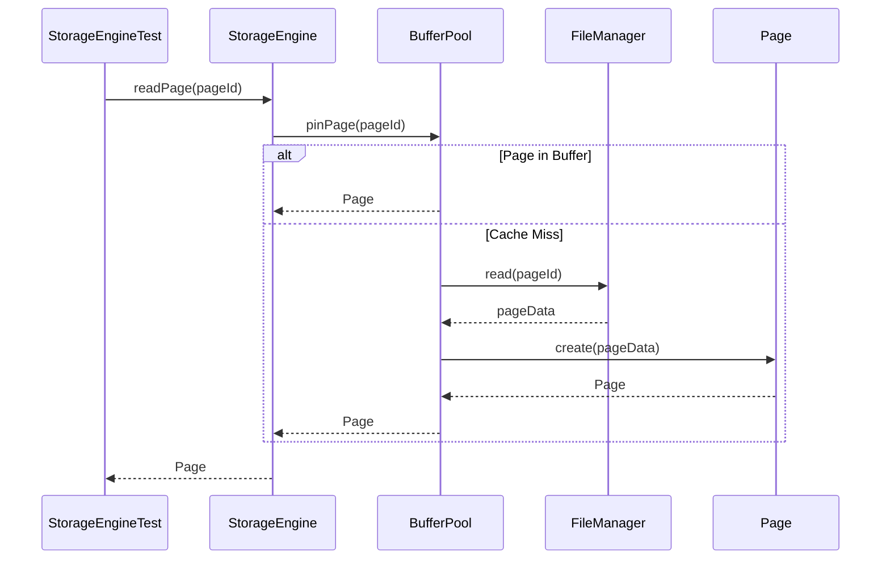
```mermaid
sequenceDiagram
    participant Test as StorageEngineTest
    participant Engine as StorageEngine
    participant Buffer as BufferPool
    participant File as FileManager
    participant Page

    Test->>Engine: readPage(pageId)
    Engine->>Buffer: pinPage(pageId)

    alt Page in Buffer
        Buffer-->>Engine: Page
    else Cache Miss
        Buffer->>File: read(pageId)
        File-->>Buffer: pageData
        Buffer->>Page: create(pageData)
        Page-->>Buffer: Page
        Buffer-->>Engine: Page
    end

    Engine-->>Test: Page
``` 
### 2. shouldWritePage()
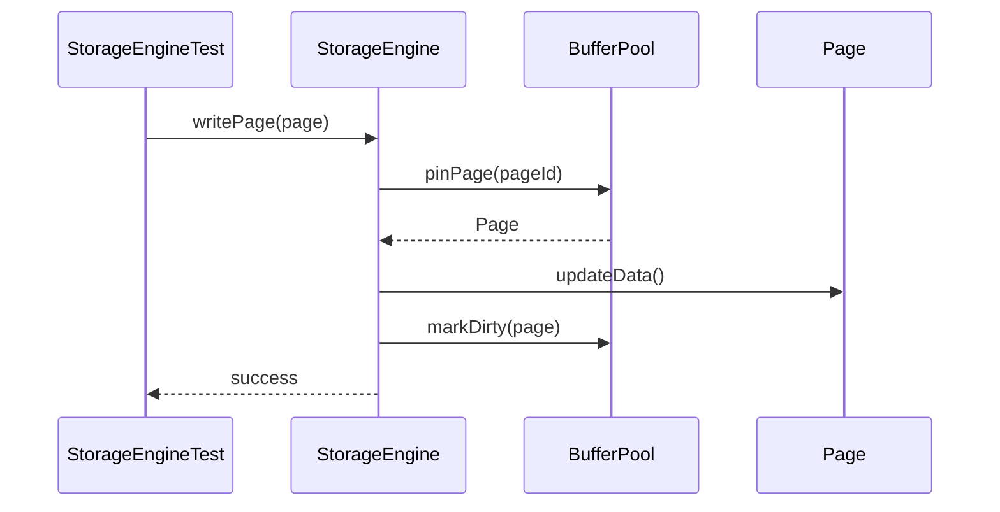
```mermaid
sequenceDiagram
    participant Test as StorageEngineTest
    participant Engine as StorageEngine
    participant Buffer as BufferPool
    participant Page

    Test->>Engine: writePage(page)

    Engine->>Buffer: pinPage(pageId)
    Buffer-->>Engine: Page

    Engine->>Page: updateData()

    Engine->>Buffer: markDirty(page)

    Engine-->>Test: success
``` 
### 3. shouldAllocatePage()
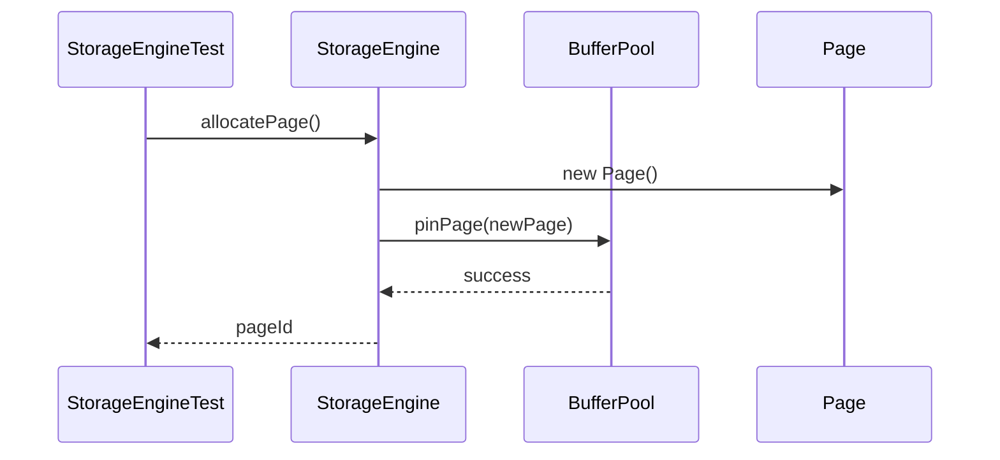
```mermaid
sequenceDiagram
    participant Test as StorageEngineTest
    participant Engine as StorageEngine
    participant Buffer as BufferPool
    participant Page

    Test->>Engine: allocatePage()

    Engine->>Page: new Page()

    Engine->>Buffer: pinPage(newPage)

    Buffer-->>Engine: success

    Engine-->>Test: pageId 
```

### 4. shouldCreateCheckpoint()
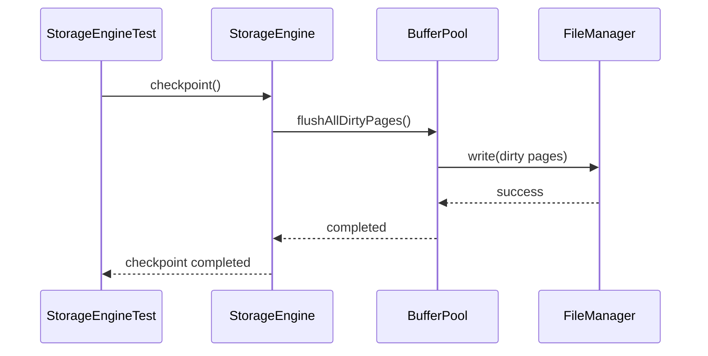
```mermaid
sequenceDiagram
    participant Test as StorageEngineTest
    participant Engine as StorageEngine
    participant Buffer as BufferPool
    participant File as FileManager

    Test->>Engine: checkpoint()

    Engine->>Buffer: flushAllDirtyPages()

    Buffer->>File: write(dirty pages)

    File-->>Buffer: success

    Buffer-->>Engine: completed

    Engine-->>Test: checkpoint completed 
```
## Buffer Pool 

### 5. shouldPinPage()
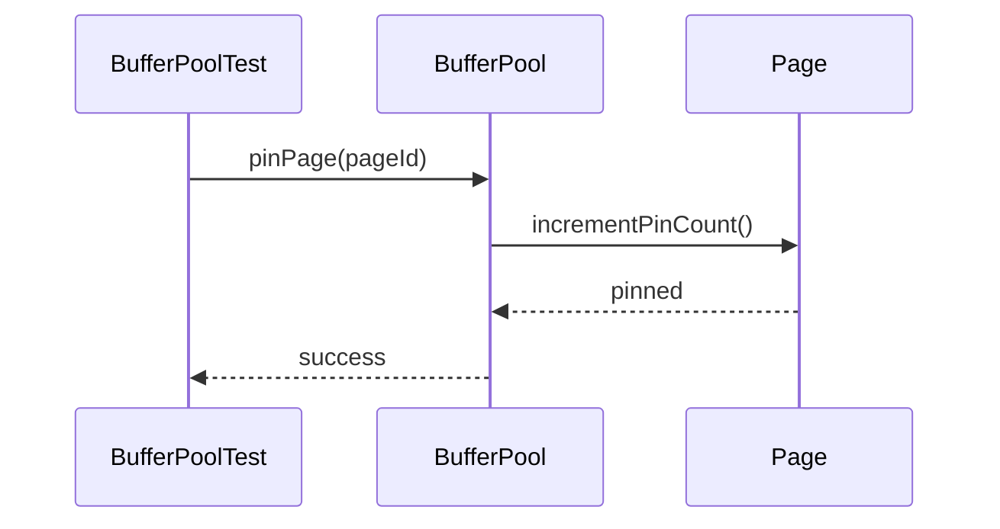
```mermaid
sequenceDiagram
    participant Test as BufferPoolTest
    participant Buffer as BufferPool
    participant Page

    Test->>Buffer: pinPage(pageId)

    Buffer->>Page: incrementPinCount()

    Page-->>Buffer: pinned

    Buffer-->>Test: success 
```

### 6. shouldUnpinPage()
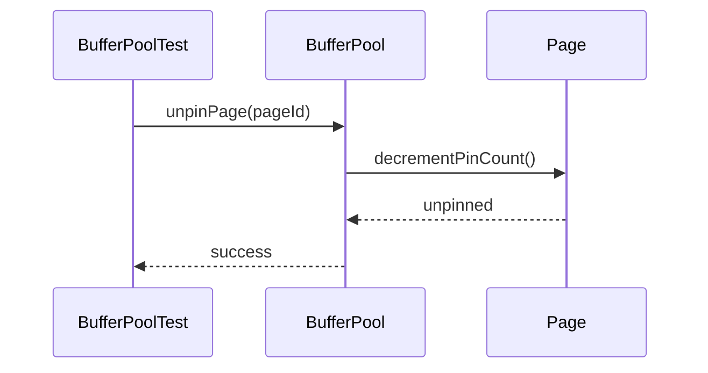
```mermaid
sequenceDiagram
    participant Test as BufferPoolTest
    participant Buffer as BufferPool
    participant Page

    Test->>Buffer: unpinPage(pageId)

    Buffer->>Page: decrementPinCount()

    Page-->>Buffer: unpinned

    Buffer-->>Test: success
```

### 7. shouldFlushDirtyPage()
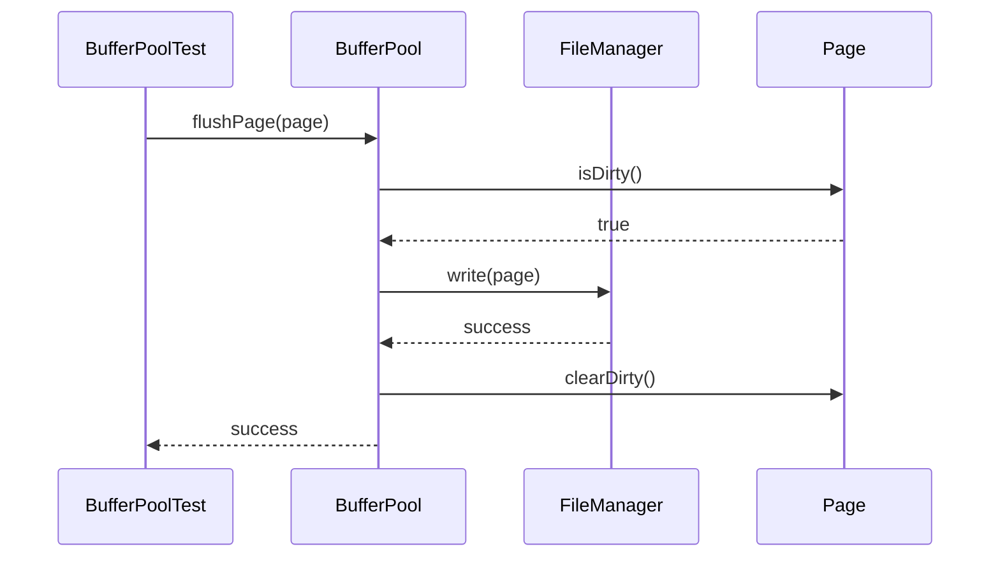
```mermaid
sequenceDiagram
    participant Test as BufferPoolTest
    participant Buffer as BufferPool
    participant File as FileManager
    participant Page

    Test->>Buffer: flushPage(page)

    Buffer->>Page: isDirty()

    Page-->>Buffer: true

    Buffer->>File: write(page)

    File-->>Buffer: success

    Buffer->>Page: clearDirty()

    Buffer-->>Test: success
```

### 8. shouldEvictPage()
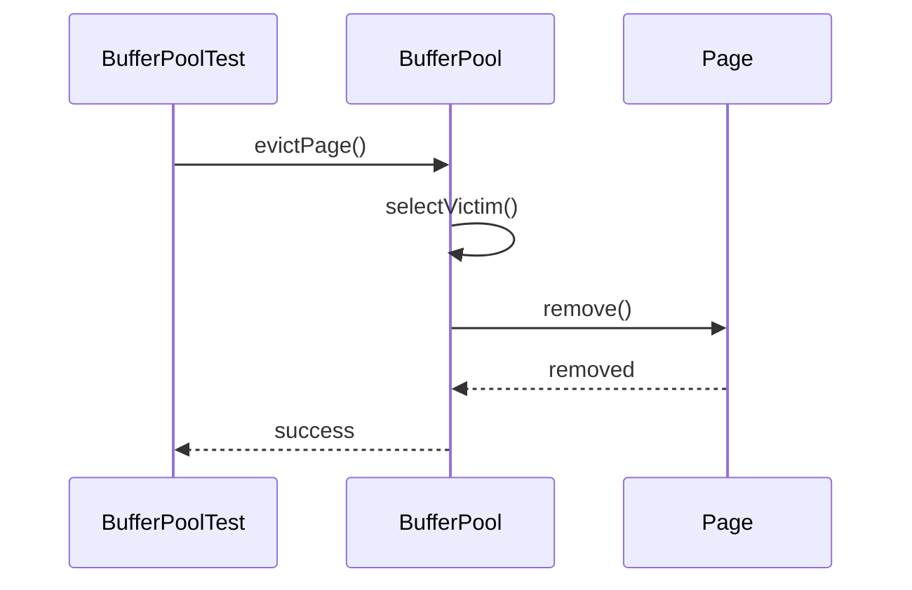
```mermaid
sequenceDiagram
    participant Test as BufferPoolTest
    participant Buffer as BufferPool
    participant Page

    Test->>Buffer: evictPage()

    Buffer->>Buffer: selectVictim()

    Buffer->>Page: remove()

    Page-->>Buffer: removed

    Buffer-->>Test: success
```

## Page Test 

### 9. shouldCreatePage()
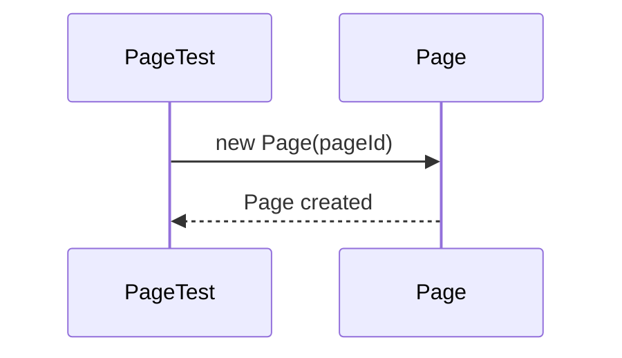
```mermaid
sequenceDiagram
    participant Test as PageTest
    participant Page

    Test->>Page: new Page(pageId)

    Page-->>Test: Page created
```

### 10. shouldReadPageData()
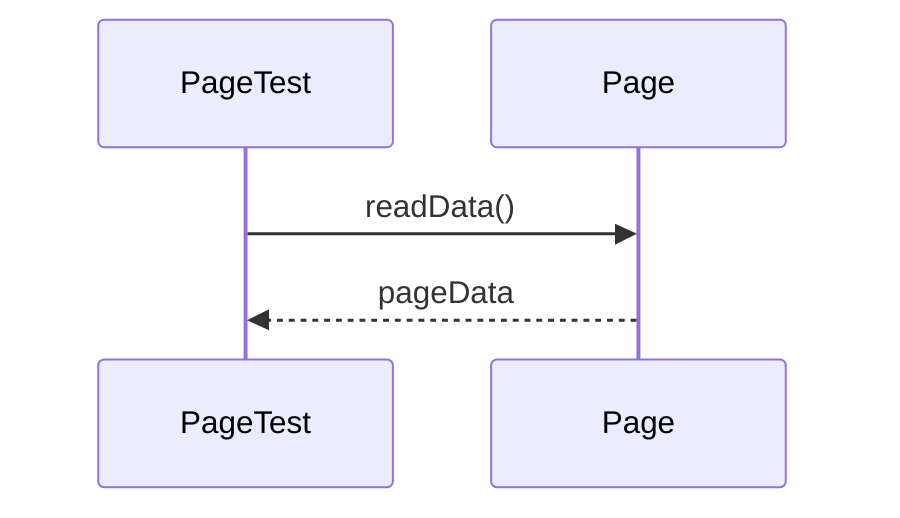
```mermaid
sequenceDiagram
    participant Test as PageTest
    participant Page

    Test->>Page: readData()

    Page-->>Test: pageData
```

### 11. shouldWritePageData()
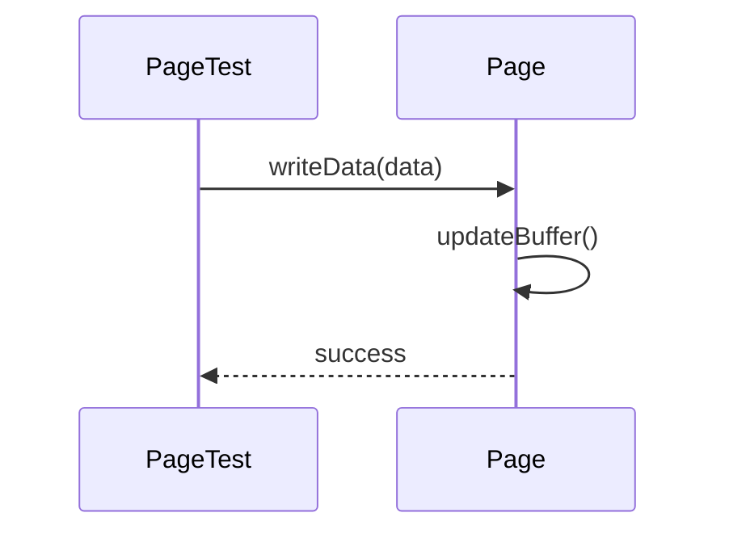
```mermaid
sequenceDiagram
    participant Test as PageTest
    participant Page

    Test->>Page: writeData(data)

    Page->>Page: updateBuffer()

    Page-->>Test: success
```

### 12. shouldMarkPageDirty()
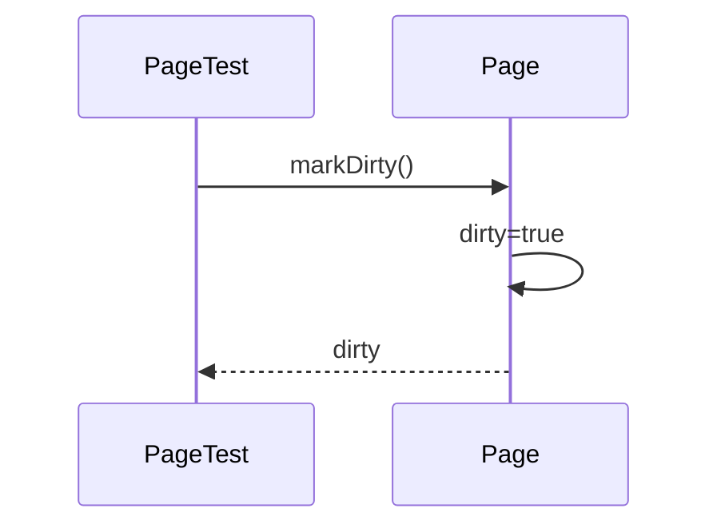
```mermaid
sequenceDiagram
    participant Test as PageTest
    participant Page

    Test->>Page: markDirty()

    Page->>Page: dirty=true

    Page-->>Test: dirty
```

## File Managemer

### 13. shouldCreateDataFile()

```mermaid
sequenceDiagram
    participant Test as FileManagerTest
    participant File as FileManager

    Test->>File: createDataFile()

    File->>File: allocateFile()

    File-->>Test: success
```

### 14. shouldReadDataFile()
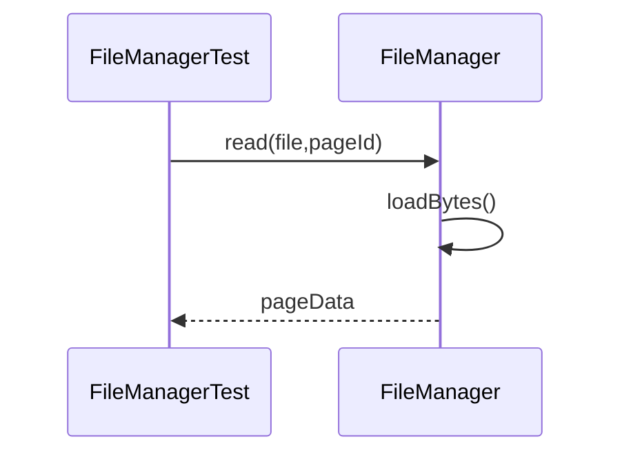
```mermaid
sequenceDiagram
    participant Test as FileManagerTest
    participant File as FileManager

    Test->>File: read(file,pageId)

    File->>File: loadBytes()

    File-->>Test: pageData
```

### 15. shouldWriteDataFile()
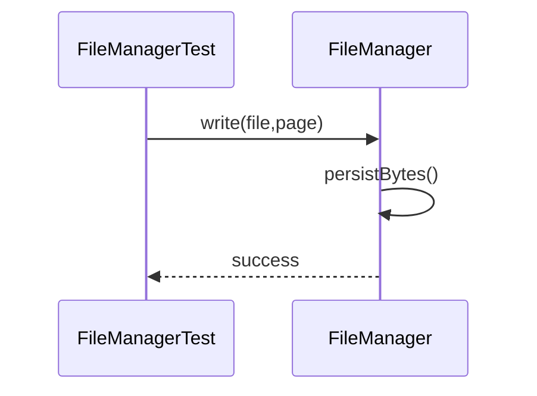
```mermaid
sequenceDiagram
    participant Test as FileManagerTest
    participant File as FileManager

    Test->>File: write(file,page)

    File->>File: persistBytes()

    File-->>Test: success
```

### 16. shouldDeleteDataFile()
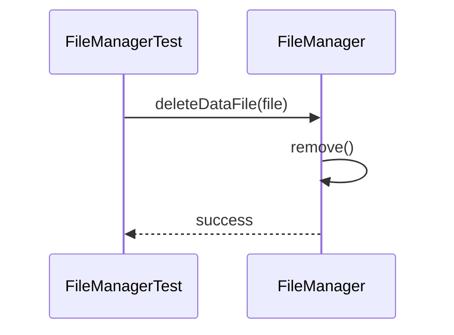
```mermaid
sequenceDiagram
    participant Test as FileManagerTest
    participant File as FileManager

    Test->>File: deleteDataFile(file)

    File->>File: remove()

    File-->>Test: success
```
# Storage Engine Integration Test 

### 1. shouldAllocateAndWritePage()
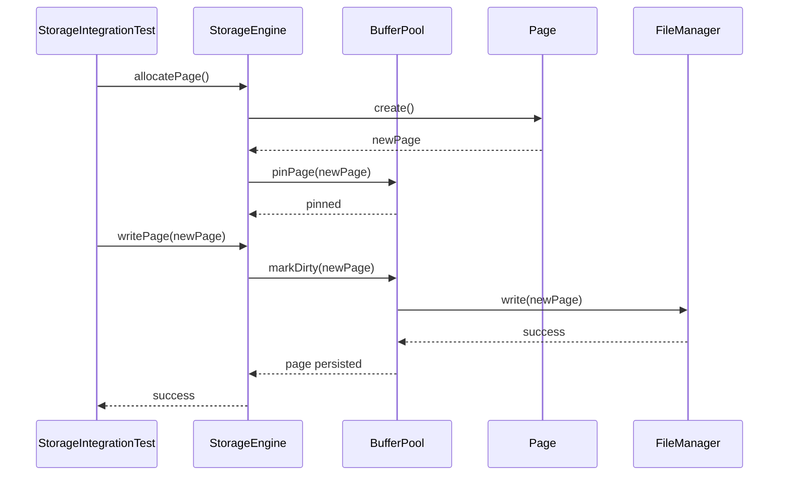
```mermaid
sequenceDiagram
    participant Test as StorageIntegrationTest
    participant Engine as StorageEngine
    participant Buffer as BufferPool
    participant Page
    participant File as FileManager

    Test->>Engine: allocatePage()

    Engine->>Page: create()
    Page-->>Engine: newPage

    Engine->>Buffer: pinPage(newPage)
    Buffer-->>Engine: pinned

    Test->>Engine: writePage(newPage)

    Engine->>Buffer: markDirty(newPage)
    Buffer->>File: write(newPage)

    File-->>Buffer: success
    Buffer-->>Engine: page persisted

    Engine-->>Test: success
```

### 2. shouldReadPageFromDisk()
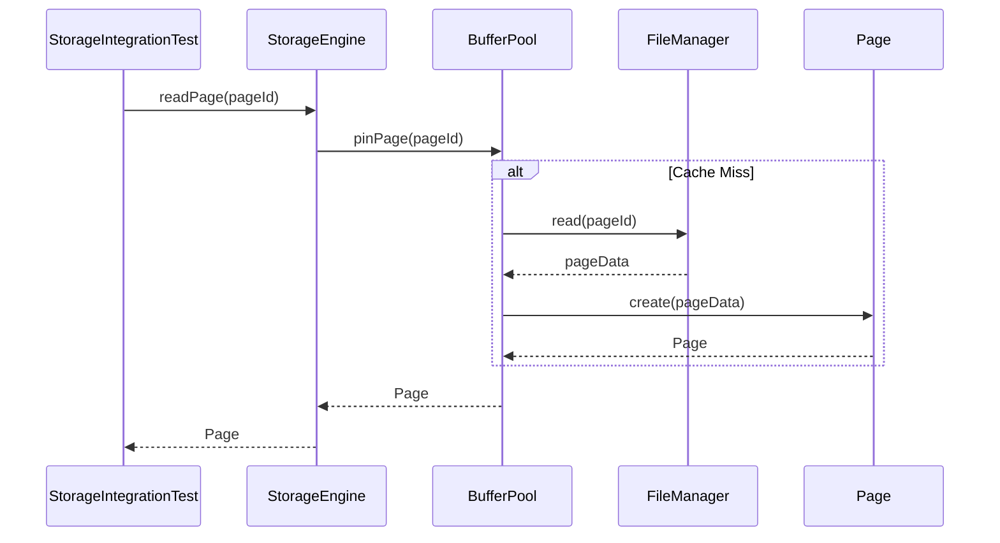
```mermaid
sequenceDiagram
    participant Test as StorageIntegrationTest
    participant Engine as StorageEngine
    participant Buffer as BufferPool
    participant File as FileManager
    participant Page

    Test->>Engine: readPage(pageId)

    Engine->>Buffer: pinPage(pageId)

    alt Cache Miss
        Buffer->>File: read(pageId)
        File-->>Buffer: pageData
        Buffer->>Page: create(pageData)
        Page-->>Buffer: Page
    end

    Buffer-->>Engine: Page

    Engine-->>Test: Page
```

#### 3. shouldLoadPageIntoBufferPool()
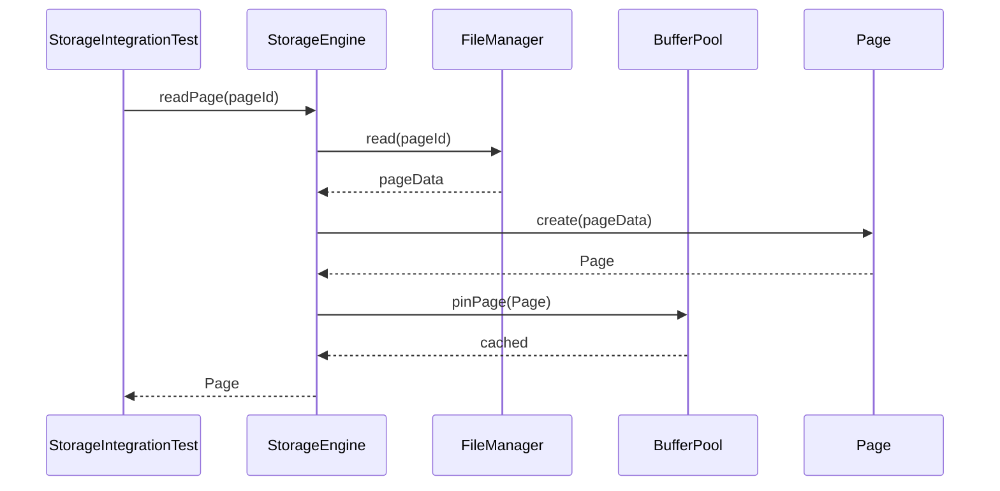
```mermaid
sequenceDiagram
    participant Test as StorageIntegrationTest
    participant Engine as StorageEngine
    participant File as FileManager
    participant Buffer as BufferPool
    participant Page

    Test->>Engine: readPage(pageId)

    Engine->>File: read(pageId)

    File-->>Engine: pageData

    Engine->>Page: create(pageData)

    Page-->>Engine: Page

    Engine->>Buffer: pinPage(Page)

    Buffer-->>Engine: cached

    Engine-->>Test: Page
```

### 4. shouldFlushDirtyPageToDisk()
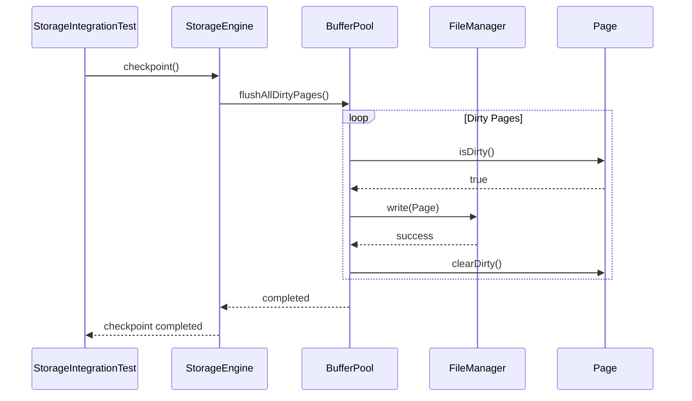
```mermaid
sequenceDiagram
    participant Test as StorageIntegrationTest
    participant Engine as StorageEngine
    participant Buffer as BufferPool
    participant File as FileManager
    participant Page

    Test->>Engine: checkpoint()

    Engine->>Buffer: flushAllDirtyPages()

    loop Dirty Pages
        Buffer->>Page: isDirty()
        Page-->>Buffer: true
        Buffer->>File: write(Page)
        File-->>Buffer: success
        Buffer->>Page: clearDirty()
    end

    Buffer-->>Engine: completed

    Engine-->>Test: checkpoint completed
```

### 5. shouldEvictPageUsingReplacementPolicy()
```mermaid
sequenceDiagram
    participant Test as StorageIntegrationTest
    participant Buffer as BufferPool
    participant Page
    participant File as FileManager

    Test->>Buffer: evictPage()

    Buffer->>Buffer: selectVictim()

    Buffer->>Page: isDirty()

    alt Dirty Page
        Page-->>Buffer: true
        Buffer->>File: write(Page)
        File-->>Buffer: success
    else Clean Page
        Page-->>Buffer: false
    end

    Buffer->>Page: remove()

    Page-->>Buffer: removed

    Buffer-->>Test: eviction completed
```
