# Transaction & Lock Unit Test

## TransactionManagerTest

### 1. shouldBeginTransaction()
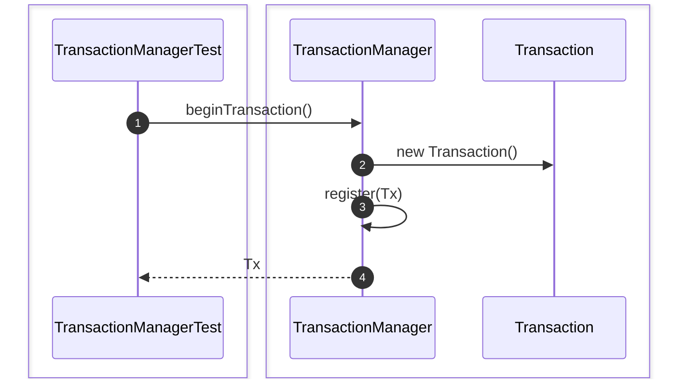
```mermaid
sequenceDiagram
    autonumber

    box #e1f5fe Test Suite
    participant Test as TransactionManagerTest
    end
    box #ffebee Transaction Components
    participant Manager as TransactionManager
    participant Tx as Transaction
    end

    Test->>Manager: beginTransaction()
    Manager->>Tx: new Transaction()
    Manager->>Manager: register(Tx)
    Manager-->>Test: Tx
```

### 2. shouldCommitTransaction()
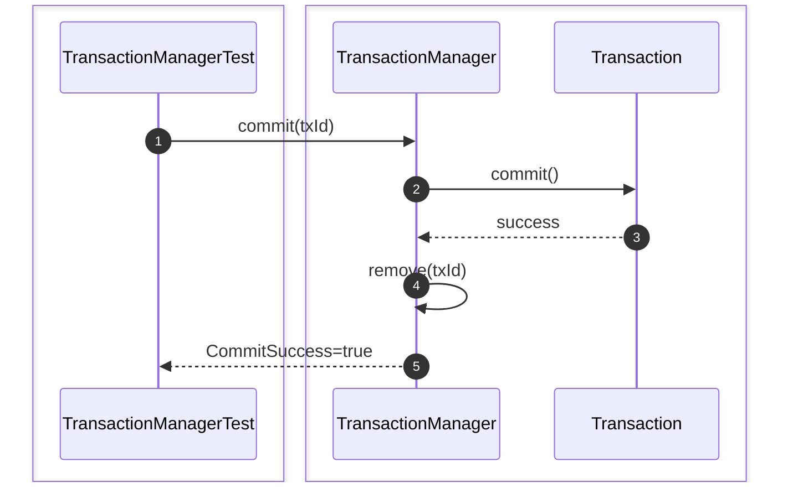
```mermaid
sequenceDiagram
    autonumber

    box #e1f5fe Test Suite
    participant Test as TransactionManagerTest
    end
    box #ffebee Transaction Components
    participant Manager as TransactionManager
    participant Tx as Transaction
    end

    Test->>Manager: commit(txId)
    Manager->>Tx: commit()
    Tx-->>Manager: success
    Manager->>Manager: remove(txId)
    Manager-->>Test: CommitSuccess=true
```

### 3. shouldRollbackTransaction()
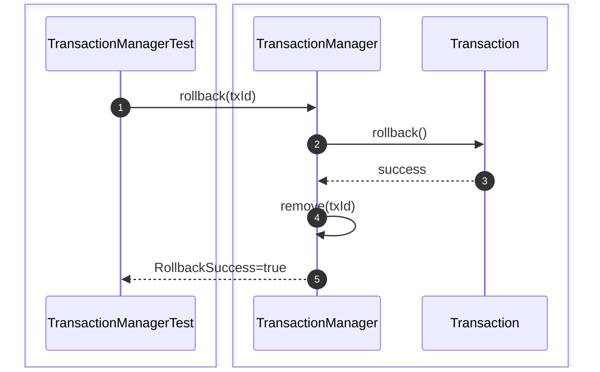
```mermaid
sequenceDiagram
    autonumber

    box #e1f5fe Test Suite
    participant Test as TransactionManagerTest
    end
    box #ffebee Transaction Components
    participant Manager as TransactionManager
    participant Tx as Transaction
    end

    Test->>Manager: rollback(txId)
    Manager->>Tx: rollback()
    Tx-->>Manager: success
    Manager->>Manager: remove(txId)
    Manager-->>Test: RollbackSuccess=true
```

### 4. shouldRecoverTransactions()
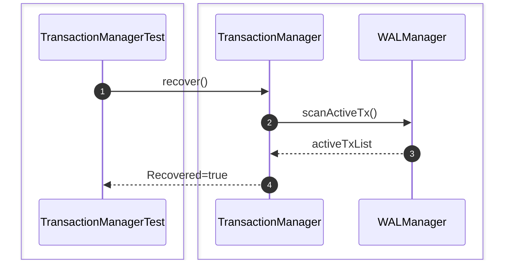
```mermaid
sequenceDiagram
    autonumber

    box #e1f5fe Test Suite
    participant Test as TransactionManagerTest
    end
    box #ffebee Transaction Components
    participant Manager as TransactionManager
    participant WAL as WALManager
    end

    Test->>Manager: recover()
    Manager->>WAL: scanActiveTx()
    WAL-->>Manager: activeTxList
    Manager-->>Test: Recovered=true
```

### 5. shouldSuspendTransaction()
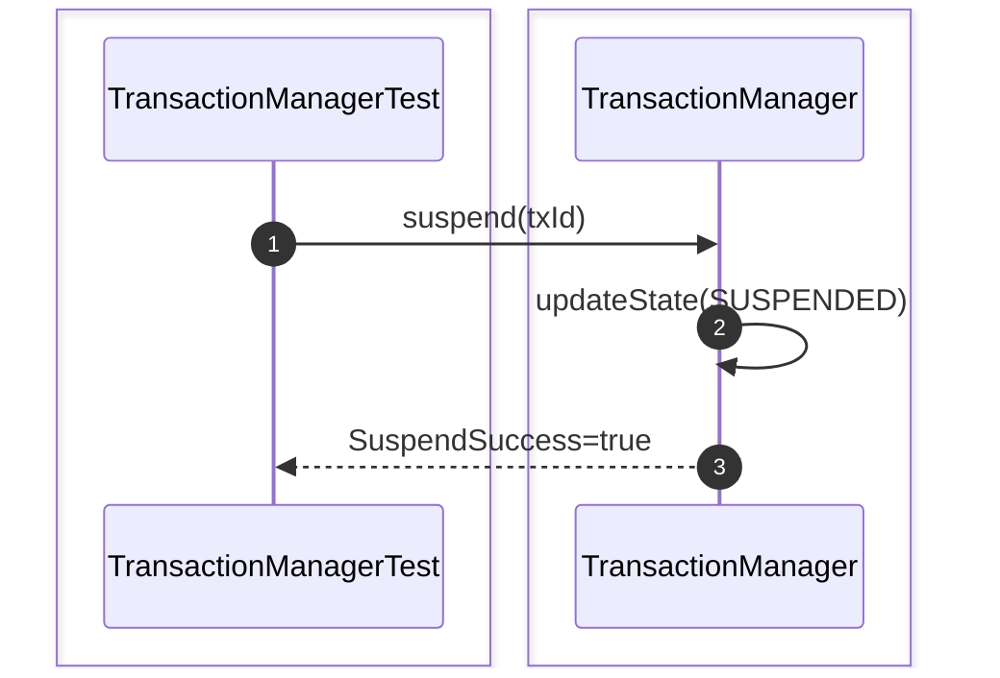
```mermaid
sequenceDiagram
    autonumber

    box #e1f5fe Test Suite
    participant Test as TransactionManagerTest
    end
    box #ffebee Transaction Components
    participant Manager as TransactionManager
    end

    Test->>Manager: suspend(txId)
    Manager->>Manager: updateState(SUSPENDED)
    Manager-->>Test: SuspendSuccess=true
```

### 6. shouldResumeTransaction()
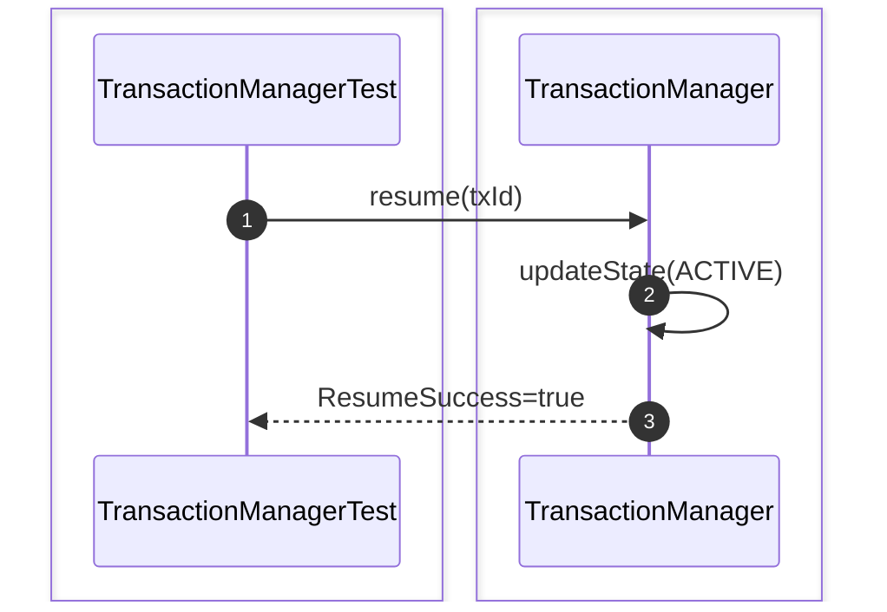
```mermaid
sequenceDiagram
    autonumber

    box #e1f5fe Test Suite
    participant Test as TransactionManagerTest
    end
    box #ffebee Transaction Components
    participant Manager as TransactionManager
    end

    Test->>Manager: resume(txId)
    Manager->>Manager: updateState(ACTIVE)
    Manager-->>Test: ResumeSuccess=true
```

### 7. shouldRegisterActiveTransaction()
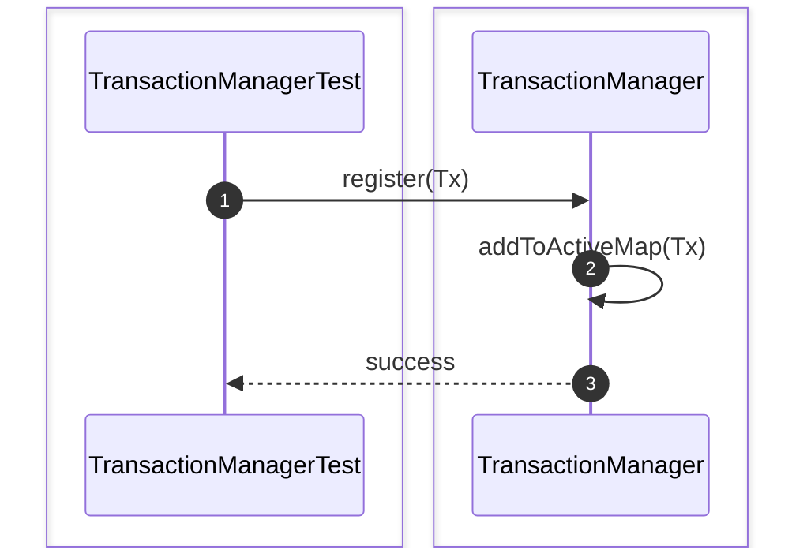
```mermaid
sequenceDiagram
    autonumber

    box #e1f5fe Test Suite
    participant Test as TransactionManagerTest
    end
    box #ffebee Transaction Components
    participant Manager as TransactionManager
    end

    Test->>Manager: register(Tx)
    Manager->>Manager: addToActiveMap(Tx)
    Manager-->>Test: success
```

### 8. shouldRemoveCommittedTransaction()
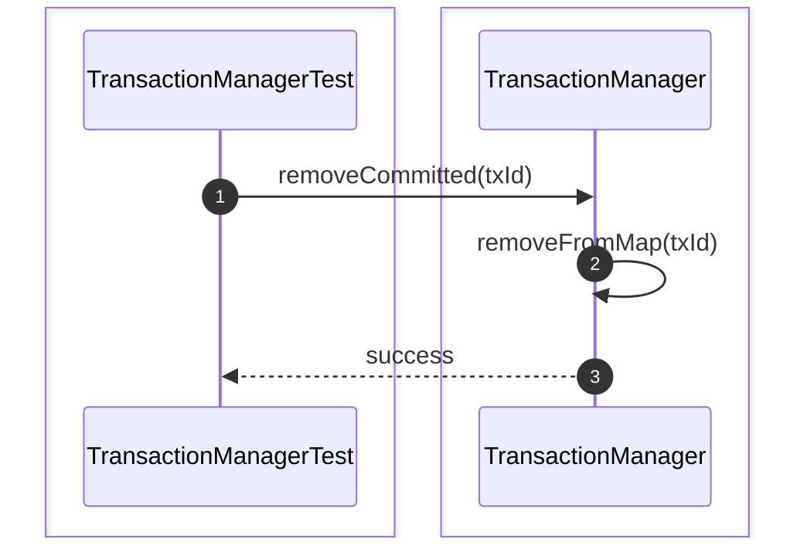
```mermaid
sequenceDiagram
    autonumber

    box #e1f5fe Test Suite
    participant Test as TransactionManagerTest
    end
    box #ffebee Transaction Components
    participant Manager as TransactionManager
    end

    Test->>Manager: removeCommitted(txId)
    Manager->>Manager: removeFromMap(txId)
    Manager-->>Test: success
```

### 9. shouldRemoveRolledBackTransaction()
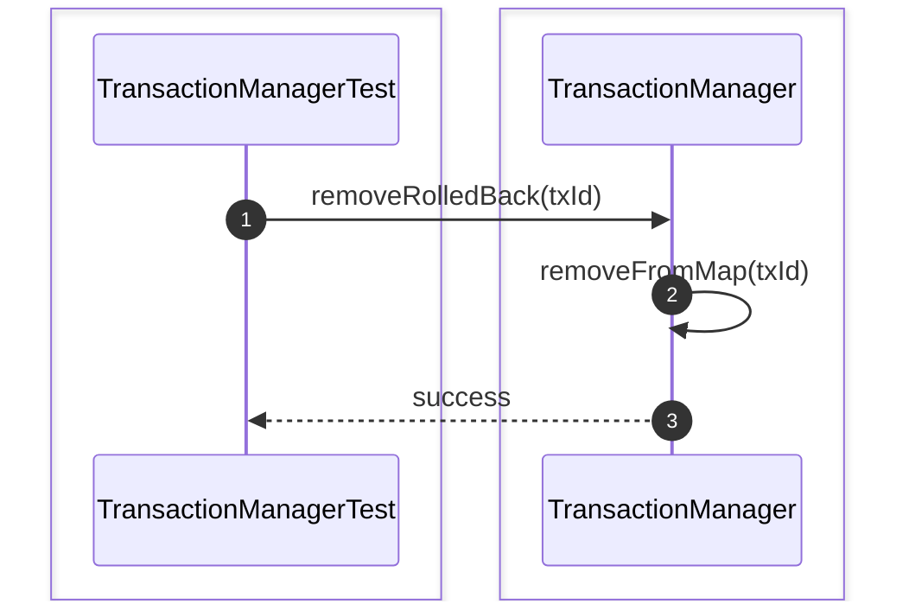
```mermaid
sequenceDiagram
    autonumber

    box #e1f5fe Test Suite
    participant Test as TransactionManagerTest
    end
    box #ffebee Transaction Components
    participant Manager as TransactionManager
    end

    Test->>Manager: removeRolledBack(txId)
    Manager->>Manager: removeFromMap(txId)
    Manager-->>Test: success
```

### 10. shouldAssignTransactionId()
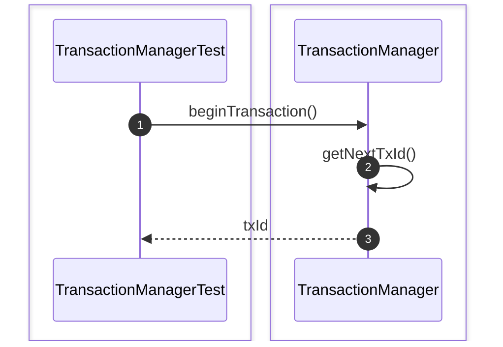
```mermaid
sequenceDiagram
    autonumber

    box #e1f5fe Test Suite
    participant Test as TransactionManagerTest
    end
    box #ffebee Transaction Components
    participant Manager as TransactionManager
    end

    Test->>Manager: beginTransaction()
    Manager->>Manager: getNextTxId()
    Manager-->>Test: txId
```

### 11. shouldTrackTransactionState()
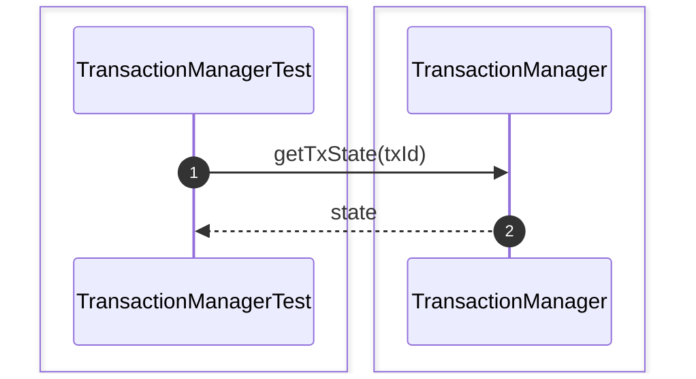
```mermaid
sequenceDiagram
    autonumber

    box #e1f5fe Test Suite
    participant Test as TransactionManagerTest
    end
    box #ffebee Transaction Components
    participant Manager as TransactionManager
    end

    Test->>Manager: getTxState(txId)
    Manager-->>Test: state
```

### 12. shouldRejectDuplicateTransaction()
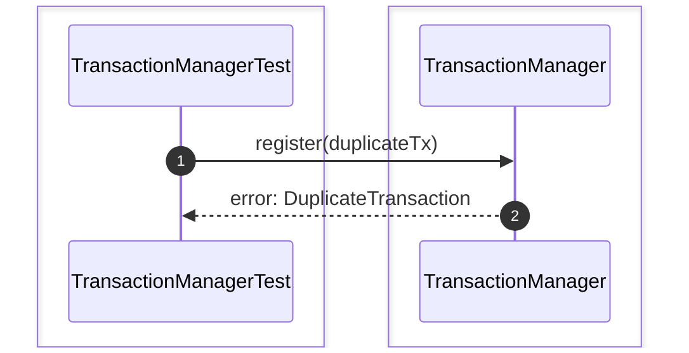
```mermaid
sequenceDiagram
    autonumber

    box #e1f5fe Test Suite
    participant Test as TransactionManagerTest
    end
    box #ffebee Transaction Components
    participant Manager as TransactionManager
    end

    Test->>Manager: register(duplicateTx)
    Manager-->>Test: error: DuplicateTransaction
```

## TransactionTest

### 1. shouldBegin()
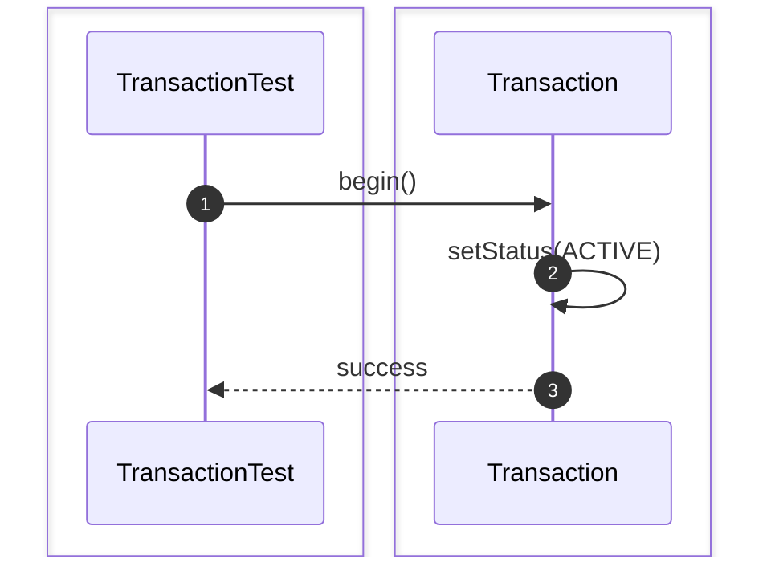
```mermaid
sequenceDiagram
    autonumber

    box #e1f5fe Test Suite
    participant Test as TransactionTest
    end
    box #ffebee Transaction Components
    participant Tx as Transaction
    end

    Test->>Tx: begin()
    Tx->>Tx: setStatus(ACTIVE)
    Tx-->>Test: success
```

### 2. shouldCommit()
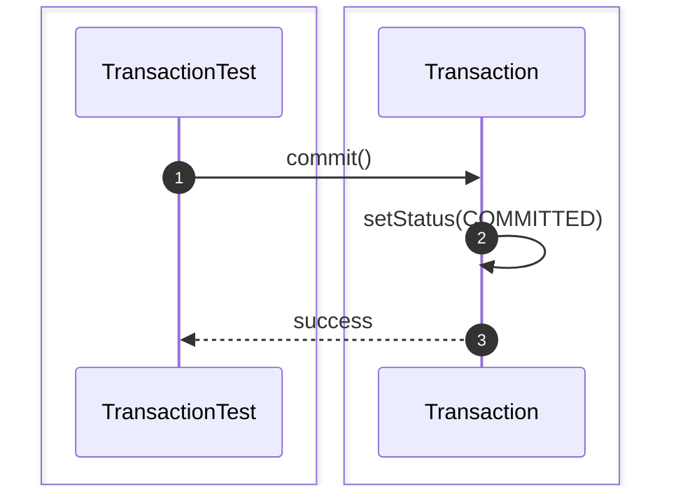
```mermaid
sequenceDiagram
    autonumber

    box #e1f5fe Test Suite
    participant Test as TransactionTest
    end
    box #ffebee Transaction Components
    participant Tx as Transaction
    end

    Test->>Tx: commit()
    Tx->>Tx: setStatus(COMMITTED)
    Tx-->>Test: success
```

### 3. shouldRollback()
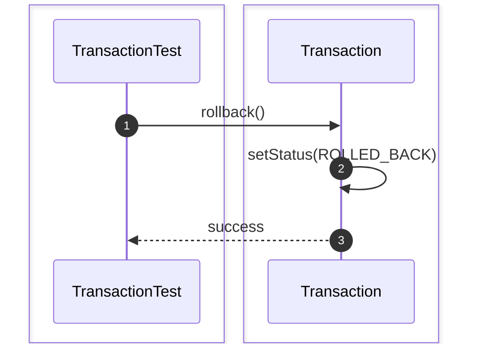
```mermaid
sequenceDiagram
    autonumber

    box #e1f5fe Test Suite
    participant Test as TransactionTest
    end
    box #ffebee Transaction Components
    participant Tx as Transaction
    end

    Test->>Tx: rollback()
    Tx->>Tx: setStatus(ROLLED_BACK)
    Tx-->>Test: success
```

### 4. shouldCreateSavepoint()
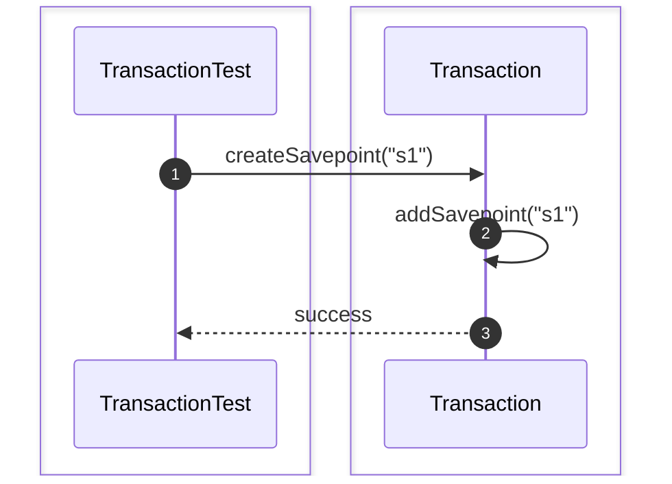
```mermaid
sequenceDiagram
    autonumber

    box #e1f5fe Test Suite
    participant Test as TransactionTest
    end
    box #ffebee Transaction Components
    participant Tx as Transaction
    end

    Test->>Tx: createSavepoint("s1")
    Tx->>Tx: addSavepoint("s1")
    Tx-->>Test: success
```

### 5. shouldRollbackToSavepoint()
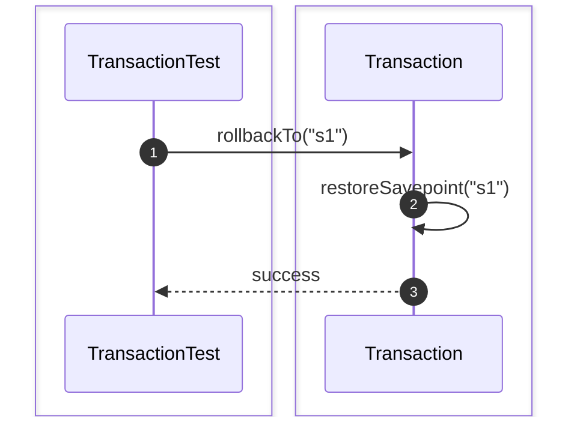
```mermaid
sequenceDiagram
    autonumber

    box #e1f5fe Test Suite
    participant Test as TransactionTest
    end
    box #ffebee Transaction Components
    participant Tx as Transaction
    end

    Test->>Tx: rollbackTo("s1")
    Tx->>Tx: restoreSavepoint("s1")
    Tx-->>Test: success
```

### 6. shouldReleaseSavepoint()
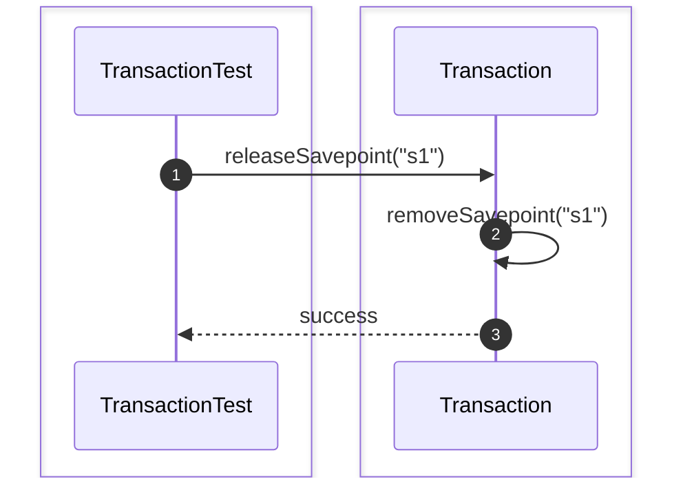
```mermaid
sequenceDiagram
    autonumber

    box #e1f5fe Test Suite
    participant Test as TransactionTest
    end
    box #ffebee Transaction Components
    participant Tx as Transaction
    end

    Test->>Tx: releaseSavepoint("s1")
    Tx->>Tx: removeSavepoint("s1")
    Tx-->>Test: success
```

### 7. shouldHandleStateTransition()
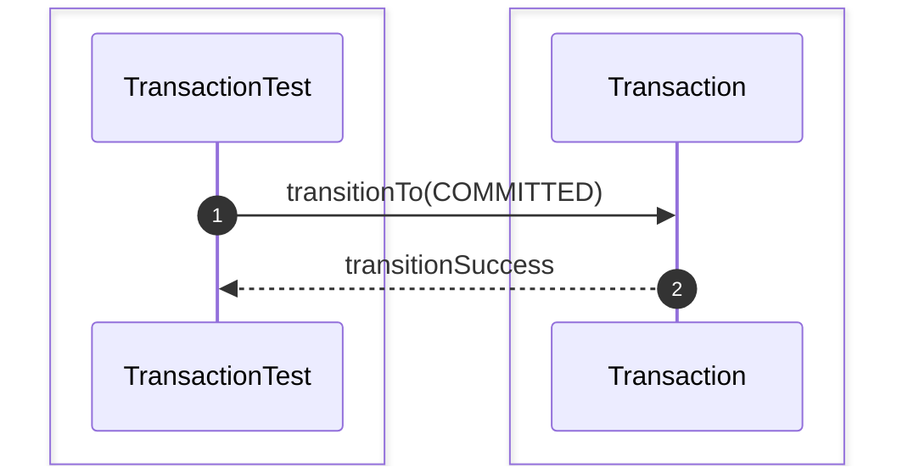
```mermaid
sequenceDiagram
    autonumber

    box #e1f5fe Test Suite
    participant Test as TransactionTest
    end
    box #ffebee Transaction Components
    participant Tx as Transaction
    end

    Test->>Tx: transitionTo(COMMITTED)
    Tx-->>Test: transitionSuccess
```

### 8. shouldEnforceIsolationLevel()
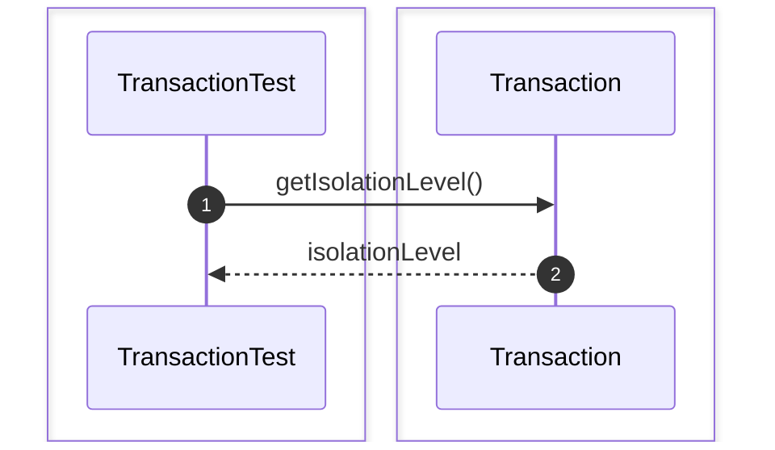
```mermaid
sequenceDiagram
    autonumber

    box #e1f5fe Test Suite
    participant Test as TransactionTest
    end
    box #ffebee Transaction Components
    participant Tx as Transaction
    end

    Test->>Tx: getIsolationLevel()
    Tx-->>Test: isolationLevel
```

### 9. shouldRecordStartTime()
```mermaid
sequenceDiagram
    autonumber

    box #e1f5fe Test Suite
    participant Test as TransactionTest
    end
    box #ffebee Transaction Components
    participant Tx as Transaction
    end

    Test->>Tx: getStartTime()
    Tx-->>Test: startTime
```

### 10. shouldRecordCommitTime()
```mermaid
sequenceDiagram
    autonumber

    box #e1f5fe Test Suite
    participant Test as TransactionTest
    end
    box #ffebee Transaction Components
    participant Tx as Transaction
    end

    Test->>Tx: commit()
    Tx->>Tx: recordCommitTime()
    Tx-->>Test: commitTime
```

### 11. shouldRejectCommitAfterRollback()
```mermaid
sequenceDiagram
    autonumber

    box #e1f5fe Test Suite
    participant Test as TransactionTest
    end
    box #ffebee Transaction Components
    participant Tx as Transaction
    end

    Test->>Tx: commit()
    Tx-->>Test: error: InvalidStateTransition
```

### 12. shouldRejectRollbackAfterCommit()
```mermaid
sequenceDiagram
    autonumber

    box #e1f5fe Test Suite
    participant Test as TransactionTest
    end
    box #ffebee Transaction Components
    participant Tx as Transaction
    end

    Test->>Tx: rollback()
    Tx-->>Test: error: InvalidStateTransition
```

## LockManagerTest

### 1. shouldAcquireSharedLock()
```mermaid
sequenceDiagram
    autonumber

    box #e1f5fe Test Suite
    participant Test as LockManagerTest
    end
    box #ffebee Transaction Components
    participant LockMgr as LockManager
    end

    Test->>LockMgr: acquireShared(txId, resourceId)
    LockMgr->>LockMgr: checkCompatibility()
    LockMgr-->>Test: LockAcquired=true
```

### 2. shouldAcquireExclusiveLock()
```mermaid
sequenceDiagram
    autonumber

    box #e1f5fe Test Suite
    participant Test as LockManagerTest
    end
    box #ffebee Transaction Components
    participant LockMgr as LockManager
    end

    Test->>LockMgr: acquireExclusive(txId, resourceId)
    LockMgr->>LockMgr: checkCompatibility()
    LockMgr-->>Test: LockAcquired=true
```

### 3. shouldReleaseLock()
```mermaid
sequenceDiagram
    autonumber

    box #e1f5fe Test Suite
    participant Test as LockManagerTest
    end
    box #ffebee Transaction Components
    participant LockMgr as LockManager
    end

    Test->>LockMgr: release(txId, resourceId)
    LockMgr->>LockMgr: updateQueue()
    LockMgr-->>Test: LockReleased=true
```

### 4. shouldUpgradeLock()
```mermaid
sequenceDiagram
    autonumber

    box #e1f5fe Test Suite
    participant Test as LockManagerTest
    end
    box #ffebee Transaction Components
    participant LockMgr as LockManager
    end

    Test->>LockMgr: upgrade(txId, resourceId)
    LockMgr->>LockMgr: changeSharedToExclusive()
    LockMgr-->>Test: UpgradeSuccess=true
```

### 5. shouldDowngradeLock()
```mermaid
sequenceDiagram
    autonumber

    box #e1f5fe Test Suite
    participant Test as LockManagerTest
    end
    box #ffebee Transaction Components
    participant LockMgr as LockManager
    end

    Test->>LockMgr: downgrade(txId, resourceId)
    LockMgr->>LockMgr: changeExclusiveToShared()
    LockMgr-->>Test: DowngradeSuccess=true
```

### 6. shouldCheckCompatibility()
```mermaid
sequenceDiagram
    autonumber

    box #e1f5fe Test Suite
    participant Test as LockManagerTest
    end
    box #ffebee Transaction Components
    participant LockMgr as LockManager
    end

    Test->>LockMgr: checkCompat(SHARED, EXCLUSIVE)
    LockMgr-->>Test: compatible=false
```

### 7. shouldRejectConflictingLock()
```mermaid
sequenceDiagram
    autonumber

    box #e1f5fe Test Suite
    participant Test as LockManagerTest
    end
    box #ffebee Transaction Components
    participant LockMgr as LockManager
    end

    Test->>LockMgr: acquireExclusive(txId2, res)
    LockMgr-->>Test: LockBlocked
```

### 8. shouldQueueWaitingTransaction()
```mermaid
sequenceDiagram
    autonumber

    box #e1f5fe Test Suite
    participant Test as LockManagerTest
    end
    box #ffebee Transaction Components
    participant LockMgr as LockManager
    end

    Test->>LockMgr: acquireExclusive(txId2, res)
    LockMgr->>LockMgr: addToWaitQueue()
    LockMgr-->>Test: queued=true
```

### 9. shouldWakeWaitingTransaction()
```mermaid
sequenceDiagram
    autonumber

    box #e1f5fe Test Suite
    participant Test as LockManagerTest
    end
    box #ffebee Transaction Components
    participant LockMgr as LockManager
    end

    Test->>LockMgr: release(tx1, res)
    LockMgr->>LockMgr: wakeNextInQueue()
    LockMgr-->>Test: tx2Acquired
```

### 10. shouldDetectDeadlock()
```mermaid
sequenceDiagram
    autonumber

    box #e1f5fe Test Suite
    participant Test as LockManagerTest
    end
    box #ffebee Transaction Components
    participant LockMgr as LockManager
    end

    Test->>LockMgr: detectDeadlock()
    LockMgr->>LockMgr: buildWaitGraph()
    LockMgr-->>Test: cycleDetected=true
```

### 11. shouldResolveDeadlock()
```mermaid
sequenceDiagram
    autonumber

    box #e1f5fe Test Suite
    participant Test as LockManagerTest
    end
    box #ffebee Transaction Components
    participant LockMgr as LockManager
    end

    Test->>LockMgr: resolveDeadlock()
    LockMgr->>LockMgr: abortTransaction()
    LockMgr-->>Test: resolved=true
```

### 12. shouldReleaseAllLocksOnCommit()
```mermaid
sequenceDiagram
    autonumber

    box #e1f5fe Test Suite
    participant Test as LockManagerTest
    end
    box #ffebee Transaction Components
    participant LockMgr as LockManager
    end

    Test->>LockMgr: releaseAll(txId)
    LockMgr->>LockMgr: clearLocksForTx()
    LockMgr-->>Test: success
```

## MVCCManagerTest

### 1. shouldCreateVersion()
```mermaid
sequenceDiagram
    autonumber

    box #e1f5fe Test Suite
    participant Test as MVCCManagerTest
    end
    box #ffebee Transaction Components
    participant MVCC as MVCCManager
    end

    Test->>MVCC: createVersion(rowId, data, txId)
    MVCC-->>Test: newVersion
```

### 2. shouldReadVisibleVersion()
```mermaid
sequenceDiagram
    autonumber

    box #e1f5fe Test Suite
    participant Test as MVCCManagerTest
    end
    box #ffebee Transaction Components
    participant MVCC as MVCCManager
    end

    Test->>MVCC: read(rowId, txId)
    MVCC->>MVCC: applyVisibilityRules()
    MVCC-->>Test: visibleVersion
```

### 3. shouldHideUncommittedVersion()
```mermaid
sequenceDiagram
    autonumber

    box #e1f5fe Test Suite
    participant Test as MVCCManagerTest
    end
    box #ffebee Transaction Components
    participant MVCC as MVCCManager
    end

    Test->>MVCC: read(rowId, activeTxId)
    MVCC->>MVCC: checkCommitted()
    MVCC-->>Test: olderVisibleVersion
```

### 4. shouldEnforceVisibilityRule()
```mermaid
sequenceDiagram
    autonumber

    box #e1f5fe Test Suite
    participant Test as MVCCManagerTest
    end
    box #ffebee Transaction Components
    participant MVCC as MVCCManager
    end

    Test->>MVCC: checkVisibility(version, txId)
    MVCC-->>Test: visible=true
```

### 5. shouldCreateSnapshot()
```mermaid
sequenceDiagram
    autonumber

    box #e1f5fe Test Suite
    participant Test as MVCCManagerTest
    end
    box #ffebee Transaction Components
    participant MVCC as MVCCManager
    end

    Test->>MVCC: createSnapshot(txId)
    MVCC-->>Test: snapshot
```

### 6. shouldReturnSnapshotVersion()
```mermaid
sequenceDiagram
    autonumber

    box #e1f5fe Test Suite
    participant Test as MVCCManagerTest
    end
    box #ffebee Transaction Components
    participant MVCC as MVCCManager
    end

    Test->>MVCC: readWithSnapshot(rowId, snapshot)
    MVCC-->>Test: version
```

### 7. shouldDeleteObsoleteVersion()
```mermaid
sequenceDiagram
    autonumber

    box #e1f5fe Test Suite
    participant Test as MVCCManagerTest
    end
    box #ffebee Transaction Components
    participant MVCC as MVCCManager
    end

    Test->>MVCC: deleteObsolete(rowId, activeTxList)
    MVCC-->>Test: deletedCount
```

### 8. shouldGarbageCollect()
```mermaid
sequenceDiagram
    autonumber

    box #e1f5fe Test Suite
    participant Test as MVCCManagerTest
    end
    box #ffebee Transaction Components
    participant MVCC as MVCCManager
    end

    Test->>MVCC: collectGarbage()
    MVCC->>MVCC: cleanExpiredVersions()
    MVCC-->>Test: GcSuccess=true
```

### 9. shouldRemoveExpiredVersion()
```mermaid
sequenceDiagram
    autonumber

    box #e1f5fe Test Suite
    participant Test as MVCCManagerTest
    end
    box #ffebee Transaction Components
    participant MVCC as MVCCManager
    end

    Test->>MVCC: removeExpired(version)
    MVCC-->>Test: success
```

### 10. shouldRejectInvisibleVersion()
```mermaid
sequenceDiagram
    autonumber

    box #e1f5fe Test Suite
    participant Test as MVCCManagerTest
    end
    box #ffebee Transaction Components
    participant MVCC as MVCCManager
    end

    Test->>MVCC: read(rowId, txId)
    MVCC-->>Test: null
```

# Transaction & Lock Integration Test

### 1. shouldCommitTransactionSuccessfully()
```mermaid
sequenceDiagram
    autonumber

    box #e1f5fe Test Suite
    participant Test as TransactionIntegrationTest
    end
    box #ffebee Transaction Components
    participant Manager as TransactionManager
    participant Tx as Transaction
    participant LockMgr as LockManager
    end

    Test->>Manager: commit(tx)
    Manager->>Tx: commit()
    Manager->>LockMgr: releaseAll()
    Manager-->>Test: CommitCompleted=true
```

### 2. shouldRollbackTransactionSuccessfully()
```mermaid
sequenceDiagram
    autonumber

    box #e1f5fe Test Suite
    participant Test as TransactionIntegrationTest
    end
    box #ffebee Transaction Components
    participant Manager as TransactionManager
    participant Tx as Transaction
    participant LockMgr as LockManager
    end

    Test->>Manager: rollback(tx)
    Manager->>Tx: rollback()
    Manager->>LockMgr: releaseAll()
    Manager-->>Test: RollbackCompleted=true
```

### 3. shouldRecoverAfterCrash()
```mermaid
sequenceDiagram
    autonumber

    box #e1f5fe Test Suite
    participant Test as TransactionIntegrationTest
    end
    box #ffebee Transaction Components
    participant Manager as TransactionManager
    participant WAL as WALManager
    end

    Test->>Manager: recover()
    Manager->>WAL: scan()
    WAL-->>Manager: logs
    Manager->>Manager: undoRedo()
    Manager-->>Test: RecoverySuccess=true
```

### 4. shouldCommitTransactionAndFlushWAL()
```mermaid
sequenceDiagram
    autonumber

    box #e1f5fe Test Suite
    participant Test as TransactionIntegrationTest
    end
    box #ffebee Transaction Components
    participant Manager as TransactionManager
    participant WAL as WALManager
    end

    Test->>Manager: commit(tx)
    Manager->>WAL: writeCommit()
    WAL->>WAL: flush()
    Manager-->>Test: Success
```

### 5. shouldRollbackTransactionAndReleaseLocks()
```mermaid
sequenceDiagram
    autonumber

    box #e1f5fe Test Suite
    participant Test as TransactionIntegrationTest
    end
    box #ffebee Transaction Components
    participant Manager as TransactionManager
    participant LockMgr as LockManager
    end

    Test->>Manager: rollback(tx)
    Manager->>LockMgr: releaseAll(tx)
    Manager-->>Test: Success
```

### 6. shouldRecoverDatabaseUsingWAL()
```mermaid
sequenceDiagram
    autonumber

    box #e1f5fe Test Suite
    participant Test as TransactionIntegrationTest
    end
    box #ffebee Transaction Components
    participant Manager as TransactionManager
    participant WAL as WALManager
    end

    Test->>Manager: recover()
    Manager->>WAL: scan()
    WAL-->>Manager: logs
    Manager-->>Test: recovered
```

### 7. shouldRecoverMultipleTransactions()
```mermaid
sequenceDiagram
    autonumber

    box #e1f5fe Test Suite
    participant Test as TransactionIntegrationTest
    end
    box #ffebee Transaction Components
    participant Manager as TransactionManager
    end

    Test->>Manager: recover()
    Manager->>Manager: recoverTxList()
    Manager-->>Test: recovered
```

### 8. shouldRecoverAfterPowerFailure()
```mermaid
sequenceDiagram
    autonumber

    box #e1f5fe Test Suite
    participant Test as TransactionIntegrationTest
    end
    box #ffebee Transaction Components
    participant Manager as TransactionManager
    end

    Test->>Manager: recover()
    Manager->>Manager: verifyDiskState()
    Manager-->>Test: recovered
```

