# Transaction Unit Test

## Transaction Manager

### 1. shouldBeginTransaction()
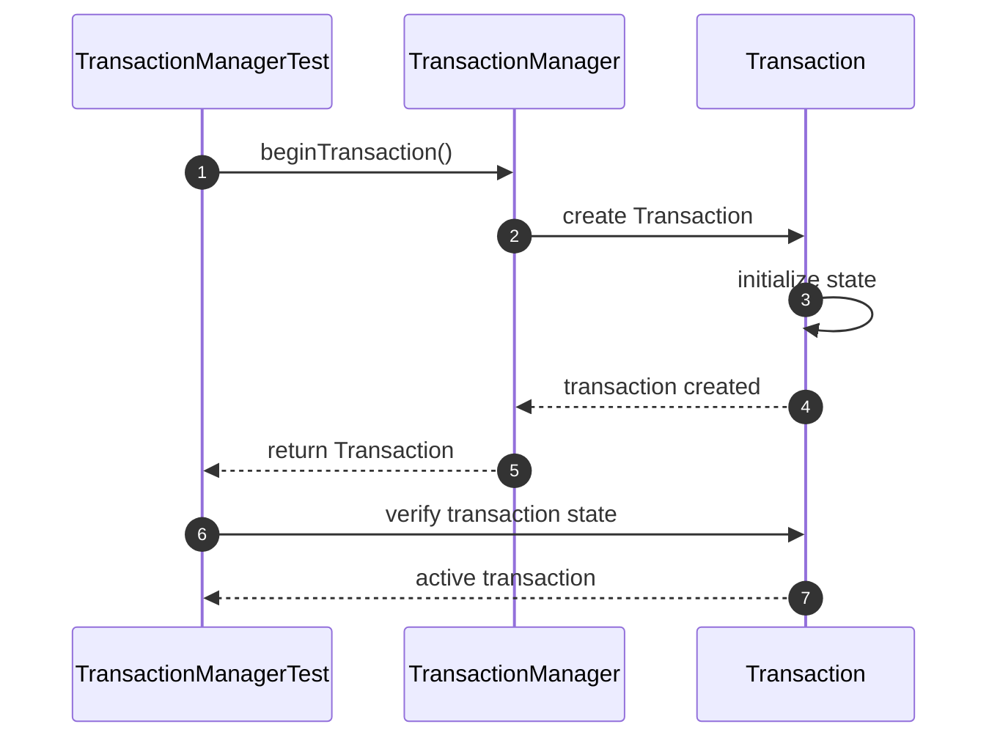
```mermaid
sequenceDiagram
    autonumber

    participant Test as TransactionManagerTest
    participant Manager as TransactionManager
    participant Tx as Transaction

    Test->>Manager: beginTransaction()

    Manager->>Tx: create Transaction

    Tx->>Tx: initialize state

    Tx-->>Manager: transaction created

    Manager-->>Test: return Transaction

    Test->>Tx: verify transaction state

    Tx-->>Test: active transaction
```

### 2. shouldCommitTransaction()
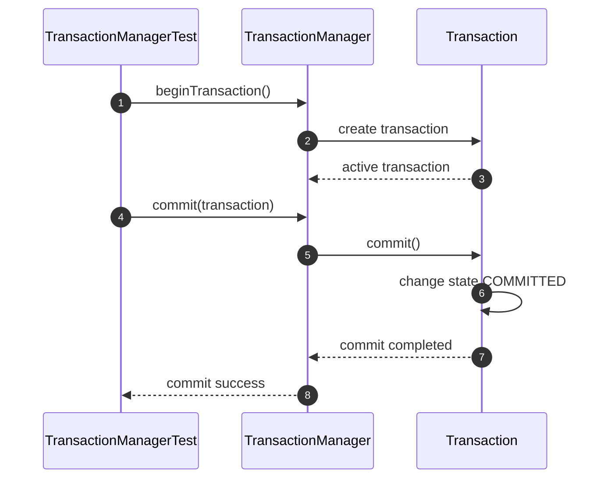
```mermaid
sequenceDiagram
    autonumber

    participant Test as TransactionManagerTest
    participant Manager as TransactionManager
    participant Tx as Transaction

    Test->>Manager: beginTransaction()

    Manager->>Tx: create transaction

    Tx-->>Manager: active transaction

    Test->>Manager: commit(transaction)

    Manager->>Tx: commit()

    Tx->>Tx: change state COMMITTED

    Tx-->>Manager: commit completed

    Manager-->>Test: commit success
```

### 3. shouldRollbackTransaction()
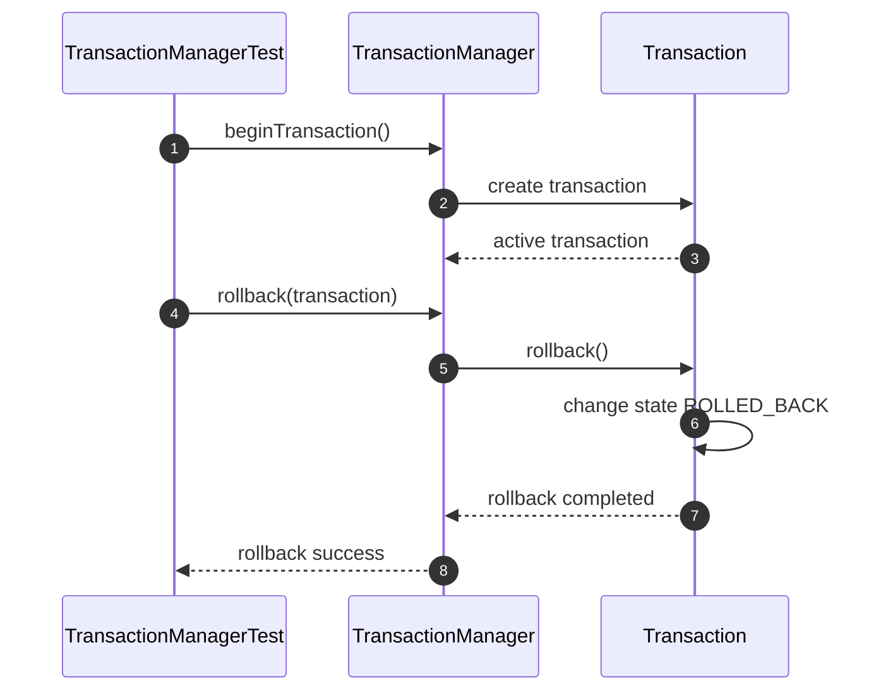
```mermaid
sequenceDiagram
    autonumber

    participant Test as TransactionManagerTest
    participant Manager as TransactionManager
    participant Tx as Transaction

    Test->>Manager: beginTransaction()

    Manager->>Tx: create transaction

    Tx-->>Manager: active transaction

    Test->>Manager: rollback(transaction)

    Manager->>Tx: rollback()

    Tx->>Tx: change state ROLLED_BACK

    Tx-->>Manager: rollback completed

    Manager-->>Test: rollback success
```

### 4. shouldRecoverTransactions()
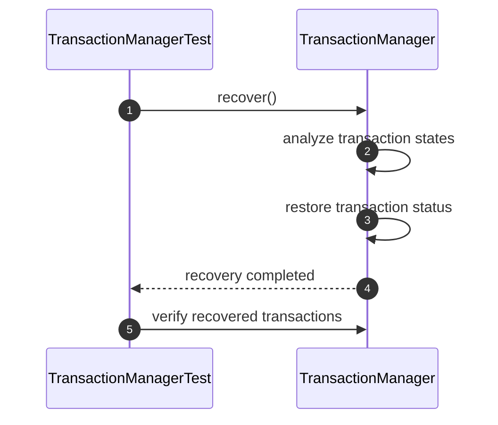
```mermaid
sequenceDiagram
    autonumber

    participant Test as TransactionManagerTest
    participant Manager as TransactionManager

    Test->>Manager: recover()

    Manager->>Manager: analyze transaction states

    Manager->>Manager: restore transaction status

    Manager-->>Test: recovery completed

    Test->>Manager: verify recovered transactions
```

### 5. shouldLockDataInTransaction()
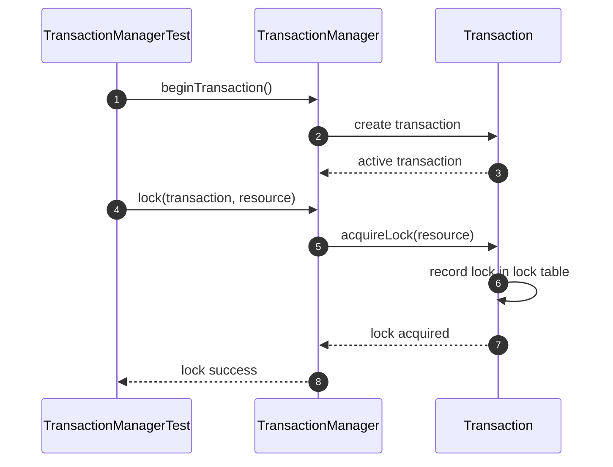
```mermaid
sequenceDiagram
    autonumber

    participant Test as TransactionManagerTest
    participant Manager as TransactionManager
    participant Tx as Transaction

    Test->>Manager: beginTransaction()

    Manager->>Tx: create transaction

    Tx-->>Manager: active transaction

    Test->>Manager: lock(transaction, resource)

    Manager->>Tx: acquireLock(resource)

    Tx->>Tx: record lock in lock table

    Tx-->>Manager: lock acquired

    Manager-->>Test: lock success
```

## Transaction 

### 6. shouldBegin()
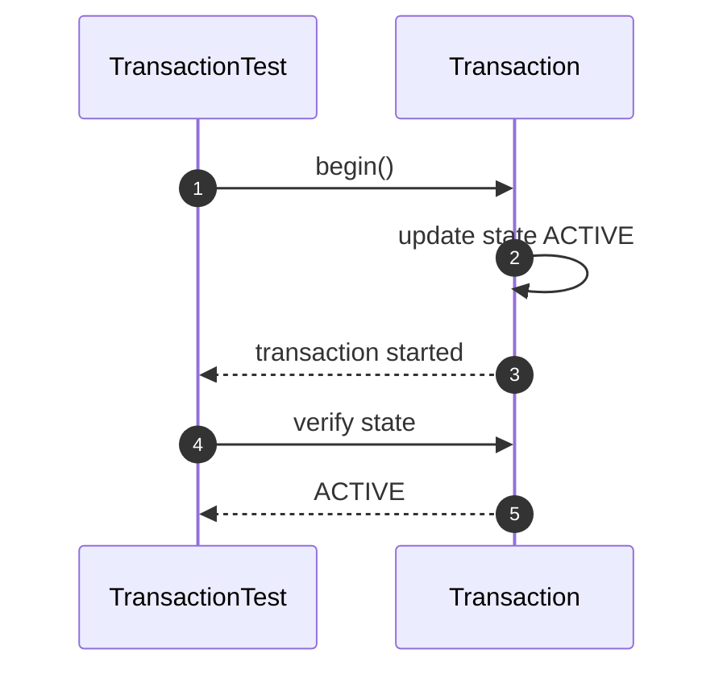
```mermaid
sequenceDiagram
    autonumber

    participant Test as TransactionTest
    participant Tx as Transaction

    Test->>Tx: begin()

    Tx->>Tx: update state ACTIVE

    Tx-->>Test: transaction started

    Test->>Tx: verify state

    Tx-->>Test: ACTIVE
```

### 7. shouldCommit()
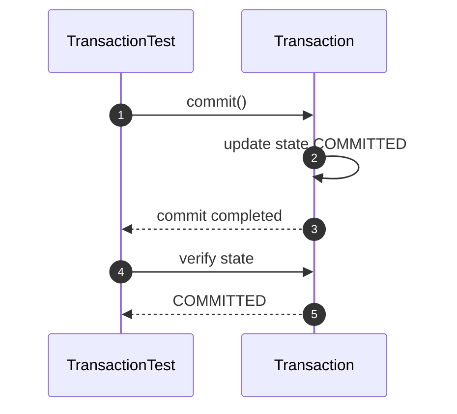
```mermaid
sequenceDiagram
    autonumber

    participant Test as TransactionTest
    participant Tx as Transaction

    Test->>Tx: commit()

    Tx->>Tx: update state COMMITTED

    Tx-->>Test: commit completed

    Test->>Tx: verify state

    Tx-->>Test: COMMITTED
```

### 8. shouldRollback()
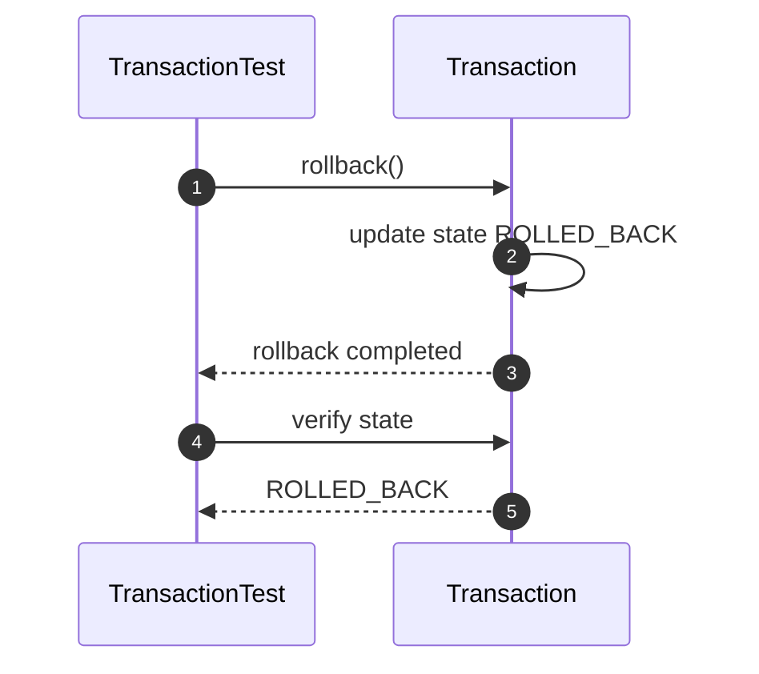
```mermaid 
sequenceDiagram
    autonumber

    participant Test as TransactionTest
    participant Tx as Transaction

    Test->>Tx: rollback()

    Tx->>Tx: update state ROLLED_BACK

    Tx-->>Test: rollback completed

    Test->>Tx: verify state

    Tx-->>Test: ROLLED_BACK
```

### 9. shouldCreateSavepoint()
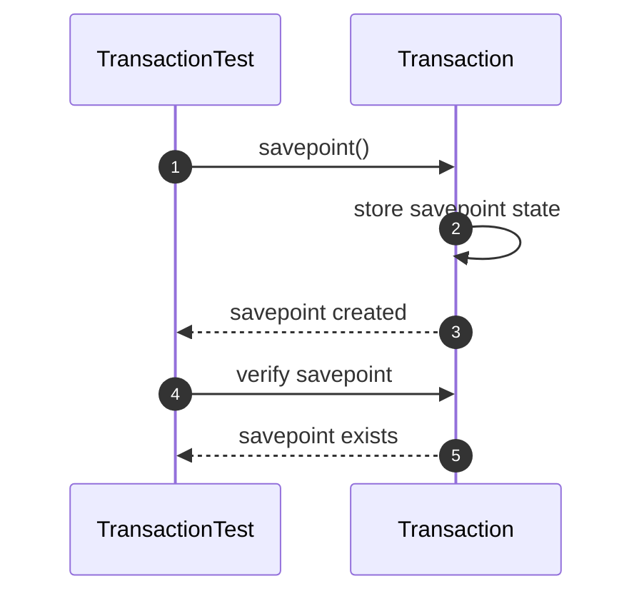
```mermaid
sequenceDiagram
    autonumber

    participant Test as TransactionTest
    participant Tx as Transaction

    Test->>Tx: savepoint()

    Tx->>Tx: store savepoint state

    Tx-->>Test: savepoint created

    Test->>Tx: verify savepoint

    Tx-->>Test: savepoint exists 
```

### 10. shouldHandleStateTransition()
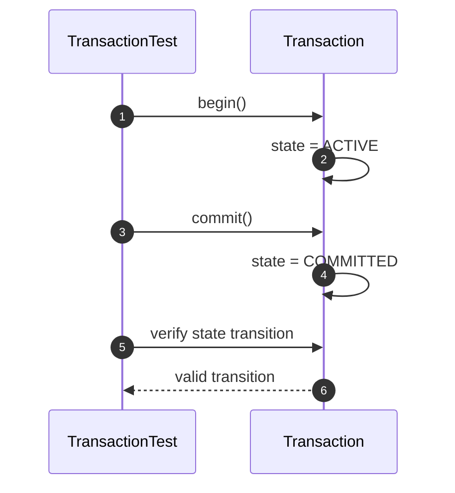
```mermaid
sequenceDiagram
    autonumber

    participant Test as TransactionTest
    participant Tx as Transaction

    Test->>Tx: begin()

    Tx->>Tx: state = ACTIVE

    Test->>Tx: commit()

    Tx->>Tx: state = COMMITTED

    Test->>Tx: verify state transition

    Tx-->>Test: valid transition
```

### 11. shouldEnforceIsolationLevel()
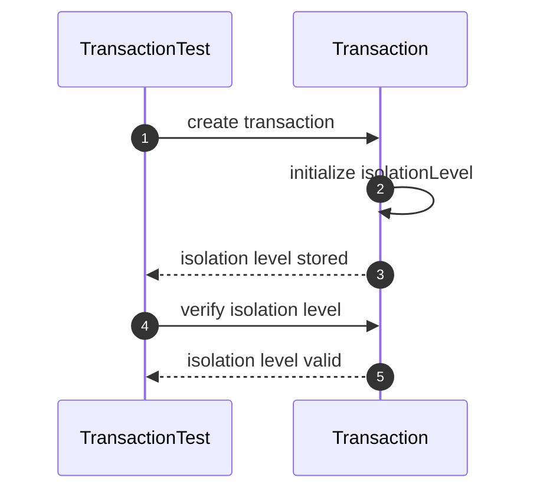
```mermaid
sequenceDiagram
    autonumber

    participant Test as TransactionTest
    participant Tx as Transaction

    Test->>Tx: create transaction

    Tx->>Tx: initialize isolationLevel

    Tx-->>Test: isolation level stored

    Test->>Tx: verify isolation level

    Tx-->>Test: isolation level valid
```

## Lock Manager 

### 12. shouldAcquireLock()
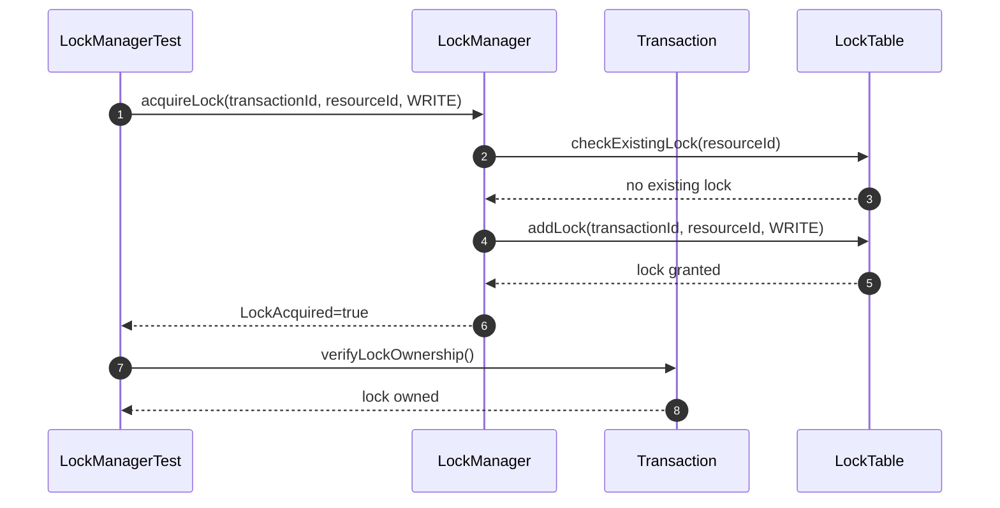
```mermaid
sequenceDiagram
    autonumber
    participant Test as LockManagerTest
    participant LM as LockManager
    participant TX as Transaction
    participant LockTable as LockTable

    Test->>LM: acquireLock(transactionId, resourceId, WRITE)

    LM->>LockTable: checkExistingLock(resourceId)

    LockTable-->>LM: no existing lock

    LM->>LockTable: addLock(transactionId, resourceId, WRITE)

    LockTable-->>LM: lock granted

    LM-->>Test: LockAcquired=true

    Test->>TX: verifyLockOwnership()

    TX-->>Test: lock owned
```

### 13. shouldUpgradeLock() 
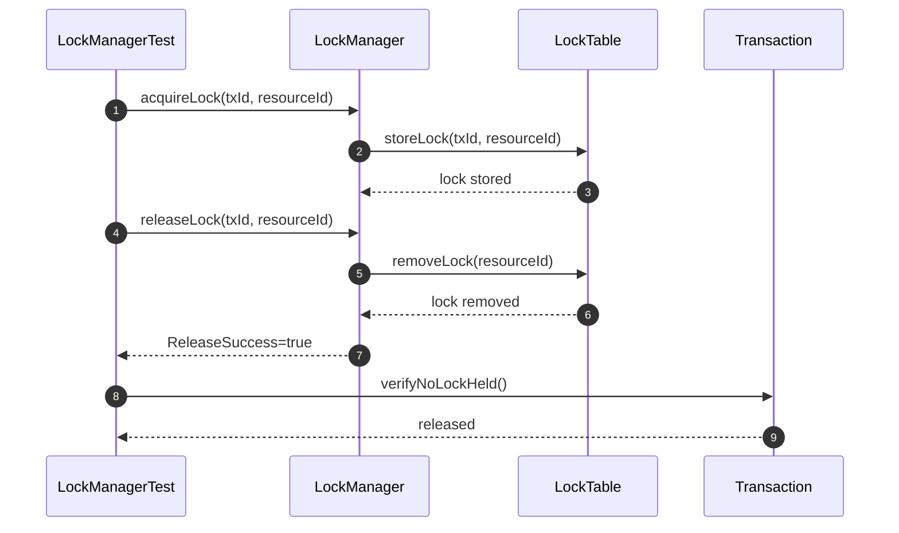
```mermaid
sequenceDiagram
    autonumber
    participant Test as LockManagerTest
    participant LM as LockManager
    participant LockTable as LockTable
    participant TX as Transaction

    Test->>LM: acquireLock(txId, resourceId)

    LM->>LockTable: storeLock(txId, resourceId)

    LockTable-->>LM: lock stored


    Test->>LM: releaseLock(txId, resourceId)

    LM->>LockTable: removeLock(resourceId)

    LockTable-->>LM: lock removed

    LM-->>Test: ReleaseSuccess=true


    Test->>TX: verifyNoLockHeld()

    TX-->>Test: released
```

### 14. shouldCheckCompatibility()
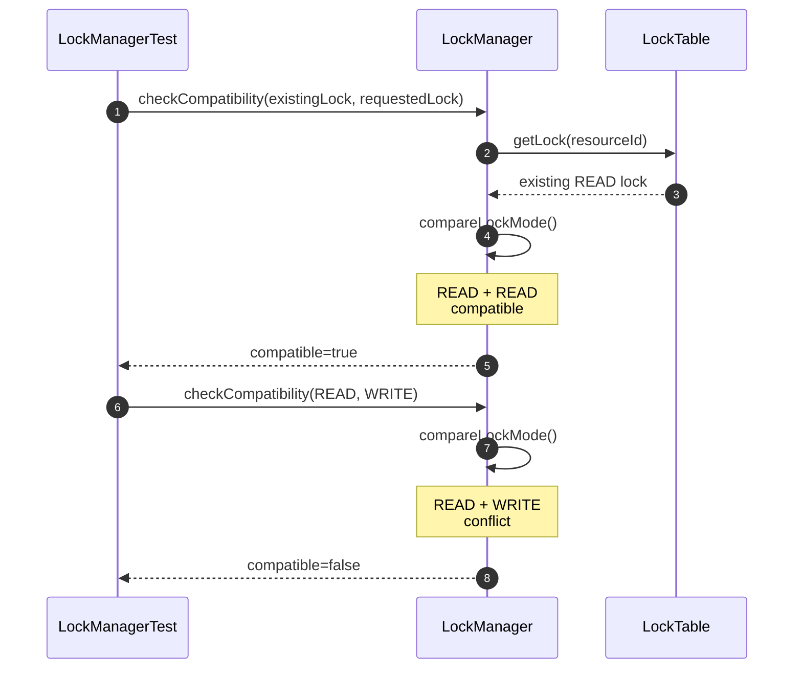
```mermaid
sequenceDiagram
    autonumber
    participant Test as LockManagerTest
    participant LM as LockManager
    participant LockTable as LockTable

    Test->>LM: checkCompatibility(existingLock, requestedLock)

    LM->>LockTable: getLock(resourceId)

    LockTable-->>LM: existing READ lock


    LM->>LM: compareLockMode()

    Note over LM: READ + READ <br/> compatible


    LM-->>Test: compatible=true


    Test->>LM: checkCompatibility(READ, WRITE)

    LM->>LM: compareLockMode()

    Note over LM: READ + WRITE <br/> conflict


    LM-->>Test: compatible=false
```

### 15. shouldDetectDeadlock()
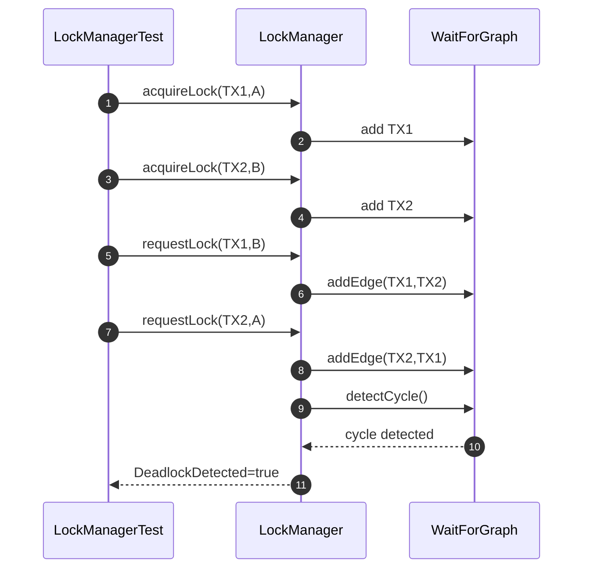
```mermaid
sequenceDiagram
    autonumber
    participant Test as LockManagerTest
    participant LM as LockManager
    participant WaitGraph as WaitForGraph

    Test->>LM: acquireLock(TX1,A)

    LM->>WaitGraph: add TX1


    Test->>LM: acquireLock(TX2,B)

    LM->>WaitGraph: add TX2


    Test->>LM: requestLock(TX1,B)

    LM->>WaitGraph: addEdge(TX1,TX2)


    Test->>LM: requestLock(TX2,A)

    LM->>WaitGraph: addEdge(TX2,TX1)


    LM->>WaitGraph: detectCycle()

    WaitGraph-->>LM: cycle detected


    LM-->>Test: DeadlockDetected=true 
```
## MVCC Manager

### 16. shouldCreateVersion()
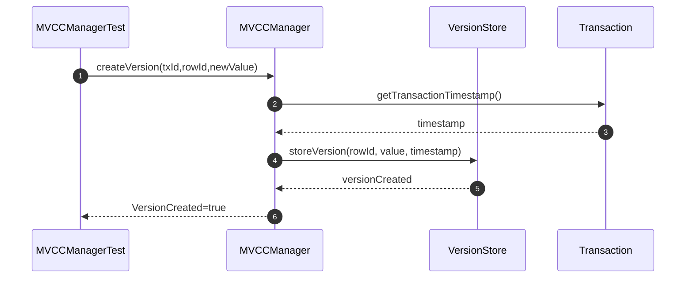
```mermaid
sequenceDiagram
    autonumber
    participant Test as MVCCManagerTest
    participant MVCC as MVCCManager
    participant VersionStore as VersionStore
    participant TX as Transaction


    Test->>MVCC: createVersion(txId,rowId,newValue)


    MVCC->>TX: getTransactionTimestamp()

    TX-->>MVCC: timestamp


    MVCC->>VersionStore: storeVersion(rowId, value, timestamp)


    VersionStore-->>MVCC: versionCreated


    MVCC-->>Test: VersionCreated=true
```

### 17. shouldEnforceVisibilityRule()
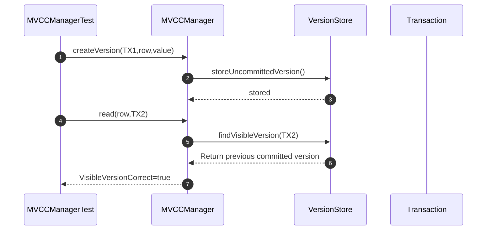
```mermaid
sequenceDiagram
    autonumber
    participant Test as MVCCManagerTest
    participant MVCC as MVCCManager
    participant VersionStore as VersionStore
    participant TX as Transaction


    Test->>MVCC: createVersion(TX1,row,value)


    MVCC->>VersionStore: storeUncommittedVersion()

    VersionStore-->>MVCC: stored


    Test->>MVCC: read(row,TX2)


    MVCC->>VersionStore: findVisibleVersion(TX2)


    VersionStore-->>MVCC: Return previous committed version


    MVCC-->>Test: VisibleVersionCorrect=true
```

### 18. shouldGarbageCollect()
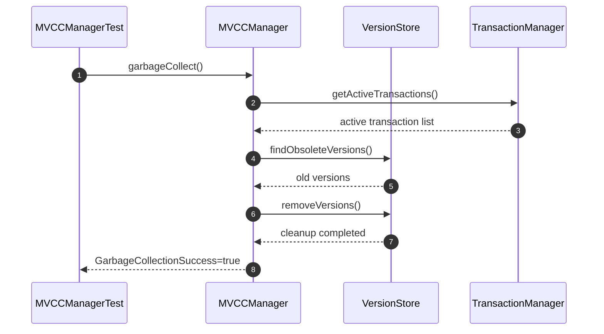
```mermaid
sequenceDiagram
    autonumber
    participant Test as MVCCManagerTest
    participant MVCC as MVCCManager
    participant VersionStore as VersionStore
    participant ActiveTX as TransactionManager


    Test->>MVCC: garbageCollect()


    MVCC->>ActiveTX: getActiveTransactions()


    ActiveTX-->>MVCC: active transaction list


    MVCC->>VersionStore: findObsoleteVersions()


    VersionStore-->>MVCC: old versions


    MVCC->>VersionStore: removeVersions()


    VersionStore-->>MVCC: cleanup completed


    MVCC-->>Test: GarbageCollectionSuccess=true
```

## WAL Manager

### 19. shouldAppendLog()
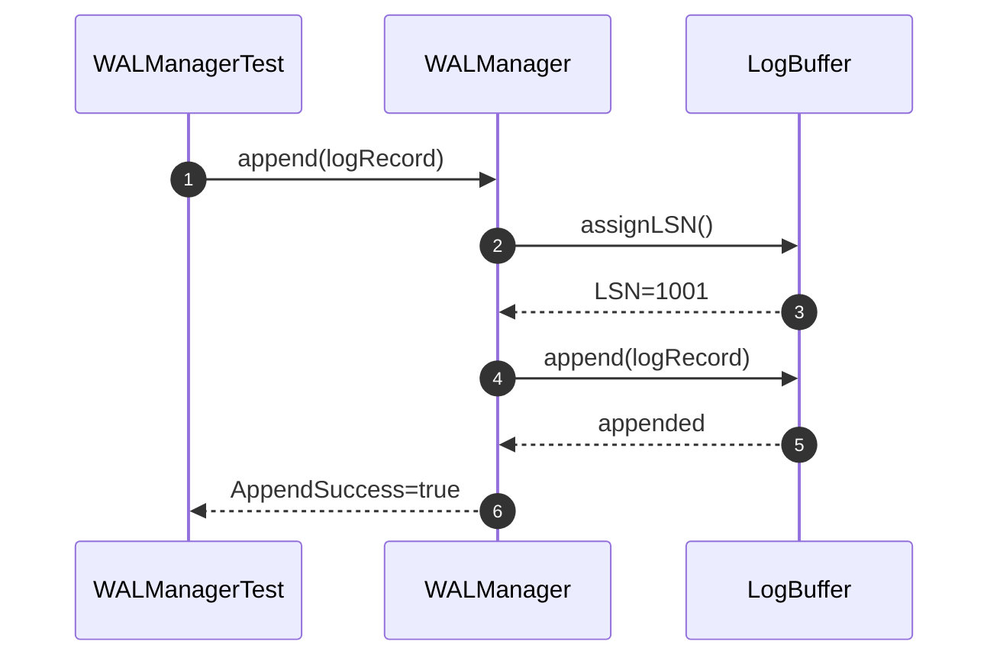
```mermaid
sequenceDiagram
    autonumber
    participant Test as WALManagerTest
    participant WAL as WALManager
    participant LogBuffer as LogBuffer

    Test->>WAL: append(logRecord)

    WAL->>LogBuffer: assignLSN()
    LogBuffer-->>WAL: LSN=1001

    WAL->>LogBuffer: append(logRecord)

    LogBuffer-->>WAL: appended

    WAL-->>Test: AppendSuccess=true
```

### 20. shouldFlushLog()
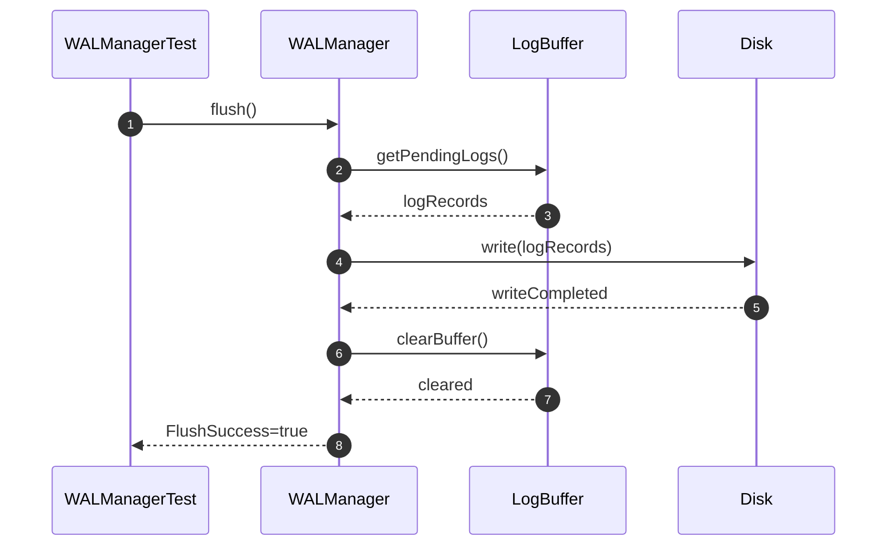
```mermaid
sequenceDiagram
    autonumber
    participant Test as WALManagerTest
    participant WAL as WALManager
    participant LogBuffer as LogBuffer
    participant Disk as Disk

    Test->>WAL: flush()

    WAL->>LogBuffer: getPendingLogs()

    LogBuffer-->>WAL: logRecords

    WAL->>Disk: write(logRecords)

    Disk-->>WAL: writeCompleted

    WAL->>LogBuffer: clearBuffer()

    LogBuffer-->>WAL: cleared

    WAL-->>Test: FlushSuccess=true
```

### 21. shouldReplayLog()
```mermaid
sequenceDiagram
    autonumber
    participant Test as WALManagerTest
    participant WAL as WALManager
    participant Disk as Disk
    participant Storage as StorageEngine

    Test->>WAL: replay()

    WAL->>Disk: readLogFiles()

    Disk-->>WAL: logRecords

    loop For each log record
        WAL->>Storage: apply(logRecord)
        Storage-->>WAL: applied
    end

    WAL-->>Test: ReplayCompleted=true
```

### 22. shouldOrderLSN()
```mermaid
sequenceDiagram
    autonumber
    participant Test as WALManagerTest
    participant WAL as WALManager
    participant LogBuffer as LogBuffer

    Test->>WAL: append(record1)

    WAL->>LogBuffer: assignLSN()

    LogBuffer-->>WAL: LSN=101

    Test->>WAL: append(record2)

    WAL->>LogBuffer: assignLSN()

    LogBuffer-->>WAL: LSN=102

    WAL-->>Test: verifyLSNOrder()

    Test-->>Test: LSN increases monotonically
```
## Recovery Manager

### 23. shouldRecover()
```mermaid
sequenceDiagram
    autonumber
    participant Test as RecoveryManagerTest
    participant Recovery as RecoveryManager
    participant WAL as WALManager
    participant Storage as StorageEngine

    Test->>Recovery: recover()

    Recovery->>WAL: replay()

    WAL-->>Recovery: logRecords

    loop Apply logs
        Recovery->>Storage: apply(logRecord)
        Storage-->>Recovery: applied
    end

    Recovery-->>Test: RecoverySuccess=true
```

### 24. shouldRedo()
```mermaid 
sequenceDiagram
    autonumber
    participant Test as RecoveryManagerTest
    participant Recovery as RecoveryManager
    participant WAL as WALManager
    participant Storage as StorageEngine

    Test->>Recovery: redo()

    Recovery->>WAL: scanCommittedLogs()

    WAL-->>Recovery: committedLogs

    loop For each committed log
        Recovery->>Storage: redo(logRecord)
        Storage-->>Recovery: redone
    end

    Recovery-->>Test: RedoCompleted=true
```

### 25. shouldUndo()
```mermaid
sequenceDiagram
    autonumber
    participant Test as RecoveryManagerTest
    participant Recovery as RecoveryManager
    participant WAL as WALManager
    participant Storage as StorageEngine

    Test->>Recovery: undo()

    Recovery->>WAL: scanUncommittedLogs()

    WAL-->>Recovery: uncommittedLogs

    loop Reverse order
        Recovery->>Storage: undo(logRecord)
        Storage-->>Recovery: undone
    end

    Recovery-->>Test: UndoCompleted=true
```

### 26. shouldRecoverCheckpoint()
```mermaid
sequenceDiagram
    autonumber
    participant Test as RecoveryManagerTest
    participant Recovery as RecoveryManager
    participant WAL as WALManager
    participant Storage as StorageEngine

    Test->>Recovery: recover()

    Recovery->>WAL: loadLatestCheckpoint()

    WAL-->>Recovery: checkpointLSN

    Recovery->>Storage: restoreCheckpoint(checkpointLSN)

    Storage-->>Recovery: restored

    Recovery->>WAL: replayLogsAfter(checkpointLSN)

    WAL-->>Recovery: remainingLogs

    loop Apply remaining logs
        Recovery->>Storage: apply(logRecord)
        Storage-->>Recovery: applied
    end

    Recovery-->>Test: CheckpointRecoverySuccess=true
```

# Transaction Integration Test 

### 27. shouldCommitTransactionSuccessfully()
```mermaid
sequenceDiagram 
    autonumber
    participant Test as TransactionIntegrationTest
    participant TM as TransactionManager
    participant TX as Transaction
    participant LM as LockManager
    participant MVCC as MVCCManager
    participant WAL as WALManager

    Test->>TM: beginTransaction()

    TM->>TX: begin()

    TX-->>TM: ACTIVE


    Test->>TM: commit(txId)

    TM->>WAL: append(COMMIT)

    WAL-->>TM: LSN assigned

    TM->>WAL: flush()

    WAL-->>TM: flushed


    TM->>MVCC: createVersion()

    MVCC-->>TM: version committed


    TM->>LM: releaseLock(txId)

    LM-->>TM: locks released


    TM->>TX: commit()

    TX-->>TM: COMMITTED

    TM-->>Test: CommitSuccess=true
```

### 28. shouldRollbackTransactionSuccessfully()
```mermaid
sequenceDiagram
    autonumber
    participant Test as TransactionIntegrationTest
    participant TM as TransactionManager
    participant TX as Transaction
    participant WAL as WALManager
    participant MVCC as MVCCManager
    participant LM as LockManager

    Test->>TM: beginTransaction()

    TM->>TX: begin()

    TX-->>TM: ACTIVE


    Test->>TM: rollback(txId)

    TM->>WAL: append(ROLLBACK)

    WAL-->>TM: log appended


    TM->>MVCC: discardUncommittedVersions()

    MVCC-->>TM: rollback completed


    TM->>LM: releaseLock(txId)

    LM-->>TM: locks released


    TM->>TX: rollback()

    TX-->>TM: ABORTED


    TM-->>Test: RollbackSuccess=true
```

### 29. shouldRecoverAfterCrash()
```mermaid 
sequenceDiagram
    autonumber
    participant Test as TransactionIntegrationTest
    participant TM as TransactionManager
    participant Recovery as RecoveryManager
    participant WAL as WALManager
    participant Storage as StorageEngine

    Note over TM,Storage: System Crash

    Test->>Recovery: recover()

    Recovery->>WAL: loadLatestCheckpoint()

    WAL-->>Recovery: checkpointLSN


    Recovery->>WAL: replayLogsAfter(checkpointLSN)

    WAL-->>Recovery: logRecords


    loop REDO committed transactions
        Recovery->>Storage: redo(logRecord)
        Storage-->>Recovery: applied
    end


    loop UNDO uncommitted transactions
        Recovery->>Storage: undo(logRecord)
        Storage-->>Recovery: reverted
    end


    Recovery->>TM: recover()

    TM-->>Recovery: TransactionTable restored

    Recovery-->>Test: RecoverySuccess=true
```