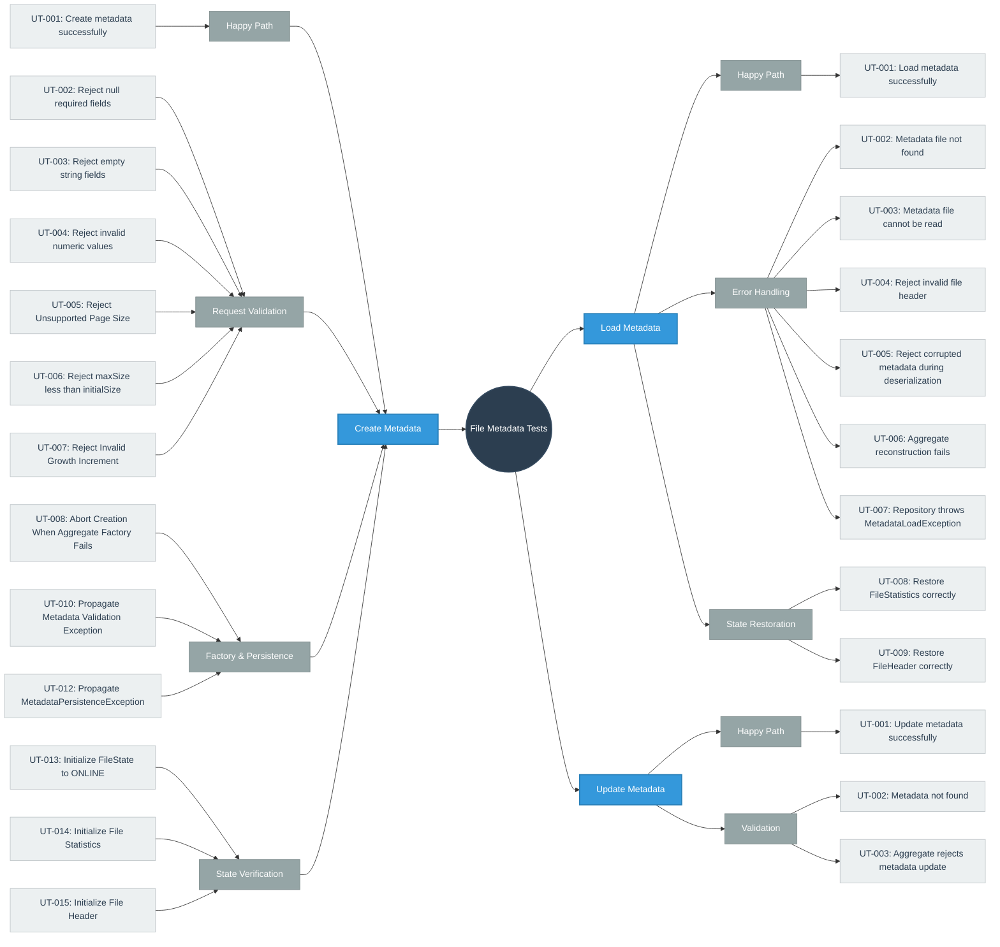

```mermaid
graph LR
    %% Style Definitions
    classDef rootStyle fill:#2c3e50,stroke:#34495e,stroke-width:2px,color:#fff;
    classDef mainStyle fill:#3498db,stroke:#2980b9,stroke-width:2px,color:#fff;
    classDef categoryStyle fill:#95a5a6,stroke:#7f8c8d,stroke-width:1px,color:#fff;
    classDef testStyle fill:#ecf0f1,stroke:#bdc3c7,stroke-width:1px,color:#2c3e50;

    %% Center Root Node
    Root((File Metadata Tests)):::rootStyle

    %% ================= LEFT SIDE: CREATE METADATA =================
    UT_C001["UT-001: Create metadata successfully"]:::testStyle --> C_Happy["Happy Path"]:::categoryStyle
    
    UT_C002["UT-002: Reject null required fields"]:::testStyle --> C_Val["Request Validation"]:::categoryStyle
    UT_C003["UT-003: Reject empty string fields"]:::testStyle --> C_Val
    UT_C004["UT-004: Reject invalid numeric values"]:::testStyle --> C_Val
    UT_C005["UT-005: Reject Unsupported Page Size"]:::testStyle --> C_Val
    UT_C006["UT-006: Reject maxSize less than initialSize"]:::testStyle --> C_Val
    UT_C007["UT-007: Reject Invalid Growth Increment"]:::testStyle --> C_Val

    UT_C008["UT-008: Abort Creation When Aggregate Factory Fails"]:::testStyle --> C_Fact["Factory & Persistence"]:::categoryStyle
    UT_C010["UT-010: Propagate Metadata Validation Exception"]:::testStyle --> C_Fact
    UT_C012["UT-012: Propagate MetadataPersistenceException"]:::testStyle --> C_Fact

    UT_C013["UT-013: Initialize FileState to ONLINE"]:::testStyle --> C_State["State Verification"]:::categoryStyle
    UT_C014["UT-014: Initialize File Statistics"]:::testStyle --> C_State
    UT_C015["UT-015: Initialize File Header"]:::testStyle --> C_State

    C_Happy --> Create["Create Metadata"]:::mainStyle
    C_Val --> Create
    C_Fact --> Create
    C_State --> Create
    Create --> Root

    %% ================= RIGHT SIDE: LOAD METADATA =================
    Root --> Load["Load Metadata"]:::mainStyle
    
    Load --> L_Happy["Happy Path"]:::categoryStyle
    L_Happy --> UT_L001["UT-001: Load metadata successfully"]:::testStyle

    Load --> L_Err["Error Handling"]:::categoryStyle
    L_Err --> UT_L002["UT-002: Metadata file not found"]:::testStyle
    L_Err --> UT_L003["UT-003: Metadata file cannot be read"]:::testStyle
    L_Err --> UT_L004["UT-004: Reject invalid file header"]:::testStyle
    L_Err --> UT_L005["UT-005: Reject corrupted metadata during deserialization"]:::testStyle
    L_Err --> UT_L006["UT-006: Aggregate reconstruction fails"]:::testStyle
    L_Err --> UT_L007["UT-007: Repository throws MetadataLoadException"]:::testStyle

    Load --> L_State["State Restoration"]:::categoryStyle
    L_State --> UT_L008["UT-008: Restore FileStatistics correctly"]:::testStyle
    L_State --> UT_L009["UT-009: Restore FileHeader correctly"]:::testStyle

    %% ================= RIGHT SIDE: UPDATE METADATA =================
    Root --> Update["Update Metadata"]:::mainStyle

    Update --> U_Happy["Happy Path"]:::categoryStyle
    U_Happy --> UT_U001["UT-001: Update metadata successfully"]:::testStyle

    Update --> U_Val["Validation"]:::categoryStyle
    U_Val --> UT_U002["UT-002: Metadata not found"]:::testStyle
    U_Val --> UT_U003["UT-003: Aggregate rejects metadata update"]:::testStyle


```